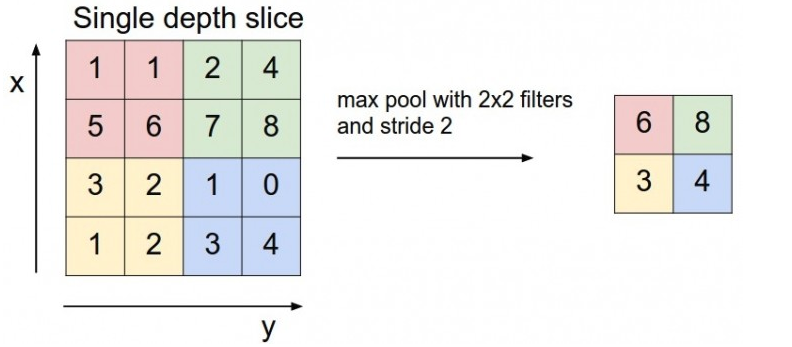
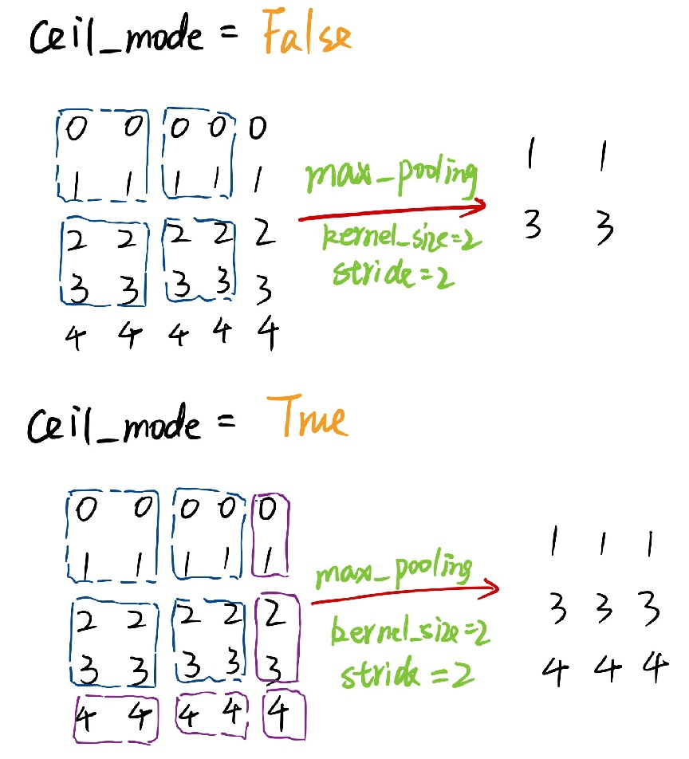
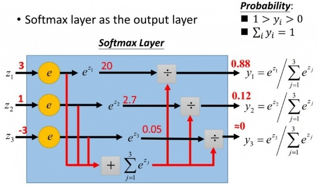

- [1. 层](#1-层)
  - [1.1. Conv2d](#11-conv2d)
    - [1.1.1. dilation](#111-dilation)
    - [1.1.2. padding](#112-padding)
  - [1.2. MaxPool2d](#12-maxpool2d)
  - [1.3. Linear](#13-linear)
- [2. 激活函数](#2-激活函数)
  - [2.1. conv2d](#21-conv2d)
  - [2.2. softmax](#22-softmax)
  - [2.3. log_softmax](#23-log_softmax)
- [3. 损失函数](#3-损失函数)
  - [3.1. CrossEntropyLoss](#31-crossentropyloss)
  - [3.2. NLLLoss](#32-nllloss)
- [4. 参考文献](#4-参考文献)

# 1. 层

## 1.1. Conv2d

`nn.Conv2d` 的输入为 `(batch_size, channel, height, width)`。

`nn.Conv2d` 的参数包括[[1](#ref1)]：

- **`in_channels`**：int，输入图片的通道数（彩色图像=3，灰度图像=1）；
- **`out_channels`**：int，卷积输出图片的通道数（也就是卷积核个数）；
- **`kernel_size`**：int或tuple，卷积核尺寸（赋值单个int时长=宽），default=1；
- `stride`：int或tuple，卷积操作的滑动步长，default=1；
- `padding`：int或tuple，输入图片外围扩充大小（赋值单个int时长=宽），default=0；

​                           当采取默认参数时，padding = (kernel_size - 1) /2 可保证输出图片与输入图片尺寸一致；

- `dilation`：卷积核扩充大小，default=1；
- `groups`：从输入通道到输出通道分组的个数，default=1；
- `bias`：bool，输出增加偏差，default=True；

假设输入图片的高度和宽度为 $H_{in}$ 和 $H_{in}$，则输出特征图的高度和宽度$H_{out}$ 和 $H_{out}$ 为

$$
\begin{aligned}
H_{out} &= \frac{H_{in} + 2\times padding[0] - dilation[0]\times (kernel\_size[0]-1)-1} {stride[0]}+1 \\
W_{out} &= \frac{W_{in} + 2\times padding[1] - dilation[1]\times (kernel\_size[1]-1)-1}{stride[1]}+1
\end{aligned}
$$

若采用默认参数，有

$$
\begin{aligned}
H_{out} = H_{in} - kernel\_size[0] + 1 \\
W_{out} = W_{in} - kernel\_size[1] + 1
\end{aligned}
$$

### 1.1.1. dilation

**注意**，PyTorch 认为`dilation=n` 表示卷积核尺寸从 (`1x1`) 扩充为 `nxn`，其中原本的卷积核像素在左上角，其它像素填充为0。因此 `dilation=1` 等价于传统的无扩充的卷积[[2](#ref2)]。

如果我们设置的 `padding=0, dilation=1` 的话，蓝色为输入，绿色为输出，卷积核为3*3的卷积效果如图[[3](#ref3)]：


如果我们设置的 `dilation=2` 的话，卷积核点与输入之间距离为1的值相乘来得到输出


这样单次计算时覆盖的面积（即感受域）由 `dilation=0` 时的 $3\times 3=9$ 变为了 `dilation=1` 时的 $5\times 5=25$。在增加了感受域的同时却没有增加计算量，保留了更多的细节信息，对图像还原的精度有明显的提升。

### 1.1.2. padding

`padding` 是图像周围填充的像素尺寸。

在默认参数（`dilation=1, padding = 0`）的情况下，每经过一次卷积，图像的尺寸都会缩小。比如原始图像为 $5\times 5$，卷积核大小为 $3\times 3$，滑动步长 $stride=1$，则卷积输出的特征图为 $(5-3+1)\times (5-3+1)=3\times 3$。这样处理有两个缺点：

- 卷积后的矩阵越变越小（卷积层很多时，最终得到的将是很小的图片）；

- 输入矩阵边缘像素只被计算过一次，而中间像素被卷积计算多次，意味着丢失图像角落信息。

为了保证输出尺寸与输入尺寸一致，即

$$
\begin{aligned}
H_{out} = H_{in} \\
W_{out} = W_{in}
\end{aligned}
$$

需要在图像周围填充一定的像素宽度，计算匹配的 `padding` 值，将上面的公式变换如下

$$
\begin{aligned}
padding[0] = \frac{stride[0]\times (H_{out}-1) + dilation[0]\times (kernel\_size[0]-1)-H_{in}+1} {2} \\
padding[1] = \frac{stride[1]\times (H_{out}-1) + dilation[1]\times (kernel\_size[1]-1)-H_{in}+1} {2} \\
\end{aligned}
$$

将默认的 `stride=1`和 `dilation=1` 参数代入，可得

$$
\begin{aligned}
padding[0] = (kernel\_size[0]-1) / 2 \\
padding[1] = (kernel\_size[1]-1) / 2
\end{aligned}
$$

也就是说，`padding` 的取值与 `kernel_size` 有关。如果采用长宽相等的卷积核，可简写为

$$
padding = (kernel\_size-1) / 2
$$

对于上述例子，计算后 `padding = 1`。即原始图像为 $5\times 5$，图像周围填充1像素的宽度，尺寸变为$7\times 7$，经过卷积后特征图尺寸正好又变为 $5\times 5$。


## 1.2. MaxPool2d

`nn.MaxPool2d` 的参数包括：

- `kernel_size`：(int or tuple) ，max pooling 的窗口大小，可以为tuple，在nlp中tuple用更多（n,1）

- `stride`：(int or tuple, optional) ，max pooling 的窗口移动的步长。默认值是kernel_size

- `padding`：(int or tuple, optional) - 输入的每一条边补充0的层数

- `dilation`：(int or tuple, optional) – 一个控制窗口中元素步幅的参数

- `return_indices`：如果等于 `True`，会返回输出最大值的序号，对于上采样操作会有帮助

- `ceil_mode`：如果等于 `True`，计算输出信号大小的时候，会使用向上取整，代替默认的向下取整的操作，default=`False`

下图的 `kernel_size = 2, stride = 2`，将输入图片尺寸缩减为原来的一半。



当输入无法被 `kernel_size` 整除时，根据 `ceil_mode` 来决定如何池化



## 1.3. Linear

`nn.Linear` 的参数如下：

- **in_features**：输入维度；

- **out_features**：输出维度；

- bias：如果设为 `False `则不存在偏置，default: `True`。

# 2. 激活函数

## 2.1. conv2d

`torch.nn` 与 `torch.nn.functional` 差不多[[4](#ref4)]，不过一个包装好的类，一个是可以直接调用的函数。在实现源代码上，`torch.nn.Conv2d` 类在 `forward` 时调用了 `torch.nn.functional.conv2d`。

可能会疑惑为什么需要这两个功能如此相近的模块，其实这么设计是有其原因的。如果我们只保留nn.functional下的函数的话，在训练或者使用时，我们就要手动去维护weight, bias, stride这些中间量的值，这显然是给用户带来了不便。而如果我们只保留nn下的类的话，其实就牺牲了一部分灵活性，因为做一些简单的计算都需要创造一个类，这也与PyTorch的风格不符。

二者有一些细微的差别：

- **两者的调用方式不同。**`nn.Xxx` 需要先实例化并传入参数，然后以函数调用的方式调用实例化的对象并传入输入数据。`nn.functional.xxx`同时传入输入数据和weight, bias等其他参数 。

- **`nn.Xxx`继承于`nn.Module`， 能够很好的与`nn.Sequential`结合使用，** 而`nn.functional.xxx`无法与`nn.Sequential`结合使用。

- **`nn.Xxx`不需要你自己定义和管理weight；而`nn.functional.xxx`需要你自己定义weight，**每次调用的时候都需要手动传入weight, 不利于代码复用。

两种定义方式得到CNN功能都是相同的，至于喜欢哪一种方式，是个人口味问题，但PyTorch官方推荐：

- 具有学习参数的（例如，conv2d, linear, batch_norm)采用`nn.Xxx`方式

- 没有学习参数的（例如，maxpool, loss func, activation func）等根据个人选择使用`nn.functional.xxx`或者`nn.Xxx`方式。

但关于dropout，个人强烈推荐使用`nn.Xxx`方式，因为一般情况下只有训练阶段才进行dropout，在eval阶段都不会进行dropout。使用`nn.Xxx`方式定义dropout，在调用`model.eval()`之后，model中所有的dropout layer都关闭，但以`nn.function.dropout`方式定义dropout，在调用`model.eval()`之后并不能关闭dropout。

## 2.2. softmax

我们知道 `max`，假如 `a > b`，则 `max(a, b) = a` ，这个结果是确定的，无论计算多少次，`max` 返回的值永远是 `a`。但有的时候我不想这样，因为这样会造成值小的那个饥饿。所以我希望分值大的那一项经常取到，分值小的那一项也偶尔可以取到。

可以采用某种方法，按照a和b本来的大小来计算取a和b的概率，就可以实现a经常取到，b也会偶尔取到。此时的选取不在遵循 `max`，而是 `softmax `。

`softmax` 的计算方法如下，假设输入为一维向量 $Z = [z_1,z_2,...z_i,...,z_n]\in(-\infty,+\infty)$ ，则第 $i$ 个分量 $z_i$ 的 `softmax` 输出为
$$
y_i = softmax(z_i) = \frac{e^{z_i}}{\sum_j e^{z_j}}
$$



我们知道指数函数 $e^x$ 的值域为 $(0,+\infty)$ ，因此 `softmax` 将 $(-\infty,+\infty)$ 的值映射到 $[0, 1]$。具体来说，`softmax` 具备下面两个作用

- 将向量的各个维度 $z_i$ 映射为映射到 $[0, 1]$ 之间的某个值，即为该分量的取值概率；

- 向量所有维度的取值概率之和为1。

通常情况下，计算softmax函数值不会出现什么问题，例如，当softmax函数表达式里的所有 zi 都是一个“一般大小”的数值 $c$ 时——也就是上图中，$z_1=z_2=z_3=c$ 时，那么，计算出来的函数值 $y_1=y_2=y_3=1$。但是，当某些情况发生时，计算函数值就出问题了：

- $c$ 极其大，导致分子计算 $e^c$ 时上溢出（超出float表示的界限，出现NaN）。

- $c$ 为负数，且 $|c|$ 很大，此时分母是一个极小的正数，有可能四舍五入为0，导致下溢出。

解决方法为，令 $M = max(z_i), i =1,2,3,….,n$，计算 $softmax(z_i - M)$ 的值，就可以解决上溢出、下溢出的问题了，并且，计算结果理论上仍然和  $softmax(z_i)$  保持一致。具体而言：

- $z_i - M$ 的取值范围为 $(-\infty,0]$ ，因此在做指数运算时输入的最大值为 0，从而避免上溢出。 

- $softmax(z_i - M)$ 的值域为 $[0,1]$ ，因为分母对所有指数求和时，至少有一个指数（对应输入最大值0的指数项）为1，保证了分母不为0，从而避免下溢出。

```python
softmax(input, dim=-1) # dim=0 makes sum of column values to be 1, dim=1 makes row ...
```

## 2.3. log_softmax

在 `softmax` 的基础上多做一个 log 运算，**log_softmax号称能够加快运算速度，提高数据稳定性。**在数学上等价于 `log(softmax(x)) `，但做这两个单独操作速度较慢，数值上也不稳定。

`log_softmax` 的值域为 $(-\infty, 0]$。

# 3. 损失函数

## 3.1. CrossEntropyLoss

交叉熵损失函数。在说交叉熵之前，先说一下**信息量**与**熵**。

**信息量**：衡量一个事件的不确定性；一个事件发生的概率越大，不确定性越小，则它所携带的信息量就越小。假设 $X$ 是一个离散型随机变量，其取值集合为 $X$，概率分布函数为 $p(x)=P(X=x),x\in X$  ，我们定义事件 $X=x_0$ 的信息量为：$I(x_0)=-log(p(x_0))$。当 $p(x_0) = 1$ 时，熵等于0，也就是说该事件的发生不会导致任何信息量的增加。

**熵**：用来衡量一个系统的混乱程度，代表一个系统中信息量的总和；信息量总和越大，系统不确定性越大。

对所有可能事件所带来的信息量求期望，其结果就能衡量事务的不确定度。

**交叉熵：**它主要刻画的是实际输出（概率）与期望输出（概率）的距离，也就是交叉熵的值越小，两个概率分布就越接近。假设概率分布 $p$ 为期望输出，概率分布 $q$ 为实际输出， $H(p,q)$ 为交叉熵。其计算方法有两种
$$
H(p,q)=-\sum_i (p_i log q_i + (1-p_i)log(1-q_i))
$$

或者

$$
H(p,q) = -\sum_i (p_ilog q_i)
$$

假设某个样本对应的标签 $y = [y_1,y_2,...,y_K]\in R^K$ 为一个向量，PyTorch 中的交叉熵损失函数形式如下

$$
L = -\sum_{i=1}^K (y_ilog s_i)
$$

其中，$y_i$ 为真实分类值，$s_i$ 为 `softmax` 输出值，$i$ 代表神经元节点的标号。

假设网络结构为 `xx -> Linear -> softmax`，即一个全连接层的输出作为 `softmax` 的输入，有

$$
\begin{aligned}
z_i &= \omega_i \cdot x_i + b_i \\
s_i &= \frac{e^{z_i}}{\sum_{j=1}^K e^{z_j}}
\end{aligned}
$$

采用交叉熵损失函数，则损失函数对 `softmax` 的倒数为

$$
\begin{aligned}
\frac{\partial L}{\partial \omega_i}=\frac{\partial L}{\partial z_i}\frac{\partial z_i}{\partial w_i} \\
\frac{\partial L}{\partial b_i}=\frac{\partial L}{\partial z_i}\frac{\partial z_i}{\partial b_i}
\end{aligned}
$$

由于全连接层

$$
\begin{aligned}
\frac{\partial z_i}{\partial w_i} &= x_i \\
\frac{\partial z_i}{\partial b_i} &= 1
\end{aligned}
$$

则核心问题变为求解 $\frac{\partial L}{\partial z_i}$ 。

$$
\begin{aligned}
\frac{\partial z_i}{\partial w_i} &= x_i \\
\frac{\partial z_i}{\partial b_i} &= 1
\end{aligned}
$$

由于 `softmax` 的计算公式中，任意一个 `s_i` 均包含 `z` 的所有分类，因此有

$$
\frac{\partial L}{\partial z_i} = \sum_k[\frac{\partial L}{\partial s_k}\frac{\partial s_k}{\partial z_i}]
$$

根据损失函数的定义，有

$$
\frac{\partial L}{\partial s_k}=-\frac{y_k}{s_k}
$$

下面求解 $\frac{\partial s_k}{\partial z_i}$ ，需要分情况讨论

当 $k \neq i$ 时，有

$$
\begin{aligned}
\frac{\partial s_k}{\partial z_i}
&= \frac{\partial(\frac{e^{z_k}}{\sum_j e^{z_j}})}{\partial z_i}\\
&= e^{z_k}\frac{\partial(\frac{1}{\sum_j e^{z_j}})}{\partial z_i}\\
&= e^{z_k}(-\frac{1}{(\sum_j e^{z_j})^2})\frac{\partial \sum_j e^{z_j}}{\partial z_i}\\
&= e^{z_k}(-\frac{1}{(\sum_j e^{z_j})^2})e^{z_i}\\
&= -(\frac{e^{z_k}}{\sum_j e^{z_j}})(\frac{e^{z_i}}{\sum_j e^{z_j}}) = -s_k\cdot s_i
\end{aligned}
$$

当 $k=i$ 时，有（分式求导法则：上导下不导减下导上不导除以下的平方）

$$
\begin{aligned}
\frac{\partial s_k}{\partial z_i}
&=\frac{\partial s_i}{\partial z_i}\\
&=\frac{\partial(\frac{e^{z_i}}{\sum_j e^{z_j}})}{\partial z_i}\\
&=\frac{e^{z_i}\sum_j e^{z_i}-(e^{z_i})^2}{(\sum_j e^{z_i})^2}\\
&=\frac{e^{z_i}}{\sum_j e^{z_i}}\frac{\sum_j e^{z_i}-e^{z_i}}{\sum_j e^{z_i}}\\
&=\frac{e^{z_i}}{\sum_j e^{z_i}}(1-\frac{e^{z_i}}{\sum_j e^{z_i}}) = s_i(1-s_i)
\end{aligned}
$$

最终得到

$$
\begin{aligned}
\frac{\partial L}{\partial z_i} &= -\frac{y_i}{s_i}s_i(1-s_i)+\sum_{k \neq i}(-\frac{y_k}{s_k}\cdot-s_ks_i)\\
&= -y_i + \sum_{k=1}^K y_k
\end{aligned}
$$

对于多分类问题，样本真实标签 $y = [y_1,y_2,...,y_K]$ 是one-hot，即只有一个元素为1，其余元素为0。那么有 $\sum_{k=1}^K y_k = 1$，因此在多分类问题中

$$
\frac{\partial L}{\partial z_i} = s_i - y_i
$$

那么有

$$
\begin{aligned}
\frac{\partial L}{\partial \omega_i} &= (s_i - y_i)\cdot x\\
\frac{\partial L}{\partial b_i} &= s_i - y_i
\end{aligned}
$$

## 3.2. NLLLoss

负对数似然损失函数**（Negative Log Likelihood, NLL）** 的 输入是一个对数概率向量和一个目标标签。它不会为我们计算对数概率，适合网络的最后一层是 `log_softmax`。

`NLLLoss` 的数学形式为
$$
L(X,label) = -X_{label}
$$
其中，`X` 是 `log_softmax` 的输出，`label` 是对应的标签位置，即 `NLLLoss` 的输出是取 `X` 中对应于 `label` 中为1的那个 `x` 。

在分类问题中，`CrossEntropy` **等价于** `log_softmax` + `nll_loss`，也就是说如果使用 `CrossEntropy`，则前面不要加 `softmax` 层，因为 `CrossEntropy` 中内含 `softmax`。而如果使用 `nll_loss`，前面就必须要使用 `log_softmax` 层。


理论上，对于单标签多分类问题，直接经过 `softmax` 求出概率分布，然后把这个概率分布用 `CrossEntropy` 做一个似然估计误差。但是 `softmax` 求出来的概率分布，每一个概率都是 $(0, 1)$ 的，这就会导致有些概率过小，导致下溢。 考虑到这个概率分布总归是要经过 `CrossEntropy`的，而 `CrossEntropy`的计算是把概率分布外面套一个 `-log` 来似然，那么直接在计算概率分布的时候加上 `log`，把概率从 $(0, 1)$ 变为 $(-\infty, 0)$，这样就防止中间会有下溢出。 所以 `log_softmax` 说白了就是将本来应该由 `CrossEntropy`做的 `log` 的工作提到预测概率分布来，跳过了中间的存储步骤，防止中间数值会有下溢出，使得数据更加稳定。 正是由于把log这一步从计算误差提到前面，所以用 `log_softmax` 之后，下游的损失函数就应该变成 `NLLLoss`（它没有套 `log` 这一步，直接将输入取反，然后计算和标签的乘积求和平均）。

# 4. 参考文献

<span id="ref1">[1]</span>  PyTorch. [Conv2d](https://pytorch.org/docs/stable/nn.html#conv2d).

<span id="ref2">[2]</span>  Stack Overflow. [Default dilation value in PyTorch](https://stackoverflow.com/questions/43474072/default-dilation-value-in-pytorch).

<span id="ref3">[3]</span>  Vincent Dumoulin, Francesco Visin. [A guide to convolution arithmetic for deep learning](https://arxiv.org/abs/1603.07285) ([Github](https://github.com/vdumoulin/conv_arithmetic/blob/master/README.md)).

<span id="ref4">[4]</span> 知乎. [PyTorch 中，nn 与 nn.functional 有什么区别？](https://www.zhihu.com/question/66782101).

<span id="ref5">[5]</span>  PyTorch. [MaxPool2d](https://pytorch.org/docs/stable/nn.html#maxpool2d).

<span id="ref6">[6]</span>  PyTorch. [nn.Linear](https://pytorch.org/docs/stable/nn.html#linear).