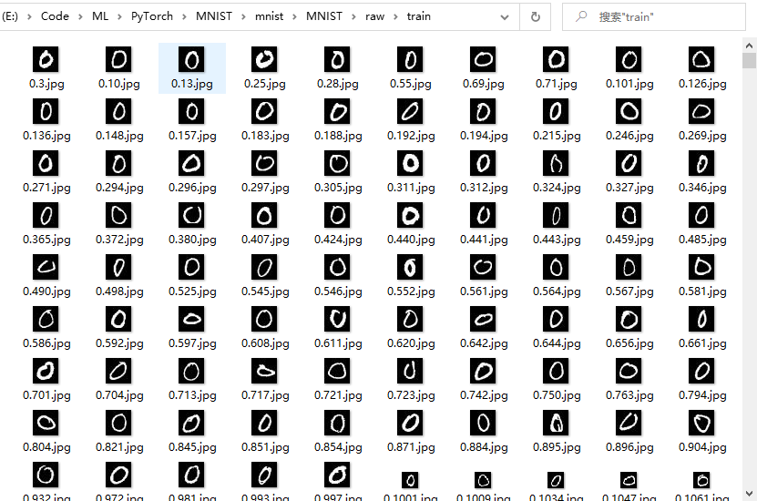

本文介绍了 Pytorch 中针对计算机视觉方面的基本数据库类Dataset，基本的手写数字数据库MNIST，以及数据库加载函数 DataLoader。

<!--more-->

---

- [1. torchvision](#1-torchvision)
- [2. Dataset](#2-dataset)
  - [2.1. 默认类](#21-默认类)
  - [2.2. 自定义类](#22-自定义类)
- [3. DataLoader](#3-dataloader)
- [4. MNIST](#4-mnist)
- [5. 参考文献](#5-参考文献)

# 1. torchvision

`torchvision` 是 PyTorch 中专门用来处理图像的库，PyTorch 官网的安装教程也会让你安装上这个包。这个包中有四个大类。

- torchvision.datasets
- torchvision.models
- torchvision.transforms
- torchvision.utils

这里我们主要介绍前三个。

`torchvision.datasets` 是用来进行数据加载的，PyTorch团队在这个包中帮我们提前处理好了很多很多图片数据集。参考 [PyTorch中文文档](#https://pytorch-cn.readthedocs.io/zh/latest/torchvision/torchvision-datasets/) 中的相关介绍。

- MNIST
- COCO
- Captions
- Detection
- LSUN
- ImageFolder
- Imagenet-12
- CIFAR
- STL10
- SVHN
- PhotoTour

我们可以直接使用这些数据集，示例如下：

```python
mnist_train_data = torchvision.datasets.MNIST('mnist/', train=True, download=True, transform=ToTensor())
train_loader = torch.utils.data.DataLoader(mnist_train_data, batch_size=16, shuffle=True)
```

`torchvision.datasets` 是 `torch.utils.data.Dataset` 的一个子类，所以他们也可以通过 `torch.utils.data.DataLoader` 使用多线程（python的多进程）。比如

```python
torch.utils.data.DataLoader(coco_cap, batch_size=args.batchSize, shuffle=True, num_workers=args.nThreads)
```

# 2. Dataset

## 2.1. 默认类

`torch.utils.data.Dataset` 是一个抽象类，是 `Pytorch` 中图像数据集中最为重要的一个类，也是 `Pytorch` 中所有数据集加载类中应该继承的父类。用户想要加载**自定义的数据必须继承这个类**，并且覆写其中的两个方法：

- `__len__`：实现 `len(dataset)` 返回整个数据集的大小。

- `__getitem__`：用来获取一些索引的数据，使 `dataset[i]` 返回数据集中第 `i` 个样本。

不覆写这两个方法会直接返回错误。

这个类其实也就是起到了封装我们加载函数的作用，在继承了这个 `Dataset` 类之后，我们需要实现的核心功能便是 `__getitem__()`函数，`__getitem__()` 是 `Python` 中类的默认成员函数，我们通过实现这个成员函数实现可以通过索引来返回图像数据的功能。那么怎么得到图像从而去返回呢？当然不会直接将图像数据加载到内存中，相反我们只需要得到图像的地址就足够了，然后在调用的时候通过不同的读取方式读取即可。

不同的读取方式参见：[python深度学习库pytorch::transforms练习:opencv,scikit-image,PIL图像处理库比较](#https://oldpan.me/archives/pytorch-transforms-opencv-scikit-image)。

## 2.2. 自定义类

更多的时候我们需要使用自己的数据集，数据集的形式可能为原始图片、可能为数组。下面以原始图片为例创建自己的数据集。要创建用于分类的自定义数据集，需要准备**两部分**内容：

- 图片数据集

- 标签信息（可用txt文件、csv文件记录，或通过图片文件名划分）

下面是自定义一个Dataset的代码示例

```python
class CustomDataset(torch.utils.data.Dataset):# Need to inherit `data.Dataset`
    def __init__(self):
        # TODO
        # 1. Initialize file path or list of file names.
        pass
    def __getitem__(self, index):
        # TODO
        # 1. Read one data from file (e.g. using numpy.fromfile, PIL.Image.open).
        # 2. Preprocess the data (e.g. torchvision.Transform).
        # 3. Return a data pair (e.g. image and label).
        #这里需要注意的是，第一步：read one data，是一个data
        pass
    def __len__(self):
        # You should change 0 to the total size of your dataset.
        return 0
```

按照上述模板定义一个自定义数据类，原始数据为 `.jpg` 图像。采用文件名来定义标签信息，图像文件的命名规范为：

```python
[label_no].[label_name].[image_num].jpg # '0.satellite.01.jpg' with label no '0' and label name 'satellite'
```

即文件名由 `.` 分隔，第一个数字为 `label` 的编号，第二个字符串为标签名称。采用 `scikit_image` 包读取图像，则自定义数据类如下

```python
# DATA.py
import numpy as np
from skimage import io  # scikit-image
from torch.utils.data import Dataset
import os
os.environ['KMP_DUPLICATE_LIB_OK']='True'

def open_image(image_path):
    return io.imread(image_path)  # load image by scikit-image

class DATA(Dataset):
    def __init__(self, root, train=True, augment=False, transform=None):
        self.train = train
        self.augment = augment
        self.transform = transform
        if self.train:
            self.data = np.array([
                x.path for x in os.scandir(root + "train\\")
                if x.name.endswith(".jpg") or x.name.endswith(".JPG")
            ])
            filename = np.array([
                os.path.split(x.path)[1] for x in os.scandir(root + "train\\")
                if x.name.endswith(".jpg") or x.name.endswith(".JPG")
            ])
            self.label = np.array([int(x.split('.', 1)[0]) for x in filename])
        else:
            self.data = np.array([
                x.path for x in os.scandir(root + "test\\")
                if x.name.endswith(".jpg") or x.name.endswith(".JPG")
            ])
            filename = np.array([
                os.path.split(x.path)[1] for x in os.scandir(root + "test\\")
                if x.name.endswith(".jpg") or x.name.endswith(".JPG")
            ])
            self.label = np.array([int(x.split('.', 1)[0]) for x in filename])

    def __getitem__(self, index):
        label = self.label[index]
        image = open_image(self.data[index])
        if self.augment:
            image = self.augment(image)  # augment images
        if self.transform is not None:
            image = self.transform(image)  # transform images
        return image, label

    def __len__(self):
        return len(self.data)  # return image number
```

在后续使用数据集时，形式如下

```python
for batch_index, (data, target) in dataloader:
        if use_cuda:
            data, target = data.cuda(), target.cuda()
        data, target = Variable(data, volatile=True), Variable(target)
```


为什么直接能用 `for batch_index, (data, target) In dataloader` 这样的语句呢？其实这个语句还可以这么写：

```python
for batch_index, batch in train_loader
    data, target = batch
```

这样就好理解了，因为这个迭代器每一次循环所得的batch里面装的东西，就是我在 `__getitem__` 方法最后 return 回来的，所以想在训练或者测试的时候还得到其他信息的话，就去增加一些返回值即可，只要是能return出来的，就能在每个batch中读取到。

# 3. DataLoader

`torch.utils.data.DataLoader`  的核心参数包括[[1](#ref1)]：

- **`dataset`**：Dataset，输入数据集；

- `batch_size`：int，每批加载多少样本，default=1；

- `shuffle`：bool，是否打乱顺序，default=False；

- `sampler`：Sampler，定义从数据集中加载样本的策略，如果定义，则 ``shuffle`` 必须设为 ``False``；

- `num_workers`：int，采用多少个子进程加载数据集，0表示仅在主进程加载，default = 0；

- `pin_memory`：如果设为 ``True``，`DataLoader` 会将 tensors 会将拷贝到 CUDA 的锁页内存中，然后再返回它们，default = ``False``；
- `drop_last`：设为 ``True`` 扔掉最后一个不完整的 batch。如果数据集大小无法被 ``batch_size`` 整除，那么最后一披数据不完整，default = ``False``； 

**num_workers** 这个参数必须大于等于0，0的话表示数据导入在主进程中进行，其他大于0的数表示通过多个进程来导入数据，可以加快数据导入速度。

**pin_memory** 就是锁页内存，创建DataLoader时，设置 ``pin_memory=True``，则意味着生成的Tensor数据最开始是属于内存中的锁页内存，这样将内存的Tensor转义到GPU的显存就会更快一些。主机中的内存，有两种存在方式，一是锁页，二是不锁页，锁页内存存放的内容在任何情况下都不会与主机的虚拟内存进行交换（注：虚拟内存就是硬盘），而不锁页内存在主机内存不足时，数据会存放在虚拟内存中。而显卡中的显存全部是锁页内存！当计算机的内存充足的时候，可以设置pin_memory=True。当系统卡住，或者交换内存使用过多的时候，设置pin_memory=False。因为pin_memory与电脑硬件性能有关，pytorch开发者不能确保每一个炼丹玩家都有高端设备，因此pin_memory默认为False。

# 4. MNIST

下面以手写数字数据集MNIST为例（介绍参考[此处](https://blog.csdn.net/DarrenXf/article/details/85232255)），首先获取训练集和测试集，[在此下载](http://yann.lecun.com/exdb/mnist/)。下载得到以下四个文件，即为数据集

```
train-images-idx3-ubyte.gz: training set images (9912422 bytes)
train-labels-idx1-ubyte.gz: training set labels (28881 bytes)
t10k-images-idx3-ubyte.gz:  test set images (1648877 bytes)
t10k-labels-idx1-ubyte.gz:  test set labels (4542 bytes)
```

采用以下代码可以得到原始图片

```python
# extractimage.py
import os
from skimage import io
import torchvision.datasets.mnist as mnist
import numpy
 
root = "./mnist/MNIST/raw/" # replace directory according to yourself
 
train_set = (
    mnist.read_image_file(os.path.join(root, 'train-images-idx3-ubyte')),
    mnist.read_label_file(os.path.join(root, 'train-labels-idx1-ubyte'))
)
 
test_set = (
    mnist.read_image_file(os.path.join(root,'t10k-images-idx3-ubyte')),
    mnist.read_label_file(os.path.join(root,'t10k-labels-idx1-ubyte'))
)
 
print("train set:", train_set[0].size())
print("test set:", test_set[0].size())
 
def convert_to_img(train=True):
    if(train):
        f = open(root + 'train.txt', 'w')
        data_path = root + '/train/'
    else:
        f = open(root + 'test.txt', 'w')
        data_path = root + '/test/'

    if (not os.path.exists(data_path)):
        os.makedirs(data_path)
    for i, (img, label) in enumerate(zip(test_set[0], test_set[1])):
        img_path = data_path + str(int(label)) + '.' + str(i) + '.jpg'
        io.imsave(img_path, img.numpy())
        f.write(img_path + ' ' + str(label) + '\n')
    f.close()
 
convert_to_img(True)
convert_to_img(False)
```

得到的原始图像如下



采用以下代码即可进行训练

```python
# MNISTNET.py
from __future__ import print_function
import argparse
import torch
import torch.nn as nn
import torch.nn.functional as F
import torch.optim as optim
from torchvision import datasets, transforms
from DATA import DATA
from skimage import io
import numpy as np

class NUMNET(nn.Module):
    def __init__(self):
        super(NUMNET, self).__init__()
        self.conv1 = nn.Conv2d(1, 20, 5, 1)
        self.conv2 = nn.Conv2d(20, 50, 5, 1)
        self.fc1 = nn.Linear(4*4*50, 500)
        self.fc2 = nn.Linear(500, 10)

    def forward(self, x): # <- (1,28,28) MNIST image size
        x = F.relu(self.conv1(x)) # -> (20, 24, 24)
        x = F.max_pool2d(x, 2, 2) # -> (20, 12, 12)
        x = F.relu(self.conv2(x)) # -> (50, 8, 8)
        x = F.max_pool2d(x, 2, 2) # -> (50, 4, 4)
        x = x.view(-1, 4*4*50) # -> (1, 50*4*4)
        x = F.relu(self.fc1(x)) # -> (1, 500)
        x = self.fc2(x)# -> (500, 10)
        return F.log_softmax(x, dim=1) # dim=0 makes sum of column values to be 1, dim=1 makes row ...

   
def train(args, model, device, train_loader, optimizer, epoch):
    model.train() # enter train mode (used for batch normlization and dropout)
    for batch_idx, (data, target) in enumerate(train_loader):
        data, target = data.to(device), target.long().to(device)
        optimizer.zero_grad()
        output = model(data)
        loss = F.nll_loss(output, target) # must have log_softmax as last
        loss.backward()
        optimizer.step()
        if batch_idx % args.log_interval == 0:
            print('Train Epoch: {} [{}/{} ({:.0f}%)]\tLoss: {:.6f}'.format(
                epoch, batch_idx * len(data), len(train_loader.dataset),
                100. * batch_idx / len(train_loader), loss.item()))

def test(args, model, device, test_loader):
    model.eval()
    test_loss = 0
    correct = 0
    with torch.no_grad():
        for data, target in test_loader:
            data, target = data.to(device), target.to(device)
            output = model(data)
            test_loss += F.nll_loss(output, target.long(), reduction='sum').item() # sum up batch loss
            pred = output.argmax(dim=1, keepdim=True) # get the index of the max log-probability
            correct += pred.eq(target.view_as(pred)).sum().item()

    test_loss /= len(test_loader.dataset)

    print('Test set: Average loss: {:.4f}, Accuracy: {}/{} ({:.0f}%)\n'.format(
        test_loss, correct, len(test_loader.dataset),
        100. * correct / len(test_loader.dataset)))

def main():
    # Training settings
    parser = argparse.ArgumentParser(description='PyTorch MNIST Example')
    parser.add_argument('--batch-size', type=int, default=64, metavar='N',
                        help='input batch size for training (default: 64)')
    parser.add_argument('--test-batch-size', type=int, default=1000, metavar='N',
                        help='input batch size for testing (default: 1000)')
    parser.add_argument('--epochs', type=int, default=50, metavar='N',
                        help='number of epochs to train (default: 10)')
    parser.add_argument('--lr', type=float, default=0.01, metavar='LR',
                        help='learning rate (default: 0.01)')
    parser.add_argument('--momentum', type=float, default=0.5, metavar='M',
                        help='SGD momentum (default: 0.5)')
    parser.add_argument('--no-cuda', action='store_true', default=False,
                        help='disables CUDA training')
    parser.add_argument('--seed', type=int, default=1, metavar='S',
                        help='random seed (default: 1)')
    parser.add_argument('--log-interval', type=int, default=10, metavar='N',
                        help='how many batches to wait before logging training status')
    parser.add_argument('--save-model', action='store_true', default=False,
                        help='For Saving the current Model')
    args = parser.parse_args()

    use_cuda = not args.no_cuda and torch.cuda.is_available()
    device = torch.device("cuda" if use_cuda else "cpu")
    torch.manual_seed(args.seed) # set random seed to make network reproduce same results
    if use_cuda:
        torch.cuda.manual_seed(args.seed)
    kwargs = {'num_workers': 2, 'pin_memory': True} if use_cuda else {}

    root = ".\\mnist\MNIST\\raw\\" # directory where the above images are extracted, i.e. 'train' and 'test' folders
    train_mean = 0.1307 # given by mnist providers
    train_std = 0.3081 # given by mnist providers

    transform = transforms.Compose([transforms.ToTensor(), transforms.Normalize((train_mean,), (train_std,))])
    train_loader = torch.utils.data.DataLoader(
        DATA(root, train=True, transform=transform),
        batch_size=args.batch_size, shuffle=True, **kwargs)
    test_loader = torch.utils.data.DataLoader(
        DATA(root, train=False, transform=transform),
        batch_size=args.test_batch_size, shuffle=True, **kwargs)

    model = NUMNET().to(device)
    optimizer = optim.SGD(model.parameters(), lr=args.lr, momentum=args.momentum)

    for epoch in range(1, args.epochs + 1):
        train(args, model, device, train_loader, optimizer, epoch)
        test(args, model, device, test_loader)

    if (args.save_model):
        torch.save(model.state_dict(),"mnist_cnn.pt")
       
if __name__ == '__main__':
    main()
```

训练打印信息如下

```
Train Epoch: 1 [0/10000 (0%)]   Loss: 2.304347
Train Epoch: 1 [640/10000 (6%)] Loss: 2.240660
Train Epoch: 1 [1280/10000 (13%)]       Loss: 2.177136
Train Epoch: 1 [1920/10000 (19%)]       Loss: 1.999795
Train Epoch: 1 [2560/10000 (25%)]       Loss: 1.730417
Train Epoch: 1 [3200/10000 (32%)]       Loss: 1.335797
Train Epoch: 1 [3840/10000 (38%)]       Loss: 0.853206
Train Epoch: 1 [4480/10000 (45%)]       Loss: 0.866024
Train Epoch: 1 [5120/10000 (51%)]       Loss: 0.649082
Train Epoch: 1 [5760/10000 (57%)]       Loss: 0.667902
Train Epoch: 1 [6400/10000 (64%)]       Loss: 0.581703
Train Epoch: 1 [7040/10000 (70%)]       Loss: 0.314934
Train Epoch: 1 [7680/10000 (76%)]       Loss: 0.493458
Train Epoch: 1 [8320/10000 (83%)]       Loss: 0.477450
Train Epoch: 1 [8960/10000 (89%)]       Loss: 0.652692
Train Epoch: 1 [9600/10000 (96%)]       Loss: 0.406439
......
```

# 5. 参考文献

<span id="ref1">[1]</span>  [cdy艳0917](https://me.csdn.net/sinat_42239797). [Pytorch学习（三）定义自己的数据集及加载训练](https://blog.csdn.net/sinat_42239797/article/details/90641659?utm_medium=distribute.pc_relevant.none-task-blog-BlogCommendFromMachineLearnPai2-1.nonecase&depth_1-utm_source=distribute.pc_relevant.none-task-blog-BlogCommendFromMachineLearnPai2-1.nonecase).

<span id="ref2">[2]</span>  teeyohuang. [Pytorch打怪路（三）Pytorch创建自己的数据集1](https://blog.csdn.net/Teeyohuang/article/details/79587125).

<span id="ref3">[3]</span>  Vincent Dumoulin, Francesco Visin. [A guide to convolution arithmetic for deep learning](https://arxiv.org/abs/1603.07285) ([Github](https://github.com/vdumoulin/conv_arithmetic/blob/master/README.md)).

<span id="ref4">[4]</span> 知乎. [PyTorch 中，nn 与 nn.functional 有什么区别？](https://www.zhihu.com/question/66782101).

<span id="ref5">[5]</span>  PyTorch. [MaxPool2d](https://pytorch.org/docs/stable/nn.html#maxpool2d).

<span id="ref6">[6]</span>  PyTorch. [nn.Linear](https://pytorch.org/docs/stable/nn.html#linear).