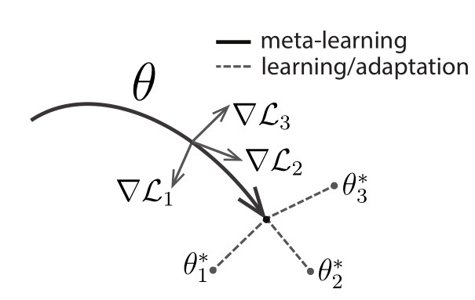
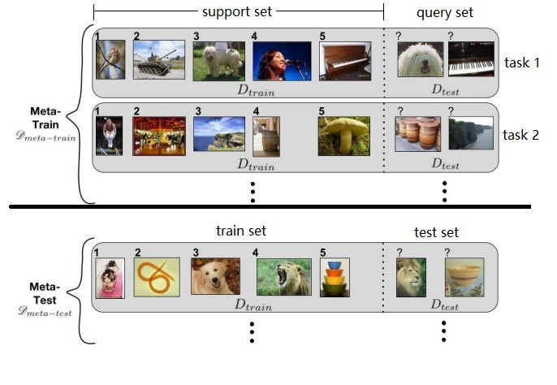

- [1. MAML](#1-maml)
  - [1.1. 算法](#11-算法)
  - [1.2. 梯度下降数学分析](#12-梯度下降数学分析)
  - [1.3. 基于优化的元学习目标](#13-基于优化的元学习目标)
  - [1.4. MAML数学分析](#14-maml数学分析)
  - [1.5. 二重梯度的另一解释（混乱向）](#15-二重梯度的另一解释混乱向)
  - [1.6. FOMAML图解](#16-fomaml图解)
  - [1.7. 缺点](#17-缺点)
- [2. 各类实现](#2-各类实现)
- [3. 参考文献](#3-参考文献)

# 1. MAML

2017.《Model-Agnostic Meta-Learning for Fast Adaptation of Deep Networks》

> The key idea underlying our method is to **train the model's initial parameters** such that the model has maximal performance on a new task after the parameters have been updated through one or more gradient steps computed with a small amount of data from that new task.

本文的设想是**训练一组初始化参数**，通过在初始参数的基础上进行一或多步的梯度调整，来达到**仅用少量数据就能快速适应新task**的目的。为了达到这一目的，训练模型需要最大化新task的loss function的参数敏感度（*maximizing the sensitivity of the loss functions of new tasks with respect to the parameters*），当敏感度提高时，极小的参数（参数量）变化也可以对模型带来较大的改进。本文提出的算法可以适用于多个领域，包括少样本的回归、图像分类，以及增强学习，并且使用更少的参数量达到了当时（2017年）最先进的专注于少样本分类领域的网络的准确率。

核心算法示意图如下

如上图所示，作者便将目标设定为，通过梯度迭代，找到对于task敏感的参数 $\theta$ 。训练完成后的模型具有对新task的学习域分布最敏感的参数，因此可以在仅一或多次的梯度迭代中获得最符合新任务的  $\theta^*$  ，达到较高的准确率。

## 1.1. 算法

假设这样一个监督分类场景，目的是训练一个数学模型 $M_{fine-tune}$ ，对未知标签的图片做分类，则两大步骤如下：

1. 利用某一批数据集训练元模型 $M_{meta}$ 
2. 在另外一批数据集上精调（fine-tune）得到最终的模型 $M_{fine-tune}$ 。

MAML在监督分类中的算法伪代码如下：

该算法是 meta-train 阶段，目的是得到 $M_{meta}$。下面进行详细分析：

参考示意图如下，一个 task 表示为 $\mathcal T$

**第一个Require**，假设我们有一个很大的图像池，里面有很多很多类别的图像，每类图像有几十个。我们从中随机抽取五个类别，形成一个 task $\mathcal T$，如此反复随机抽取可以得到一批（e.g. 1000个）task 作为训练集 $p(\mathcal T)$。假设一个 $\mathcal T$ 包含5类，每类20个样本，随机选5样本作为support set，剩余15样本为query set。

> 训练样本就这么多，要组合形成那么多的task，岂不是不同task之间会存在样本的重复？或者某些task的query set会成为其他task的support set？没错！就是这样！我们要记住，MAML的目的，在于fast adaptation，即通过对大量task的学习，获得足够强的泛化能力，从而面对新的、从未见过的task时，通过fine-tune就可以快速拟合。task之间，只要存在一定的差异即可。

**第二个Require**，step size 就是学习率，MAML 是基于二重梯度（gradient by gradient），每次迭代有两次参数更新过程，所以有两个学习率可以调整。

**1**：随机初始化模型参数 $\theta$；

**2**：循环，对于每个epoch，进行若干batch；

**3**：随机选取若干个（比如4个） $\mathcal T$  形成一个batch；

**4**：对于每个batch中的第 $i$ 个 $\mathcal T$ ，进行**第一次**梯度更新*「inner-loop 内层循环」*。

**5**：选取 $\mathcal T_i$ 中的 **support set**，共  $N\cdot K$个样本（5-way 5-shot=25个样本）

**6**：计算每个参数的梯度。原文写对每一个类下的 $K$ 个样本做计算。实际上参与计算的总计有 $N\cdot K$ 个样本。这里的loss计算方法，在回归问题中就是MSE；在分类问题中就是cross-entropy；

**7**：进行第一次梯度更新得到 $\theta'$，可以理解为对 $\mathcal T_i$ 复制一个原模型 $f(\theta)$ 来更新参数；

**8**：挑出训练集中的 query set 数据用于后续二次梯度更新；

**9**：完成第一次梯度更新。

**10**：进行**第二次**梯度更新，此时计算出的梯度直接通过GD作用于原模型上，用于更新其参数。*「outer-loop 外层循环」*

大致与步骤 **7** 相同，但是不同点有三处：

- 隐含了**二重梯度**，需要计算 $\mathcal L_{T_i}f(\theta')$ 对 $\theta$ 的导数，而 $\mathcal L_{T_i}f(\theta')$ 是 $\theta'$ 的函数， $\theta'$ 又是 $\theta$ 的函数（见步骤**7**）；

- 不再分别利用每个 $\mathcal T$ 的loss更新梯度，而是计算一个 batch 中模型 $L_{T_i}f(\theta')$ 的 loss 总和进行梯度下降；

- 参与计算的样本是task中的 **query set**（5way*15=75个样本），目的是增强模型在task上的泛化能力，避免过拟合support set。

**11**：结束在该batch中的训练，回到步骤**3**，继续采样下一个batch。

**总结**：MAML使用训练集优化内层循环，使用测试集优化模型，也就是外层循环。外层循环需要计算**二重梯度（gradient by gradient）**。

## 1.2. 梯度下降数学分析

定义神经网络模型的初始的参数为

$$
\boldsymbol{\theta} = [\theta_1,\theta_2,...,\theta_n]^T
$$

假设随机选取的一批任务为 $\tau$，包含 10 个样本，每个样本输入 6 个量，输出 4 个量。神经网络即为一个 6 输入 2 输出的网络。

样本输入矩阵为（行是样本，列是输入维度）

$$
\boldsymbol M_{in} = \begin{bmatrix}
 ^1x_1&  ^1x_2&  \cdots& ^1x_6\\ 
 ^2x_1&  ^2x_2&  \cdots& ^2x_6 \\ 
 \vdots& \vdots & \ddots & \vdots\\ 
 ^{10}x_1& ^{10}x_2&  \cdots& ^{10}x_6
\end{bmatrix}
$$

同理，输出矩阵为

$$
\boldsymbol M_{out} = \begin{bmatrix}
 ^1y_1&  ^1y_2&  \cdots& ^1y_4\\ 
 ^2y_1&  ^2y_2&  \cdots& ^2y_4 \\ 
 \vdots& \vdots & \ddots & \vdots\\ 
 ^{10}y_1& ^{10}y_2&  \cdots& ^{10}y_4
\end{bmatrix}
$$

对于参数为 $\boldsymbol \theta$ 的模型，其预测输出矩阵为

$$
\boldsymbol M_{pred}(\boldsymbol \theta) = \begin{bmatrix}
 ^1\hat{y}_1(\boldsymbol \theta)&  ^1\hat{y}_2(\boldsymbol \theta)&  \cdots& ^1\hat{y}_4(\boldsymbol \theta)\\ 
 ^2\hat{y}_1(\boldsymbol \theta)&  ^2\hat{y}_2(\boldsymbol \theta)&  \cdots& ^2\hat{y}_4(\boldsymbol \theta) \\ 
 \vdots& \vdots & \ddots & \vdots\\ 
 ^{10}\hat{y}_1(\boldsymbol \theta)& ^{10}\hat{y}_2(\boldsymbol \theta)&  \cdots& ^{10}\hat{y}_4(\boldsymbol \theta)
\end{bmatrix}
$$

定义一个损失函数 $L_\tau$ 来衡量模型在任务 $\tau$ 上的性能（即模型预测输出与期望输出间的距离），可以采用 MSE 来表征，注意到损失函数是关于模型参数的函数

$$
L_\tau(\boldsymbol \theta) = MSE_\tau = \frac{1}{10\cdot4} \cdot [\frac{1}{2} \sum_i^{10} \sum_j^{4}(^i\hat{y}_j(\boldsymbol \theta) - {}^iy_j)^2]
$$

如何使得模型的预测输出与期望输出的距离变小呢？按照梯度下降方法（GD），我们可以计算损失函数 $L_\tau(\boldsymbol \theta)$ 关于模型参数 $\boldsymbol \theta$ 的梯度，然后沿着这个梯度的负方向更新模型参数即可。

假设损失函数关于模型参数的梯度为 $\boldsymbol g$，则

$$
\begin{aligned}
\boldsymbol g = \nabla_{\boldsymbol \theta} L_\tau(\boldsymbol \theta) = \frac{\partial L_\tau(\boldsymbol \theta)}{\partial \boldsymbol \theta} = \begin{bmatrix}
\partial L_\tau(\boldsymbol \theta) / \partial \theta_1\\ 
\partial L_\tau(\boldsymbol \theta) / \partial \theta_2\\ 
\vdots\\ 
\partial L_\tau(\boldsymbol \theta) / \partial \theta_n
\end{bmatrix}
\end{aligned}
$$

我们可以计算1次梯度下降，也可以计算多次。假设 $\boldsymbol g_1$ 是在原始模型参数上进行第1次梯度计算，有

$$
\begin{aligned}
\boldsymbol g_1 &= \nabla_{\boldsymbol \theta} L_\tau(\boldsymbol \theta)\\
{}^1\boldsymbol \theta &= \boldsymbol \theta - \epsilon \boldsymbol g_1
\end{aligned}
$$

其中，${}^1\boldsymbol \theta$ 表示经过1次梯度更新后的模型参数，后文以此类推。

第2次梯度计算建立在第1次梯度计算的基础上，有

$$
\begin{aligned}
\boldsymbol g_2 &= \nabla_{{}^1\boldsymbol \theta} L_\tau({}^1\boldsymbol \theta)\\
{}^2\boldsymbol \theta &= {}^1\boldsymbol \theta - \epsilon \boldsymbol g_2\\
& = \boldsymbol \theta - \epsilon \boldsymbol g_1 - \epsilon \boldsymbol g_2
\end{aligned}
$$

我们将1次，2次，...，直到 $k$ 次梯度计算的过程统一列写如下：

$$
\begin{aligned}
initialization:\quad&{}^0\boldsymbol \theta = \boldsymbol \theta\\
1^{st}\;gradient\;step:\quad&{}^1\boldsymbol \theta = U^1_\tau(\boldsymbol \theta)=\boldsymbol \theta - \epsilon \boldsymbol g_1\\
2^{nd}\;gradient\;step:\quad&{}^2\boldsymbol \theta = U^2_\tau(\boldsymbol \theta)=\boldsymbol \theta- \epsilon \boldsymbol g_1- \epsilon \boldsymbol g_2\\
...&...\\
k^{th}\;gradient\;step:\quad&{}^k\boldsymbol \theta = U^k_\tau(\boldsymbol \theta)=\boldsymbol \theta- \epsilon \boldsymbol g_1- \epsilon \boldsymbol g_2-...- \epsilon \boldsymbol g_k\\
\end{aligned}
$$

其中，模型参数 ${}^k_\tau\boldsymbol \theta$ 表示模型参数已经在任务数据 $\tau$ 上经过 $k$ 次更新，$U^k_\tau(\boldsymbol \theta)$ 是一个梯度算子，定义为在数据 $\tau$ 进行 $k$ 次更新，$U^k_\tau(\boldsymbol \theta)={}^{k}_\tau \boldsymbol \theta$。

## 1.3. 基于优化的元学习目标

MAML 的目标是：找寻一组模型初始参数 $\boldsymbol \theta$，使得模型在面对随机选取的新任务 $\tau$ 时，经过 $k$ 次梯度更新，在 $\tau$ 上的损失函数就能达到很小。

> We consider the optimization problem of MAML: find an initial set of parameters, $\boldsymbol \theta$, such that for a randomly sampled task $\tau$ with corresponding loss $L_\tau$, the learner will have low loss after $k$ updates. --------[Reptile]

用数学语言描述，即

$$
\begin{aligned}
\mathop{minimize}_{\phi} \; \mathbb E_{\tau}[L_{\tau}(^{k}_\tau\boldsymbol \theta)]
= \mathop{minimize}_{\phi} \; \mathbb E_{\tau}[L_{\tau}(U^k_\tau(\boldsymbol \theta))]
\end{aligned}
$$

其中，${}^{k}_\tau \boldsymbol \theta$ 是在任务 $\tau$ 上经过 $k$ 次更新后的模型参数。在前面的梯度数学分析中，我们省略了下标 $\tau$，因为梯度计算和损失函数计算默认都是对同一批数据，但是在这里加上下标，是因为后面 MAML 并不在同一批数据上计算梯度和计算损失函数，需要下标做区分。

虽然这里说的是 MAML 的目标，实际上这是基于优化的元学习问题（Optimization-based Meta-Learning）共同的目标。

## 1.4. MAML数学分析

假设任务 $\tau$ 可以分解为两个互不相交的数据子集 A（比如包含7个样本） 和 B（包含3个样本），MAML 通过进行 $k=1$ 次梯度算子更新，将上述问题转化为如下问题。省略 $U$ 的上标 $k$，有

$$
\begin{aligned}
\mathop{minimize}_{\phi} \; \mathbb E_{\tau}[L_{\tau,B}(U_{\tau,A}(\boldsymbol \theta))]
\end{aligned}
$$

即 MAML 在数据集 A 上训练，在数据集 B 上计算损失函数 $L_{\tau,B}(U_{\tau,A}(\boldsymbol \theta))$，使得其最小。

MAML 中只进行 $k=1$ 次梯度算子更新，作者号称有如下四个原因：

- Meta Learning会快很多；

- 如果能让模型只经过一次梯度下降就性能优秀，当然很好；

- Few-shot learning的数据有限，多次梯度下降很容易过拟合；

- 刚才说的可以在实际应用中多次梯度下降。

**为了使损失函数最小，需要求损失函数对模型原始参数 $\boldsymbol \theta$ 的梯度，然后再在梯度负方向更新参数。** 注意到

$$
U^{k=1}_\tau(\boldsymbol \theta)={}^{1}_\tau \boldsymbol \theta
$$

那么

$$
\begin{aligned}
\boldsymbol g_{MAML} &= \nabla_{\boldsymbol \theta} L_{\tau,B}(U_{\tau,A}(\boldsymbol \theta))= \frac{\partial}{\partial \boldsymbol \theta} L_{\tau,B}(U_{\tau,A}(\boldsymbol \theta))\\
&= L_{\tau,B}'(_{A}^1\boldsymbol \theta) U_{\tau,A}'(\boldsymbol \theta)\quad where \quad {}^{1}_A \boldsymbol \theta = U_{\tau,A}(\boldsymbol \theta)
\end{aligned}
$$

上式中，第一项是使用 A 数据进行一次梯度更新后的模型参数在 B 数据上的损失函数的导数，这里的导数是对更新后的模型参数求的，比较好求。

首先计算 $U_{\tau,A}'(\boldsymbol \theta)$，前面算子更新时我们知道 $U^1_\tau(\boldsymbol \theta)=\boldsymbol \theta - \epsilon \boldsymbol g_1$
$$
\begin{aligned}
    U_{\tau,A}'(\boldsymbol \theta) &= \frac{\partial U_{\tau,A}(\boldsymbol \theta)}{\partial \boldsymbol \theta}= \frac{\partial \boldsymbol \theta}{\partial \boldsymbol \theta}-\epsilon \frac{\partial \boldsymbol g_1}{\partial \boldsymbol \theta}\\
\end{aligned}
$$

下面分析第一项 $\frac{\partial \boldsymbol \theta}{\partial \boldsymbol \theta}$ 的展开，注意到 $\boldsymbol \theta = [\theta_1,\theta_2,...,\theta_n]^T$ 的定义，那么该项展开即为 $\boldsymbol \theta$ 的每个分量对其自身求偏导，需要分情况讨论

$$
\begin{aligned}
\frac{\partial \theta_i}{\partial \theta_j} = \left\{\begin{matrix}
1 \quad i=j\\ 
0 \quad i \neq j
\end{matrix}\right.
\end{aligned}
$$

那么第一项即为 $n\times n$ 单位阵（可以看作一个特殊的 Jacobian 矩阵）

$$
\begin{aligned}
\frac{\partial \boldsymbol \theta}{\partial \boldsymbol \theta} = 
\begin{bmatrix}
1\;0\;\cdots \; 0\\
0\;1\;\cdots \; 0\\
\vdots\;\vdots\;\ddots \; \vdots\\
0\;0\;\cdots \; 1
\end{bmatrix} = \boldsymbol I_{n \times n}
\end{aligned}
$$

然后分析第二项的展开。根据前文易知

$$
\begin{aligned}
\boldsymbol g &= \begin{bmatrix}
\partial L_\tau / \partial \theta_1\\ 
\partial L_\tau / \partial \theta_2\\ 
\vdots\\ 
\partial L_\tau / \partial \theta_n
\end{bmatrix}
\end{aligned}
$$

代入有

（**向量对向量求偏导，是向量的每个分量对另一个向量的每个分量求偏导后形成矩阵，就是Hessian 矩阵！Hessian 等价于梯度的 Jacobian 矩阵。——Ian Goodfellow所著的《Deep Learning》的P78**）

$$
\begin{aligned}
    U_{\tau,A}'(\boldsymbol \theta) &= \frac{\partial U_{\tau,A}(\boldsymbol \theta)}{\partial \boldsymbol \theta}\\
    &= \boldsymbol I_{n \times n} - \epsilon \begin{bmatrix}
    \partial (\frac{\partial L_{\tau,A}}{\partial \theta_1}) / \partial \theta_1 &  \partial (\frac{\partial L_{\tau,A}}{\partial \theta_1}) / \partial \theta_2&  \cdots & \partial (\frac{\partial L_{\tau,A}}{\partial \theta_1}) / \partial \theta_n \\ 
    \partial (\frac{\partial L_{\tau,A}}{\partial \theta_2}) / \partial \theta_1 &  \partial (\frac{\partial L_{\tau,A}}{\partial \theta_2}) / \partial \theta_2&  \cdots & \partial (\frac{\partial L_{\tau,A}}{\partial \theta_2}) / \partial \theta_n \\ 
    \vdots & \vdots & \ddots & \vdots\\
    \partial (\frac{\partial L_{\tau,A}}{\partial \theta_n}) / \partial \theta_1 &  \partial (\frac{\partial L_{\tau,A}}{\partial \theta_n}) / \partial \theta_2&  \cdots & \partial (\frac{\partial L_{\tau,A}}{\partial \theta_n}) / \partial \theta_n \\ 
    \end{bmatrix}_{n \times n}\\
    &= \boldsymbol I_{n \times n} - \epsilon \begin{bmatrix}
    \partial^2 L_{\tau,A} / \partial \theta_1^2 &  \partial^2 L_{\tau,A} /\partial \theta_1 \partial \theta_2 &  \cdots & \partial^2 L_{\tau,A} /\partial \theta_1 \partial \theta_n \\ 
    \partial^2 L_{\tau,A} /\partial \theta_2 \partial \theta_1 &  \partial^2 L_{\tau,A} / \partial \theta_2^2 &  \cdots & \partial^2 L_{\tau,A} /\partial \theta_2 \partial \theta_n \\ 
    \vdots & \vdots & \ddots & \vdots\\
    \partial^2 L_{\tau,A} /\partial \theta_n \partial \theta_1 &  \partial^2 L_{\tau,A} /\partial \theta_n \partial \theta_2&  \cdots & \partial^2 L_{\tau,A} / \partial \theta_n^2 \\ 
    \end{bmatrix}_{n \times n}\\
    &= \boldsymbol I_{n \times n} - \epsilon \boldsymbol H_{\tau,A}(\boldsymbol \theta)_{n \times n}
    \end{aligned}
$$

MAML 的作者表示，大部分计算量都在于计算这个 Hessian 矩阵。因此，作者提出了一种简化计算二重梯度的方法，即 First-Order MAML (FOMAML)。

FOMAML 假设学习率 $\epsilon \rightarrow 0^+$，则上式中的 Hessian 矩阵因为乘以 $0^+$ 被消去。那么 $U_{\tau,A}'(\boldsymbol \theta)$ 就等于单位阵了，

此时 FOMAML 的梯度即为

$$
\boldsymbol g_{FOMAML} = L'_{\tau,B}(_{A}^1 \boldsymbol \theta)
$$

那么 FOMAML 的实现过程就很简单了：

- 采样任务 $\tau$；
- 计算在数据集 A 上的梯度因子 $U_{\tau,A}(\boldsymbol \theta)= _{A}^1 \boldsymbol \theta = \phi$;
- 计算在数据集 B 上的损失函数 $L_{\tau,B}$ 对 $\phi$ 的导数：$g_{FOMAML}=L'_{\tau,B}(\phi)$；
- 将 $g_{FOMAML}$ 插入外循环更新参数。

可以看出只需要计算一重梯度即可，约节省了33%的计算量。

## 1.5. 二重梯度的另一解释（混乱向）

设初始化的参数为 $\theta$ ，每个任务的模型一开始的参数都是 $\theta$。

模型在 $\mathcal T_i$ 上经过训练后，参数就会变成 $\theta_i'$ ，用 $l_i(\theta_i')$ 表示模型在**每个任务 $\mathcal T_i$ 上的损失**。那么，对于这个Meta Learning而言，**整体的损失**函数应该是 $\theta$ 的函数：

$$
\mathcal L( \theta ) = \sum_{i=1}^N l_i(\theta_i')
$$

一旦我们可以计算 $\theta$ 的梯度，就可以直接更新 $\theta$ ：

$$
\theta' \leftarrow \theta-\epsilon\nabla_{\theta}\mathcal L(\theta)
$$

MAML假设：**每次训练只进行一次梯度下降**。如果只经历了一次梯度下降，即可用等号代替左箭头：

$$
\theta' = \theta-\epsilon \nabla_{\theta}\mathcal L(\theta)
$$

对于每个不同任务，准确来说应该是：

$$
\theta_i' = \theta-\epsilon \nabla_{\theta}\mathcal l_i(\theta)
$$

下一步就是计算 $\theta$ 关于 $\mathcal L$ 的梯度。我们有：

$$
\nabla_\theta \mathcal L( \theta ) = \nabla_\theta \sum_{i=1}^N l_i(\theta_i') = \sum_{i=1}^N \nabla_\theta l_i(\theta_i')
$$

现在的问题是如何求 $\nabla_\theta l_i(\theta_i')$ ，略去下标 $i$，有：

$$
\begin{aligned}
\nabla_\theta l(\theta ') =
    \begin{bmatrix}
    \partial l(\theta')/\partial \theta_1\\ 
    \partial l(\theta')/\partial \theta_2\\ 
    \vdots\\ 
    \partial l(\theta')/\partial \theta_n
    \end{bmatrix}
\end{aligned}
$$

注意 $l$ 是的 $\theta'$ 的函数，而 $\theta'$ 又和每一个 $\theta_i$ 有关，因此有：

$$
\frac {\partial l(\theta')}{\partial \theta_i} = \sum_j\frac{\partial l(\theta')}{\partial \theta_j'}\frac{\partial \theta_j'}{\partial \theta_i}
$$

也就是说，每一个 $\theta_i$ 通过影响不同的 $\theta_j '$，从而影响到了 $l$。$l$ 和 $\theta$ 的关系是很直接的，我们可以直接求$\frac{\partial l(\theta ')}{\partial \theta_j'}$ ，现在的问题是怎么求 $\frac{\partial \theta_j'}{\partial \theta_i}$。

注意到 $\theta'$ 和 $\theta$ 的关系也是显然的：

$$
\theta' = \theta-\epsilon \nabla_{\theta}\mathcal l(\theta)
$$

当 $i \neq j$ 时

$$
\frac{\partial \theta_j'}{\partial \theta_i} = -
\epsilon\frac{\partial l^2(\theta)}{\partial \theta_i\partial \theta_j}
$$

当 $i = j$ 时

$$
\frac{\partial \theta_j'}{\partial \theta_i} = 
1 - \epsilon\frac{\partial l^2(\theta)}{\partial \theta_i\partial \theta_i}
$$

到此为止已经把梯度计算出来了，二重梯度也是MAML计算中最为耗时的部分。

在MAML的论文中提到了一种简化，它通过计算一重梯度来近似二重梯度。具体而言，假设学习率 $\epsilon \rightarrow 0^+$，则更新一次后的参数 $\theta'$ 对初始参数 $\theta$ 求偏导可变为

$$
\begin{aligned}
&(i \neq j) \; \frac{\partial \theta_j'}{\partial \theta_i} = -
\epsilon\frac{\partial l^2(\theta)}{\partial \theta_i\partial \theta_j} \approx 0 \\
&(i = j) \; \frac{\partial \theta_j'}{\partial \theta_i} = 1 - \epsilon\frac{\partial l^2(\theta)}{\partial \theta_i\partial \theta_i} \approx 1
\end{aligned}
$$

也就是说，可**将更新后的模型参数对模型原始参数的导数近似看作常数**（0或1）。

那么原来的偏导可近似为：

$$
\frac {\partial l(\theta')}{\partial \theta_i} = \sum_j\frac{\partial l(\theta')}{\partial \theta_j'}\frac{\partial \theta_j'}{\partial \theta_i} \approx
\frac {\partial l(\theta')}{\partial \theta_i'}
$$

整个梯度就可以近似为：

$$
\nabla_\theta l(\theta') \approx \nabla_{\theta'} l(\theta')
$$

简化后的一阶近似的MAML模型参数更新式为：

$$
\begin{aligned}
\theta \leftarrow \theta - \alpha \nabla_{\theta'} \sum \mathcal L(\theta')\\
\theta_i' \leftarrow \theta - \beta \nabla_\theta l_i(\theta)\\
\end{aligned}
$$

## 1.6. FOMAML图解

一阶近似的MAML可以看作是如下形式的参数更新：假设每个batch只有一个task，某次采用第m个task来更新模型参数，得到$\hat\theta^m$，再求一次梯度来更新模型的原始参数$\phi$，将其从 $\phi^0$ 更新至 $\phi^1$，以此类推。

与之相比，右边是模型预训练方法，它是将参数根据每次的训练任务一阶导数的方向来更新参数。

## 1.7. 缺点

MAML的缺点[[2](#ref2)]：

1. Hard to train：paper中给出的backbone是4层的conv加1层linear，试想，如果我们换成16层的VGG，每个task在算fast parameter的时候需要计算的Hessian矩阵将会变得非常大。那么你每一次迭代就需要很久，想要最后的model收敛就要更久。

2. Robustness一般：不是说MAML的robustness不好，因为也是由一阶online的优化方法SGD求解出来的，会相对找到一个flatten minima location。然而这和非gradient-based meta learning方法求解出来的model的robust肯定是没法比的。

# 2. 各类实现

[dragen-1860 的 Pytorch 实现](https://github.com/dragen1860/MAML-Pytorch)：https://github.com/dragen1860/MAML-Pytorch

[Tensorflow实现](https://github.com/dragen1860/MAML-TensorFlow)：https://github.com/dragen1860/MAML-TensorFlow

# 3. 参考文献

[1]  [Rust-in](https://www.zhihu.com/people/rustinnnnn). [MAML 论文及代码阅读笔记](https://zhuanlan.zhihu.com/p/66926599).

[2] 人工智障. [MAML算法，model-agnostic metalearnings?](https://www.zhihu.com/question/266497742/answer/550695031)

[3] [Veagau](https://www.cnblogs.com/veagau/). [【笔记】Reptile-一阶元学习算法](https://www.cnblogs.com/veagau/p/11816163.html)

[4] [pure water](https://blog.csdn.net/qq_41694504). [Reptile原理以及代码详解](https://blog.csdn.net/qq_41694504/article/details/106750606)