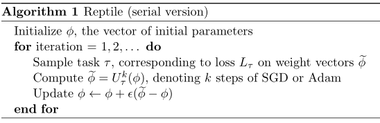
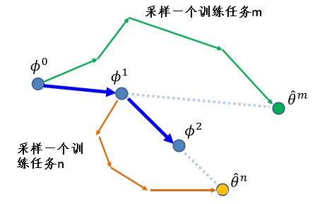

- [1. Reptile](#1-reptile)
  - [1.1. 算法](#11-算法)
  - [1.2. 数学分析](#12-数学分析)
  - [1.3. 有效性分析](#13-有效性分析)
  - [1.4. 实验](#14-实验)
- [2. 比较](#2-比较)
- [3. 算法实现](#3-算法实现)
- [4. reptile回归sin函数](#4-reptile回归sin函数)
- [5. 参考文献](#5-参考文献)


# 1. Reptile

2018.《On First-Order Meta-Learning Algorithms》和《Reptile: a Scalable Metalearning Algorithm》

Reptile是OpenAI提出的一种非常简单的meta learning 算法。与MAML类似，也是学习网络参数的初始值。

## 1.1. 算法

算法伪代码如下



其中，$\phi$ 是模型的初始参数，$\tau$ 是某个 task，$SGD(L,\phi,k)$ 表示从$\phi$ 开始对损失函数$L$进行$k$次随机梯度下降，返回更新后的参数$W$。

在最后一步中，通过 $W-\phi$ 这种残差形式来更新一次初始参数。

算法当然也可设计为batch模式，如下


如果k=1，该算法等价于「联合训练」（joint training，通过训练来最小化在一系列训练任务上期望损失）。

Reptile 要求 k>1，更新依赖于损失函数的高阶导数，k>1 时 Reptile 的行为与 k=1（联合训练）时截然不同。

Reptile与FOMAML紧密相关，但是与FOMAML不同，Reptile**无需对每一个任务进行训练-测试（training-testing）划分**。

相比MAML需要进行二重梯度计算，Reptile只需要进行一重梯度计算，计算速度更快。

Reptile的图例如下。



## 1.2. 数学分析

**基于优化的元学习问题**（Optimization-based Meta-Learning）的目标：找寻一组**模型初始参数** $\boldsymbol \theta$，使得模型在面对随机选取的新任务 $\tau$ 时，经过 $k$ 次梯度更新，在 $\tau$ 上的损失函数就能达到很小。

> We consider the optimization problem of MAML: find an initial set of parameters, $\boldsymbol \theta$, such that for a randomly sampled task $\tau$ with corresponding loss $L_\tau$, the learner will have low loss after $k$ updates. --------[Reptile]

用数学语言描述，即

$$
\begin{aligned}
\mathop{minimize}_{\phi} \; \mathbb E_{\tau}[L_{\tau}(^{k}_\tau\boldsymbol \theta)]
= \mathop{minimize}_{\phi} \; \mathbb E_{\tau}[L_{\tau}(U^k_\tau(\boldsymbol \theta))]
\end{aligned}
$$

其中，${}^{k}_\tau \boldsymbol \theta$ 是在任务 $\tau$ 上经过 $k$ 次更新后的模型参数。

虽然这里说的是 MAML 的目标，实际上这是**基于优化的元学习问题**（Optimization-based Meta-Learning）共同的目标。因为截至 MAML 文章发表，人们还没有建立起元学习的框架概念。

## 1.3. 有效性分析

为什么 Reptile 有效？首先以两步 SGD 为例分析参数更新过程

$$
\begin{aligned}
\phi_1 &= \phi\\
\phi_2 &= \phi_1 - \alpha L_1'(\phi_1)\\
\phi_3 &= \phi_2 - \alpha L_1'(\phi_1) - \alpha L_2'(\phi_2)
\end{aligned}
$$

下面定义几个**辅助变量**，其中 $i\in [1, k]$ 指代第 $i$ 个 minibatch，也即第 $i$ 次梯度下降的训练过程（？）

$$
\begin{aligned}
g_i &= L_i'(\phi_i)
\;\;(gradient \; obtained\; during\;SGD)\\
\phi_{i+1} &= \phi_i-\alpha g_i
\;\;(sequence\;of\;parameters)\\
\overline{g}_i &= L_i'(\phi_1)
\;\;(gradient\;at\;initial\;point)\\
\overline{H}_i &= L_i''(\phi_1)
\;\;(Hessian\;at\;initial\;point)\\
\end{aligned}
$$

首先，采用**泰勒展开**将 $g_i$ 展开至 “二阶导+高次项” 的形式

$$
\begin{aligned}
g_i &= L_i'(\phi_i) = L_i'(\phi_1) + L_i''(\phi_1)(\phi_i - \phi_1) + O(||\phi_i - \phi_1||^2)\\
&= \overline{g}_i + \overline{H}_i(\phi_i - \phi_1) + O(\alpha^2)\\
&= \overline{g}_i - \alpha\overline{H}_i\sum_0^{i-1}g_i + O(\alpha^2)\\
&= \overline{g}_i - \alpha\overline{H}_i\sum_0^{i-1}\overline{g}_i + O(\alpha^2)\\
\end{aligned}
$$

最后一步的依据是，$g_i = \overline{g}_i + O(\alpha)$ 带入倒数第二行时，后面的 $O(\alpha)$ 与求和符号前的 $\alpha$ 相乘，即变为 $O(\alpha^2)$ 从而合并为一项。

下面取  $k=2$ ，即两步SGD，分别推导 MAML、FOMAML、Reptile 的梯度。[这个参考](https://www.cnblogs.com/veagau/p/11816163.html#42-reptile实现) [[3](#ref3)] 考虑了 $k$ 为任意情况下的通解，在  $k=2$ 时的结果与本文相同。

对于二阶的MAML，初始参数 $\phi_1$ 首先在support set上梯度更新一次得到 $\phi_2$ ，然后将 $\phi_2$ 在 query set 上计算损失函数，再计算梯度更新模型的初始参数。即 query set 的 loss 要对 $\phi_2$ 求导，链式法则 loss 对  $\phi_2$ 求导乘以  $\phi_2$ 对 $\phi_1$ 求导

$$
\begin{aligned}
g_{MAML} &= \frac{\partial}{\partial\phi_1}L_2(\phi_2) = \frac{\partial \phi_2}{\partial \phi_1} L_2'(\phi_2) \\
 &= (I-\alpha L_1''(\phi_1))L_2'(\phi_2)\\
 &= (I-\alpha L_1''(\phi_1))(L_2'(\phi_1) + L_2''(\phi_1)(\phi_2 - \phi_1) + O(\alpha^2))\\
 &= (I-\alpha L_1''(\phi_1))(L_2'(\phi_1) + L_2''(\phi_1)(\phi_2 - \phi_1)) + O(\alpha^2)\\
 &= (I-\alpha L_1''(\phi_1))(L_2'(\phi_1) - \alpha L_2''(\phi_1)L_1'(\phi_1)) + O(\alpha^2)\\
 &= L_2'(\phi_1)-\alpha L_2''(\phi_1)L_1'(\phi_1) - \alpha L_1''(\phi_1)L_2'(\phi_1) + O(\alpha^2)\\
 \end{aligned}
$$

对于FOMAML，其一阶简化是简化了参数 $\phi_2$ 对初始参数 $\phi_1$ 求导部分，即 $\frac{\partial \phi_2}{\partial \phi_1} = const$，参见2.3节。则只剩下 loss 对参数 $\phi_2$ 的求导。

$$
\begin{aligned}
g_{FOMAML} &= L_2'(\phi_2) = L_2'(\phi_1) + L_2''(\phi_1)(\phi_2 - \phi_1) + O(\alpha^2)\\
&= L_2'(\phi_1) -\alpha L_2''(\phi_1)L_1'(\phi_1) + O(\alpha^2)
\end{aligned}
$$

对于Reptile，根据梯度定义和SGD过程有

$$
\begin{aligned}
g_{Reptile} &= (\phi_1 - \phi_3)/\alpha = L_1'(\phi_1)+L_2'(\phi_2)\\
&= L_1'(\phi_1)+L_2'(\phi_1)+ L_2''(\phi_1)(\phi_2-\phi_1) + O(\alpha^2)\\
&= L_1'(\phi_1)+L_2'(\phi_1)-\alpha L_2''(\phi_1)L_1'(\phi_1) + O(\alpha^2)
\end{aligned}
$$

接下来对上面的三个梯度进行变量替换，全部用之前定义的辅助变量来表示

$$
\begin{aligned}
g_{MAML} &= g_2 - \alpha \overline{H_2}\overline{g}_1-\alpha\overline{H_1}\overline{g}_2+O(\alpha^2)\\
g_{FOMAML} &= g_2 = \overline{g}_2-\alpha\overline{H}_2\overline{g}_1+O(\alpha^2)\\
g_{Reptile} &= g_1+g_2 = \overline{g}_1+\overline{g}_2-\alpha \overline{H}_2\overline{g}_1 + O(\alpha^2)\\
\end{aligned}
$$

再次定义两个期望参数如下。

**第一个**：AvgGrad 定义为loss对初始参数的梯度的平均期望

$$
AvgGrad = \mathbb E_{\tau,1}[\overline{g}_1] =\mathbb E_{\tau,2}[\overline{g}_2]
$$

（-AvgGrad）是参数 $\phi$ 在最小化 joint training 问题中的下降方向。就是想在所有batch上减小loss，也就是减小整体的任务损失。

为什么此处 $\overline{g}_1$ 和 $\overline{g}_2$ 的期望相等呢，因为它们都是表示的是loss对原始参数的梯度，只不过对应于不同的batch。在minibatch中，一个batch用于进行一次梯度下降，因为batch是随机的，所以loss对原始参数的梯度与batch是无关的（？）。

**第二个**：AvgGradInner

$$
AvgGradInner = \mathbb E_{\tau,1,2}[\overline{H}_1\overline{g}_2]
= \mathbb E_{\tau,1,2}[\overline{H}_2\overline{g}_1]
= \frac{1}{2}\mathbb E_{\tau,1,2}[\overline{H}_1\overline{g}_2+\overline{H}_2\overline{g}_1]
= \frac{1}{2}\mathbb E_{\tau,1,2}[\frac{\partial}{\partial \phi_1}(\overline{g}_1\cdot \overline{g}_2)]
$$

(-AvgGradInner) 的方向可以增大不同minibatch间梯度的内积，从而提高泛化能力。换句话说，AvgGradInner是 $\overline{g}_0\overline{g}_1$ 的对原始参数的导数，因为梯度在参数更新时是加负号的，**所以是在最大化同一任务中不同minibatch之间梯度的内积**。对其中一个batch进行梯度更新会显著改善另一个batch的的表现，这样就增加了模型的泛化性和快速学习的能力。

下面就可以对上述三个梯度进行进一步替换，$k=2$ 时

$$
\begin{aligned}
\mathbb{E}[g_{MAML}] &= (1)AvgGrad - (2\alpha)AvgGradInner + O(\alpha^2)\\
\mathbb{E}[g_{FOMAML}] &= (1)AvgGrad - (\alpha)AvgGradInner + O(\alpha^2)\\
\mathbb{E}[g_{Reptile}] &= (2)AvgGrad - (\alpha)AvgGradInner + O(\alpha^2)\\
\end{aligned}
$$

扩展到 $k>2$ 的情况有 [[3](#ref3)] 

$$
\begin{aligned}
\mathbb{E}[g_{MAML}] &= (1)AvgGrad - (2(k-1)\alpha)AvgGradInner + O(\alpha^2)\\
\mathbb{E}[g_{FOMAML}] &= (1)AvgGrad - ((k-1)\alpha)AvgGradInner + O(\alpha^2)\\
\mathbb{E}[g_{Reptile}] &= (2)AvgGrad - (\frac{1}{2}k(k-1)\alpha)AvgGradInner + O(\alpha^2)\\
\end{aligned}
$$

可以看到三者AvgGradInner与AvgGrad之间的系数比的关系是：**MAML > FOMAML > Retile**。这个比例与步长 $\alpha$，迭代次数 $k$ 正相关。

~~另一种分析有效的方法借助了流形，Reptile 收敛于一个解，这个解在欧式空间上与每个任务的最优解的流形接近。没看懂不管了。~~

## 1.4. 实验

**少样本分类**


从两个表格中的数据可以看出，MAML与Reptile在加入了转导（Transduction）后，在Mini-ImageNet上进行实验，Reptile的表现要更好一些，而Omniglot数据集上正好相反。

**不同的内循环梯度组合比较**

通过在内循环中使用四个不重合的Mini-Batch，产生梯度数据 g1,g2,g3,g4 ，然后将它们以不同的方式进行线性组合（等价于执行多次梯度更新）用于外部循环的更新，进而比较它们之间的性能表现，实验结果如下图：


从曲线可以看出：

- 仅使用一个批次的数据产生的梯度的效果并不显著，因为相当于让模型用见到过的少量的数据去优化所有任务。
- 进行了两步更新的Reptile（绿线）的效果要明显不如进行了两步更新的FOMAML（红线），因为Reptile在AvgGradInner上的**权重**（AvgGradInner与AvgGrad的系数的比例）要小于FOMAML。
- 随着mini-batch数量的增多，所有算法的性能也在提升。通过同时利用多步的梯度更新，Reptile的表现要比仅使用最后一步梯度更新的FOMAML的表现好。

**内循环中Mini-Batch 重合比较**

Reptile和FOMAML在内循环过程中都是使用的SGD进行的优化，在这个优化过程中任何微小的变化都将导致最终模型性能的巨大变化，因此这部分的实验主要是探究两者对于内循环中的超数的敏感性，同时也验证了FOMAML在minibatch以错误的方式选取时会出现显著的性能下降情况。

mini-batch的选择有两种方式：

- **shared-tail（共尾）**：最后一个内循环的数据来自以前内循环批次的数据
- **separate-tail（分尾）**：最后一个内循环的数据与以前内循环批次的数据不同


采用不同的mini-batch选取方式在FOMAML上进行实验，发现随着内循环迭代次数的增多，采用分尾方式的FOMAML模型的测试准确率要高一些，因为在这种情况下，测试的数据选取方式与训练过程中的数据选取方式更为接近。

当采用不同的批次大小时，采用共尾方式选取数据的FOMAML的准确性会随着批次大小的增加而显著减小。当采用**full-batch**时，共尾FOMAML的表现会随着外循环步长的加大而变差。

**共尾FOMAML的表现如此敏感的原因可能是最初的几次SGD更新让模型达到了局部最优，以后的梯度更新就会使参数在这个局部最优附近波动。**

# 2. 比较

再次比较Model Pre-training、MAML 和 Reptile方法。


（左：MAML。右：Model Pre-training）


（Reptile）

Pre-training采用task的loss对参数的梯度更新模型的原始参数。

MAML采用task的第二次梯度计算更新模型的原始参数。

Reptile采用多次梯度计算更新模型的原始参数。


上面这个图不具体，但是很直观的展示了这些算法的区别。$g_i$ 表示第 $i$ 次负梯度计算。这里的MAML是一阶的，沿着 $g_2$ 方向更新，Reptile 沿着 $g_1+g_2$  的方向更新，而我们常规的预训练模型就是沿着 $g_1$ 方向更新。


# 3. 算法实现

[First-order近似实现Reptile](https://github.com/dragen1860/Reptile-Pytorch)：https://github.com/dragen1860/Reptile-Pytorch

# 4. reptile回归sin函数

```python
import numpy as np
import torch
from torch import nn, autograd as ag
import matplotlib.pyplot as plt
from copy import deepcopy

seed = 0
plot = True
innerstepsize = 0.02 # stepsize in inner SGD
innerepochs = 1 # number of epochs of each inner SGD
outerstepsize0 = 0.1 # stepsize of outer optimization, i.e., meta-optimization
niterations = 30000 # number of outer updates; each iteration we sample one task and update on it

rng = np.random.RandomState(seed)
torch.manual_seed(seed)

# Define task distribution
x_all = np.linspace(-5, 5, 50)[:,None] # generate 50 x points within [-5,5]
ntrain = 10 # Size of training minibatches
def gen_task():
    "Generate regression problem"
    phase = rng.uniform(low=0, high=2*np.pi)
    ampl = rng.uniform(0.1, 5)
    f_randomsine = lambda x : np.sin(x + phase) * ampl
    return f_randomsine

# Define model. Reptile paper uses ReLU, but Tanh gives slightly better results
model = nn.Sequential(
    nn.Linear(1, 64),
    nn.Tanh(),
    nn.Linear(64, 64),
    nn.Tanh(),
    nn.Linear(64, 1),
)

def totorch(x):
    return ag.Variable(torch.Tensor(x))

def train_on_batch(x, y):
    x = totorch(x)
    y = totorch(y)
    model.zero_grad()
    ypred = model(x)
    loss = (ypred - y).pow(2).mean()
    loss.backward()
    for param in model.parameters():
        param.data -= innerstepsize * param.grad.data

def predict(x):
    x = totorch(x)
    return model(x).data.numpy()

# Choose a fixed task and minibatch for visualization
f_plot = gen_task()
xtrain_plot = x_all[rng.choice(len(x_all), size=ntrain)]

# Reptile training loop
for iteration in range(niterations): # iterate 30000 times
    weights_before = deepcopy(model.state_dict())
    # Generate task
    f = gen_task()
    y_all = f(x_all)
    # Do SGD on this task
    inds = rng.permutation(len(x_all)) # get random index of 0-50
    for _ in range(innerepochs): # SGD 1 times
        for start in range(0, len(x_all), ntrain): # from 0-50, select a num every 'ntrain' interval
            mbinds = inds[start:start+ntrain] # get randomly index from 'start' to 'ntrain'
            train_on_batch(x_all[mbinds], y_all[mbinds])
    # Interpolate between current weights and trained weights from this task
    # I.e. (weights_before - weights_after) is the meta-gradient
    weights_after = model.state_dict()
    outerstepsize = outerstepsize0 * (1 - iteration / niterations) # linear schedule
    model.load_state_dict({name :
        weights_before[name] + (weights_after[name] - weights_before[name]) * outerstepsize
        for name in weights_before})

    # Periodically plot the results on a particular task and minibatch
    if plot and iteration==0 or (iteration+1) % 1000 == 0:
        plt.cla()
        f = f_plot
        weights_before = deepcopy(model.state_dict()) # save snapshot before evaluation
        plt.plot(x_all, predict(x_all), label="pred after 0", color=(0,0,1))
        for inneriter in range(32):
            train_on_batch(xtrain_plot, f(xtrain_plot))
            if (inneriter+1) % 8 == 0:
                frac = (inneriter+1) / 32
                plt.plot(x_all, predict(x_all), label="pred after %i"%(inneriter+1), color=(frac, 0, 1-frac))
        plt.plot(x_all, f(x_all), label="true", color=(0,1,0))
        lossval = np.square(predict(x_all) - f(x_all)).mean()
        plt.plot(xtrain_plot, f(xtrain_plot), "x", label="train", color="k")
        plt.ylim(-4,4)
        plt.legend(loc="lower right")
        plt.pause(0.01)
        model.load_state_dict(weights_before) # restore from snapshot
        print(f"-----------------------------")
        print(f"iteration               {iteration+1}")
        print(f"loss on plotted curve   {lossval:.3f}") # optimized in one example for brevity
```

- 用 $sin$ 函数来测试Reptile算法。
  - 在 $[-5,5]$ 区间内随机取50个$x$点
  - 在 $[0,2\pi]$ 区间内随机取相位$P$
  - 在 $[0.1,5]$ 区间内随机取幅值$A$

- 那么就可以随机生成任意相位幅值的50个点的sin函数：$Asin(x+P)$

- 设置minibatch的个数为ntrain=10，也就是一次训练10个点
- 先随机产生一个 $sin$ 函数，并在其上随机取10个点，作为测试集

- 进行外环迭代 niterations=30000次
  - 随机产生一个 $sin$ 函数
  - 进行内环迭代innerepochs=1次
    - 随机取50个点（$x$）中的10个点（ntrain）
    - 训练一次（SGD）
    - 取5次直到取完所有50个点
    - [完成内环迭代]
  - 更新外层学习率 outerstepsize = outerstepsize0 * (1 - iteration / niterations)
  - 更新模型参数 weights_before+ (weights_after - weights_before) * outerstepsize
- 若外环迭代达到1000次的整数倍，那么将训练的模型在测试集上测试
- 测试迭代inneriter=32次
  - 在测试集上训练一次（10个离散点）
  - 每过8次画一次图上的曲线（50个离散点）
- MSE衡量测试结果
- [完成外环迭代]


# 5. 参考文献

<span id="ref1">[1]</span>  [Rust-in](https://www.zhihu.com/people/rustinnnnn). [MAML 论文及代码阅读笔记](https://zhuanlan.zhihu.com/p/66926599).

<span id="ref2">[2]</span> 人工智障. [MAML算法，model-agnostic metalearnings?](https://www.zhihu.com/question/266497742/answer/550695031)

<span id="ref3">[3]</span> [Veagau](https://www.cnblogs.com/veagau/). [【笔记】Reptile-一阶元学习算法](https://www.cnblogs.com/veagau/p/11816163.html)

[4] [pure water](https://blog.csdn.net/qq_41694504). [Reptile原理以及代码详解](https://blog.csdn.net/qq_41694504/article/details/106750606)