LaTeX 是一种高质量的排版系统，被广泛的期刊杂志所支持，让笔者仅需要关注内容本身，而无需过多的为格式和排版而费心，具备高质量的表格、公式书写体验。

<!--more-->

---

- [1. LaTeX简介](#1-latex简介)
- [2. 下载和安装MiKTeX](#2-下载和安装miktex)
- [3. 下载和安装TeXstudio](#3-下载和安装texstudio)
  - [3.1. 下载和安装](#31-下载和安装)
  - [3.2. 配置](#32-配置)
  - [3.3. 测试](#33-测试)
- [4. LaTeX详细指南](#4-latex详细指南)
  - [4.1. 主文档](#41-主文档)
  - [4.2. 宏包安装和管理](#42-宏包安装和管理)
  - [4.3. 插入图片](#43-插入图片)
    - [4.3.1. 添加图片](#431-添加图片)
    - [4.3.2. 引用图片](#432-引用图片)
    - [4.3.3. visio绘图转为无边框PDF](#433-visio绘图转为无边框pdf)
  - [4.4. 插入公式](#44-插入公式)
    - [4.4.1. 插入行内公式](#441-插入行内公式)
    - [4.4.2. 插入行间公式](#442-插入行间公式)
    - [4.4.3. 引用公式编号](#443-引用公式编号)
  - [4.5. 插入参考文献](#45-插入参考文献)
    - [4.5.1. 参考文献来源](#451-参考文献来源)
    - [4.5.2. 参考文献的添加](#452-参考文献的添加)
    - [4.5.3. 参考文献的引用](#453-参考文献的引用)
    - [4.5.4. 参考文献编译](#454-参考文献编译)
    - [4.5.5. 参考文献字母大写](#455-参考文献字母大写)
    - [4.5.6. 附录：参考文献的格式字段](#456-附录参考文献的格式字段)
  - [4.6. 引用章节名称](#46-引用章节名称)
  - [4.7. 列表](#47-列表)
- [5. 参考文献](#5-参考文献)

# 1. LaTeX简介

> LaTeX is a high-quality typesetting system; it includes features designed for the production of technical and scientific documentation. LaTeX is the de facto standard for the communication and publication of scientific documents. LaTeX is available as [free software](https://www.latex-project.org/lppl/).

LaTeX 是一种高质量的排版系统；它包括为制作技术和科学文档而设计的功能。LaTeX 是科学文献交流和出版的事实标准。LaTeX 是免费软件。

一个完整的 LaTex 写作环境包括：

- TeX 发行版：
  - Windows下的 MiKTeX（[Home - MiKTeX.org](https://MiKTeX.org/)）
  - Linux下的TexLive
- 编辑器：
  - 跨平台的 TeXstudio （[Home - TexXstudio](http://texstudio.sourceforge.net/)）
  - Windows下的 WinEdit
  - 跨平台的 VSCode（2020.08.28新增：[LaTeX+VSCode环境配置](./2020-08-28-LateX-VSCode.md)）

下面以 MiKTeX 20.6 + TeXstudio 2.12.22 为例进行安装和部署讲解。

# 2. 下载和安装MiKTeX

可以将 MiKTeX 看作是 LaTeX 的一种发行版，类比 C 的发行版 MSC 一样（大雾）。[官网的下载页面](https://MiKTeX.org/download)（https://MiKTeX.org/download）包括三种下载（安装）方式，如图分别为安装程序（Installer）、绿色版（Portable Edition）以及命令行（Command-line installer）。

对于Windows开发环境，不考虑命令行方式，因此可以任意选择安装程序或者绿色版。

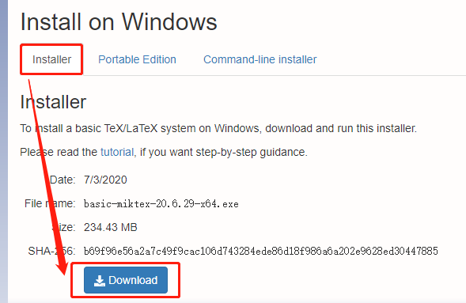

需要注意的是，绿色版并没有单独的压缩包，而是直接对应安装版的安装程序，只不过将安装程序重命名为 `MiKTeX-portable.exe`，然后双击安装即可。绿色版与安装版的区别在于，绿色版不会向系统盘写入配置信息，也不会注册环境变量，意味着之后如果需要安装编辑器，无法自动获取系统中已经安装的LaTeX版本，而需要手动配置。**懒人推荐安装版，省去配置环境变量等步骤**（虽然后面是以绿色版介绍的）。

双击下载的 exe 文件进行安装，路径任意。

# 3. 下载和安装TeXstudio

## 3.1. 下载和安装

前往[官网](http://texstudio.sourceforge.net/)（http://texstudio.sourceforge.net/），选择左侧的“Download”，对于Windows平台，根据需要选择安装版或者绿色版进行下载。

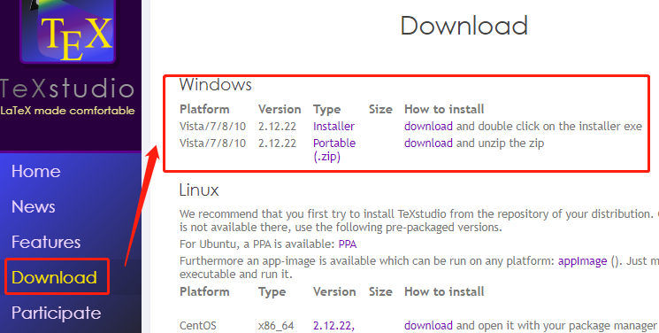

下载完成后双击安装，安装路径任意。

## 3.2. 配置

**第一步：**配置语言，将界面语言更改为中文。

点击菜单栏的「Options」-「Configure TeXstudio..」，在弹出的界面中选择左侧的「General」，下拉「Language」中选择「zh-cn」，点击「OK」即可完成语言更改。

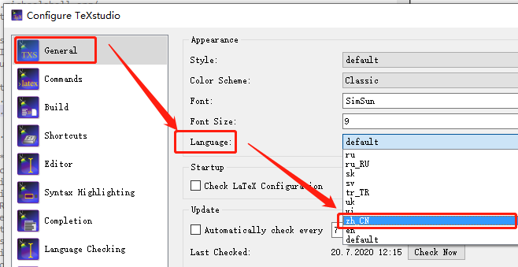

**第二步：**配置 LaTeX 路径，重点路径如图

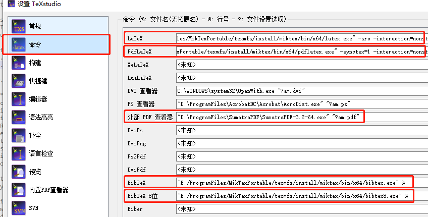

通过各行右侧的「打开」按钮来选择路径。


假设安装的MiKTeX为绿色版，安装根目录为`X:\ProgramFiles\MiKTeX\`，则上述路径均位于

```
X:\ProgramFiles\MiKTeX\texmfs\install\miktex\bin\x64
```

相应的，安装版的路径位于

```
X:\ProgramFiles\MiKTeX\miktex\bin\x64
```

分别对应为

- LaTeX：latex.exe
- PdfLaTeX：pdflatex.exe
- External PDF Viewer：视自己安装的pdf阅读器而定，可不设置
- BibTeX：bibtex.exe
- BibTex 8位：bibtex8.exe

**第三步（可选）：**配置选择外部 PDF 查看器进行查看。

因 LaTeX 直接将文档代码生成为 PDF 文件，因此需要设置 PDF 查看器。TeXstudio 默认设置为内部的 PDF 查看器进行查看，可设置为外部自己安装的第三方 PDF 查看器。如下图更改红框中的设置即可

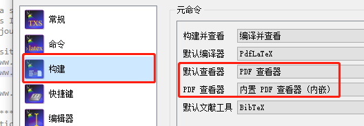

**注意**，不是所有第三方 PDF 阅读器都支持「热刷新」，即在阅读器打开 PDF 文件的情况下对文件进行修改、保存和刷新显示，而热刷新功能在 LaTeX 写作时是十分必要的功能。因此，如果不肯定自己使用的第三方 PDF 阅读器是否支持热刷新，请慎重设置，或者不修改设置而是直接使用内置 PDF 查看器。

支持热刷新的第三方 PDF 阅读器推荐：Sumatra PDF。

## 3.3. 测试

完成 TeXstudio 的配置后，新建一个空白的 tex 文档进行测试。点击左上方的「新建」按钮即可新建一个空白文档。

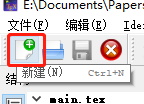

在空白文档中写入

```latex
\documentclass{article}
% 这里是导言区
\begin{document}
Hello, world!
\end{document}
```

保存，然后按 `F5` 进行构建并查看。如果一切顺利的话，下方的消息栏将会提示「完成」，右侧的内置 PDF 查看器将会显示一个 PDF 文档，内容为 “Hello World！”。

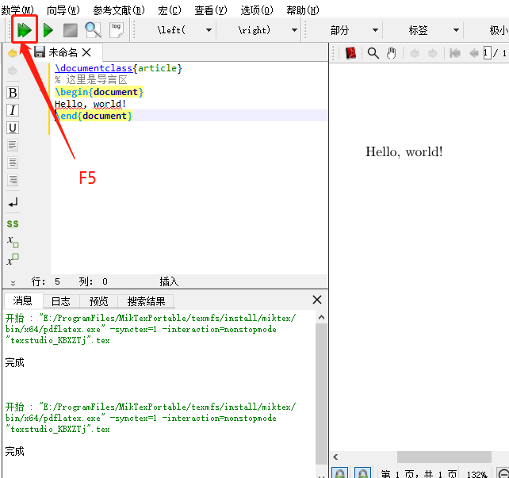 

# 4. LaTeX详细指南

## 4.1. 主文档

LaTeX 写作类似编程，包括构建（类似编译）和显示（类似运行）。在 TeXstudio 中，构建并显示可以作为一步操作，快捷键为 `F5` ，单独的构建（编译）快捷键为 `F6`，显示（查看）快捷键为 `F7`。三者也有按钮可以点击，点击效果与使用快捷键一致。

一个 tex 文档以 `\documentclass{xxx}`开头，用以定义该文档的类型。

```latex
\documentclass[option]{class}
```

其中，class 指定想要的文档类型，options 参数可以定制文档类的属性。 不同的选项之间须用逗号隔开。

标准文档类的最常用class如下表所示。

| class（类） | 解释  |
| - | - |
| article     | 排版科学期刊杂志的论文、 演示文档、 短报告、 程序文档、 邀请函…… |
| proc        | 一个基于 article 的会议文集类                                |
| minimal     | 非常小的文档类。 只设置了页面尺寸和基本字体。 主要用来查错。 |
| report      | 排版多章节长报告、 短篇书籍、 博士论文……                     |
| book        | 排版书籍。                                                   |
| slides      | 排版幻灯片。 该文档类使用大号 sans serif 字体。 也可以选用 FoilTEXa 来得到相同的效果 |

标准文档类的最常用options如下表所示。

| options（设置项）           | 解释  |
| - | - |
| 10pt, 11pt, 12pt            | 设置文档中所使用的字体的大小。 如果该项没有指定， 默认使用10pt 字体。 |
| a4paper, letterpaper, . . . | 定义纸张的尺寸。 缺省设置为letterpaper， 还可以使用a5paper, b5paper, executivepaper 以及legalpaper。 |
| fleqn                       | 设置行间公式为左对齐， 而不是居中对齐。                      |
| leqno                       | 设置行间公式的编号为左对齐， 而不是右对齐。                  |
| titlepage, notitlepage      | 指定是否在文档标题(document title) 后另起一页。 article 文档类缺省设置为不开始新页， report 和book 类则相反。 |
| onecolumn, twocolumn        | 设置以单栏(one column) 或双栏(two column) 的方式来排版文档。 |
| twoside, oneside            | 指定文档为双面或单面打印格式。 article 和report 类为单面(single sided) 格式， book 类缺省为双面(double sided) 格式。 注意该选项只是作用于文档样式， 而不会通知打印机以双面格式打印文档。 |
| landscape                   | 将文档的打印输出布局设置为 landscape 模式。                  |
| openright, openany          | 决定新的一章仅在奇数页开始还是在下一页开始。 在文档类型为article 时该选项不起作用， 因为该类中没有定义“章” (chapter)。 report 类默认在下一页开始新一章而book 类的新一章总是在奇数页开始。 |

文档的的主体部分以 `\begin{document}` 开头，以 `\end{document}` 结束，以百分号 % 作为注释符号。 

未完待续......

## 4.2. 宏包安装和管理

按快捷键 `F5` 进行编译构建，若使用了第三方提供的模板（比如期刊的排版模板），可能会提示安装依赖的样式包等，点击安装即可。

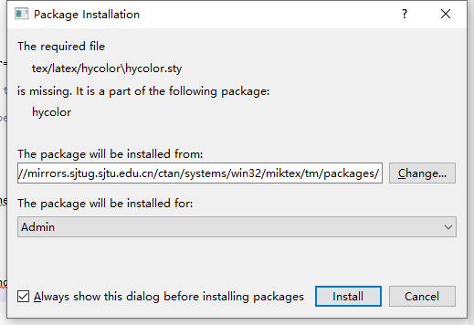

其中，「Change」按钮可以更换宏包的源。

MiKTeX 提供了一个专门的宏包管理器，位于texstudio安装路径的mpm.exe。如

```
E:\ProgramFiles\MiKTeXPortable\texmfs\install\MiKTeX\bin\x64\mpm.exe
```

双击后可以打开 MiKTeX consule。若采用安装版而不是绿色版的 MiKTeX，则还可在 cmd 中输入 mpm 打开。如下

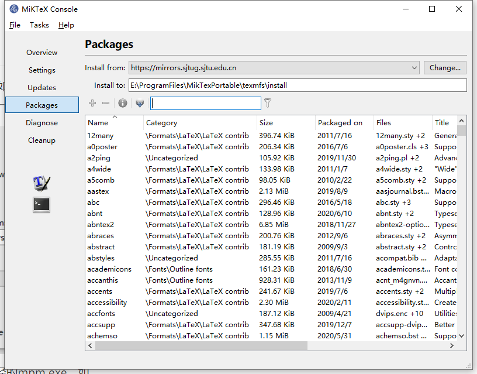

右键任意包可以查看其文件的存放位置。

一个包一般分为3部分，sty文件、tpm文件和tar.bz2包文件，在[官网此处](https://MiKTeX.org/packages/preprint)（https://MiKTeX.org/packages/preprint）可以查看某个包的详细信息，点击「Browse Files」可查看某个包的所有文件。

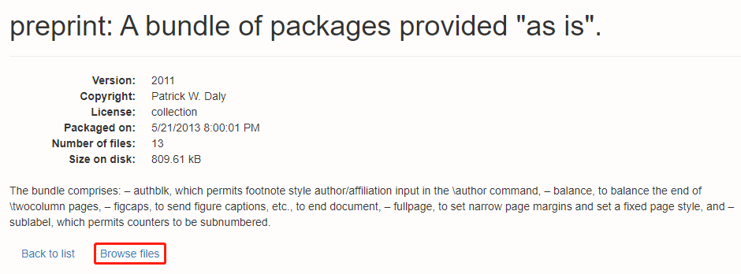

若使用安装版 MiKTeX 则包位置即为显示的路径。

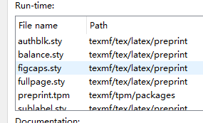

若采用绿色版 MiKTeX 则包文件位置分别为：

tpm文件：

```
[MiKTeXPortableRoot]\texmfs\install\tpm\packages
```

sty文件：

```
[MiKTeXPortableRoot]\texmfs\install\tex\latex
```

tar.bz2包文件：

```
[MiKTeXPortableRoot]\texmfs\install\source
```

如果在编译时，遇到包下载和安装失败，可尝试通过 MiKTeX console 进行一次全局更新。

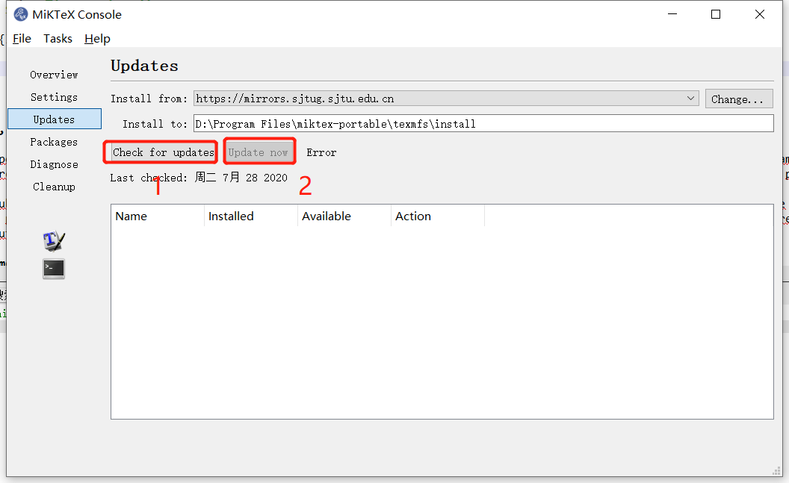

然后重新编译 tex 文件，应该能自动提示下载缺失的宏包。

## 4.3. 插入图片

### 4.3.1. 添加图片

添加图时，如下

```latex
\begin{figure}[!t]
  \centering
  \includegraphics[scale=1.0]{images/Figname.pdf}
  \caption{双七自由度机械臂的一般模型}
  \label{fig:FrameDefinition_Lagrange}
\end{figure}
```

其中，`\label{fig:xxx}` 一定紧跟着要放在 `\caption{xxx}` 后面，在正文引用时候才能正确编号。

对于两栏文章而言，插入跨栏图片为


```latex
\begin{figure*}[!t] % add a "*" to import a cross column figure
  \centering
  \includegraphics[scale=1.0]{images/Figname.pdf}
  \caption{双七自由度机械臂的一般模型}
  \label{fig:FrameDefinition_Lagrange}
\end{figure*}
```

图形（figure）环境有一个可选参数项允许用户来指示图形有可能被放置的位置，参数位于中括号中。这一可选参数项可以是下列字母的任意组合：

- !：表示忽略审美强制排布图片
- h：当前位置。将图形放置在 正文文本中给出该图形环境的地方.如果本页所剩的页面不够, 这一参数将不起作用。
- t：顶部。将图形放置在页面的顶部。
- b：底部。将图形放置在页面的底部。
- p：浮动页。将图形放置在一只允许有浮动对象的页面上。

**注:**

- 如果在图形环境中没有给出上述任一参数,则缺省为 [tbp]。
- 给出参数的顺序不会影响到最后的结果.因为在考虑这些参数时 LaTeX 总是尝试以 h-t-b-p 的顺序来确定图形的位置.所以 [hb] 和 [bh] 都使 LATEX 以 h-b 的顺序来排版。
- 给出的参数越多, LaTeX 的排版结果就会越好。[htbp]，[tbp]，[htp]，[tp] 这些组合得到的效果不错.
- 只给出单个的参数项极易引发问题。如果该图形不适合所指定的位置，它就会被搁置并阻碍对后面的图形 的处理。一旦这些阻塞的图形数目超过了18 幅这一 LaTeX 所能容许的最大值,就会产生 "Too Many Unprocessed Floats" 的错误。

当 LaTeX "试图" 放置一浮动图形时，它将遵循以下规则：

1. 图形只能置于由位置参数所确定的地点。
2. 图形的放置不能造成超过版心的错误(overfull page)。
3. 图形只能置于当前页或后面的页中.所以图形只能 "向后浮动"而不能"向前浮动"。
4. 图形必须按顺序出现，这样只有当前面的图形都被放置好之后才能被放置。
   - 只要前面有未被处理的图形，一幅图形就不会被放在当前位置.
   - 一幅 "不可能放置"的图形将阻碍它后面的图形的放置，直到文件结束或达到LaTex的浮动限制。
5. 必须符合一定的审美条件。例如，一页上的浮动对象的数目不能超过totalnumber。在浮动位置选项前加上一个惊叹号(如 `\begin{figure}[!ht]`) 会使LaTex忽略应用于文本页的审美条件，试图用最严格的标准来放置浮动图形。不过，`!`不会影响应用于浮动页

### 4.3.2. 引用图片

在正文需要引用图片的地方增加 `\ ref{fig:xxx}`，如

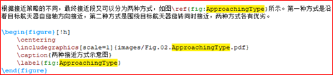

编译为

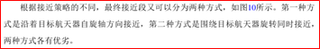

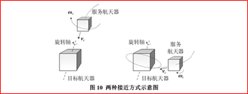

若编译报错，很可能是没有引入相应的包。在此处，`\includegraphics` 依赖宏包 `graphicx` ，需要在文档开头引入

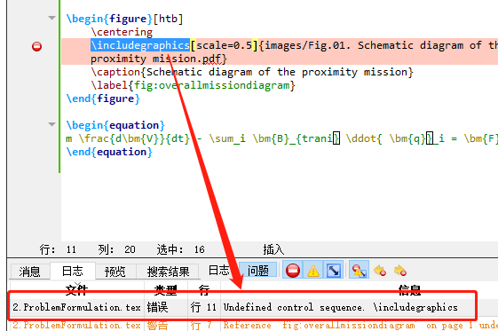

```latex
\usepackage{graphicx}
...
\begin{document}
...
\end{document}
```


### 4.3.3. visio绘图转为无边框PDF

visio绘图是矢量图，但是无法直接导入LaTeX使用。

PDF也是矢量格式，将visio绘图转为PDF可以插入LaTeX。

由于visio直接导出为pdf后四周存在灰色外框和一定宽度的白边，如下设置避免这种情况。

- 首先调出开发工具选项卡。在工具栏右键，选择【自定义功能区】


- 勾上【开发工具】

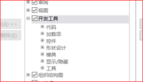

- 切换到【开发工具】，选择【显示】右下方的小箭头，点击【页】

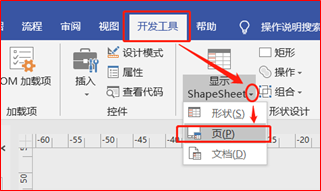

- 找到【Print Properties】，将Page Left\Right\Top\Bottom Margin全部设为0，去除四周留白

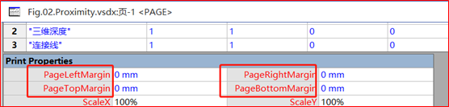

- 关闭【Print Properties】，保存visio绘图。

- 切换到【设计】选项卡，选择【大小】下面的小箭头，点击【适应绘图】，保存visio绘图。

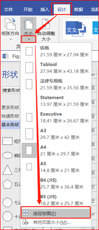

- 另存为，类型选择【PDF】，点击【选项】，弹出页面取消勾选【辅助功能文档结构标记】，点击【确定】输出为PDF。

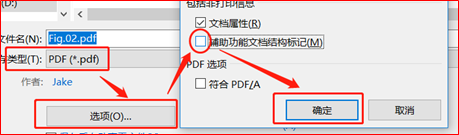

## 4.4. 插入公式

基本公式规范

上标：`A^b`，编译为 $A^b$

下标：`A_b`，编译为 $A_b$

上下标：`A_b^c`，编译为 $A_b^c$

更多参考：https://www.jianshu.com/p/22117d964baf 或者自行百度。

### 4.4.1. 插入行内公式

用\$....\$插入行内公式，内容按照latex公式规范书写。如

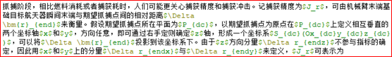

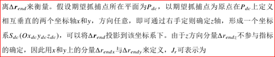

### 4.4.2. 插入行间公式

按照如下形式 插入行间公式。

```latex
\begin{equation}
…
\end{equation}
```

示例如下（其中 \nonumber 表示该公式无需编号）：

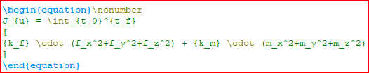


复杂的公式可以先在Word中用 MathType 先进行书写，然后转换为 LaTeX 语言格式，再粘贴出来后，稍作修改即可复制到 LaTeX 文档中。

参考：[LaTeX公式与MathType公式如何快速转换](https://www.mathtype.cn/jiqiao/zhuanhua-gongshi.html)

### 4.4.3. 引用公式编号

在公式中加入label字段，如：

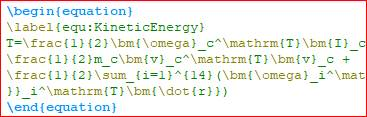

引用时用 `\ref` 命令，如：


编译为：


## 4.5. 插入参考文献

### 4.5.1. 参考文献来源

参考文献的数据按照一定格式存放于 `.bib` 文件中，可以去Google Scholar搜索该参考文献，点击文献下面的引号，弹出引用格式，选择下方第一个BibTex即可

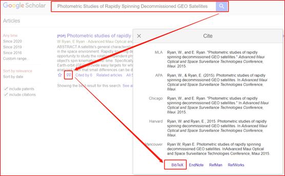

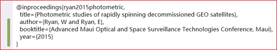

中文文献或者无需翻墙的文献，百度学术也可以得到bib格式，如图


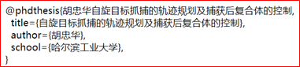

### 4.5.2. 参考文献的添加

复制给出的bib格式参考文献数据，添加到自己的 .bib 文件中。一些情况下还需要对信息进行增改，比如：

- 修改缩写，上面参考文献缩写“胡忠华自旋……”太长了，改成规范格式“hzh2016zi”
  - 英文：作者姓+年+标题第一个词（如potter2020magic）；
  - 中文：姓名拼音缩写/姓氏拼音+年+标题第一字拼音（如dong2020wei或dyf2020wei）

- 补全信息，比如硕士博士论文的出版地（保存地），否则会出现出版地不详，而GBT7714规定，硕士博士论文要列出【保存地：保存年份】

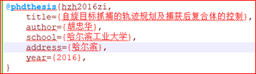

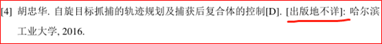

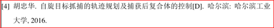

### 4.5.3. 参考文献的引用

- 使用 `\cite{}`，此时引用序号为正文字体大小，即：

  Ryan\cite{ryan2015photometric}在2015年发表了xxxx

  编译后得到

  Ryan[1]在2015年发表了xxxx

- 使用 `\upcite{}`，此时引用序号为上标，即：

  Ryan\upcite{ryan2015photometric}在2015年发表了xxxx

  编译后得到

  Ryan[1]在2015年发表了xxxx

- 使用 `\citep{}` 等也可以（具体cite命令可以自行百度）

 注意，将参考文献在正文中进行引用后，再进行编译。如果不引用，该参考文献将不会出现在参考文献列表中。

### 4.5.4. 参考文献编译

首先保障添加参考文献到.bib文件且在正文引用，然后按照下面四步进行编译：

- 当前窗口激活为任意 .tex 文件，编译（texStudio快捷键F5） , 这会生成一个.aux 的文件, 这告诉 BibTeX 将使用那些引用，此时文中引用位置显示为 `[?]`

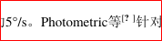

- 当前窗口激活为任意 .tex 文件，编译 .bib 文件（texStudio快捷键F8），生成.bbl文件，确保没有任何Warning

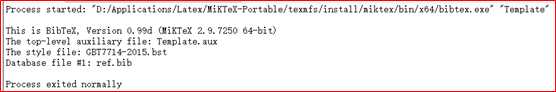

- 当前窗口激活为任意 .tex 文件，再次编译 .tex 文件（texStudio快捷键F5）, 此时参考文献列表中已经包含了该参考文献, 但此时引用的编号可能不正确（比如[?]）
- 当前窗口激活为任意 .tex 文件，最后再次编译 .tex 文件, （texStudio快捷键F5） 如果一切顺利的话, 这是所有东西都已正常了。

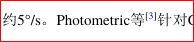

编译如果报错，检查：

- 大括号是否完整；

- 大括号后面是否漏了逗号；

- 作者姓名是否用and连接，是否错误采用逗号连接，是否多用了and。

修改后，将当前窗口激活为任意 .tex 文件，重新编译 .bib 文件（F8）

### 4.5.5. 参考文献字母大写

部分模板中，bib参考文献题目中大写自动变为小写，比如，参考文献原始标题为：

> Real-Time Optimal Approach and Capture of ENVISAT Based on Neural Networks

按照GB7717规范引用后在参考文献列表中显示为：

> Real-time optimal approach and capture of envisat based on neural networks

为了保留大写，在bib中录入时对需要保持原大写的部分添加**大括号**，即：

```
title = {Real-Time Optimal Approach and Capture of {ENVISAT} Based on Neural Networks},
```

编译后显示为：

> Real-time optimal approach and capture of ENVISAT based on neural networks

### 4.5.6. 附录：参考文献的格式字段

**@article**

期刊杂志的论文

必要域: author, title, journal, year.

可选域: volume, number, pages, month, note.

```
@article{px2017qiu,
author={潘迅 and 泮斌峰 and 唐硕},
title={求解中途飞越燃料最优转移轨道的同伦方法},
journal={宇航学报},
volume={38},
number={4},
pages={393--400},
year={2017},
}
```

```
@article{lhj2020realtime,
  author={Hong Jue Li and Yun Feng Dong and Pei Yun Li},
  title={Real-Time Optimal Approach and Capture of {ENVISAT}},
  journal = {International Journal of Aerospace Engineering},
  volume={2020},
  number={},
  pages={Article ID 8165147},
  year = {2020},
}
```

**@book**

公开出版的图书

必要域: author/editor, title, publisher, year.

可选域: volume/number, series, address, edition, month, note.


```
@book{lb2018kong,
  author={梁斌 and 徐文福},
  title={空间机器人：建模、规划与控制},
  year={2019},
  address={北京},
  publisher={清华大学出版社},
}
```

**@booklet**

无出版商或作者的图书

必要域: title.

可选域: author, howpublished, address, month, year, note.

**@conference**

等价于 inproceedings

必要域: author, title, booktitle, year.

可选域: editor, volume/number, series, pages, address, month, organization, publisher, note.

**@inbook**

书籍的一部分章节

必要域: author/editor, title, chapter and/or pages, publisher, year.

可选域: volume/number, series, type, address, edition, month, note.

**@incollection**

书籍中带独立标题的章节

必要域: author, title, booktitle, publisher, year.

可选域: editor, volume/number, series, type, chapter, pages, address, edition, month, note.

```
@incollection{izzo2019machine,
  author={D. Izzo and C. I. Sprague and D. V. Tailor},
  title={Machine learning and evolutionary techniques},
  booktitle={Modeling and Optimization in Space Engineering},
  publlisher={Springer},
  address={Cham},
  pages={191--210},
  year={2019},
}
```

**@inproceedings**

会议论文集中的一篇

必要域: author, title, booktitle, year.

可选域: editor, volume/number, series, pages, address, month, organization, publisher, note.

```
@inproceedings{sommer2017temporal,
  author={S. Sommer and J. Rosebrock and D. Cerutti-Maori},
  title={Temporal analysis of Envisat’s rotational motion},
  booktitle = {Proceedings of the 7th European Conference on SXX},
  editor={},
  address={Darmstadt, Germany},
  publisher={IEEE},
  year={1997},
}
```

**@manual**

技术文档

必要域: title.

可选域: author, organization, address, edition, month, year, note.

**@mastersthesis**

硕士论文

必要域: author, title, school, year.

可选域: type, address, month, note.

**@misc**

其他

必要域: none

可选域: author, title, howpublished, month, year, note.

**@phdthesis**

博士论文

必要域: author, title, year, school.

可选域: address, month, keywords, note.

```
@phdthesis{fbm2007zi,
  Author = {丰保民},
  title = {自由漂浮空间机器人轨迹规划与轨迹跟踪问题研究},
  school = {哈尔滨工业大学},
  address = {哈尔滨},
  type = {},
  month = {},
  note = {},
  year = {2007},
}
```

**@proceedings**

会议论文集

必要域: title, year.

可选域: editor, volume/number, series, address, month, organization, publisher, note.

**@techreport**

教育，商业机构的技术报告

必要域: author, title, institution, year.

可选域: type, number, address, month, note.

**@unpublished**

未出版的论文，图书

必要域: author, title, note.

可选域: month, year.

## 4.6. 引用章节名称

首先在章节名称中添加label，如：

```
\section{最优控制的描述}\label{section:zykzdms}
```

然后在其他部分通过\ref引用，如：

```
如第\ref{section:zykzdms}节所示
```

编译后表现为：

```
如第1.1节所示
```
## 4.7. 列表

有序列表

```latex
\begin{enumerate}
\item This is the first item
\item This is the second item
\item This is the third item
\end{enumerate}
```

最终结果为

```
1) this is the first item
2) this is the second item
3) this is the third item
```

注意，数字后的符号选取（括号、顿号、句号等与模板有关）。

无序列表

```latex
\begin{itemize}
\item This is the first item
\item This is the second item
\item This is the third item
\end{itemize}
```

最终结果为

- this is the first item
- this is the second item
- this is the third item

# 5. 参考文献

<span id="ref1">[1]</span>  Latex Project. [The LATEX Project](https://www.latex-project.org/).

