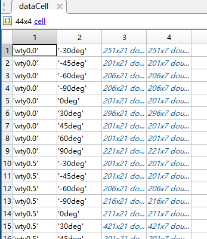
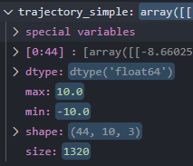

- [1. mat](#1-mat)
  - [1.1. MATLAB保存mat文件](#11-matlab保存mat文件)
  - [1.2. Python读取mat文件](#12-python读取mat文件)
- [2. list](#2-list)
  - [2.1. 复制](#21-复制)
  - [2.2. 合并](#22-合并)
  - [2.3. 插入新元素](#23-插入新元素)
  - [2.4. 获取列表中的值](#24-获取列表中的值)
- [3. ndarray](#3-ndarray)
  - [3.1. 概念](#31-概念)
  - [3.2. 数组属性](#32-数组属性)
  - [3.3. 创建数组](#33-创建数组)
  - [3.4. 数组拼接](#34-数组拼接)
- [4. list和array的区别](#4-list和array的区别)
- [5. 参考文献](#5-参考文献)

# 1. mat

## 1.1. MATLAB保存mat文件

如下例子所示

```matlab
clear
clc

maindir = 'Results';
subdir  = dir( maindir );

j = 1;
for ii = 1 : length( subdir )
    if( isequal( subdir( ii ).name, '.' )||...
        isequal( subdir( ii ).name, '..')||...
        ~subdir( ii ).isdir) % skip if not dir
        continue;
    end
    
    matfile = fullfile( maindir, subdir( ii ).name, 'Result.mat' );
    condition = split(subdir( ii ).name, '_');
    load(matfile)
    dataCell{j,1} = condition(2);
    dataCell{j,2} = condition(3);
    dataCell{j,3} = DesireStatus;
    dataCell{j,4} = DesireControl;
    j = j + 1;
end

save('MixResults.mat','dataCell');
```

最终保存的文件形式如图所示



## 1.2. Python读取mat文件

```python
import scipy.io as sio
import numpy as np

load_path = 'MixResults.mat'
load_data = sio.loadmat(load_path)
```

此处得到的 `load_data` 是如下形式的值

```python
{'__globals__': [],
'__header__': b'MATLAB 5.0 MAT-file,...00:47 2020',
'__version__': '1.0',
'dataCell': array([[array([[arra...pe=object)}
```

其中，scipy读入的mat文件是个dict类型，会有很多不相关的keys，一般输出四种keys：\_\_globals\_\_，\_\_header\_\_，\_\_version\_\_，data。其中最后一个data才是我们要的数据。

本例中，数据为 `dataCell` ，内容为

```
array([[array([[array(['wty0.0'], dtype='<U6')]], dtype=object),
        array([[array(['-30deg'], dtype='<U6')]], dtype=object),
        array([[ 0.00000000e+00, -8.66025400e+00,  0.00000000e+00, ...,
         0.00000000e+00,  0.00000000e+00,  0.00000000e+00],
       [ 1.31815433e-01, -8.66003375e+00,  3.20285361e-12, ...,
        -6.21551560e-19,  0.00000000e+00,  0.00000000e+00],
       [ 2.63630865e-01, -8.65933419e+00,  1.29989166e-11, ...,
        -3.17675810e-19,  0.00000000e+00,  0.00000000e+00],
       ...,
       [ 4.58717705e+01, -2.75108745e+00,  2.14124086e-11, ...,
         2.86948290e-17, -5.53482295e-17,  5.27271879e-15],
       [ 4.60035859e+01, -2.75027966e+00, -4.46901743e-12, ...,
         1.32056047e-17, -4.37313113e-17, -2.42826591e-16],
       [ 4.61354014e+01, -2.75000000e+00,  2.89500769e-27, ...,
        -2.77555756e-17, -1.30104261e-17, -1.48286602e-14]]),
        array([[ 0.00000000e+00,  2.40730441e+00,  6.83370983e-08, ...,
         2.87639504e+00, -3.90482776e-07,  2.65632451e-01],
       [ 1.31815433e-01,  2.77247364e+00,  2.88899127e-04, ...,
         1.27018538e+00, -2.19925908e-07,  1.26745599e-01],
       [ 2.63630865e-01,  3.06865475e+00,  1.11303404e-03, ...,
         6.74119805e-02, -9.25865826e-08,  2.27535649e-02],
       ...,
       [ 4.58717705e+01, -3.25427728e+00,  5.09348887e-03, ...,
         2.01213062e-02,  1.28660157e-03,  2.75940695e+00],
       [ 4.60035859e+01, -3.15266928e+00,  1.21336612e-03, ...,
         1.97145055e-02,  1.30781251e-03,  3.95909773e+00],
       [ 4.61354014e+01, -3.04097330e+00,  1.01612056e-07, ...,
         1.87656241e-02,  1.31095528e-03,  5.18427291e+00]])],
       ...,
       dtype=object)
```

可以按照如下方式拼命取出 `dataCell` 中的各个元素

```python
>>> targetw = []
>>> targetw.append(load_data['dataCell'][i][0][0][0][0]) # wty
'wty0.0'
>>> position = []
>>> position.append(load_data['dataCell'][i][1][0][0][0]) # deg
'-30deg'
>>> trajectory = np.zeros((tnum,1))
>>> trajectory = load_data['dataCell'][i][2]
>>> control = np.zeros((tnum,1))
>>> control = load_data['dataCell'][i][3]
```

得到的数据为 ndarray ，数据结构为



取出其中 `wty` 的数值，可以借助 `strip` 砍掉 “wty” 三个字符。注意 `strip` 后返回的是一个字符串，需要通过强制格式转换转为数字

```python
wt = wty.strip('wty') # 0.0
wt = float(wt)
```

提取 `trajectory` 中的第一行数据，最后一行数据，以及 `wt`，合并后形成一个新的向量，借助 `np.hstack` 实现：

```python
trow = trajectory.shape[0]
vec = np.hstack((trajectory[0,1:4],trajectory[trow-1,1:4],wt))
# trajectory: t, rx, ry, rz, vx, ...; [1:4] is rx ry and rz
```

# 2. list

列表（list）是用来存储一组有序数据元素的数据结构，元素之间用都好分隔。列表中的数据元素应该包括在**方括号**中，而且列表是可变的数据类型，一旦创建了一个列表，你可以添加、删除或者搜索列表中的元素。在方括号中的数据可以是 `int` 型，也可以是 `str` 型。

新建一个空列表

```python
A = []
```

当方括号中的数据元素全部为int类型时，这个列表就是int类型的列表。str类型和混合类型的列表类似

```python
A = [1,2,3]
A = ["a",'b','c'] # 单引号和双引号都认
A = [1,"b",3]
```

## 2.1. 复制

**列表的复制**和字符串的复制类似，也是利用 `*` 操作符

```python
A = [1,2,3]
A*2 # A = [1,2,3,1,2,3]
```

## 2.2. 合并

**列表的合并**就是将两个现有的list合并在一起，主要有两种实现方式，一种是利用+操作符，它和字符串的连接一致；另外一种用的是extend()函数。

直接将两个列表用+操作符连接即可达到合并的目的，列表的合并是有先后顺序的。

```python
a = [1,2]
b = ['a','b']
m = ["c","c"]
c=a+b+m # c = [1,2,'a','b','c','c']
d=b+a+m # d = ['a','b',1,2,'c','c']
```

将列表b合并到列表a中，用到的方法是a.extend(b)，将列表a合并到列表b中，用到的方法是b.extend(a)。

## 2.3. 插入新元素

向列表中**插入新元素**。列表是可变的，也就是当新建一个列表后你还可以对这个列表进行操作，对列表进行插入数据元素的操作主要有 `append()` 和 `insert()` 两个函数可用。这两个函数都会直接改变原列表，不会直接输出结果，需要调用原列表的列表名来获取插入新元素以后的列表。

函数 `append()` 是在列表末尾插入新的数据元素，如下：

```python
a = [1,2]
a.append(3) # a = [1,2,3]
```

函数 `insert()` 是在列表指定位置插入新的数据元素，如下：

```python
a = [1,2,3]
a.insert(3,4) # a = [1,2,3,4]，在列表第四位（从0开始算起）插入4
a = [1,2]
a.insert(2,4) # a = [1,2,4,3]，在列表第三位（从0开始算起）插入4
```

## 2.4. 获取列表中的值

获取指定位置的值利用的方法和字符串索引是一致的，主要是有普通索引和切片索引两种。

- 普通索引：普通索引是活期某一特定位置的数，如下：

```python
>>> a = [1,2,3]
>>> a[0] # 获取第一位数据
1
>>> a[2]
3
```

- 切片索引：切片索引是获取某一位置区间内的数，如下：

```python
>>> a = [1,2,3,4,5]
>>> a[1:3] # 获取第2位到第4位的数据，不包含第4位
[2,3]
```

假设 `a = [1,2,3,4,5,6,7,8,9]`，对应的标号为 `[0,2,2,3,4,5,6,7,8]`；

`print a[1:2:3]` 输出为2 ，从下标表为1的地方开始到小于下标为2的位置，其中3为步长；

`print a[1:4:1]` 输出为2，3，4,以上面类似，只是步长为1了；

`print a[1::1]` 输出为2，3，4，5，6，7，8，9。中间为空表示默认，则从小标为1到最后；

`print a[-1:-4:-1]` 反向索引，从最后一位开始放过来取值，注意这里的步长要为-1，因为反向。

# 3. ndarray

Numpy是Python的一个扩充程序库，支持高阶大量的维度数组与矩阵运算，此外也针对数组运算提供大量的数学函数库。对于数据的运算，用矩阵会比python自带的字典或者列表快好多。

## 3.1. 概念

NumPy 最重要的一个特点是其 N 维数组对象 ndarray，它是一系列**同类型**数据的集合，以 0 下标为开始进行集合中元素的索引。

ndarray 对象是用于存放同类型元素的多维数组。

ndarray 中的每个元素在内存中都有相同存储大小的区域。

ndarray 内部由以下内容组成：

- 一个指向数据（内存或内存映射文件中的一块数据）的指针。
- 数据类型或 dtype，描述在数组中的固定大小值的格子。
- 一个表示数组形状（shape）的元组，表示各维度大小的元组。
- 一个跨度元组（stride），其中的整数指的是为了前进到当前维度下一个元素需要"跨过"的字节数。

创建一个 ndarray 只需调用 NumPy 的 array 函数即可：

```python
numpy.array(object, dtype = None, copy = True, order = None, subok = False, ndmin = 0)
```

参数说明

| 名称     | 描述                                                      |
| :------- | :-------------------------------------------------------- |
| `object` | 数组或嵌套的数列                                          |
| `dtype`  | 数组元素的数据类型，可选                                  |
| `copy`   | 对象是否需要复制，可选                                    |
| `order`  | 创建数组的样式，C为行方向，F为列方向，A为任意方向（默认） |
| `subok`  | 默认返回一个与基类类型一致的数组                          |
| `ndmin`  | 指定生成数组的最小维度                                    |

例子

```python
>>> import numpy as np 
>>> a = np.array([1,2,3])  
>>> print (a)
[1, 2, 3]
>>> a = np.array([[1,  2],  [3,  4]])  
>>> print (a)
[[1, 2] 
 [3, 4]]
```

## 3.2. 数组属性

NumPy 数组的维数称为秩（rank），秩就是轴的数量，即数组的维度，一维数组的秩为 1，二维数组的秩为 2，以此类推。

在 NumPy中，每一个线性的数组称为是一个轴（axis），也就是维度（dimensions）。比如说，二维数组相当于是两个一维数组，其中第一个一维数组中每个元素又是一个一维数组。所以一维数组就是 NumPy 中的轴（axis），第一个轴相当于是底层数组，第二个轴是底层数组里的数组。而轴的数量——秩，就是数组的维数。

很多时候可以声明 axis。axis=0，表示沿着第 0 轴进行操作（沿着行移动），即对每一列进行操作；axis=1，表示沿着第1轴进行操作（沿着列移动），即对每一行进行操作。

## 3.3. 创建数组

- `numpy.zeros` 创建指定大小数组，数组元素以 0 来填充：

```python
>>> import numpy as np 
>>> x = np.zeros(5) 
>>> print (x)
[0. 0. 0. 0. 0.]
>>> y = np.zeros((5,), dtype = np.int) 
>>> print (y)
[0 0 0 0 0]
```

- `numpy.ones` 创建指定形状的数组，数组元素以 1 来填充：

```python
>>> import numpy as np 
[0. 0. 0. 0. 0.]
>>> x = np.ones(5)
[1. 1. 1. 1. 1.]
>>> print (x)
>>> y = np.ones((2,2), dtype = np.int) 
>>> print (y)
[[1 1]
 [1 1]]
```

- `numpy.arange` 创建数值范围并返回 ndarray 对象，函数格式如下：

```python
numpy.arange(start, stop, step, dtype)
```

生成数组示例如下：

```python
>>> import numpy as np
>>> x = np.arange(5) # = np.arrange(0,1,5)
>>> print (x)
[0  1  2  3  4]
>>> x = np.arange(5, dtype =  float)
>>> print (x)
[0.  1.  2.  3.  4.]
>>> x = np.arange(10,20,2)  
>>> print (x)
[10  12  14  16  18]
>>> x = np.arange(0,1,0.1)
>>> print (x)
[ 0.  0.1  0.2  0.3  0.4  0.5  0.6  0.7  0.8  0.9]
```

- `numpy.reshape` 在不改变数据内容的情况下，改变一个数组的格式，参数及返回值：

```python
>>> import numpy as np
>>> x = np.arange(6)
>>> print (x)
[0  1  2  3  4  5]
>>> y = x.reshape((2,3))
>>> print (y)
[[0 1 2]
 [3 4 5]]
>>> z = x.reshape(-1,2)
>>> print (z)
[[0 1]
 [2 3]
 [4 5]]
```

通过 reshape 生成的新数组和原始数组共用一个内存，也就是改变了原数组的元素，新数组的相应元素也将发生改变。

-1 表示要根据另一个维度自动计算当前维度。`reshape(-1,2)` 即我们想要2列而不知道行数有多少，让numpy自动计算。

- `numpy.linspace` 创建一个一维数组，数组是一个等差数列构成的，格式如下：

```python
np.linspace(start, stop, num=50, endpoint=True, retstep=False, dtype=None)
```

参数说明：

| 参数       | 描述                                                         |
| :--------- | :----------------------------------------------------------- |
| `start`    | 序列的起始值                                                 |
| `stop`     | 序列的终止值，如果 `endpoint` 为 `true`，该值包含于数列中    |
| `num`      | 要生成的等步长的样本数量，默认为 `50`                        |
| `endpoint` | 该值为 `true` 时，数列中包含 `stop` 值，反之不包含，默认是 `true`。 |
| `retstep`  | 如果为 `true` 时，生成的数组中会显示间距，反之不显示。       |
| `dtype`    | `ndarray` 的数据类型                                         |

示例：

```python
>>> import numpy as np
>>> a = np.linspace(1,10,10)
>>> print(a)
[ 1.  2.  3.  4.  5.  6.  7.  8.  9. 10.]
```

## 3.4. 数组拼接

两个拼接数组的方法：

`np.vstack()` 在竖直方向上堆叠

`np.hstack()` 在水平方向上平铺

```python
>>> import numpy as np
>>> arr1=np.array([1,2,3])
>>> arr2=np.array([4,5,6])
>>> print np.vstack((arr1,arr2))
[[1 2 3]
 [4 5 6]]
>>> print np.hstack((arr1,arr2,arr1))
[1 2 3 4 5 6 1 2 3]
>>> a1=np.array([[1,2],[3,4],[5,6]])
>>> a2=np.array([[7,8],[9,10],[11,12]])
>>> print np.hstack((a1,a2))
[[ 1  2  7  8]
 [ 3  4  9 10]
 [ 5  6 11 12]]
```

# 4. list和array的区别

在数据类型上，二者存在区别

```python
>>> import numpy as np
>>> a=np.array([1,2,3,4,55,6,7,77,8,9,99]) # array
>>> b=np.array_split(a,3) # 分为三段
>>> print (b) # list, 包含3个 array 元素
[array([1, 2, 3, 4]), array([55,  6,  7, 77]), array([ 8,  9, 99])]
>>> print (b[0:2]+b[1:3]) # list，包含4个 array 元素
[array([1, 2, 3, 4]), array([55,  6,  7, 77]), array([55,  6,  7, 77]), array([ 8,  9, 99])]
>>> c = np.hstack((brr1_folds[:2]+brr1_folds[1:3]))
>>> print (c) # list
[ 1  2  3  4 55  6  7 77 55  6  7 77  8  9 99]
```

# 5. 参考文献

[1] CDA数据分析师. [Python基础知识详解(三)：数据结构篇](https://baijiahao.baidu.com/s?id=1652154442455041874&wfr=spider&for=pc).

[2] RUNOOB.COM. [NumPy 从数值范围创建数组](https://www.runoob.com/numpy/numpy-array-from-numerical-ranges.html).