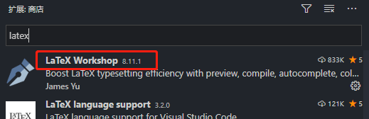

VSCode作为一个小巧而又功能强大的编辑器，已经成为我进行仿真程序开发调试的唯一工具，某日灵机一动，是否可以直接拿VSCode来写LaTeX？扩展一搜，果然可以，从此一个程序内仿真、画图、码字一气呵成。

<!--more-->

---

- [1. 前言](#1-前言)
- [2. LaTeX配置](#2-latex配置)
  - [2.1. 安装MikTeX](#21-安装miktex)
  - [2.2. 配置环境变量（绿色版）](#22-配置环境变量绿色版)
- [3. 配置VSCode的LaTeX环境](#3-配置vscode的latex环境)
  - [3.1. 安装LaTeX Workshop](#31-安装latex-workshop)
  - [3.2. 配置json](#32-配置json)
  - [3.3. 编译测试](#33-编译测试)
  - [3.4. 快捷键](#34-快捷键)
  - [3.5. 安装LTeX](#35-安装ltex)
- [4. 参考文献](#4-参考文献)

# 1. 前言

由于VSCode太牛逼，所有的C和Python仿真均已经迁移至该编辑器下完成，偶然发现其还可编译LaTeX，狂喜，遂研究之，步骤列于下。

下面以 MikTeX 20.6 + VSCode 1.48.2 为例进行安装和部署讲解。

# 2. LaTeX配置

## 2.1. 安装MikTeX

参考[下载和安装MikTeX](./2020-07-20-LateX.md)。此处摘录如下：

[官网的下载页面](https://miktex.org/download) 包括三种下载（安装）方式，如图分别为安装程序（Installer）、绿色版（Portable Edition）以及命令行（Command-line installer）。对于Windows开发环境，不考虑命令行方式，因此可以任意选择安装程序或者绿色版。


需要注意的是，绿色版并没有单独的压缩包，而是直接对应安装版的安装程序，只不过将安装程序重命名为 `MiKTeX-portable.exe`，然后双击安装即可。绿色版与安装版的区别在于，绿色版不会向系统盘写入配置信息，也不会注册环境变量，意味着之后如果需要安装编辑器，无法自动获取系统中已经安装的LaTeX版本，而需要手动配置。**懒人推荐安装版，省去配置环境变量等步骤**（虽然后面是以绿色版介绍的）。

双击下载的 exe 文件进行安装，路径任意。

## 2.2. 配置环境变量（绿色版）

将 miktex 附带的 `xelatex.exe` 和 `pdflatex.exe` 等工具所在的路径加入系统 Path 环境变量。假设安装的MiKTeX为绿色版，安装根目录为`X:\ProgramFiles\MiKTeX\`，则上述路径均位于

```
X:\ProgramFiles\MiKTeX\texmfs\install\miktex\bin\x64
```

相应的，安装版的路径位于

```
X:\ProgramFiles\MiKTeX\miktex\bin\x64
```

**注意**，如果在 VSCode 打开的情况下改变了环境变量，需要重启 VSCode 使其能够获取最新的环境变量。

# 3. 配置VSCode的LaTeX环境

## 3.1. 安装LaTeX Workshop

LaTeX Workshop 几乎可以认为是 VSCode 标配的 LaTeX 编译扩展，挂上翻墙通过扩展商店搜索 latex 弹出的第一个就是。



安装完成后，`ctrl+,` 打开设置面板（或通过左下角的小齿轮点击进入），搜索 `json` 然后点击 「在settings.json 中编辑」，打开 settings.json。

## 3.2. 配置json

在 `settings.json` 中新增如下代码：

```json
{
	"latex-workshop.latex.recipes": [
      {
        "name": "pdflatex -> bibtex -> pdflatex*2",
        "tools": [
          "pdflatex",
          "bibtex",
          "pdflatex",
          "pdflatex"
        ]
      }
    ],
    "latex-workshop.latex.tools": [
      {
        "name": "xelatex",
        "command": "xelatex",
        "args": [
          "-synctex=1",
          "-interaction=nonstopmode",
          "-file-line-error",
          "%DOC%"
        ]
      },
      {
        "name": "latexmk",
        "command": "latexmk",
        "args": [
          "-synctex=1",
          "-interaction=nonstopmode",
          "-file-line-error",
          "%DOC%"
        ]
      },
      {
        "name": "pdflatex",
        "command": "pdflatex",
        "args": [
          "-synctex=1",
          "-interaction=nonstopmode",
          "-file-line-error",
          "%DOC%"
        ]
      },
      {
        "name": "bibtex",
        "command": "bibtex",
        "args": [
          "%DOCFILE%"
        ]
      }
    ],
    "latex-workshop.view.pdf.viewer": "tab",
}
```

最终效果如下（忽略前面的若干主体配置项）：


**注意**，`latex-workshop.latex.tools` 字段定义了编译 LaTeX 的序列操作，默认为 `xelatex -> bibtex -> xelatex*2`，这里将其修改为 `pdflatex -> bibtex -> pdflatex*2`，对应的顺序为调用1次 `pdflatex`，1次 `bibtex`，2次 `pdflatex`，**与texstudio保持一致，确保生成的 pdf 文件字体和格式一致**。

进阶配置还包括：设置禁止保存时自动build，以及设定自动清理中间文件的类型。

```json
{
    "latex-workshop.latex.autoBuild.run": "never", //禁止保存时自动build  
    "latex-workshop.latex.clean.fileTypes": [  //设定清理文件的类型  
      "*.aux",  
      "*.bbl",  
      "*.blg",  
      "*.idx",  
      "*.ind",  
      "*.lof",  
      "*.lot",  
      "*.out",  
      "*.toc",  
      "*.acn",  
      "*.acr",  
      "*.alg",  
      "*.glg",  
      "*.glo",  
      "*.gls",  
      "*.ist",  
      "*.fls",  
      "*.log",  
      "*.fdb_latexmk",  
      "*.nav",  
      "*.snm",  
      "*.synctex.gz"  
    ],
}
```

设置仅针对 LaTeX 的自动换行

```json
{
    "latex-workshop.view.pdf.viewer": "tab",
    "[latex]": {
      "editor.wordWrap": "on", // <== auto wrap
      "editor.formatOnPaste": false,
      "editor.suggestSelection": "recentlyUsedByPrefix"
    },
}
```


## 3.3. 编译测试

快捷键 `ctrl+alt+B` 编译 .tex文件，快捷键 `ctrl+alt+v` 或者右上角的「查看pdf」图标查看 .pdf 文件。


## 3.4. 快捷键

快捷键的更改根据个人习惯而定。

打开键盘快捷方式面板(左下侧齿轮，或快捷键`ctrl+k,ctrl+s`)：

- 搜索"切换侧栏可见性"，设置快捷键为`ctrl+k ctrl+b`。

- 搜索 `latex build`，将默认的`ctrl+alt+b`替换为`ctrl+b`(与Sublime Text 3统一)。

- 搜索`latex recipe`，设置快捷键为`ctlr+r`，方便点菜(选择编译方式)！(ST3中是显示文档大纲)。

- 其他常用的快捷键：

- - `ctrl+k ctrl+a`： 切换活动栏可见性(左侧图标开关)
  - `ctrl+alt+x`：显示LaTeX面板(左侧编译命令面板和文档大纲)。
  - `ctrl+alt+c`：清除辅助文件
  - `ctrl+alt+v`：查看编译的pdf文件(预览)
  - `ctrl+alt+j`：正向搜索。当设置`"latex-workshop.view.pdf.viewer": "tab";`时，在LaTeX源文件中按下快捷键，定位到PDF文档相应位置。(反向搜索见后面)

根据 `latex-workshop.latex.recipes` 中的`name`段设定，可在 `.tex` 文件首行指定编译方式。如 `%!TEX program = xelatex` 表示用 xelatex 编译文件，而 `%!TEX program = PDFlatex` 表示用 latexpdf 编译文件。多个文件情况，还可以用 `% !TEX root` 指定主文件，`% !TEX bib `指定 bib 的编译方式。

**示例**

```text
%! TeX program = pdflatex
\documentclass{article}

\begin{document}
    press ctrl+b to complie，press ctrl+alt+v to view pdf
\end{document}
```

## 3.5. 安装LTeX

用过 LaTeX 的都知道，对比 Office 家族，LaTeX 的语言纠错功能非常不方便。因为本身没这功能，需要借助外部工具才能实现。这个缺点对于我等「外语渣」是非常要命的。当然，解决方法也不是没有。典型的，如果你用的是 TeXstudio 这个编辑器，可以通过外挂 LanguageTool （简称: LT） 这个检查工具，实现拼写和语法检查。具体怎么配置，网上有很多教程。

VS Code 的插件市场其实是有提供一些插件， 让 Code 能够调用 LT 进行拼写检查。比如 「LanguageTool for Visual Studio Code」和 「LanguageTool Linter」。 但是邪门的是——他们竟然只支持纯文本 或者 Markdown 文件的拼写检查，不支持 .tex 文件! 不过幸运就降临在今天，在浏览扩展时，无意发现了「LTeX」 这个插件，下载使用后直呼内行，直接在 VS Code 插件市场搜索并安装，然后重启 VSCode 后打开任意 .tex 文档即可开始进行拼写、语法检查（不包括中文）。

有些品牌，网络词汇等可能会被识别为拼写错误，可以把他们加入词典避免误判：

```
"ltex.de.dictionary": [Niubility, Zhihu], 
//注意根据要对应语言，ltex.<LANGUAGE>.dictionary
```

有些环境内的语言可能不需要检查，比如代码块里的程序代码，可以参照如下设置过滤：

```
"ltex.environments.ignore": ["lstlisting", "verbatim], 
```

有些自定义命令也可以设置过滤避免检查

```
"ltex.commands.ignore": ["\\documentclass[]{}", "\\renewcommand*{}[]{}"]
```

其他诸如「自定义规则」，「错误提醒风格」等的可以自己参照说明设置。

# 4. 参考文献

<span id="ref1">[1]</span>  [当年老王](https://blog.csdn.net/yinqingwang). [论文写作的又一利器：VSCode + Latex Workshop + MikTex + Git](https://blog.csdn.net/yinqingwang/article/details/79684419).

<span id="ref2">[2]</span>  [strange_jiong](https://blog.csdn.net/dream_allday). [Latex编译出现字体获取不到的情况](https://blog.csdn.net/dream_allday/article/details/84997874).

<span id="ref3">[3]</span>  [开心鲨鱼](https://www.zhihu.com/people/kai-xin-sha-yu). [配置VScode编辑LaTeX及正反向搜索等设置](https://zhuanlan.zhihu.com/p/90526218?utm_source=wechat_session).

<span id="ref4">[4]</span> LaTeX工作室. [LaTeX技巧932：如何配置Visual Studio Code作为LaTeX编辑器新版更新](https://www.latexstudio.net/archives/12260.html).