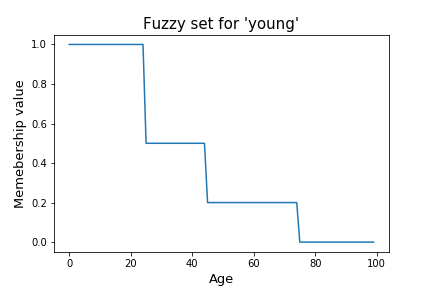

本文介绍了 1993 年发表的自适应网络模糊推理系统（ANFIS），Adaptive-Network-Based Fuzzy Inference System。

<!--more-->

---

- [1. 基础知识](#1-基础知识)
  - [1.1. 模糊集与隶属度](#11-模糊集与隶属度)
  - [1.2. 模糊集运算](#12-模糊集运算)
  - [1.3. 模糊度](#13-模糊度)
  - [1.4. 模糊逻辑](#14-模糊逻辑)
  - [1.5. 模糊决策](#15-模糊决策)
  - [1.6. 模糊神经网络](#16-模糊神经网络)
- [2. ANFIS](#2-anfis)
  - [2.1. 基础知识](#21-基础知识)
    - [2.1.1. 模糊推理系统](#211-模糊推理系统)
    - [2.1.2. 自适应网络](#212-自适应网络)
    - [2.1.3. ANFIS 结构](#213-anfis-结构)
    - [2.1.4. ANFIS 学习算法](#214-anfis-学习算法)
  - [2.2. 程序文件组成](#22-程序文件组成)
  - [2.3. membership.py](#23-membershippy)
    - [2.3.1. make_anfis()](#231-make_anfis)
    - [2.3.2. make_gauss_mfs()](#232-make_gauss_mfs)
    - [2.3.3. GaussMemFunc()](#233-gaussmemfunc)
  - [2.4. anfis.py](#24-anfispy)
    - [2.4.1. AnfisNet()](#241-anfisnet)
    - [2.4.2. FuzzifyVariable 类](#242-fuzzifyvariable-类)
    - [2.4.3. ConsequentLayer 类](#243-consequentlayer-类)
    - [2.4.4. PlainConsequentLayer 类](#244-plainconsequentlayer-类)
- [3. 参考文献](#3-参考文献)

# 1. 基础知识

## 1.1. 模糊集与隶属度

> A fuzzy set is a class of objects with a continuum of grades of membership. Such a set is characterized by a membership (characteristic) function which assigns to each object a grade of membership ranging between zero and one. —— [Fuzzy sets](https://www.sciencedirect.com/science/article/pii/S001999586590241X) by L.A. Zadeh, 1965

模糊集是一类具有连续隶属度的对象。这样一个集合可以用一个成员（特征）函数来表征，该函数为每个对象分配0到1之间的成员级别。

> Fuzzy set is a mathematical model of vague qualitative or quantitative data, frequently generated by means of the natural language. —— [Fuzzy Sets](http://www.scholarpedia.org/article/Fuzzy_systems) Milan Mares @ scholarpedia

模糊集是一种模糊的定性或定量数据的数学模型，经常借助自然语言生成。该模型是基于经典的集合及其特征函数概念的推广。


> The attempts to use the computing technology for processing such models have pointed at the fact that the traditional probabilistic processing of uncertainty is not adequate to the properties of vagueness. Meanwhile the probability, roughly speaking, predicts the development of well defined factor (e.g., which side of a coin appears, which harvest we can expect, etc.), the fuzziness analyzes the uncertain classification of already existing and known factors, e.g., is a color "rather violet" or "almost blue"? "Is the patient's temperature a bit higher, or is it a fever?", etc. —— [Fuzzy Sets](http://www.scholarpedia.org/article/Fuzzy_systems) Milan Mares @ scholarpedia

利用计算技术处理这类模型的尝试表明，传统的不确定性概率处理方法不足以处理模糊特性。粗略地说，概率用来预测定义明确的因素的发展（例如，硬币的哪一面出现了，我们期望的收获情况等），而模糊性分析已经存在和已知的因素的不确定分类，例如，颜色是“相当紫罗兰色”还是“几乎蓝色”，病人的体温“有点高，还是发烧？”等等。

> In classical set theory, the membership of elements in a set is assessed in binary terms according to a bivalent condition — an element either belongs or does not belong to the set. By contrast, fuzzy set theory permits the gradual assessment of the membership of elements in a set; this is described with the aid of a membership function valued in the real unit interval [0, 1]. —— [wikipedia](https://en.wikipedia.org/wiki/Fuzzy_set)

在经典集合论中，一个集合中元素的隶属度是根据一个二价条件（一个元素要么属于集合，要么不属于集合）用二元项来评估。相比之下，模糊集理论允许逐步评估集合中元素的隶属度；这是借助于以实数单位区间 $[0,1]$ 取值的隶属函数来描述的。

> 任何科学理论都有它的研究对象，这些对象构成一个不空的集合，称为论域。在形式科学里，论域（或称做论述全集），是指在某些系统化的论述里的一些令人感兴趣的变数之上，由其中的实体所组成的集合。

给定一个论域（universe of discourse） $U$ ，那么从 $U$ 到单位区间 $[0,1]$ 的一个映射 $\mu_A:U\rightarrow[0,1]$ 称为 $U$ 上的一个**模糊集**。

> 要注意，严格地说，模糊集或子集是映射所确定的序对集，但由于模糊子集完全由其隶属函数所确定，因而我们不区分映射和映射所确定的序对集，而总是直接把模糊子集定义为一个满足上述定义的映射。

模糊集可以记为 $A$，映射（函数）$\mu(\cdot)$ 或简记为 $\mu_A$ 叫做模糊集 $A$ 的**隶属度函数**（membership function）。对于每一个 $x\in U$ ，$\mu_A(x)$ 叫做元素 $x$ 对模糊集 $A$ 的**隶属度**。

传统集合在模糊集理论中通常称作“明确集（crisp set），而隶属度函数只能取 0 或者 1 时，对应于传统集合的指示函数（indicator function）。



模糊集可以表示为：

- 解析法：也即给出隶属度函数的具体表达式（或者如上图的曲线形式）；
- Zadeh 记法：$A = \frac{1}{x_1} + \frac{0.7}{x_2} + \frac{0}{x_3}$，分母是论域中的元素，分子是对应的隶属度；
- 续偶法：$A = {(x_1,1),(x_2,0.7),(x_3,0)}$；
- 向量法：在有限论域的场合，给论域中元素规定一个表达的顺序，那么可以将上述序偶法简写为隶属度的向量式，如 $A=(1,0.7,0)$。

一个模糊集的实例，假设 $Age\in[0,100]$ 是一个论域，，我们可以定义两个模糊集 `young` ，`midlife`，和 `old`。对于模糊集 `young` 可以定义为下图的形式。当然也可以定义为其它形式。

另一个模糊集的实例：


一个常用的隶属度函数为**高斯隶属度函数**

$$
D(A)=e^{-\frac{-(A(x)-\mu)^2}{\sigma^2}}
$$

其中 $\mu, \sigma$ 分别为高斯隶属度函数的中心和宽度。

## 1.2. 模糊集运算

首先建立公共假设：$A,B,C\sim U,\forall x \in U$

> Standard fuzzy set operations are union, intersection and complement

模糊集的关系包括：相等、包含。

- 若 $\mu_A(x) = \mu_B(x)$，则称 $B$ 和 $A$ 相等，记为 $A = B$；

- 若 $\mu_A(x)\leq \mu_B(x)$，则称 $B$ 包含 $A$，记为 $A \subseteq B$。

标准的模糊集运算包括：交（取小）、并（取大）、补。

- 模糊集的交集定义为取模糊集中的最小值。$C=A\cap B:\mu_C(x) = min\{\mu_A(x),\mu_B(x)\} = \mu_A(x)\land \mu_B(x)$

- 模糊集的交集定义为取模糊集中的最大值。$C=A\cup B:\mu_C(x) = max\{\mu_A(x),\mu_B(x)\} = \mu_A(x)\lor \mu_B(x)$

- 模糊集的交集定义为取模糊集中的反值。$C = A^C:\mu_C(x) = \mu_{A^C}(x) = 1-\mu_A(x)$

下面给一个并（取大）和交（取小）的例子。


## 1.3. 模糊度

一个模糊集 $A$ 的模糊程度的衡量，直观定义如下：

设映射 $D:F(U)\rightarrow [0,1]$ 满足下述5个性质：

- 清晰性：$D(A) = 0$ 当且仅当 $A\in P(U)$。（经典集的模糊度恒为0）
- 模糊性：$D(A) = 1$ 当且仅当 $\forall x \in U, A(x) = 0.5$。（隶属度都为 0.5 的模糊集最模糊）
- 单调性：$\forall x\in U$，如果 $A(x)\leq B(x) \leq 0.5$ 或者 $A(x) \geq B(x) \geq 0.5$，则 $D(A)\leq D(B)$。（元素隶属度越靠近 0.5 的模糊集越模糊）
- 对称性：$\forall A\in F(U)$，有 $D(A^c)=D(A)$。（补集的模糊度相等）
- 可加性：$D(A\cup B) + D(A\cap B) = D(A) + D(B)$。

则称 $D$ 是定义在 $F(U)$ 上的模糊度函数，而 $D(A)$ 为模糊集 $A$ 的模糊度。

可以证明，符合上述定义的模糊度是存在的。一个常用模糊度的公式（分别针对有限和无限论域）为

$$
\begin{aligned}
  D_p(A) &= \frac{2}{n^{1/p}}\left( \sum_{i=1}^n \vert A(x_i) - A_{0.5}(x_i) \vert^p \right)^{1/p}\\
  D(A) &= \int_{-\infty}^{+\infty}\vert A(x)-A_{0.5}(x) \vert dx
\end{aligned}
$$

其中，$p>0$ 是参数，称为 Minkowski 模糊度。特别地，当 $p=1$ 时称为 Hamming 模糊度或者 Kaufmann 模糊指标。当 $p=2$ 时称为 Euclid 模糊度。

## 1.4. 模糊逻辑

模糊逻辑是对布尔逻辑的推广，针对隶属度进行计算。

模糊逻辑的定义形式有很多种，比较常见的被称为是 Zadeh operators，如下表所示

|Boolean|Fuzzy|
|-|-|
|AND(x,y)|MIN(x,y)|
|OR(x,y)|MAX(x,y)|
|NOT(x)|1-x|

另一种 AND/OR 算子基于**乘法**定义

```
x AND y = x*y
NOT x = 1-x

Hence,
x OR y = NOT( AND ( NOT(x), NOT(y) ) )
x OR y = 1-(1-x*(1-y))
```

## 1.5. 模糊决策

最大隶属度法：取推理结果中隶属度最大的一项作为输出。简单易行，但是完全派出了隶属度较小的其它量的影响和作用，没有充分利用推理过程取得信息。

加权平均法：

$$
U = \frac{\sum_{i=1}^n\mu(x_i)x_i}{\sum_{i=1}^n\mu(x_i)}
$$

中位数法：

论域上把隶属度函数曲线与横坐标围成的面积平分为两部分的元素，称为模糊集中的中位数。将中位数作为输出。由于模糊推理不需要很精确，可以直接取靠近中位数的一个结果作为结果。

中位数法相比最大隶属度法利用了更多信息，但计算复杂，特别是隶属度函数连续时还要计算积分，因此应用场合比加权平均法少。

加权平均法比中位数法具有更佳的性能，更好的静态性能，但是相比中位数法的动态性能稍逊。

## 1.6. 模糊神经网络

- 将模糊逻辑用于神经网络：将模糊集合的概念应用于神经网络的计算和学习，用模糊技术提高神经网络的学习性能；
- 将神经网络用于模糊系统：
  - 用神经网络的学习能力实时调整知识库，在线提取或调整模糊规则或其它参数；
  - 用神经网络完成模糊推理过程。
- 模糊系统和神经网络的全面结合，构造完整意义上的模糊神经网络和算法。

模糊神经网络（Fuzzy Neural Network, FNN）（又称为神经模糊系统，Neuro-Fuzzy System, NFS）是一个学习机，通过利用神经网络的近似技术来找寻一个模糊系统的参数（如模糊集，模糊规则）。

> A fuzzy neural network or neuro-fuzzy system is a learning machine that finds the parameters of a fuzzy system (i.e., fuzzy sets, fuzzy rules) by exploiting approximation techniques from neural networks.
> [Fuzzy neural network](http://www.scholarpedia.org/article/Fuzzy_neural_network) —— Rudolf Kruse @ scholarpedia

神经网络控制和模糊控制的优劣比较如下表所示。

|Neural Networks|Fuzzy Systems|
|-|-|
no mathematical model necessary | no mathematical model necessary          
learning from scratch           | apriori knowledge essential              
several learning algorithms     | not capable to learn                     
black-box behavior              | simple interpretation and implementation

从表中可以看出，如果将二者结合，可以充分发挥二者的优势，弥补二者的劣势。

- 采用基于神经网络理论的数据驱动学习方法，对基于底层模糊系统的神经模糊系统进行训练。这种启发式算法只考虑局部信息引起基本模糊系统的局部变化。
- 它可以表示为学习过程中任何时刻（比如学习前，学习中或学习后）的模糊规则集。因此，系统可以根据模糊规则在有无先验知识的情况下进行初始化。
- 学习过程受到约束，以保证底层模糊系统的语义特性。
- 神经模糊系统近似于一个 n 维未知函数，该函数可由训练样本部分表示。因此，模糊规则可以解释为训练数据的模糊原型。
- 神经模糊系统被表示为特殊的三层前馈神经网络：
  - 第一层对应于输入变量。
  - 第二层象征着模糊规则。
  - 第三层表示输出变量。
  - 模糊集被转换为（模糊）连接权。
- 有些方法还使用五层，其中模糊集分别编码为第二层和第四层的神经元。但是，五层模型可以转换为三层体系结构。
  - 第一层为输入层，缓存输入信号。
  - 第二层为模糊化层，对输入信号进行模糊化。
  - 第三层为模糊规则层。
  - 第四层为模糊决策层，主要针对满足一定条件的量进行分类并将模糊量去模糊化。
  - 第五层为输出层，输出运算结果

两种常见的神经模糊模型：

- Mamdani 模型: 着重研究模型的可解释性
- Takagi-Sugeno-Kang (TSK) 模型：着重研究模型的精确程度

Mamdani 模型的模糊规则示意如下：

```
IF x1 is A1 and x2 is A2 and ... xn is An   THEN y = c1
IF funding is adequate and staff is small   THEN risk is low
```
可以看出，Mamdani 模型的输出（后件）为模糊集，需要加上解模糊的环节。

TSK 模型的模糊规则示意如下：

```
IF x1 is A1 and x2 is A2 and ... xn is An   THEN y = a0+a1*x1+...+an*xn
IF funding is adequate and staff is small   THEN risk is 0.2
```

可以看出，TSK 模型的 THEN 部分是清晰的，它的输出（后件）是一个函数，是所有输入变量的线性组合，因此具有较好的可解释性和精确性。

三种 FNN 的部署 方式：

- 真实输入，模糊权重
- 模糊输入，真实权重
- 模糊输入，模糊权重

# 2. ANFIS

## 2.1. 基础知识


### 2.1.1. 模糊推理系统

Fuzzy Inference System（FIS），由五个功能模块组成：

1. 包含若干模糊if-then规则的规则库；
2. 定义关于使用模糊if-then规则的模糊集的隶属函数的数据库；
3. 在规则上的执行推理操作的决策单元；
4. 将明确输入转化为与语言价值匹配的程度的模糊界面；
5. 将推理得到的模糊结果转化为明确输出的去模糊界面。

通常，1、2被联合称为知识库。

### 2.1.2. 自适应网络

自适应网络是一个由节点和连接节点的定向链路组成的多层前馈网络，其中每个节点对传入的信号以及与此节点相关的一组参数执行一个特定的功能(节点函数)。自适应网络的结构中包含有参数的方形节点和无参数的圆形节点，自适应网络的参数集是每个自适应节点的参数集的结合。他们的输出依赖于这些节点相关的参数，学习规则指定如何更改这些参数。

Jyh-Shing Roger Jang 于 1993 年发表的[《ANFIS : Adaptive-Network-Based Fuzzy Inference System》](https://ieeexplore.ieee.org/stamp/stamp.jsp?tp=&arnumber=256541)。当时对于处理模糊不确定系统，使用传统数学工具的系统建模并不能得到令人满意的效果。考虑采用模糊if-then规则的模糊推理系统不需要精确的定量分析就可以对人的知识和推理过程进行定性建模，作者提出了一种基于自适应网络的模糊推理系统。

### 2.1.3. ANFIS 结构

ANFIS的模型结构由自适应网络和模糊推理系统合并而成，在功能上继承了模糊推理系统的可解释性的特点以及自适应网络的学习能力，能够根据先验知识改变系统参数，使系统的输出更贴近真实的输出。

为简单起见，假定所考虑的模糊推理系统有2个输入x和y，单个输出z。对于一阶 Takagi-Sugeno 模糊模型，如果具有以下2条模糊规则

- rule 1: if $x$ is $A_1$ and $y$ is $B_1$ then $f_1=p_1x+q_1y+r_1$
- rule 2: if $x$ is $A_2$ and y is $B_2$ then $f_2=p_2x+q_2y+r_2$

那么该一阶T-S模糊推理系统的ANFIS网络结构如图所示


输入x，y在第一层进行模糊化，模糊化的方法：用隶属函数（menbership functions，MFs，一般为钟形函数，**钟形函数参数为前向参数**）对输入特征x，y进行模糊化操作，得到一个[0,1]的隶属度（menbership grade），通常用mu表示。

在第二层，每个特征的隶属度mu相乘得到每个规则的触发强度（firing strength）。

第三层将上一层得到的每条规则的触发强度做归一化，表征该规则在整个规则库中的触发比重，即在整个推理过程中使用到这条规则的程度（用概率理解）。

第四层计算规则的结果，一般由输入特征的线性组合给出（假设输入有n个特征，$f_i=c_0+c_1x_1+c_2x_2+...+c_nx_n$。$c_0,c_1,...,c_n$为**后向参数**）。

第五层去模糊化得到确切的输出，最终的系统输出结果为每条规则的结果的加权平均（权重为规则的归一化触发程度，理解为计算期望）。

[ANFIS](https://github.com/jfpower/anfis-pytorch) is a way of presenting a fuzzy inference system (FIS) as a series of numeric layers so that it can be trained like a neural net.

The canonical reference is the original paper by [Jyh-Shing Roger Jang](http://mirlab.org/jang/):

- Jang, J.-S.R. (1993). "ANFIS: adaptive-network-based fuzzy inference system". IEEE Transactions on Systems, Man and Cybernetics. 23 (3): 665–685. doi:10.1109/21.256541

Note that it assumes a Takagi Sugeno Kang (TSK) style of defuzzification rather than the more usual Mamdani style.

### 2.1.4. ANFIS 学习算法

文章W中给出的学习算法（参数更新方法）为 LSE-GD 混合学习算法。即更新参数同时在前向传递和反向传递中进行。

在正向传播中，我们固定前向参数，在输入传递到第四层时，通过最小二乘估计（least square estimate，LSE）更新后向参数，在这种前向参数（隶属度函数的参数）固定的前提下，得到的后向参数（第四蹭线性组合参数）估计是最优的，这样，混合学习算法比单纯的GD算法要快很多。

## 2.2. 程序文件组成

ANFIS（https://github.com/jfpower/anfis-pytorch ）

The ANFIS framework is mainly in three files:

- anfis.py This is where the layers of the ANFIS system are defined as Torch modules.

- membership.py At the moment I only have Bell and Gaussian membership functions, but any others will go in here too.

- experimental.py The experimental infrastructure to train and test the FIS, and to plot some graphs etc.

There are then some runnable examples:

- jang_examples.py these are four examples from Jang's paper (based partly on the details in the paper, and particle on the example folders in his source code distribution).

- vignette_examples.py these are three examples from the Vignette paper. Two of these use Gaussians rather than Bell MFs.

## 2.3. membership.py

定义了隶属度函数。

### 2.3.1. make_anfis()

```python
def make_anfis(x, num_mfs=5, num_out=1, hybrid=True):
    '''
        Make an ANFIS model, auto-calculating the (Gaussian) MFs.
        I need the x-vals to calculate a range and spread for the MFs.
        Variables get named x0, x1, x2,... and y0, y1, y2 etc.
    '''
    num_invars = x.shape[1]
    minvals, _ = torch.min(x, dim=0)
    maxvals, _ = torch.max(x, dim=0)
    ranges = maxvals-minvals
    invars = []
    for i in range(num_invars):
        sigma = ranges[i] / num_mfs
        mulist = torch.linspace(minvals[i], maxvals[i], num_mfs).tolist()
        invars.append(('x{}'.format(i), make_gauss_mfs(sigma, mulist)))
    outvars = ['y{}'.format(i) for i in range(num_out)]
    model = AnfisNet('Simple classifier', invars, outvars, hybrid=hybrid)
    return model
```

输入 `x` 的列数作为输入状态量的个数，求 `x` 跨行间比较的最大值和最小值（即沿着每列求最大值和最小值） `minvals, maxvals`，即可得到输入各个状态量的取值范围 `ranges`。

`num_mfs` 为隶属度函数的个数。对于每个输入状态量，采用取值范围除以 `num_mfs` 来初始化 `sigma`，采用在取值范围内均匀取 `num_mfs` 个点来初始化 `mulist`。用得到的 `sigma, mulist` 来初始化高斯隶属度函数 `make_gauss_mfs()`。

最终，将得到的隶属度函数，与一个字符串 `'x{}'.format(i)` 一起，组成一个元组（tuple），添加到列表 `invars` 中作为后续建立网络的输入。假设输入状态量维度（列数）为2，则 `invars` 的成员为

```python
invars[0] = ['x0', [GaussMembFunc(), GaussMembFunc(), GaussMembFunc()]]
invars[1] = ['x1', [GaussMembFunc(), GaussMembFunc(), GaussMembFunc()]]
```


`outvars` 列表通过遍历输出状态量的维度来建立，是一个字符串列表。假设输出状态量维度为3，则 `outvars` 的成员为

```python
outvars = ['y0', 'y1', 'y2']
```

最后，将 `invars` 和 `outvars`  作为参数传入 `AnfisNet()` 建立 ANFIS 网络。转到 [AnfisNet()](#241-anfisnet) 查阅。

### 2.3.2. make_gauss_mfs()

```python
def make_gauss_mfs(sigma, mu_list):
    '''Return a list of gaussian mfs, same sigma, list of means'''
    return [GaussMembFunc(mu, sigma) for mu in mu_list]
```

`make_gauss_mfs` 输入 `sigma, mulist` ，根据 `mulist` 的个数（也就是之前 `make_anfis()` 函数中传入的隶属度函数的个数 `num_mfs`），调用 `GaussMembFunc()`，返回一个成员为 `membership.GaussMembFunc` 类型的列表。


### 2.3.3. GaussMemFunc()

```python
class GaussMembFunc(torch.nn.Module):
    '''
        Gaussian membership functions, defined by two parameters:
            mu, the mean (center)
            sigma, the standard deviation.
    '''
    def __init__(self, mu, sigma):
        super(GaussMembFunc, self).__init__()
        self.register_parameter('mu', _mk_param(mu))
        self.register_parameter('sigma', _mk_param(sigma))

    def forward(self, x):
        val = torch.exp(-torch.pow(x - self.mu, 2) / (2 * self.sigma**2))
        return val

    def pretty(self):
        return 'GaussMembFunc {} {}'.format(self.mu, self.sigma)
```

该函数包括 `mu, sigma` 两个可反向求导的参数，同时在 `foward` 中定义了函数的前向传播表达式并返回函数值 `val`，即一个高斯函数

$$
val = e^{-\frac{(x-\mu)^2}{2\sigma^2}}
$$

## 2.4. anfis.py

定义了 ANFIS 的层。

### 2.4.1. AnfisNet()

定义了 5 层的 ANFIS 网络类容器。

```python
class AnfisNet(torch.nn.Module):
    '''
        This is a container for the 5 layers of the ANFIS net.
        The forward pass maps inputs to outputs based on current settings,
        and then fit_coeff will adjust the TSK coeff using LSE.
    '''
    def __init__(self, description, invardefs, outvarnames, hybrid=True):
        super(AnfisNet, self).__init__()
        self.description = description
        self.outvarnames = outvarnames
        self.hybrid = hybrid
        varnames = [v for v, _ in invardefs]
        mfdefs = [FuzzifyVariable(mfs) for _, mfs in invardefs]
        self.num_in = len(invardefs)
        self.num_rules = np.prod([len(mfs) for _, mfs in invardefs])
        if self.hybrid:
            cl = ConsequentLayer(self.num_in, self.num_rules, self.num_out)
        else:
            cl = PlainConsequentLayer(self.num_in, self.num_rules, self.num_out)
        self.layer = torch.nn.ModuleDict(OrderedDict([
            ('fuzzify', FuzzifyLayer(mfdefs, varnames)),
            ('rules', AntecedentLayer(mfdefs)),
            # normalisation layer is just implemented as a function.
            ('consequent', cl),
            # weighted-sum layer is just implemented as a function.
            ]))
```

在函数的初始化中，首先对 `invardefs` 进行拆分，前面已知

```python
invardefs[0] = ['x0', [GaussMembFunc(), GaussMembFunc(), GaussMembFunc()]]
invardefs[1] = ['x1', [GaussMembFunc(), GaussMembFunc(), GaussMembFunc()]]
```

这里将其拆分为两个部分：`varnames` 和 `mfdefs`

- `varnames = ['x0', 'x1']` 为 `invardefs` 的前半部分
- `mfdefs` 是一个列表，列表的成员为 `FuzzifyVariable` 类（anfis.FuzzifyVariable），类的形参输入为 `invardefs` 的后半部分，即隶属度函数**列表**，经过类初始化后得到如下形式的列表

```python
mfdefs = 
[FuzzifyVariable(
  (mfdefs): ModuleDict(
    (mf0): GaussMembFunc()
    (mf1): GaussMembFunc()
    (mf2): GaussMembFunc()
  )
),
FuzzifyVariable(
  (mfdefs): ModuleDict(
    (mf0): GaussMembFunc()
    (mf1): GaussMembFunc()
    (mf2): GaussMembFunc()
  )
)]
```

跳转到 [`FuzzifyVariable()` 类](#242-fuzzifyvariable-类) 查阅更多。

`self.num_rules` 将所有隶属度函数个数做元素积，这里

```python
[len(mfs) for _, mfs in invardefs] = [3,3]
np.prod[3,3] = 9
```

然后将`self.num_in`，`self.num_rules`，`self.num_out` 作为参数传给 [`PlainConsequentLayer()` 类](#244-plainconsequentlayer-类)。 最终，形成一个三层网络结构 `self.layer`。

其中，`self.num_in`，`self.num_rules` 在实例化 `AnfisNet` 时确定，而 `self.num_out` 是通过下面代码根据 `self.outvarnames` 的长度得到的

```python
    @property
    def num_out(self):
        return len(self.outvarnames)
```
其中，`@property` 装饰器<sup>[[1](#ref1)]</sup> 把 `num_out` 的 getter 方法变成属性，但是没有定义 `num_out.setter` 方法，从而将 `num_out` 变为一个 **私有的只读属性**。该属性无法在外部进行更改，而是在实例化 `AnfisNet` 时根据 `outvarnames` 自动确定的。

与之相反，`coeff` 定义时既包括 `@property` 又包括 `@coeff.setter` 方法，那么 `coeff` 就可以在外部进行赋值更改。

```python
    @property
    def coeff(self):
        return self.layer['consequent'].coeff

    @coeff.setter
    def coeff(self, new_coeff):
        self.layer['consequent'].coeff = new_coeff
```

这样做的好处是可以在赋值时进行一些复杂的操作，比如上述代码中的 `self.layer['consequent'].coeff = new_coeff` 操作，或者如参考文献 [[1](#ref1)] 中的取值类型和范围的限定报错提示操作。

```python
    def fit_coeff(self, x, y_actual):
        '''
            Do a forward pass (to get weights), then fit to y_actual.
            Does nothing for a non-hybrid ANFIS, so we have same interface.
        '''
        if self.hybrid:
            self(x)
            self.layer['consequent'].fit_coeff(x, self.weights, y_actual)

    def input_variables(self):
        '''
            Return an iterator over this system's input variables.
            Yields tuples of the form (var-name, FuzzifyVariable-object)
        '''
        return self.layer['fuzzify'].varmfs.items()

    def output_variables(self):
        '''
            Return an list of the names of the system's output variables.
        '''
        return self.outvarnames

    def extra_repr(self):
        rstr = []
        vardefs = self.layer['fuzzify'].varmfs
        rule_ants = self.layer['rules'].extra_repr(vardefs).split('\n')
        for i, crow in enumerate(self.layer['consequent'].coeff):
            rstr.append('Rule {:2d}: IF {}'.format(i, rule_ants[i]))
            rstr.append(' '*9+'THEN {}'.format(crow.tolist()))
        return '\n'.join(rstr)

    def forward(self, x):
        '''
            Forward pass: run x thru the five layers and return the y values.
            I save the outputs from each layer to an instance variable,
            as this might be useful for comprehension/debugging.
        '''
        self.fuzzified = self.layer['fuzzify'](x)
        self.raw_weights = self.layer['rules'](self.fuzzified)
        self.weights = F.normalize(self.raw_weights, p=1, dim=1)
        self.rule_tsk = self.layer['consequent'](x)
        # y_pred = self.layer['weighted_sum'](self.weights, self.rule_tsk)
        y_pred = torch.bmm(self.rule_tsk, self.weights.unsqueeze(2))
        self.y_pred = y_pred.squeeze(2)
        return self.y_pred
```

### 2.4.2. FuzzifyVariable 类

```python
class FuzzifyVariable(torch.nn.Module):
    '''
        Represents a single fuzzy variable, holds a list of its MFs.
        Forward pass will then fuzzify the input (value for each MF).
    '''
    def __init__(self, mfdefs):
        super(FuzzifyVariable, self).__init__()
        if isinstance(mfdefs, list):  # No MF names supplied
            mfnames = ['mf{}'.format(i) for i in range(len(mfdefs))]
            mfdefs = OrderedDict(zip(mfnames, mfdefs))
        self.mfdefs = torch.nn.ModuleDict(mfdefs)
        self.padding = 0
```
该类的初始化步骤如下：

- 通过 `isinstance()` 判断输入的 `mfdefs` 是否是**列表**；
- 如果是，则给 `mfdefs` 中的每个成员取名为 `mf{}.format(i)`，并形成列表 `mfnames`；
- 通过 `zip()` 将 `mfnames` 和 `mfdefs` 组合成一个成员为元组的列表（a list of tuples）；
- 将上述列表传入 `OrderDict` 得到有序字典 `mfdefs`
- `mfdefs` 传入 `torch.nn.ModuleDict()` 得到 `self.mfdefs`。

```python
mfdefs = OrderedDict([
    ('mf0', GaussMembFunc()),
    ('mf1', GaussMembFunc()),
    ('mf2', GaussMembFunc())
])
self.mfdefs = ModuleDict(
  (mf0): GaussMembFunc()
  (mf1): GaussMembFunc()
  (mf2): GaussMembFunc()
)
```

`torch.nn.ModuleDict()` 自动将 `mfdefs` 注册为参数（可被反向传播且可被迁移到GPU上加速计算）。注意，传入 `torch.nn.ModuleDict()` 的类必须是 `torch.nn.Module` 的子类。

```
    @property
    def num_mfs(self):
        '''Return the actual number of MFs (ignoring any padding)'''
        return len(self.mfdefs)

    def members(self):
        '''
            Return an iterator over this variables's membership functions.
            Yields tuples of the form (mf-name, MembFunc-object)
        '''
        return self.mfdefs.items()

    def pad_to(self, new_size):
        '''
            Will pad result of forward-pass (with zeros) so it has new_size,
            i.e. as if it had new_size MFs.
        '''
        self.padding = new_size - len(self.mfdefs)

    def fuzzify(self, x):
        '''
            Yield a list of (mf-name, fuzzy values) for these input values.
        '''
        for mfname, mfdef in self.mfdefs.items():
            yvals = mfdef(x)
            yield(mfname, yvals)

    def forward(self, x):
        '''
            Return a tensor giving the membership value for each MF.
            x.shape: n_cases
            y.shape: n_cases * n_mfs
        '''
        y_pred = torch.cat([mf(x) for mf in self.mfdefs.values()], dim=1)
        if self.padding > 0:
            y_pred = torch.cat([y_pred,
                                torch.zeros(x.shape[0], self.padding)], dim=1)
        return y_pred
```

### 2.4.3. ConsequentLayer 类

```python
class ConsequentLayer(torch.nn.Module):
    '''
        A simple linear layer to represent the TSK consequents.
        Hybrid learning, so use MSE (not BP) to adjust coefficients.
        Hence, coeffs are no longer parameters for backprop.
    '''
    def __init__(self, d_in, d_rule, d_out):
        super(ConsequentLayer, self).__init__()
        c_shape = torch.Size([d_rule, d_out, d_in+1])
        self._coeff = torch.zeros(c_shape, dtype=dtype, requires_grad=True)

    @property
    def coeff(self):
        '''
            Record the (current) coefficients for all the rules
            coeff.shape: n_rules * n_out * (n_in+1)
        '''
        return self._coeff

    @coeff.setter
    def coeff(self, new_coeff):
        '''
            Record new coefficients for all the rules
            coeff: for each rule, for each output variable:
                   a coefficient for each input variable, plus a constant
        '''
        assert new_coeff.shape == self.coeff.shape, \
            'Coeff shape should be {}, but is actually {}'\
            .format(self.coeff.shape, new_coeff.shape)
        self._coeff = new_coeff
```

### 2.4.4. PlainConsequentLayer 类

继承自 ConsequentLayer 类

# 3. 参考文献

<span id="ref1">[1]</span> luyuze95 只顾风雨兼程. [python中@property装饰器的使用](https://www.cnblogs.com/luyuze95/p/11818282.html).

<span id="ref2">[2]</span> Rudolf Kruse. [Fuzzy neural network](http://www.scholarpedia.org/article/Fuzzy_neural_network).

<span id="ref3">[3]</span> Milan Mares. [Fuzzy Sets](http://www.scholarpedia.org/article/Fuzzy_systems).

[4] L.A. Zadeh. [Fuzzy sets](https://www.sciencedirect.com/science/article/pii/S001999586590241X).

[5] Pranav Gajjewar. [Understanding Fuzzy Neural Network using code and animation](https://medium.com/@apbetahouse45/understanding-fuzzy-neural-network-with-code-and-graphs-263d1091d773)