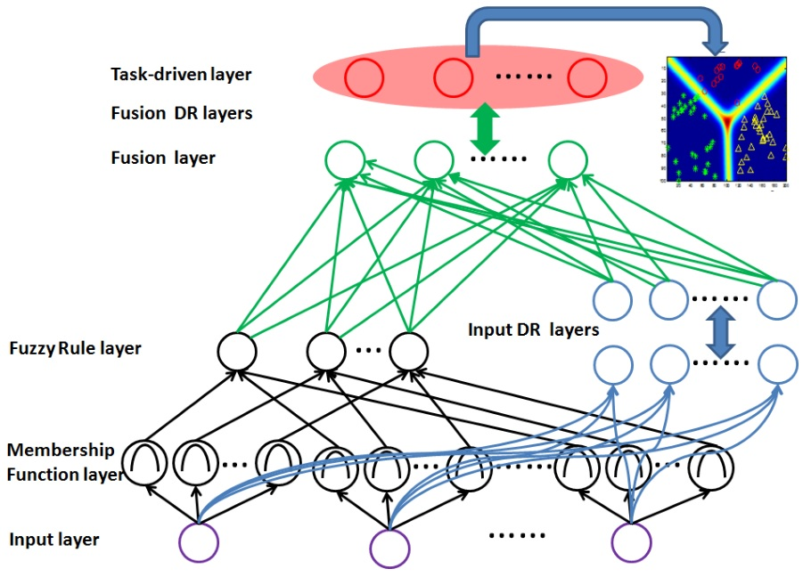

FDNN 于2016年由 Deng Yue 提出，是一种模糊深度神经网络的混合架构，在图像分类和区域划分方面优于传统的深度神经网络等多种方法。

<!--more-->

---

- [1. FDNN](#1-fdnn)
  - [1.1. 模糊逻辑表示部分](#11-模糊逻辑表示部分)
  - [1.2. 神经表示部分](#12-神经表示部分)
  - [混合部分](#混合部分)
  - [任务驱动部分](#任务驱动部分)
  - [总结](#总结)
- [5. 参考文献](#5-参考文献)

# 1. FDNN

2016.《A Hierarchical Fused Fuzzy Deep Neural Network for Data Classification》

混合架构由四部分组成：模糊逻辑表示部分（黑色）、神经表示部分（蓝色）、混合部分（绿色）、任务驱动部分（红色）。假设 $l$ 为层编号，$a_i^{(l)}$ 为第 $l$ 层第 $i$ 个神经元的输入，$o_i^{(l)}$ 为对应的输出。

假设我们输入的图像有 $k=15$ 个类别，每张图像有 $n=200$ 个特征，那么输入层维度为200，隶属度函数层维度为 $15\times 200$。输出层维度为15。

## 1.1. 模糊逻辑表示部分

输入层的每一个神经元均于多个隶属度函数相连接，隶属度函数用来表征任意输入元素的语言标签，这里的输入元素即输入层的单一神经元，也即输入向量的一个特征维度。

隶属度函数层将输入计算为属于某个模糊集的程度。文中采用高斯隶属度函数，将第 $i$ 个模糊神经元映射的第 $k$ 个输入转化为模糊度

$$
o_i^{(l)} = u_i(a_k^{(l)})=e^{-\frac{-(a_k^{(l)}-\mu_i)^2}{\sigma_i^2}},\forall i
$$

对于输入的每一个特征维度（$\forall n$），隶属度函数层均会计算其在每个类别（$k$）中的模糊度。

文中均值 $\mu$ 和方差 $\sigma$ 的选取遵循前人研究：

> C.-T. Lin, C.-M. Yeh, S.-F. Liang, J.-F. Chung, and N. Kumar, “Support-vector-based fuzzy neural network for pattern classification,” Fuzzy Systems, IEEE Transactions on, vol. 14, no. 1, pp. 31–41, 2006.

> F.-J. Lin, C.-H. Lin, and P.-H. Shen, “Self-constructing fuzzy neural network speed controller for permanent-magnet synchronous motor drive,” Fuzzy Systems, IEEE Transactions on, vol. 9, no. 5, pp. 751–759, 2001.

模糊规则层执行模糊 AND 逻辑，定义为求连乘，假设 $\Omega_i$ 是第 $l-1$ 层所有与第 $l$ 层第 $i$ 个神经元节点相连的神经元，有：

$$
o_i^{(l)} = \prod_j o_j^{(l-1)},\forall j\in \Omega_i
$$

连乘后的结果仍然是模糊度。

## 1.2. 神经表示部分

该部分用来将输入转化为某种高层表达，采用全连接神经网络，激活函数为Sigmoid，参数为权重和方差 $\theta^{(l)} = \{\boldsymbol w^{(l)},\boldsymbol b^{(l)}\}$，有

$$
o_i^{(l)} = \frac{1}{1+e^{-a_i^{(l)}}},\quad a_i^{(l)} = \boldsymbol w_i^{(l)}\boldsymbol o^{(l-1)} + \boldsymbol b_i^{(l)}
$$

## 混合部分

该部分受到已有研究的启发，采用一个被广泛使用的多模型混合神经网络结构：

> J. Ngiam, A. Khosla, M. Kim, J. Nam, H. Lee, and A. Y. Ng, “Multimodal deep learning,” in Proceedings of the 28th International Conference on Machine Learning (ICML-11), 2011, pp. 689–696.

$$
\begin{aligned}
o_i^{(l)} &= \frac{1}{1+e^{-a_i^{(l)}}}\\
a_i^{(l)} &= (\boldsymbol w_d)_i^{(l)}(\boldsymbol o_d)^{(l-1)} + (\boldsymbol w_f)_i^{(l)}(\boldsymbol o_f)^{(l-1)} + \boldsymbol b_i^{(l)}
\end{aligned}
$$

其中，$\boldsymbol o_d$ 表示（深度）神经表示部分的输出，$\boldsymbol o_f$ 表示模糊逻辑表示部分的输出，二者通过权重$\boldsymbol w_d, \boldsymbol w_f$ 来混合。然后，混合后的信息，通过与神经表示部分类似的多层全连接层来进行更深度的变换，输出结果结合了模糊度和神经表达，而不再是模糊度。

## 任务驱动部分

在该部分中，设置分类层，将混合表达信息对应到相应的分类中，采用softmax函数。假设 $(\boldsymbol f_i,y_i)$ 是第 $i$ 个输入以及其对应的标签， $\pi_\Theta(\boldsymbol f_i)$ 表示 FDNN 的前向传播过程，那么对于第 $c$ 个通道的 softmax 函数的计算过程如下

$$
\hat y_{(ic)} = p(y_i\vert\boldsymbol f_i) = \frac{e^{\boldsymbol w_c\pi_\Theta(\boldsymbol f_i)+b_c}}{\sum_c e^{\boldsymbol w_c\pi_\Theta(\boldsymbol f_i)+b_c}}
$$

其中，$\boldsymbol w_c, b_c$ 分别为第 $c$ 个类别的回归系数和回归偏差，$\hat \boldsymbol y=[\hat y_{i1},\cdots,\hat y_{ik}]$ 表示 $k$ 类的预测的标签输出。

在 $m$ 个训练样本上，采用 MSE 作为损失函数

$$
C = \frac{1}{m}\sum_i^m \vert\vert \hat \boldsymbol y_i-\boldsymbol y_i \vert\vert_2^2
$$

## 总结

虽然有多种其它可选方法来提取深度混合信息，这里作者仍然倾向于使用模糊学习，原因有如下三点：

- 模糊学习可以方便的降低输入数据的不确定性，这种重要的模糊度降低追求是模糊系统不可或缺的特性，是其它学习系统无法替代的。
- 模糊学习自然会产生 $(0,1)$ 范围内的软逻辑值（模糊表示）。模糊量（原文`fusion`有误，应为`fuzzy`）和神经输出量在相同的范围内，使得这两种输出在融合部分很容易融合。
- 模糊学习部分允许任务驱动的参数学习。在这里，通过反向传播的智能数据驱动学习，可以代替精疲力竭的手工参数调整步骤。

# 5. 参考文献

[1]  [Rust-in](https://www.zhihu.com/people/rustinnnnn). [MAML 论文及代码阅读笔记](https://zhuanlan.zhihu.com/p/66926599).

[2] 人工智障. [MAML算法，model-agnostic metalearnings?](https://www.zhihu.com/question/266497742/answer/550695031)

[3] [Veagau](https://www.cnblogs.com/veagau/). [【笔记】Reptile-一阶元学习算法](https://www.cnblogs.com/veagau/p/11816163.html)

[4] [pure water](https://blog.csdn.net/qq_41694504). [Reptile原理以及代码详解](https://blog.csdn.net/qq_41694504/article/details/106750606)