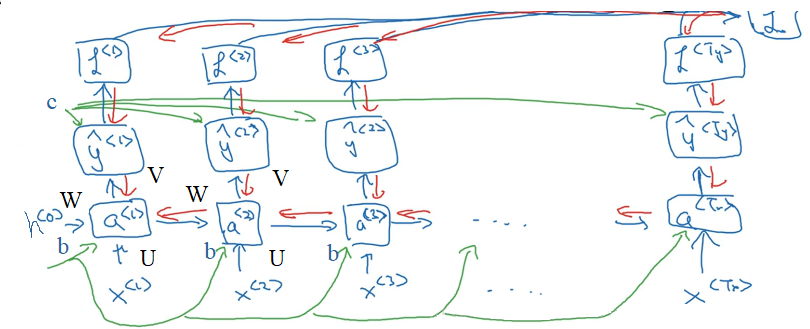

本文介绍了 RNN （循环神经网络）和 LSTM （长短时记忆网络）的基本概念。

<!--more-->

---

- [1. RNN](#1-rnn)
  - [1.1. 概念](#11-概念)
  - [1.2. 模型](#12-模型)
  - [前向传播](#前向传播)
  - [反向传播](#反向传播)
- [2. LSTM](#2-lstm)
  - [2.1. 概念](#21-概念)
  - [2.2. 模型](#22-模型)
- [3. 参考文献](#3-参考文献)

# 1. RNN

## 1.1. 概念

在前馈神经网络中，信息传递是单向的[[1](#ref1)]。前馈神经网络可以看作一个复杂的函数，每次输入都是独立的，即网络的输出只依赖于当前的输入．但是在很多现实任务中，网络的输出不仅和当前时刻的输入相关，也和其过去一段时间的输出相关。．此外，前馈网络难以处理时序数据，比如视频、语音、文本等．时序数据的长度一般是不固定的，而前馈神经网络要求输入和输出的维数都是固定的，不能任意改变．因此，当处理这一类和时序数据相关的问题时，就需要一种能力更强的模型．

循环神经网络（Recurrent Neural Network，RNN）是一类具有短期记忆能力的神经网络．在循环神经网络中，神经元不但可以接受其他神经元的信息，也可以接受自身的信息，形成具有环路的网络结构．和前馈神经网络相比，循环神经网络更加符合生物神经网络的结构．循环神经网络已经被广泛应用在语音识别、语言模型以及自然语言生成等任务上．

## 1.2. 模型

循环神经网络（Recurrent Neural Network，RNN）通过使用带自反馈的神经元，能够处理任意长度的时序数据。

给定一个输入序列 $\boldsymbol x_{1:T} = (\boldsymbol x_1,...,\boldsymbol x_t,...,\boldsymbol x_T)$，通过下面的公式更新隐层活性值 $\boldsymbol h_t$：

$$
\boldsymbol h_t = f(\boldsymbol h_{t-1},\boldsymbol x_t)
$$

其中，$\boldsymbol h_0 = 0$，$f(\cdot)$ 是非线性函数，可以是一个前馈网络。

网络结构如下图所示

从数学上讲，上述公式可以堪称一个动力系统，因此隐层活性值在很多文献中也称为隐状态（hidden state）。

由于循环神经网络具有短期记忆能力，因此其计算能力十分强大，可以近似任意非线性动力系统（程序），相比较而言，前馈神经网络可以模拟任何连续函数。

## 前向传播

如果我们把每个时刻的状态都看作前馈神经网络的一层，循环神经网络可以看作在时间维度上权值共享的神经网络。一个简单的循环神经网络按时间展开后如下图所示

令 $\boldsymbol x_t \in \mathbb R^M$ 为 $t$ 时刻的网络输入向量，则在该时刻的网络隐状态 $\boldsymbol h_t \in \mathbb R^D$ 和网络输出 $\boldsymbol y_t \in \mathbb R^N$ 的更新公式为

$$
\begin{aligned}
\boldsymbol h_t &= f(\boldsymbol U \boldsymbol h_{t-1} + \boldsymbol W \boldsymbol x_t + \boldsymbol b)\\
\boldsymbol y_t &= g(\boldsymbol V \boldsymbol h_t + \boldsymbol c)
\end{aligned}
$$

其中 $\boldsymbol U \in \mathbb R^{D\times D}$ 是状态-状态权重矩阵，$\boldsymbol W \in \mathbb R^{D\times M}$ 是状态-输入权重矩阵，$\boldsymbol b \in \mathbb R^D$ 是偏置向量，$\boldsymbol V \in \mathbb R^{N\times D}$ 是状态-输出权重矩阵，$f(\cdot)$ 是激活函数，如 $sigmoid$ 或 $tanh$ 函数，$g(\cdot)$ 也是激活函数，如 $softmax$ 或 $purlin$ 函数。

注意到，第二个方程的具体形式与模型的具体使用方式有关，比如其中的常数项 $\boldsymbol c$ 的有无，激活函数的选取等。

## 反向传播

有了RNN前向传播算法的基础，就容易推导出RNN反向传播算法的流程了。RNN 反向传播算法的思路和 DNN 是一样的，即通过梯度下降法一轮轮的迭代，得到合适的RNN模型参数 $U,W,V,b,c$。由于我们是**基于时间反向传播**，所以 RNN 的反向传播有时也叫做 BPTT(back-propagation through time)。当然这里的 BPTT 和 DNN 的 BP 也有很大的不同点，即这里所有的U,W,V,b,c在序列的各个位置是共享的，反向传播时我们更新的是相同的参数。

RNN反向传播过程中，需要计算 $U,W,V,b,c$ 等参数的梯度。清晰起见，我们将前向传播过程整理如下

$$
\begin{aligned}
a_t &= \boldsymbol W \boldsymbol h_{t-1} + \boldsymbol U \boldsymbol x_t + \boldsymbol b\\
\boldsymbol h_t &= f(a_t)\\
o_t &= \boldsymbol V \boldsymbol h_t + \boldsymbol c\\
\hat \boldsymbol y_t &= g(o_t)
\end{aligned}
$$

反向传播的形象的分析如下图所示。途中绿线是正向传播过程，红线是反向传播过程。可以看出，在输出端的 $V,c$ 参数仅与 $t$ 时刻的反向传播通路有关，因此分别求导数后求和即可。而输入端 $U,W,b$ 参数的梯度受到两个反向传播通路的影响，分别是 $t$ 时刻的输出端反向通路，以及 $t+1$ 时刻隐层信息的反向通路。

为了简化描述，这里的损失函数我们为[交叉熵损失函数](https://zhuanlan.zhihu.com/p/38241764)，输出的激活函数 $g(\cdot)$ 为 softmax 函数，隐藏层的激活函数 $f(\cdot)$ 为 tanh 函数。对于 RNN，由于在序列的每个位置（任意 $t$ 时刻）都有输出 $\hat y_t$，也即都有损失函数，因此最终损失 $L$ 为

$$
L = \sum_{t=1}^T L_t = \sum_{t=1}^T \left[ - (y_tln\hat y_t +(1-y_t)ln(1-\hat y_t) ) \right]
$$

首先计算比较简单的 $V,c$ 的梯度，有[[1](#ref1)]

$$
\begin{aligned}
\frac{\partial L}{\partial c} &= \sum_{t=1}^T \frac{\partial L_t}{\partial c} = \sum_{t=1}^T \frac{\partial L_t}{\partial \hat y_t} \frac{\partial \hat y_t}{\partial o_t} \frac{\partial o_t}{\partial c}\\
&= \sum_{t=1}^T -(\frac{y_t}{\hat y_t}-\frac{1-y_t}{1-\hat y_t})softmax'\cdot 1\\
&= \sum_{t=1}^T -(\frac{y_t}{\hat y_t}-\frac{1-y_t}{1-\hat y_t})\cdot \hat y_t(1-\hat y_t)\\
&= -\sum_{t=1}^T (\hat y_t-y_t)\\
\frac{\partial L}{\partial V} &= \sum_{t=1}^T \frac{\partial L_t}{\partial c} = \sum_{t=1}^T \frac{\partial L_t}{\partial \hat y_t} \frac{\partial \hat y_t}{\partial o_t} \frac{\partial o_t}{\partial V}\\
&= -\sum_{t=1}^T (\hat y_t-y_t)h_t
\end{aligned}
$$

$U,W,b$ 的梯度计算就比较复杂了，误差传播源来自于两个反向传播通路的方向，分别是 $t$ 时刻的输出端反向通路，以及 $t+1$ 时刻隐层信息的反向通路。以 $W$ 的梯度表达式为例[[2](#ref2)]

首先写出最后一个时刻（$t=T$ 时刻）的 $\boldsymbol W$ 的梯度

$$
\frac{\partial L}{\partial W} = \frac{\partial L}{\partial \hat y_T} \frac{\partial \hat y_T}{\partial o_T} \frac{\partial o_T}{\partial h_T} \frac{\partial h_T}{\partial W}
$$

再写出倒数第二个时刻（$t=T-1$ 时刻）的 $\boldsymbol W$ 的梯度

$$
\begin{aligned}
\frac{\partial L}{\partial W} &= \frac{\partial L_T}{\partial \hat y_T} \frac{\partial \hat y_T}{\partial o_T} \frac{\partial o_T}{\partial h_T} \frac{\partial h_T}{\partial h_t} \frac{\partial h_t}{\partial W}
+\frac{\partial L_{T-1}}{\partial \hat y_{T-1}} \frac{\partial \hat y_{T-1}}{\partial o_{T-1}} \frac{\partial o_{T-1}}{\partial h_{T-1}} \frac{\partial h_{T-1}}{\partial W}\\
&=\sum_{t=1}^T \frac{\partial L}{\partial \hat y_T} \frac{\partial \hat y_T}{\partial o_T} \frac{\partial o_T}{\partial h_T} \frac{\partial h_T}{\partial h_t} \frac{\partial h_t}{\partial W}\\
\end{aligned}
$$

# 2. LSTM

## 2.1. 概念

长短期记忆（Long short-term memory, LSTM）是一种特殊的RNN（Gers et al.,2000; Hochreiter et al., 1997），主要是为了解决长序列训练过程中的梯度消失和梯度爆炸问题。简单来说，就是相比普通的RNN，LSTM能够在更长的序列中有更好的表现。

LSTM 与 RNN 的主要输入输出区别如下图所示

## 2.2. 模型

LSTM 网络的循环单元结构如下图所示

其中，LSTM 引入三个门来控制信息的传递，分别为遗忘门 $\boldsymbol f_t$、输入门 $\boldsymbol i_t$、输出门 $\boldsymbol o_t$。三个门的作用是：

- 遗忘门 $\boldsymbol f_t$ 控制上一个时刻的内部状态 $\boldsymbol c_{t-1}$ 需要遗忘多少信息；
- 输入门 $\boldsymbol i_t$ 控制当前时刻的候选状态 $\tilde \boldsymbol c_t$ 有多少信息需要保存；
- 输出门 $\boldsymbol o_t$ 控制当前时刻的内部状态 $\boldsymbol c_t$ 有多少信息需要输出给外部状态 $\boldsymbol h_t$。

三个门的计算方式为：

$$
\begin{aligned}
\boldsymbol f_t &= \sigma(\boldsymbol W_f \boldsymbol h_{t-1} + \boldsymbol U_f \boldsymbol x_t + \boldsymbol b_f)=\sigma([\boldsymbol W_f, \boldsymbol U_f]\cdot[\boldsymbol h_{t-1}, \boldsymbol x_t]^T + \boldsymbol b_f)\\
\boldsymbol i_t &= \sigma(\boldsymbol W_i \boldsymbol h_{t-1} + \boldsymbol U_i \boldsymbol x_t + \boldsymbol b_i)=\sigma([\boldsymbol W_i, \boldsymbol U_i]\cdot[\boldsymbol h_{t-1}, \boldsymbol x_t]^T + \boldsymbol b_f)\\
\boldsymbol o_t &= \sigma(\boldsymbol W_o \boldsymbol h_{t-1} + \boldsymbol U_o \boldsymbol x_t + \boldsymbol b_o)=\sigma([\boldsymbol W_o, \boldsymbol U_o]\cdot[\boldsymbol h_{t-1}, \boldsymbol x_t]^T + \boldsymbol b_f)\\
\end{aligned}
$$

其中，$\sigma$ 为 $sigmoid$ 激活函数，输出区间为 $[0,1]$。也就是说，LSTM 网络中的“门”是一种“软”门，取值在 $[0,1]$ 之间，表示以一定的比例允许信息通过。注意到，等式右边包含一个对 $\boldsymbol h_{t-1}$ 和 $\boldsymbol x_t$ **向量拼接**的操作，相应的参数也因此进行了拼接。

相比 RNN，LSTM 引入了一个新的状态，称为细胞状态（cell state），表示为 $\boldsymbol c_t$，专门进行现行的循环信息传递，同时输出（非线性地）输出信息给隐层状态 $\boldsymbol h_t\in \mathbb R^D$。计算公式如下

$$
\begin{aligned}
\tilde \boldsymbol c_t &= tanh(\boldsymbol W_c \boldsymbol h_{t-1} + \boldsymbol U_c \boldsymbol x_t + \boldsymbol b_c)=\sigma([\boldsymbol W_c, \boldsymbol U_c]\cdot[\boldsymbol h_{t-1}, \boldsymbol x_t]^T + \boldsymbol b_f)\\
\boldsymbol c_t &= \boldsymbol f_t \odot \boldsymbol c_{t-1} + \boldsymbol i_t \odot \tilde \boldsymbol c_t\\
\boldsymbol h_t &= \boldsymbol o_t \odot tanh(\boldsymbol c_t)
\end{aligned}
$$

其中，$\tilde \boldsymbol c_t \in \mathbb R^D$ 是通过非线性函数（$tanh$）得到的候选状态，$\boldsymbol c_{t-1}$ 是上一时刻的记忆单元，$\odot$ 是向量的元素乘积。在每个时刻，LSTM 网络的细胞状态 $\boldsymbol c_t$ 记录了截至当前时刻的历史信息。

根据不同的门状态取值，可以实现不同的功能。当 $\boldsymbol f_t = 0,\boldsymbol i_t = 1$ 时，记忆单元将历史信息清空，并将候选状态向量 $\tilde \boldsymbol c_t$ 写入，但此时记忆单元 $\boldsymbol c_t$ 依然和上一时刻的历史信息相关。当$\boldsymbol f_t = 1,\boldsymbol i_t = 0$ 时，记忆单元将复制上一时刻的内容，不写入新的信息。

需要注意的是，LSTM 中的 $\boldsymbol c_t$ 对应于传统 RNN 中的 $\boldsymbol h_t$，通常是上一个传过来的历史状态乘以遗忘门后加上一些新信息得到，因此更新比较缓慢。而 LSTM 中的 $\boldsymbol h_t$ 则变化剧烈的多，在不同的时刻下的取值往往区别很大。

再次进行维度分析，$\boldsymbol h_t,\boldsymbol c_t,\boldsymbol i_t,\boldsymbol f_t,\boldsymbol o_t \in \mathbb R^D$ 且 $\boldsymbol b_f,\boldsymbol b_i,\boldsymbol b_o,\boldsymbol b_c \in \mathbb R^D$，$\boldsymbol x_t\in \mathbb R^M$，那么 $\boldsymbol W_f,\boldsymbol W_i,\boldsymbol W_o,\boldsymbol W_c \in \mathbb R^{D\times M}$， $\boldsymbol U_f,\boldsymbol U_i,\boldsymbol U_o,\boldsymbol U_c \in \mathbb R^{D\times D}$。则上面所有式子可简洁描述为

$$
\begin{aligned}
\begin{bmatrix}
 \tilde \boldsymbol c_t\\ 
 \boldsymbol o_t\\
 \boldsymbol i_t\\
 \boldsymbol f_t 
\end{bmatrix}=
\begin{bmatrix}
 tanh\\ 
 \sigma\\
 \sigma\\
 \sigma 
\end{bmatrix}\left( \boldsymbol W
\begin{bmatrix}
 \boldsymbol h_{t-1}\\ 
 \boldsymbol x_t
\end{bmatrix}+\boldsymbol b
 \right)
\end{aligned}
$$

其中

$$
\begin{aligned}
\boldsymbol W &=\begin{bmatrix}
 \boldsymbol W_c & \boldsymbol U_c\\ 
 \boldsymbol W_o & \boldsymbol U_o\\
 \boldsymbol W_i & \boldsymbol U_i\\ 
 \boldsymbol W_f & \boldsymbol U_f
\end{bmatrix} \in \mathbb R^{4D\times (D+M)}\\
\boldsymbol b &= \begin{bmatrix}
 \boldsymbol b_c\\ 
 \boldsymbol b_o\\
 \boldsymbol b_i\\
 \boldsymbol b_f 
\end{bmatrix}\in \mathbb R^{4D}
\end{aligned}
$$

循环神经网络中的隐状态 $\boldsymbol h$ 存储了历史信息，可以看作一种记忆（Memory）。在简单循环网络中，隐状态每个时刻都会被重写，因此可以看作一种短期记忆（Short-Term Memory）。在神经网络中，长期记忆（Long-Term Memory）可以看作网络参数，隐含了从训练数据中学到的经验，其更新周期要远远慢于短期记忆。

而在 LSTM 网络中，记忆单元 $\boldsymbol c$ 可以在某个时刻捕捉到某个关键信息，并有能力将此关键信息保存一定的时间间隔。记忆单元 $\boldsymbol c$ 中保存信息的生命周期要长于短期记忆 $\boldsymbol h$，但又远远短于长期记忆，**长短期记忆是指长的“短期记忆”。因此称为长短期记忆（Long Short-Term Memory）**。

# 3. 参考文献

[1]  刘建平Pinard. [循环神经网络(RNN)模型与前向反向传播算法](https://www.cnblogs.com/pinard/p/6509630.html).

[2]  刘建平Pinard. [LSTM如何解决RNN带来的梯度消失问题](https://zhuanlan.zhihu.com/p/136223550).
