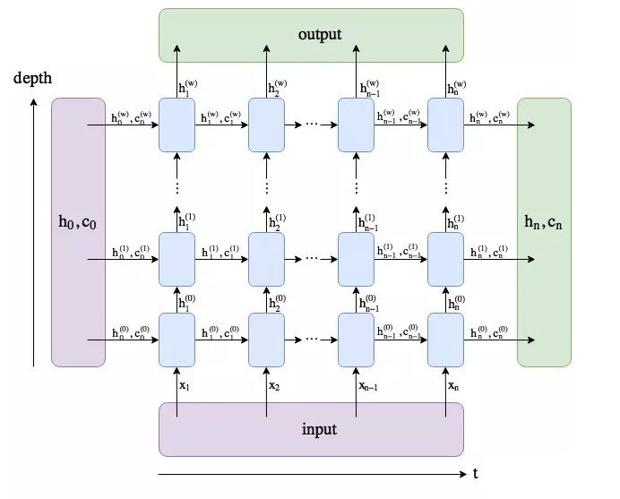

本文介绍了 LSTM （长短时记忆网络）的基本概念，以及正/反向传播的推导过程，然后分析了 LSTM 如何克服 RNN 的梯度消失问题，最后介绍了 PyTorch 的 LSTM 模块的实现。

<!--more-->

---

- [1. LSTM](#1-lstm)
  - [1.1. 概念](#11-概念)
  - [1.2. 模型](#12-模型)
  - [1.3. 前向传播](#13-前向传播)
  - [1.4. 如何解决梯度消失](#14-如何解决梯度消失)
  - [1.5. 如何解决梯度爆炸](#15-如何解决梯度爆炸)
- [2. 实际案例](#2-实际案例)
  - [2.1. LSTM 的 PyTorch 类](#21-lstm-的-pytorch-类)
  - [2.2. LSTM 实现 MNIST 识别](#22-lstm-实现-mnist-识别)
- [3. 参考文献](#3-参考文献)

# 1. LSTM

## 1.1. 概念

长短期记忆（Long short-term memory, LSTM）是一种特殊的RNN（Gers et al.,2000; Hochreiter et al., 1997），主要是为了解决长序列训练过程中的梯度消失和梯度爆炸问题。简单来说，就是相比普通的RNN，LSTM能够在更长的序列中有更好的表现。

LSTM 与 RNN 的主要输入输出区别如下图所示


## 1.2. 模型

LSTM 网络的循环单元结构如下图所示


其中，LSTM 引入三个门来控制信息的传递，分别为遗忘门 $\boldsymbol f_t$、输入门 $\boldsymbol i_t$、输出门 $\boldsymbol o_t$。三个门的作用是：

- 遗忘门 $\boldsymbol f_t$ 控制上一个时刻的内部状态 $\boldsymbol c_{t-1}$ 需要遗忘多少信息；
- 输入门 $\boldsymbol i_t$ 控制当前时刻的候选状态 $\tilde \boldsymbol c_t$ 有多少信息需要保存；
- 输出门 $\boldsymbol o_t$ 控制当前时刻的内部状态 $\boldsymbol c_t$ 有多少信息需要输出给外部状态 $\boldsymbol h_t$。

## 1.3. 前向传播

三个门的计算方式为：

$$
\begin{aligned}
\boldsymbol f_t &= \sigma(\boldsymbol W_f \boldsymbol h_{t-1} + \boldsymbol U_f \boldsymbol x_t + \boldsymbol b_f)=\sigma([\boldsymbol W_f, \boldsymbol U_f]\cdot[\boldsymbol h_{t-1}, \boldsymbol x_t]^T + \boldsymbol b_f)\\
\boldsymbol i_t &= \sigma(\boldsymbol W_i \boldsymbol h_{t-1} + \boldsymbol U_i \boldsymbol x_t + \boldsymbol b_i)=\sigma([\boldsymbol W_i, \boldsymbol U_i]\cdot[\boldsymbol h_{t-1}, \boldsymbol x_t]^T + \boldsymbol b_f)\\
\boldsymbol o_t &= \sigma(\boldsymbol W_o \boldsymbol h_{t-1} + \boldsymbol U_o \boldsymbol x_t + \boldsymbol b_o)=\sigma([\boldsymbol W_o, \boldsymbol U_o]\cdot[\boldsymbol h_{t-1}, \boldsymbol x_t]^T + \boldsymbol b_f)\\
\end{aligned}
$$

其中，$\sigma$ 为 $sigmoid$ 激活函数，输出区间为 $[0,1]$。也就是说，LSTM 网络中的“门”是一种“软”门，取值在 $[0,1]$ 之间，表示以一定的比例允许信息通过。注意到，等式右边包含一个对 $\boldsymbol h_{t-1}$ 和 $\boldsymbol x_t$ **向量拼接**的操作，相应的参数也因此进行了拼接。

相比 RNN，LSTM 引入了一个新的状态，称为细胞状态（cell state），表示为 $\boldsymbol c_t$，专门进行现行的循环信息传递，同时输出（非线性地）输出信息给隐层状态 $\boldsymbol h_t\in \mathbb R^D$。计算公式如下

$$
\begin{aligned}
\tilde \boldsymbol c_t &= tanh(\boldsymbol W_c \boldsymbol h_{t-1} + \boldsymbol U_c \boldsymbol x_t + \boldsymbol b_c)=\sigma([\boldsymbol W_c, \boldsymbol U_c]\cdot[\boldsymbol h_{t-1}, \boldsymbol x_t]^T + \boldsymbol b_f)\\
\boldsymbol c_t &= \boldsymbol f_t \odot \boldsymbol c_{t-1} + \boldsymbol i_t \odot \tilde \boldsymbol c_t\\
\boldsymbol h_t &= \boldsymbol o_t \odot tanh(\boldsymbol c_t)
\end{aligned}
$$

其中，$\tilde \boldsymbol c_t \in \mathbb R^D$ 是通过非线性函数（$tanh$）得到的候选状态，$\boldsymbol c_{t-1}$ 是上一时刻的记忆单元，$\odot$ 是向量的元素乘积。在每个时刻，LSTM 网络的细胞状态 $\boldsymbol c_t$ 记录了截至当前时刻的历史信息。

根据不同的门状态取值，可以实现不同的功能。当 $\boldsymbol f_t = 0,\boldsymbol i_t = 1$ 时，记忆单元将历史信息清空，并将候选状态向量 $\tilde \boldsymbol c_t$ 写入，但此时记忆单元 $\boldsymbol c_t$ 依然和上一时刻的历史信息相关。当$\boldsymbol f_t = 1,\boldsymbol i_t = 0$ 时，记忆单元将复制上一时刻的内容，不写入新的信息。

需要注意的是，**LSTM 中的 $\boldsymbol c_t$ 对应于传统 RNN 中的 $\boldsymbol h_t$**，通常是上一个传过来的历史状态乘以遗忘门后加上一些新信息得到，因此更新比较缓慢。而 LSTM 中的 $\boldsymbol h_t$ 则变化剧烈的多，在不同的时刻下的取值往往区别很大。

再次进行维度分析，$\boldsymbol h_t,\boldsymbol c_t,\boldsymbol i_t,\boldsymbol f_t,\boldsymbol o_t \in \mathbb R^D$ 且 $\boldsymbol b_f,\boldsymbol b_i,\boldsymbol b_o,\boldsymbol b_c \in \mathbb R^D$，$\boldsymbol x_t\in \mathbb R^M$，那么 $\boldsymbol W_f,\boldsymbol W_i,\boldsymbol W_o,\boldsymbol W_c \in \mathbb R^{D\times M}$， $\boldsymbol U_f,\boldsymbol U_i,\boldsymbol U_o,\boldsymbol U_c \in \mathbb R^{D\times D}$。则上面所有式子可简洁描述为

$$
\begin{aligned}
\begin{bmatrix}
 \tilde \boldsymbol c_t\\ 
 \boldsymbol o_t\\
 \boldsymbol i_t\\
 \boldsymbol f_t 
\end{bmatrix}=
\begin{bmatrix}
 tanh\\ 
 \sigma\\
 \sigma\\
 \sigma 
\end{bmatrix}\left( \boldsymbol W
\begin{bmatrix}
 \boldsymbol h_{t-1}\\ 
 \boldsymbol x_t
\end{bmatrix}+\boldsymbol b
 \right)
\end{aligned}
$$

其中

$$
\begin{aligned}
\boldsymbol W &=\begin{bmatrix}
 \boldsymbol W_c & \boldsymbol U_c\\ 
 \boldsymbol W_o & \boldsymbol U_o\\
 \boldsymbol W_i & \boldsymbol U_i\\ 
 \boldsymbol W_f & \boldsymbol U_f
\end{bmatrix} \in \mathbb R^{4D\times (D+M)}\\
\boldsymbol b &= \begin{bmatrix}
 \boldsymbol b_c\\ 
 \boldsymbol b_o\\
 \boldsymbol b_i\\
 \boldsymbol b_f 
\end{bmatrix}\in \mathbb R^{4D}
\end{aligned}
$$

循环神经网络中的隐状态 $\boldsymbol h$ 存储了历史信息，可以看作一种记忆（Memory）。在简单循环网络中，隐状态每个时刻都会被重写，因此可以看作一种短期记忆（Short-Term Memory）。在神经网络中，长期记忆（Long-Term Memory）可以看作网络参数，隐含了从训练数据中学到的经验，其更新周期要远远慢于短期记忆。

而在 LSTM 网络中，记忆单元 $\boldsymbol c$ 可以在某个时刻捕捉到某个关键信息，并有能力将此关键信息保存一定的时间间隔。记忆单元 $\boldsymbol c$ 中保存信息的生命周期要长于短期记忆 $\boldsymbol h$，但又远远短于长期记忆，**长短期记忆是指长的“短期记忆”。因此称为长短期记忆（Long Short-Term Memory）**。

## 1.4. 如何解决梯度消失

[LSTM如何来避免梯度弥散和梯度爆炸？](https://www.zhihu.com/question/34878706)

LSTM 通过引入门机制，把矩阵乘法变成了 element-wise 的 [Hadamard product](https://baike.baidu.com/item/%E5%93%88%E8%BE%BE%E7%8E%9B%E7%A7%AF)（哈达玛积，逐元素相乘）。这样做后，细胞状态 $\boldsymbol c_t$ （对应于 RNN 中的隐状态 $\boldsymbol h_t$）的更新公式变为

$$
\boldsymbol c_t = \boldsymbol f_t \odot \boldsymbol c_{t-1} + \boldsymbol i_t \odot tanh(\boldsymbol W_c \boldsymbol h_{t-1} + \boldsymbol U_c \boldsymbol x_t + \boldsymbol b_c)
$$

进一步推导

$$
\begin{aligned}
\frac{\partial \boldsymbol L}{\partial \boldsymbol c_{t-1}} &= \frac{\partial L}{\partial c_t}\frac{\partial c_t}{\partial c_{t-1}} = \frac{\partial L}{\partial c_t} \odot diag(f_t+\cdots)
\end{aligned}
$$

公式里其余的项不重要，这里就用省略号代替了。可以看出当 $f_t=1$ 时，就算其余项很小，梯度仍然可以很好地传导到上一个时刻，此时即使层数较深也不会发生 Gradient Vanish 的问题；当 $f_t=0$ 时，即上一时刻的信号不影响到当前时刻，则此项也会为0。$f_t$ 在这里控制着梯度传导到上一时刻的衰减程度，与它 Forget Gate 的功能一致。


这样的方式本质上类似 Highway Network 或者 ResNet（残差连接），使得梯度的信息可以“贯穿”时间线，缓解梯度消散。


这里需要强调的是：LSTM不是让所有远距离的梯度值都不会消散，而是只让具有时序关键信息位置的梯度可以一直传递。另一方面，仅在 $c_t$ 通路上缓解了梯度消失问题，而在 $h_t$ 通路上梯度消失依然存在。

## 1.5. 如何解决梯度爆炸

关于梯度爆炸问题： $f_t$ 已经在 $[0,1]$ 范围之内了。而且梯度爆炸爆炸也是相对容易解决的问题，可以用梯度裁剪(gradient clipping)来解决：只要设定阈值，当提出梯度超过此阈值，就进行截取即可。

# 2. 实际案例

## 2.1. LSTM 的 PyTorch 类

官方文档链接[在此](https://pytorch.org/docs/stable/generated/torch.nn.LSTM.html)（https://pytorch.org/docs/stable/generated/torch.nn.LSTM.html ）

```python
CLASStorch.nn.LSTM(*args, **kwargs)
```

参数列表如下

- **input_size** – The number of expected features in the input *x*

- **hidden_size** – The number of features in the hidden state *h*

- **num_layers** – Number of recurrent layers. E.g., setting `num_layers=2` would mean stacking two LSTMs together to form a stacked LSTM, with the second LSTM taking in outputs of the first LSTM and computing the final results. Default: 1

- **bias** – If False, then the layer does not use bias weights *b_ih* and *b_hh*. Default: `True`

- **batch_first** – If `True`, then the input and output tensors are provided as (batch, seq, feature). Default: `False`

- **dropout** – If non-zero, introduces a Dropout layer on the outputs of each LSTM layer except the last layer, with dropout probability equal to `dropout`. Default: 0

- bidirectional – If `True`, becomes a bidirectional LSTM. Default: `False`

我们再次将 LSTM 的前向传播列写如下便于比对

$$
\begin{aligned}
\boldsymbol f_t &= \sigma(\boldsymbol W_f \boldsymbol h_{t-1} + \boldsymbol U_f \boldsymbol x_t + \boldsymbol b_f)\\
\boldsymbol i_t &= \sigma(\boldsymbol W_i \boldsymbol h_{t-1} + \boldsymbol U_i \boldsymbol x_t + \boldsymbol b_i)\\
\boldsymbol o_t &= \sigma(\boldsymbol W_o \boldsymbol h_{t-1} + \boldsymbol U_o \boldsymbol x_t + \boldsymbol b_o)\\
\tilde \boldsymbol c_t &= tanh(\boldsymbol W_c \boldsymbol h_{t-1} + \boldsymbol U_c \boldsymbol x_t + \boldsymbol b_c)\\
\boldsymbol c_t &= \boldsymbol f_t \odot \boldsymbol c_{t-1} + \boldsymbol i_t \odot \tilde \boldsymbol c_t\\
\boldsymbol h_t &= \boldsymbol o_t \odot tanh(\boldsymbol c_t)
\end{aligned}
$$

前面我们已经假设，$\boldsymbol h_t,\boldsymbol c_t,\boldsymbol i_t,\boldsymbol f_t,\boldsymbol o_t \in \mathbb R^D$ 且 $\boldsymbol b_f,\boldsymbol b_i,\boldsymbol b_o,\boldsymbol b_c \in \mathbb R^D$，$\boldsymbol x_t\in \mathbb R^M$，那么 $\boldsymbol W_f,\boldsymbol W_i,\boldsymbol W_o,\boldsymbol W_c \in \mathbb R^{D\times M}$， $\boldsymbol U_f,\boldsymbol U_i,\boldsymbol U_o,\boldsymbol U_c \in \mathbb R^{D\times D}$。

`input_size` 就是输入层维度 $M$，比如某个词或者某张图的 embedding dim （特征维度）。

`hidden_size` 就是隐层 $h_t$ 的维度 $D$。

`num_layers` 是 LSTM 堆叠的层数。LSTM 可以按照下图的形式进行堆叠。



`batch_first` 是一个可选参数，指定是否将 `batch_size` 作为输入输出张量的第一个维度，如果是，则输入和输入的维度顺序为（`batch_size， seq_length，input_size`），否则，输入和输出的默认维度顺序是（`seq_length, batch_size, input_size`）。

## 2.2. LSTM 实现 MNIST 识别

注意，后文中的所有代码均为片段，全部凑在一起时无法直接运行的！旨在辅助进行理解。

考虑到网络每一时刻输入的是一个 vector，我们可以假设这个 vector 对应的是 **图像的一行**，有多少行就对应多少时刻，那最后一个时刻输入的是最后一行。最后输出的 $h_t$ 实际上就是该图像对应的类别。

MNIST 手写数字图片大小为 28*28，那么可以将每张图片看作长为28的序列，序列中的每个元素的特征维度是28，这样就将图片变成了一个序列。

那么有

```python
input_size = 28 # image width
sequence_size = 28 # image height (time step)
hidden_size = 100 # user defined
output_size = 10 # 10 classes of number from 0 to 9
num_layers = 2 # user defined
```

其中 `hidden_size` 和 `num_layers` 均由用户自定义。

然后我们开始构建 LSTM 网络的类。

```python
class MNIST_LSTM(nn.Module):
    def __init__(self, input_size, hidden_size, num_layers, output_dim):
        super(MNIST_LSTM,self).__init__()
        self.lstm = nn.LSTM(
            input_size,
            hidden_size,
            num_layers,
            batch_first=True)
        # fully connect
        self.fc = nn.Linear(hidden_dim, output_dim)

    def forward(self, x):
        # x -     [batch_size, sequence_dim, input_dim]
        # r_out - [batch_size, sequence_dim, hidden_size]
        # h_n -   [layer_dim, batch_size, hidden_size]
        # h_c -   [layer_dim, batch_size, hidden_size]
        r_out, (h_n, h_c) = self.lstm(x, None)
        # out -   [batch_size, output_size]
        out = self.fc(r_out[:,-1,:])
        return out
```

在网络初始化时，我们引入了定义的 4 个形参 `input_size, hidden_size, num_layers, output_size`，确定网络的结构中的输入维度，隐层神经元个数，隐层层数，输出维度。

然后，按照上面定义的结构定义一个 torch 官方提供的 `torch.nn.LSTM` 单元，并且设定其 `batch_first=True`，即将数据的批数放到输入输出向量的第一个维度。

最后，定义一个全连接层，将隐层信息映射到输出维度。

在定义网络前向传播时，首先给 LSTM 传入输入向量 `x` 和 初始隐层向量 `(h_n,h_c)`。此处 `x` 维度为 `[batch_size, sequence_size, input_size]`，初始隐层向量为 `None`，即表示初始时刻隐层向量均为 0 。

经过前向传播，LSTM 单元的输出为 `r_out, (h_n, h_c)`。其中

- `r_out` 也就是上面图中的 **output** 保存了**最后一层，每个 time step 的输出** `h`，如果是双向 LSTM，每个 time step 的输出 `h = [h正向, h逆向]` (同一个 time step 的正向和逆向的h连接起来)。
  - 所以 `r_out` 无需层维度信息，而包含时间序列信息，其维度为 `[batch_size, sequence_size, output_size]`；
  - 如果 `num_layers=1`，lstm 只有一层，则 `r_out` 为**每个 time step 的输出**。
- `h_n` 保存了**每一层，最后一个time step 的输出** `h`，如果是双向LSTM，单独保存前向和后向的最后一个 time step 的输出 h。
  - 所以 `h_n` 包含层维度信息，无需时间序列信息，其维度为 `[layer_size, batch_size, hidden_size]`；注意到 `batch_first=True` 不会影响到 `h_n`，因此第一个维度是层个数；
  - 如果 `num_layers=1`，lstm 只有一层，则 `h_n` 为**最后一个 time step 的输出**。
- `c_n` 与 `h_n` 一致，只是它保存的是 `c` 的值。

继续经过全连接层，输入 `r_out` 输出 `out` ：

- `r_out[:,-1,:]` 表示读取 `r_out` 第二维的倒数第一个元素对应的其余维度数据。由于 `r_out` 的第二维是 `sequence_size` 也就是 time step，倒数第一个元素对应的其余维度数据也就是最后一个时刻的数据 `[batch_size, hidden_size]`；
- 当 `layer_size = 1` 时，`r_out[:,-1,:] = h_n[-1,:,:]`；
- 经过全连接层，得到 batch 中每张图片的最终分类结果 `[batch_size, output_size]`。

最后设计训练和测试环节。

```python
def main():

    root = "./mnist/MNIST/raw/"

    train_mean = 0.1307
    train_std = 0.3081
    batch_size = 64
    test_batch_size = 50

    kwargs = {'num_workers': 2, 'pin_memory': True} if use_cuda else {}
    transform = transforms.Compose([
        transforms.ToTensor(),
        transforms.Normalize((train_mean,), (train_std,))
        ])
    train_loader = torch.utils.data.DataLoader(
        DATA(root, train=True, transform=transform),
        batch_size=batch_size, shuffle=True, **kwargs)
    test_loader = torch.utils.data.DataLoader(
        DATA(root, train=False, transform=transform),
        batch_size=test_batch_size, shuffle=True, **kwargs)

    model = MNIST_LSTM(input_size, hidden_size, layer_num, output_size)
    if use_cuda:
        model.to(device)

    lossfcn = nn.CrossEntropyLoss()

    learning_rate = 0.01
    optimizer = torch.optim.SGD(model.parameters(), lr=learning_rate)

    loss_list = []
    accuracy_list = []
    iteration_list = []

    EPOCHS = 20
    iter = 0
    for epoch in range(1,EPOCHS+1):
        print("EPOCH: {}".format(epoch))

        loss = 999.0
        for batchidx, (images, labels) in enumerate(train_loader):
            model.train()
            # 一个batch 转换为RNN的输入维度
            images = images.view(-1, sequence_size, input_size)
            images = images.requires_grad_()
            labels = labels.long() # cross entropy requires a long scalar
            # 移入GPU
            if use_cuda:
                images, labels = images.to(device), labels.to(device)
            # 梯度清零
            optimizer.zero_grad()
            # 前向传播
            output = model(images)
            # 计算损失
            loss = lossfcn(output, labels)
            # 反向传播
            loss.backward()
            # 更新参数
            optimizer.step()
            iter += 1

            # 打印训练信息
            if batchidx % 50 == 0:
                print("batch index: {}, images: {}/{}+[{}], loss: {}".format(
                    batchidx,
                    batchidx*batch_size,
                    train_loader.dataset.data.shape[0],batch_size,
                    loss.data.cpu().numpy()))

        # 模型验证
        model.eval()
        correct = 0.0
        total = 0.0
        # 迭代测试集，获取数据，预测
        with torch.no_grad():
            for images, labels in test_loader:
                images = images.view(-1, sequence_size, input_size).to(device)
                # 模型预测
                output = model(images)
                # 获取预测概率最大值的下标
                _, predict = torch.max(output.data, axis=1)
                # 统计测试集的大小
                total += labels.size(0)
                # 统计预测正确的数量
                if use_cuda:
                    predict, labels = predict.to(device), labels.to(device)
                correct += (predict == labels).sum()
            accuracy = correct / total * 100
            # 保存accuracy，loss，iteration
            loss_list.append(loss.data)
            accuracy_list.append(accuracy)
            iteration_list.append(iter)
            # 打印信息
            print("iter: {}, Loss: {}, Accu: {}%".format(iter, loss.item(), accuracy))
            print()

if __name__ == '__main__':
    main()
```

注意，上述代码并没有采用一般教程中的使用 Pytorch 代码直接下载并使用 MNIST 数据集，而是将数据集下载好后，提取出其中所有图片，保存在 raw 文件夹中，然后构造一个DataLoader 类型的 DATA 类来实现数据加载，这样可以便于我们之后将网络迁移至自己的数据集上训练。

为了便于比较，这里给出一段借助 `torchvision.datasets` 直接下载和加载 MNIST 数据集的代码

```python
# MNIST Dataset
train_dataset = torchvision.datasets.MNIST(root='./data/',
                                           train=True, 
                                           transform=transforms.ToTensor(),
                                           download=True)

test_dataset = torchvision.datasets.MNIST(root='./data/',
                                          train=False, 
                                          transform=transforms.ToTensor())

# Data Loader (Input Pipeline)
train_loader = torch.utils.data.DataLoader(dataset=train_dataset,
                                           batch_size=batch_size, 
                                           shuffle=True)

test_loader = torch.utils.data.DataLoader(dataset=test_dataset,
                                          batch_size=batch_size, 
                                          shuffle=False)
```

最终也得到了用于训练和测试的 `train_loader, test_loader`。其中

- `root='./data/'` 表明将下载的数据集存放于代码同级路径下的 data 文件夹；
- `train=true` 表明下载的数据集是用于训练的数据集；
- `transform=transforms.ToTensor()` 表明对下载的数据集进行一个数据处理操作：
  `ToTensor(object)` Convert a `numpy.ndarray` (H x W x C) in the range [0, 255] to a `torch.FloatTensor` of shape (C x H x W) in the range [0.0, 1.0].
- `download=True` 表明如果检测到 `root` 下没有数据集时自动下载数据所有数据，包括训练数据和测试数据，因此在 `train=True` 时设置一次即可。

PyTorch 官方给出的基于 CNN 的 MNIST 手写数字识别代码[在此](https://github.com/pytorch/examples/blob/master/mnist/main.py)（https://github.com/pytorch/examples/blob/master/mnist/main.py ），以供参考。

注意到上述链接的代码中，除了 `ToTensor()` 之外还用到了另一个转换，`Normalize()` 如下：

```python
transform=transforms.Compose([
                           transforms.ToTensor(),
                           transforms.Normalize((0.1307,), (0.3081,))
                       ])
```

总结而言，`ToTensor()` 能够把灰度范围从 0-255 变换到 0-1 之间，而后面的 `transform.Normalize()` 则把 0-1 数据执行以下操作：

```python
image=(image-mean)/std
```

如果取 `mean=0.5, std=0.5` 那么 `Normalize` 把 0-1 数据变换到 (-1,1)，号称可以加快模型收敛速度。当然此处MNIST应用时 `mean=0.1307, std=0.3081` 。

# 3. 参考文献

<span id="ref1">[1]</span> 谓之小一. [LSTM如何解决RNN带来的梯度消失问题](https://zhuanlan.zhihu.com/p/136223550).

<span id="ref2">[2]</span> thinkando. [机器学习中的矩阵、向量求导](https://www.jianshu.com/p/2da10b181c59).

<span id="ref3">[3]</span> Leo蓝色. [RNN正向及反向传播](https://www.jianshu.com/p/43b7a927ae34).

<span id="ref4">[4]</span> 小米粥. [RNN的反向传播-BPTT](https://zhuanlan.zhihu.com/p/90297737).