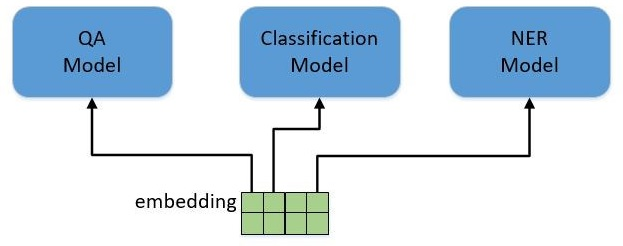

本文主要介绍自然语言处理（Natural Language Process，NLP）的基础，然后介绍 Encoder-Decoder（编码-解码）框架和 BERT 框架。

<!--more-->

---
- [1. NLP 介绍](#1-nlp-介绍)
  - [1.1. 文本表示](#11-文本表示)
  - [1.2. 训练思想](#12-训练思想)
- [2. Encoder-Decoder 框架](#2-encoder-decoder-框架)
- [3. Transformer](#3-transformer)
  - [3.1. 简介](#31-简介)
- [4. 参考文献](#4-参考文献)

# 1. NLP 介绍

_zhang_bei_. [自然语言处理中的Transformer和BERT](https://blog.csdn.net/Zhangbei_/article/details/85036948)

## 1.1. 文本表示

要处理NLP问题，首先要解决文本的表示问题。虽然我们人去看文本，能够清楚明白文本中的符号表达什么含义，但是计算机只能做数学计算，需要将文本表示成计算机可以处理的形式。

最开始的方法是采用 **one hot**，比如，我们假设英文中常用的单词有3万个，那么我们就用一个3万维的向量表示这个词，所有位置都置0。当我们想表示apple这个词时，就在对应位置设置1，如下图所示

```
append apple hello look world ...()
[0,    1,    0,    0,   0, ...]
```

这种表示方式存在的问题包括：

- 高维稀疏：高维是指有多少个词，就需要多少个维度的向量；稀疏是指，每个向量中大部分值都是0；
- 向量没有任何含义。

后来出现了**词向量**（word embedding），用一个低维稠密的向量去表示一个词，如下所示

```
apple = [0.2649816874, 0.14916784874, -1.51968714,...]
```

通常这个向量的维度在几百到上千之间，相比one hot几千几万的维度就低了很多。词与词之间可以通过相似度或者距离来表示关系，相关的词向量相似度比较高，或者距离比较近，不相关的词向量相似度低，或者距离比较远，这样词向量本身就有了含义。文本的表示问题就得到了解决。

词向量可以通过一些无监督的方法学习得到，比如 CBOW 或者 Skip-Gram 等，可以预先在语料库上训练出词向量，以供后续的使用。顺便提一句，在图像中就不存在表示方法的困扰，因为图像本身就是数值矩阵，计算机可以直接处理。

## 1.2. 训练思想

NLP中有各种各样的任务，比如分类（Classification），问答（QA），实体命名识别（NER）等。对于这些不同的任务，最早的做法是根据每类任务定制不同的模型，输入预训练好的 embedding，然后利用特定任务的数据集对模型进行训练，如下图所示。



这里存在的问题就是，不是每个特定任务都有大量的标签数据可供训练，对于那些数据集非常小的任务，恐怕就难以得到一个理想的模型。

我们看一下图像领域是如何解决这个问题的。图像分类是计算机视觉中最基本的任务，当我要解决一个小数据集的图像分类任务时，该怎么做？CV领域已经有了一套成熟的解决方案。我会用一个通用的网络模型，比如Vgg，ResNet或者GoogleNet，在ImageNet上做预训练（pre-training）。ImageNet有1400万张有标注的图片，包含1000个类别，这样的数据规模足以训练出一个规模庞大的模型。在训练过程中，模型会不断的学习如何提取特征，**底层的CNN网络结构会提取边缘，角，点等通用特征，模型越往上走，提取的特征也越抽象，与特定的任务更加相关**。当完成预训练之后，根据我自己的分类任务，调整最上层的网络结构，然后在小数据集里对模型进行训练。在训练时，可以固定住底层的模型参数只训练顶层的参数，也可以对整个模型进行训练，这个过程叫做微调（fine-tuning），最终得到一个可用的模型。总结一下，整个过程包括两步:

- 拿一个通用模型在ImageNet上做预训练（pre-training）
- 针对特定任务进行微调（fine-tuning）

如此就可以完美解决了特定任务数据不足的问题。还有一个好处是，对于各种各样的任务都不再需要从头开始训练网络，可以直接拿预训练好的结果进行微调，既减少了训练计算量的负担，也减少了人工标注数据的负担。

NLP领域也引入了这种做法，用一个通用模型，在非常大的语料库上进行预训练，然后在特定任务上进行微调，**BERT** 就是这套方案的集大成者。BERT不是第一个，但目前为止，是效果最好的方案。BERT用了一个已有的模型结构，提出了一整套的预训练方法和微调方法，我们在后文中再进行详细的描述。

# 2. Encoder-Decoder 框架

vieo. [encoder-decoder模型](https://blog.csdn.net/weixin_41803874/article/details/89409858)

Encoder-Decoder（编码-解码）是深度学习中非常常见的一个模型框架，比如无监督算法的 auto-encoding 就是用编码-解码的结构设计并训练的；比如这两年比较热的 image caption 的应用，就是 CNN-RNN 的编码-解码框架；再比如神经网络机器翻译 NMT 模型，往往就是LSTM-LSTM 的编码-解码框架。因此，准确的说，Encoder-Decoder 并不是一个具体的模型，而是一类**框架**。Encoder和Decoder部分可以是任意的文字，语音，图像，视频数据，模型可以采用CNN，RNN，BiRNN、LSTM、GRU等等。所以基于Encoder-Decoder，我们可以设计出各种各样的应用算法。

Encoder-Decoder框架有一个最显著的特征就是它是一个End-to-End学习的算法；本文将以文本-文本的例子作为介绍，这样的模型往往用在机器翻译中，比如将法语翻译成英语。这样的模型也被叫做 Sequence to Sequence learning[1]。所谓编码，就是将输入序列转化成一个固定长度的向量；解码，就是将之前生成的固定向量再转化成输出序列。

# 3. Transformer

## 3.1. 简介

Transformer来自Google团队17年的文章 《Attenion Is All You Need》（https://arxiv.org/abs/1706.03762 ），该文章的目的：减少计算量并且提高并行效率，同时不减弱最终的实验效果。

# 4. 参考文献

[1] [梦并不遥远](https://www.cnblogs.com/zyg123/). [4.3Python数据处理篇之Matplotlib系列(三)---plt.plot()](https://www.cnblogs.com/zyg123/p/10504633.html).

[2] [我的明天不是梦](https://www.cnblogs.com/xiaoboge/). [python使用matplotlib:subplot绘制多个子图](https://www.cnblogs.com/xiaoboge/p/9683056.html).