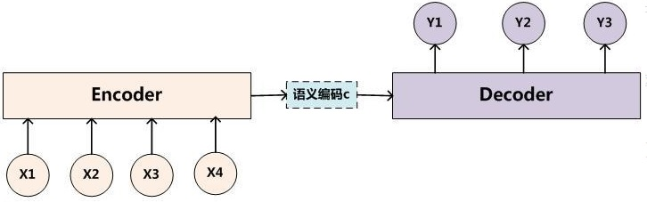
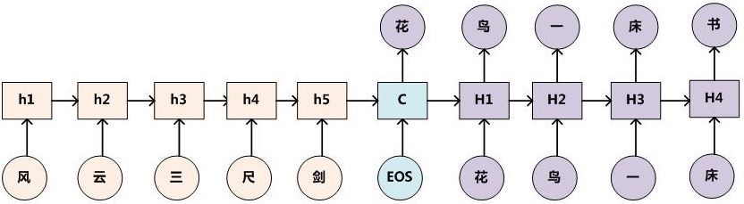
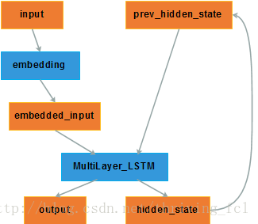
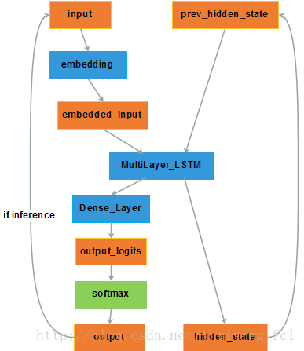
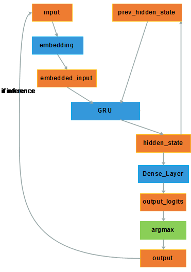
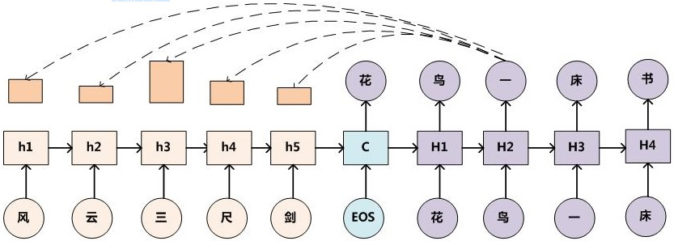

本文主要介绍自然语言处理（Natural Language Process，NLP）的基础，然后介绍 Encoder-Decoder（编码-解码）框架和 BERT 框架。

<!--more-->

---
- [1. NLP 介绍](#1-nlp-介绍)
  - [1.1. 文本表示](#11-文本表示)
  - [1.2. 训练思想](#12-训练思想)
- [2. Encoder-Decoder](#2-encoder-decoder)
  - [2.1. RNN E-D](#21-rnn-e-d)
    - [2.1.1. 实现](#211-实现)
    - [2.1.2. 结构](#212-结构)
    - [2.1.3. 分析](#213-分析)
  - [2.2. RNN E-D with attention](#22-rnn-e-d-with-attention)
    - [2.2.1. 生成 attention score](#221-生成-attention-score)
- [3. Transformer](#3-transformer)
  - [3.1. 简介](#31-简介)
- [4. 参考文献](#4-参考文献)

# 1. NLP 介绍

## 1.1. 文本表示

要处理 NLP（Natural Language Processing，自然语言处理）问题，首先要解决文本的表示问题。虽然我们人去看文本，能够清楚明白文本中的符号表达什么含义，但是计算机只能做数学计算，需要将文本表示成计算机可以处理的形式。

最开始的方法是采用 **one hot**。one-hot 编码是一种最普通常见的表示离散数据的表示，首先我们计算出需要表示的离散或类别变量的总个数 $N$，然后对于每个变量，我们就可以用 $N-1$ 个 0 和单个 1 组成的向量来表示每个类别。

比如，我们假设英文中常用的单词有 $N=30000$ 个，那么我们就用一个 30000 维的向量表示这个词，所有位置都置0。当我们想表示 `apple` 这个词时，就在对应位置设置1，如下图所示

```
Dict =    append apple hello look world ... [30000 words]
V_apple = [0,    1,    0,    0,   0, ...] 1*30000 dim
```

这样做有两个很明显的缺点：

- 高维稀疏：对于具有非常多类型的类别变量，变换后的向量维数过于巨大，且过于稀疏。
- 向量没有任何含义，映射之间完全独立，并不能表示出不同类别之间的关系。。

后来出现了**词向量**（word embedding），用一个低维稠密的向量去表示一个词，如下所示

```
apple = [0.2649816874, 0.14916784874, -1.51968714,...]
```

通常这个向量的维度在几百到上千之间，相比 one hot 几千几万的维度就低了很多。词与词之间可以通过相似度或者距离来表示关系，相关的词向量相似度比较高，或者距离比较近，不相关的词向量相似度低，或者距离比较远，这样词向量本身就有了含义。文本的表示问题就得到了解决。

> 刘斯坦. [怎么形象理解 embedding 这个概念？](https://www.zhihu.com/question/38002635)
> 
> 这个概念在深度学习领域最原初的切入点是所谓的**Manifold Hypothesis**（流形假设）。流形假设是指“自然的原始数据是低维的流形嵌入于(embedded in)原始数据所在的高维空间”。那么，深度学习的任务就是把高维原始数据（图像，句子）映射到低维流形，使得高维的原始数据被映射到低维流形之后变得可分，而这个映射就叫嵌入（Embedding）。比如 Word Embedding，就是把单词组成的句子映射到一个表征向量。但后来不知咋回事，开始把低维流形的表征向量叫做 embedding，其实是一种误用 0.0
> 
> 如果按照现在深度学习界通用的理解（其实是偏离了原意的），embedding 就是从原始数据提取出来的 feature，也就是那个通过神经网络映射之后的低维向量。
>
> 一句话解释：embedding 的原意是映射过程，现在误用为映射后的低维特征

关于 embedding 的更多理解可以参考：Ethan. [Embedding 的理解](https://zhuanlan.zhihu.com/p/46016518)

词向量可以通过一些无监督的方法学习得到，比如 CBOW 或者 Skip-Gram 等，可以预先在语料库上训练出词向量，以供后续的使用。顺便提一句，在图像中就不存在表示方法的困扰，因为图像本身就是数值矩阵，计算机可以直接处理。

## 1.2. 训练思想

NLP 中有各种各样的任务，比如分类（Classification），问答（QA），实体命名识别（NER）等。对于这些不同的任务，最早的做法是根据每类任务定制不同的模型，输入预训练好的 embedding，然后利用特定任务的数据集对模型进行训练，如下图所示。


这里存在的问题就是，不是每个特定任务都有大量的标签数据可供训练，对于那些数据集非常小的任务，恐怕就难以得到一个理想的模型。

我们看一下图像领域是如何解决这个问题的。图像分类是计算机视觉中最基本的任务，当我要解决一个小数据集的图像分类任务时，该怎么做？CV领域已经有了一套成熟的解决方案。我会用一个通用的网络模型，比如Vgg，ResNet或者GoogleNet，在ImageNet上做预训练（pre-training）。ImageNet有1400万张有标注的图片，包含1000个类别，这样的数据规模足以训练出一个规模庞大的模型。在训练过程中，模型会不断的学习如何提取特征，**底层的CNN网络结构会提取边缘，角，点等通用特征，模型越往上走，提取的特征也越抽象，与特定的任务更加相关**。当完成预训练之后，根据我自己的分类任务，调整最上层的网络结构，然后在小数据集里对模型进行训练。在训练时，可以固定住底层的模型参数只训练顶层的参数，也可以对整个模型进行训练，这个过程叫做微调（fine-tuning），最终得到一个可用的模型。总结一下，整个过程包括两步:

- 拿一个通用模型在ImageNet上做预训练（pre-training）
- 针对特定任务进行微调（fine-tuning）

如此就可以完美解决了特定任务数据不足的问题。还有一个好处是，对于各种各样的任务都不再需要从头开始训练网络，可以直接拿预训练好的结果进行微调，既减少了训练计算量的负担，也减少了人工标注数据的负担。

NLP领域也引入了这种做法，用一个通用模型，在非常大的语料库上进行预训练，然后在特定任务上进行微调，**BERT** 就是这套方案的集大成者。BERT不是第一个，但目前为止，是效果最好的方案。BERT用了一个已有的模型结构，提出了一整套的预训练方法和微调方法，我们在后文中再进行详细的描述。

# 2. Encoder-Decoder

在之前贴子关于 [RNN](deep-learning-RNN.md) / [LSTM](deep-learning-LSTM.md) 的讨论中，我们均考虑的是输入输出序列**等长**的问题，然而在实际中却大量存在输入输出序列长度不等的情况，如机器翻译、语音识别、问答系统等。这时我们便需要设计一种映射可变长序列至另一个可变长序列的RNN网络结构，Encoder-Decoder框架呼之欲出。

vieo. [encoder-decoder模型](https://blog.csdn.net/weixin_41803874/article/details/89409858)

Encoder-Decoder（编码-解码）是深度学习中非常常见的一个模型框架，比如无监督算法的 auto-encoding 就是用编码-解码的结构设计并训练的；比如这两年比较热的 image caption 的应用，就是 CNN-RNN 的编码-解码框架；再比如神经网络机器翻译 NMT 模型，往往就是LSTM-LSTM 的编码-解码框架。因此，准确的说，Encoder-Decoder 并不是一个具体的模型，而是一类**框架**。Encoder 和 Decoder 部分可以是任意的文字，语音，图像，视频数据，模型可以采用 CNN，RNN，BiRNN、LSTM、GRU 等等。所以基于 Encoder-Decoder，我们可以设计出各种各样的应用算法。



Encoder-Decoder框架有一个最显著的特征就是它是一个 End-to-End 学习的算法。

> **End-to-End （端到端）学习**：打一个比方，一个程序为了从输入得到输出，需要包括很多功能函数，一个做法是一个个实现这个函数，然后组成一个程序（非端到端），另一个做法是只写一个函数从输入一步到位给出输出（端到端）。在传统编程领域，后者一般是肯定会受到鄙视。**但是**在深度学习领域，更宽泛的说可微分编程领域，后者有极大的意义，它把所有模块放在一起，可以当成一个整体来训练，在前向推理的时候，可以一次性得到你想要的结果。这样做有什么意义？误差理论告诉我们误差传播的途径本身会导致误差的累积，多个阶段一定会导致误差累积，e2e训练能减少误差传播的途径，联合优化。
> 相对于深度学习，传统机器学习的流程往往由多个独立的模块组成，比如在一个典型的自然语言处理（Natural Language Processing）问题中，包括分词、词性标注、句法分析、语义分析等多个独立步骤，每个步骤是一个独立的任务，其结果的好坏会影响到下一步骤，从而影响整个训练的结果，这是非端到端的。而深度学习模型在训练过程中，从输入端（输入数据）到输出端会得到一个预测结果，与真实结果相比较会得到一个误差，这个误差会在模型中的每一层传递（反向传播），每一层的表示都会根据这个误差来做调整，直到模型收敛或达到预期的效果才结束，这是端到端的。

以文本-文本的例子作为介绍，这样的模型往往用在机器翻译中，比如将法语翻译成英语。这样的模型也被叫做 Sequence to Sequence learning（Sequence2Sequence）。所谓编码，就是将输入序列转化成一个固定长度的向量；解码，就是将之前生成的固定向量再转化成输出序列。

这里复习下 Sequence2Sequence 任务到底是什么，所谓的 Sequence2Sequence 任务主要是泛指一些 Sequence 到 Sequence 的映射问题，Sequence 在这里可以理解为一个字符串序列，当我们在给定一个字符串序列后，希望得到与之对应的另一个字符串序列（如翻译后的字符串、或者如语义上对应的字符串）时，这个任务就可以称为 Sequence2Sequence 了。

在现在的深度学习领域当中，通常的做法是将输入的源 Sequence 编码到一个中间的 context 当中，这个 context 是一个特定长度的编码（可以理解为一个向量，或者就是前面已经被误用的 embedding），然后再通过这个 context 还原成一个输出的目标 Sequence。

Encoder-Decoder 框架可以这么直观地去理解：可以把它看作适合处理由一个句子（或篇章）生成另外一个句子（或篇章）的通用处理模型。对于句子对 $\{X,Y\}$，我们的目标是给定输入句子 $X$，期待通过 Encoder-Decoder 框架来生成目标句子 $Y$。$X$ 和 $Y$ 可以是同一种语言，也可以是两种不同的语言。而 $X$ 和 $Y$ 分别由各自的单词序列构成：

$$
\begin{aligned}
X = \{x_1,x_2,...,x_m\}\\
Y = \{y_1,y_2,...,y_n\}
\end{aligned}
$$

 Encoder 对输入句子 $X$ 进行编码，将输入句子通过非线性变换转化为中间语义表示 $C$

$$
C = \mathcal F(x_1,x_2,...x_m)
$$

Decoder 根据句子 $X$ 的中间语义表示 $C$ 和之前已经生成的历史信息 $y_1,y_2,...,y_{i-1}$ 来生成i时刻要生成的单词 $y_i$

$$
y_i = \mathcal G(C,y_1,y_2,...,y_{i-1})
$$

每个 $y_i$ 都依次这么产生，那么看起来就是整个系统根据输入句子 $X$ 生成了目标句子 $Y$。

整个编码-解码阶段的目标是将输入 $C$ 转换成目标序列 $Y$，即最大化如下的条件概率

$$
{\rm max}_\theta \frac{1}{N} \sum_{n=1}^N logP_\theta(\boldsymbol y_n\vert \boldsymbol x_n)
$$

其中，$\theta$ 是模型的参数集合，每一个 $(\boldsymbol x_n,\boldsymbol y_n)$ 对都是一个训练集。

## 2.1. RNN E-D

### 2.1.1. 实现

> 参考：
> 
> 学术状态抽奖器. [深度学习（BOT方向） 学习笔记（2） RNN Encoder-Decoder 及 LSTM 学习](https://blog.csdn.net/mebiuw/article/details/53341404)
> 
> 张俊林博客. [使用Encoder-Decoder模型自动生成对联的思路](https://blog.csdn.net/malefactor/article/details/51124732)

最经典的 Encoder-Decoder 实现方式，即用 RNN 来实现。在RNN Encoder-Decoder 的工作当中，我们用一个 RNN 去模拟大脑的读入动作，用一个特定长度的特征向量去模拟我们的记忆，然后再用另外一个 RNN 去模拟大脑思考得到答案的动作，将三者组织起来利用就成了一个可以实现 Sequence2Sequence 工作的“模拟大脑”了。关于 RNN 的介绍这里不做展开，详见 [此处](deep-learning-RNN)。

下面以对联为例采用 RNN 来阐述生成过程，那么架构图如下图所示



只需要找到大量的对联数据对这个模型进行训练，那么即可利用这个模型，输入上联，机器自动产生下联了。具体实现方式如下

- **第一步**：根据语句顺序，依次将输入 $X$ 的每一个词 $x_t$ 都经过一个 embedding 层进行编码（比如通过 word2vec），得到 word embedding，然后将其输入 RNN，得到第 $t$ 时刻的隐层状态 $h_t$。

在 RNN 中，当前时间的隐藏状态是由上一时间的状态和当前时间输入决定的，也就是

$$
h_t = f(h_{t-1},x_t)
$$

- **第二步**：输入完 $X$ 获得了各个时间段的隐藏层以后，再将隐藏层的信息汇总，生成最后的语义向量 $C$

$$
C = q(h_1, h_2, ..., h_m)
$$

一种简单的方法是，直接将最后的隐藏层作为语义向量 $C$，即

$$
C = h_m
$$

- **第三步**，将 $C$ 作为 Decoder 的初始隐层，输入 [EOS]（<font color=red>应该为 [SOS] 或者 [BOS]，图中有误</font>） 生成第一个输出词向量，RNN 的隐层也被更新为 $H1$。

[SOS] Start Of Sentence / [BOS] Begin of Sentence，是一个起始符号，作为生成句子的起点，这个起始符号经过 embedding 层，输入 RNN 得到编码表示，然后将表示向量通过 softmax，得到生成的词出现的概率，选出比如概率最高的那个词作为输出结果。

- **第四步**，如此反复，将上一次输出的词作为下一次的输入，经过 embedding，softmax，得到本次预测输出的词向量概率，并且用于下一次输入，同时更新 RNN 隐层。

使用我们期望生成的句子（训练 pair 中的 $Y$）中的词按照同样的方式处理，每次处理都会产生一个词的概率向量。我们希望的是，产生的词的概率向量接近下一步实际输入的词的 one-hot 表示，所以我们会计算生成的词的概率向量构成的张量与我们期望的词构成的 one-hot 编码张量的损失（交叉熵之类的）。然后利用优化算法减小损失。

解码阶段可以看做编码的逆过程。

$t$ 时刻，首先更新 Decoder 的隐层状态

$$
H_t = f(H_{t-1},y_{t-1})
$$

这个阶段，我们要根据给定的语义向量 $C$ 和之前已经生成的输出序列 $y_1,y_2,...,y_{t−1}$ 来预测下一个输出的单词 $y_t$，而解码输出某个词 $y_t$ 出现的概率

$$
P(y_t)=p(y_t \vert \{y_1, y_2, ..., y_{t-1}\},C) = softmax(y_{t-1},H_{t-1})
$$

从 **整个历史角度** 来看，$t$ 时刻输出的单词 $y_t$ 是 $1$ 到 $t-1$ 时刻的输出 $y_1,...,y_{t-1}$ 和语义向量 $C$ 一起作为条件的基础上得到的。从 **前一时刻角度** 来看，$y_t$ 是前一时刻 $t-1$ 的输出 $y_{t-1}$ 和隐层向量 $H_{t-1}$ 一起作为条件的基础上得到的（此时 $y_1,...,y_{t-2}$ 被编码进了 $H_{t-1}$）。

- **第五步**，理论上 Decoder 可以无限的进行下去，但是一般只需要某一段输出，因此在输出一个结束标号后，进行截断。

对于整个输出序列 $y$，我们需要使得实际输出与期望输出尽可能的吻合，问题就转化为

$$
{\rm max}_\theta P(y) = {\rm max}_\theta  \prod_{t=1}^n P(y_t) = {\rm max}_\theta \sum_{t=1}^n{\rm ln}P(y_t)
$$

这个式子是一个条件概率的连乘，相当于最大似然估计。即找到一组参数 $\theta$，使得从 $t=1$ 时刻到 $t=T$ 时刻输出的单词的概率是样本期望输出概率的最大似然？

### 2.1.2. 结构

下面分析采用多层 LSTM 构建的 Encoder-Decoder 的网络结构。

首先给出 **Encoder** 的网络结构



- **input**：单词的 one-hot 向量，这个向量的维度与字典容量有关，比如字典里有 1000 个常用单词，那么向量维度就是 1000；
- **embedding**：对 input 进行 word2vec 操作，将其转化为稠密的低维向量，得到 embedded_input；
- **MultiLayer_LSTM**：多层 LSTM ；
- **hidden_state**：隐层状态，维度是自定义的，承载着输入词的信息。当前时刻的 hidden_state 将被存储作为历史信息；
- **output**：输出，其实我们不关心；
- **prev_hidden_state**：在下一时刻根据输入向量 embedded_input 更新为 hidden_state，即存储了下一时刻输入词的信息。

当输入序列到底时，一般取最后一次更新的 hidden_state 作为语义向量 $C$，传给 Decoder。

下面给出 **Decoder** 的网络结构



Decoder 与 Encoder 唯一关联的就是隐层变量 hidden_state。**Encoder 得到的语义向量 $C$ 作为 Decoder 的 hidden_state 的初值。**

- input：单词的 one-hot 向量。在初始时刻为自定义的开始标志 [SOS] 或者 [GO] 等。
- **embedding**：对 input 进行 word2vec 操作，将其转化为稠密的低维向量，得到 embedded_input；
- **MultiLayer_LSTM**：多层 LSTM ；
- **Dense_Layer**：全连接层，将得到的 hidden_state 映射成一个维度与字典相关的向量（比如 1000 维）。因此这个过程也叫维度映射。
- **output_logits**：经过维度映射得到的输出向量；
- **softmax**：对输出向量进行概率层面的归一化，得到 output。在学习训练时，与期望的 one-hot 形式的 output 之间可以计算交叉熵。
  在推理测试时，根据 softmax 的结果选择概率最高的词作为预测输出和下一时刻的输入。
  有时为了简便起见也直接用 argmax 得到取值最大的那个维度对应的词作为输出，且作为下一时刻的输入，如下图。



### 2.1.3. 分析

举个栗子：我们希望Decoder能够生成这样一句话 “张三有很多儿子”。

当 decoder 接收 EOS 作为起始词后，经过 embedding，RNN，softmax 后生成了一个概率向量，这个概率向量表达了词表中每个词作为生成词的概率。因为decoder没有经过训练，所以概率最大词很可能不是“张”，而是其他词，我们希望的状况就是这个概率向量就是“张”的 one-hot 表示，那么实际生成的概率向量和实际的概率向量之间就存在损失（误差）。同样的，我们下一步会把 “张” 输入到 decoder 中，希望经过一系列处理后 decoder 能够生成“三”的 one-hot，而实际生成的概率向量也是存在偏差，就这样我们把整个句子输入到 decoder 中，就可以得到整个句子的偏差，我们下面就通过优化来减小这个偏差。

Encoder-Decoder 模型虽然非常经典，但是局限性也非常大。最大的局限性就在于编码和解码之间的唯一联系就是一个固定长度的语义向量 $C$。也就是说，编码器要将整个序列的信息压缩进一个固定长度的向量中去。但是这样做有**两个弊端**，一是语义向量只是对整个序列的概括，无法完全表示整个序列的信息；二是先输入的内容携带的信息会被后输入的信息稀释掉，或者说，被覆盖了。输入序列越长，这个现象就越严重。这就使得在解码的时候一开始就没有获得输入序列足够的信息， 那么解码的准确度自然也就要打个折扣了。

## 2.2. RNN E-D with attention

Attention 也就是注意力机制，也称为对齐模型(alignment model)，是为了解决固定长度的语义向量存在的弊端的。如果

在翻译任务中，准备生成每个新的词的翻译时，这个机制可以将注意力集中在输入的某个或某几个词上，重点关注这几个词，可以想象成是将他们与待生成的翻译进行对齐，使得翻译更精准。

在对联任务中，Encoder-Decoder 框架加上 **Attention** 应该会显著提升产生下联的质量，原因还是因为它是要求严格对仗的，所以在生成下联某个字的时候，找到对应上联相应字作为生成的重点参考信息无疑是非常重要的。比如看到上联的“三”字，Attention模型使得下联产生对应字 “一” 的时候重点参考上联的 “三” 这个字，应该知道对应的应该是一个数字型汉字。下图是加上 Attention 模型的示意图。



增加 attention 机制后，Decoder 过程可以拆分成如下几个部分

### 2.2.1. 生成 attention score

attention score 表征原始输入序列 $x_t$ 对即将生成的目标词 $y_i$ 的影响能力。我们需要一个这个 score， 根据此时每个输入词的 score 大小，就可以知道应该使用哪个词与当前的 $y_i$ 进行对齐。

参考前面的对联编码-解码示意图，我们知道 $H_2$ 是第三个解码时刻的隐含状态（第一个解码时刻 $H_0 = C$）。从上帝视角来看，与 $H_2$ 最相关的部分应该是 “三” 对应的编码状态 $h_3$。因此，只要网络在第三个解码时刻时，将注意力集中于 $h_3$ 就算达成目的了。

DownUp. [深度学习方法（九）：自然语言处理中的Attention Model注意力模型](https://www.cnblogs.com/yihaha/p/7265297.html)


# 3. Transformer

\_zhang_bei\_. [自然语言处理中的Transformer和BERT](https://blog.csdn.net/Zhangbei_/article/details/85036948)

## 3.1. 简介

Transformer来自Google团队17年的文章 《Attenion Is All You Need》（https://arxiv.org/abs/1706.03762 ），该文章的目的：减少计算量并且提高并行效率，同时不减弱最终的实验效果。

# 4. 参考文献

DownUp. [深度学习方法（九）：自然语言处理中的Attention Model注意力模型](https://www.cnblogs.com/yihaha/p/7265297.html)

\_zhang_bei\_. [自然语言处理中的Transformer和BERT](https://blog.csdn.net/Zhangbei_/article/details/85036948)
