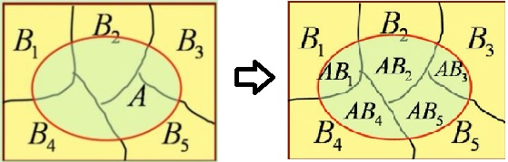

本文主要介绍自然语言处理（Natural Language Process，NLP）的基础，然后介绍 Encoder-Decoder（编码-解码）框架和 BERT 框架。

<!--more-->

---
- [1. NLP 介绍](#1-nlp-介绍)
  - [1.1. 文本表示](#11-文本表示)
  - [1.2. 训练思想](#12-训练思想)
- [2. Encoder-Decoder](#2-encoder-decoder)
  - [2.1. RNN E-D](#21-rnn-e-d)
  - [2.2. RNN E-D with attention](#22-rnn-e-d-with-attention)
- [3. Transformer](#3-transformer)
  - [3.1. 简介](#31-简介)
- [4. 参考文献](#4-参考文献)

# 1. 概率

## 1.1. 概率定义

**条件概率**：$P(A\vert B)$ 在某条件下事件发生的概率。

**先验概率**：指根据以往经验和分析得到的概率，如全概率公式，它往往作为"由因求果"问题中的"因"出现的概率。

**后验概率**：已知原分布，在实际发生某事件时,是原先某情况的可能性。后验概率是信息理论的基本概念之一。后验概率是指在得到“结果”的信息后重新修正的概率，是“执果寻因”问题中的"果"。先验概率与后验概率有不可分割的联系，后验概率的计算要以先验概率为基础。

事情还没有发生，要求这件事情发生的可能性的大小，是先验概率。事情已经发生，要求这件事情发生的原因是由某个因素引起的可能性的大小，是后验概率。

**后验概率是一种条件概率**。一种解释认为，条件概率是个数学名称，后验概率是建模的时候赋予了一定的意义。一般的条件概率，条件和事件可以是任意的；对于后验概率，它限定了事件为隐变量取值，而条件为观测结果。

**联合概率**：$P(AB)$，表示两个事件共同发生的概率。

**边缘概率**：是某个事件发生的概率，而与其它事件无关。在联合概率中，把最终结果中不需要的那些事件合并成其事件的全概率而消失（对离散随机变量用求和得全概率，对连续随机变量用积分得全概率）。这称为边缘化（marginalization）。$A$ 的边缘概率表示为 $P(A)$，$B$ 的边缘概率表示为 $P(B)$。

需要注意的是，在这些定义中 $A$ 与 $B$ 之间不一定有因果或者时间顺序关系。$A$ 可能会先于 $B$ 发生，也可能相反，也可能二者同时发生。$A$ 可能会导致 $B$ 的发生，也可能相反，也可能二者之间根本就没有因果关系。

## 1.2. 条件概率公式

条件概率是指事件 $A$ 在事件 $B$ 发生的条件下发生的概率。

若只有两个事件 $A$，$B$，那么条件概率表示为：$P(A\vert B)$，读作 “$A$ 在 $B$ 发生的条件下发生的概率”。

$$
P(A\vert B) = \frac{P(AB)}{P(B)}
$$

其中，$P(AB)$ 是两个事件的联合概率，$P(B)$ 是事件 $B$ 的边缘概率。

## 1.3. 全概率公式

设 $B_1,...,A_n$ 是样本空间 $S$ 的一个完备事件组，即

- $B_1,...,B_n$ 两两不相容：$B_i \cap B_j = \varnothing\quad (i\neq j)$
- $B_i \cup...\cup B_n = S$

每一次试验中，完备事件组中有且仅有一个事件发生。完备事件组构成样本空间的一个划分。

**全概率公式**。定理：设实验 $E$ 的样本空间为 $S$，$B_1, B_2,...,B_n$ 为 $S$ 的一个划分（完备事件组），且 $P(B_i)>0\quad i=1,2,...n$，$A$ 为 $E$ 的一个事件，则

$$
\begin{aligned}
P(A) &= P(B_1)P(A\vert B_1)+P(B_2)P(A\vert B_2)+...+P(B_n)P(A\vert B_n)\\
&= \sum_{i=1}^n P(B_i)P(A\vert B_i)
\end{aligned}
$$

其推导过程如下，如图：

$$
\begin{aligned}
A &= AS = A(B_1\cup B_2\cup ... \cup B_n)\\
&= AB_1\cup AB_2\cup ... \cup AB_n \quad (AB_i两两互斥)\\
P(A) &= P(AB_1\cup AB_2\cup ... \cup AB_n)\\
&=P(AB_1) + P(AB_2) + ... + P(AB_n)
\end{aligned}
$$

根据条件概率公式

$$
P(AB_i) = P(A)P(B_i\vert A) = P(B_i)P(A\vert B_i)
$$

带入有

$$
P(A) = \sum_{i=1}^n P(B_i)P(A\vert B_i)
$$

即为全概率公式。

**全概率公式的意义1**：将复杂的事件 $A$ 划分为比较简单的事件 $AB_1,...,AB_n$，再结合加法和乘法计算 $A$ 的（边缘）概率。

**全概率公式的意义2**：事件 $A$ 的发生可能有各种原因 $B_i\quad (i=1,2,...,n)$，如果 $A$ 是由 $B_i$ 引起，则此时 $A$ 发生的（条件）概率为

$$
P(AB_i) = P(B_i)P(A\vert B_i)
$$

若每个原因都可能导致 $A$ 的发生，那么 $A$ 发生的概率是全部原因引起其发生的概率的综合，即为全概率公式。

因此可以把全概率公式看成是 “**由原因推结果**”。每一个原因对结果的发生由一定的作用，结果发生的可能性与各种原因的作用大小有关，全概率公式表达了它们之间的关系。

## 贝叶斯公式

设 $B_1,...,A_n$ 是样本空间 $S$ 的一个完备事件组，则对任一事件 $A$，$P(A)>0$，有

$$
P()
$$

# 2. 参考文献

无。