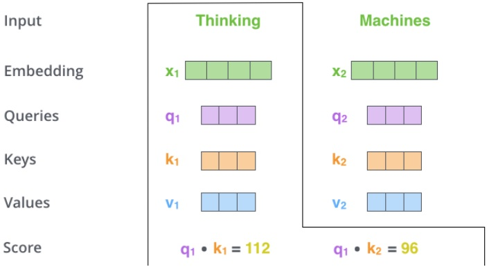
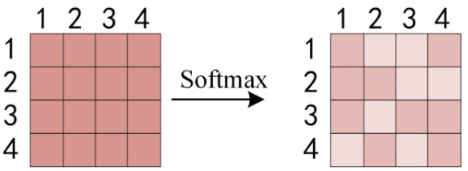

本文主要介绍 seq2seq learning 中的 Transformer 模型，由谷歌提出。建议前序阅读 Encoder-Decoder。

<!--more-->

---
- [1. 简介](#1-简介)
- [2. 总体结构](#2-总体结构)
- [3. Encoder](#3-encoder)
  - [3.1. input](#31-input)
  - [3.2. positional encoding](#32-positional-encoding)
  - [3.3. multi-head attention](#33-multi-head-attention)
    - [3.3.1. self-attention](#331-self-attention)
    - [3.3.2. scaled dot-product attention](#332-scaled-dot-product-attention)
    - [3.3.3. multi-head attention](#333-multi-head-attention)
  - [3.4. 残差连接](#34-残差连接)
- [4. Decoder](#4-decoder)
  - [4.1. encoder-decoder attention](#41-encoder-decoder-attention)
  - [4.2. masked multi-head attention](#42-masked-multi-head-attention)
  - [4.3. output](#43-output)
- [5. 参考文献](#5-参考文献)

# 1. 简介

Transformer 来自 Google 团队 2017 年的文章 **《Attenion Is All You Need》**（https://arxiv.org/abs/1706.03762 ），该文章的目的：减少计算量并且提高并行效率，同时不减弱最终的实验效果。Transformer 在机器翻译任务上的表现超过了 RNN、CNN，只用 encoder-decoder 和 attention 机制就能达到很好的效果，最大的优点是可以高效地并行化。

自 attention 机制提出后，加入 attention 的 seq2seq 模型在各个任务上都有了提升，所以现在的 seq2seq 模型指的都是结合 RNN 和 attention 的模型。之后 google 又提出了解决 seq2seq 问题的 Transformer 模型，用全 attention 的结构代替了 LSTM，在翻译任务上取得了更好的成绩。

# 2. 总体结构

模型结构如下图所示

和大多数 seq2seq 模型一样，transformer 的结构也是由 encoder 和 decoder 组成。Transformer 的 encoder 由 6 个编码器叠加组成，decoder 也由 6 个解码器组成，在结构上都是相同的，但它们不共享权重。图中左边的部分就是 Encoder，由 6 个相同的 layer 组成，layer 指的就是上图左侧的单元，最左边有个 “Nx”，这里是 $x=6$ 个。类似的，途中右边的部分就是 Decoder，同样由 6 个相同的 layer 组成。

从**顶层**看，Transformer 就是一个 Encoder-Decoder 框架的一种实现。

在编码端和解码端，分别堆叠了 6 个编码器 / 解码器。6 这个数字并没由什么特别理由，也可以换成其它数字。编码器和解码器的内部结构大同小异，都包含一个 Self-Attention 模块和一个 Feed Forward 模块，不同的是解码器部分中间还增加了一个 Encoder-Decoder Attention 模块。

# 3. Encoder

下面将目光聚焦到 Encoder，它由两个 sub-layer 组成，分别是

- multi-head **self-attention** mechanism
- fully connected **feed-forward** network

Encoder 的数据流通过程如下

- Input 经过 embedding 后，要做 positional encoding
- 然后是 Multi-head attention
- 再经过 position-wise Feed Forward
- 每个子层之间有残差连接

在这里，我们开始看到 Transformer 的一个关键性质，即每个位置的单词在 encoder 中都有自己的路径，self-attention 层中的这些路径之间存在依赖关系，然而在 feed-forward 层不具有那些依赖关系，这样各种路径在流过 feed-forward 层时可以并行执行。并且，这里每个单词对应的前馈神经网络（feed-forward）都是一样的。

## 3.1. input

首先使用嵌入算法将输入的 word（$x$） 转换为 embedding vector（$\hat x$），这个转换仅在最下方第一个 Encoder 之前发生。在 NLP 任务中，假设每个单词都转化为 $d_{model}=512$ 维的向量，用下图中的 4 个框并排在一起表示。

对于其它 Encoder 而言，同样是输入 512 维的向量，只不过第一个 Encoder 输入的是词嵌入向量，而其它 Encoder 输入其下方 Encoder 的输出向量。包含各个词向量的**列表长度**是一个超参数，一般设为训练数据集中最长句子的长度。

## 3.2. positional encoding

在数据预处理的部分，由于 Transformer 抛弃了卷积（convolution）和循环（recurrence），为了使得模型具备利用句子序列顺序的能力，必须要在词向量中插入一些相对或绝对位置信息。

在RNN（LSTM，GRU）中，时间步长的概念按顺序编码，因为输入/输出流一次一个。 对于 Transformer，作者将时间编码为正弦波，作为附加的额外输入。 这样的信号被添加到输入和输出以表示时间的流逝。下面的连接详细阐述了 positional encoding 的数学原理。

> Amirhossein Kazemnejad. [Transformer Architecture: The Positional Encoding](https://kazemnejad.com/blog/transformer_architecture_positional_encoding/)

Positional Encoding 是一种考虑输入序列中单词顺序的方法。Encoder 为每个输入词向量添加了一个维度与词向量一致（$d_{model}=512$）的位置向量 $PE$，取值范围介于 -1 和 1 之间。这些位置向量符合一种特定模式，可以用来确定每个单词的位置，或者用来提供信息以衡量序列中不同单词之间的距离。

作者提出两种 Positional Encoding 的方法

- 固定方法：用不同频率的 $sine$ 和 $cosine$ 函数直接计算
- 学习方法：学习出一份 positional embedding

经过实验（[Convolutional Sequence to Sequence Learning](https://arxiv.org/abs/1705.03122)）发现两者的结果一样，所以最后选择了第一种方法。

$$
\begin{aligned}
PE_{(pos,2i)} &= sin(pos / 10000^{2i/d_{model}})\\
PE_{(pos,2i+1)} &= cos(pos / 10000^{2i/d_{model}})
\end{aligned}
$$

其中， $pos$ 是词在句子中的位置；$i$ 是位置向量的维度。每个位置向量的分量对应一个正弦或余弦函数。

> Amirhossein Kazemnejad. [Transformer Architecture: The Positional Encoding](https://kazemnejad.com/blog/transformer_architecture_positional_encoding/)
> 
> 为什么会想到用正弦/余弦函数来刻画位置/顺序？假设你想用二进制表示一个数字，会如下图所示
> 
> 可以发现不同位之间的变化率。最低有效位（LSB）在每个数字上交替，第二低位在每两个数字上旋转，依此类推。
> 
> 但是使用二进制值来编码浮点数很浪费空间，因此我们可以使用它们的连续浮动对象-正弦函数。实际上，它们等效于交替位的操作。
> 
> 最终可以得到如下图所示的位置编码
> 
> 
> 为啥要同时用 $sin$ 和 $cos$ ？Amirhossein 个人认为，仅通过同时使用正弦和余弦，才可以将 $sin(x + k)$ 和 $cos(x + k)$ 表示为$sin(x)$ 和 $cos(x)$ 的线性变换。似乎不能对单个正弦或余弦执行相同的操作。

下面详细分析一下位置向量的数学形式。从维度的角度来看，$i=0$ 时第一个维度由波长为 $2\pi$ 的正余弦函数构成。依次往后，第 $i$ 个维度对应的正余弦函数的波长逐渐变长（$10000^{2i/d_{model}}$）。最终波长从 $2\pi$ 到 $10000\cdot 2\pi$。

作者选择正余弦函数的原因，是因为作者认为正余弦函数能够让模型轻松学习相对位置的参与，因为对于任何固定的偏移量 $k$，位置向量 $PE_{pos+k}$ 可以表示为 $PE_{pos}$ 的线性函数

$$
\begin{aligned}
sin(PE_{pos+k}) &= sin(PE_{pos})cos(PE_k)+cos(PE_{pos})sin(PE_k)\\
cos(PE_{pos+k}) &= cos(PE_{pos})cos(PE_k)-sin(PE_{pos})sin(PE_k)\\
\end{aligned}
$$

这种方法相比学习而言还有一个好处，如果采用学习到的 positional embedding（个人认为，没看论文）会像词向量一样受限于词典大小。也就是只能学习到 “位置2对应的向量是 (1,1,1,2) ” 这样的表示。而用正余弦函数明显不受序列长度的限制，也就是可以应对比训练时所用到序列的更长的序列。

当然，正余弦并不是位置编码的唯一方法，只是这个方法能够扩展到看不见的序列长度处，例如当我们要翻译一个句子，这个句子的长度比我们训练集中的任何一个句子都长时。

将上述 positional embedding 可视化后的图如下所示（图中假设 $d_{model}=64$，$l_{sequence}=10$）

最后将 encoding 后的数据与 embedding 数据**求和**，加入相对位置信息。数学上，将 $PE+wordvec$ 作为输入。如下图所示，假设 $wordvec$ 的维度为四个格子，那么实际的 positional encoding 过程如下所示

> Amirhossein Kazemnejad. [Transformer Architecture: The Positional Encoding](https://kazemnejad.com/blog/transformer_architecture_positional_encoding/)
> 
> 为什么用求和，而不是用拼接？即使是 Amirhossein 也没找出背后的理论一句，根据他的推断，因为求和比拼接节约模型参数，因此问题也转化为 “求和有什么弊端么？” Amirhossein 表示没啥弊端。

## 3.3. multi-head attention

### 3.3.1. self-attention

例如我们要翻译：”The animal didn't cross the street because **it** was too tired” 这句话。这句话中的 “it” 是指什么？它指的是 street 还是 animal？这对人类来说是一个简单的问题，但对算法来说并不简单。而 self-attention 让算法知道这里的 it 指的是 animal 。

当模型在处理每个单词时，self-attention 可以帮助模型查看 input 序列中的其他位置，寻找相关的线索，来达到更好的编码效果。它的作用就是将对其他相关单词的“understanding”融入我们当前正在处理的单词中。

RNN 可以通过隐层状态将其已处理的先前单词/向量的表示与正在处理的当前单词/向量相结合，而 self-attention 是 Transformer 将其他相关单词的 “理解” 融入我们当前正在处理的单词所使用的方法。下图展示了在第五个 Encoder 中（最顶层的 Encoder） 将大部分注意力放在了 “animal” 且将其表达融入了对 "it" 的编码。

上图上方的八个不同颜色的方块表示不同的 attention head，后文会讲解。这里以第二个（橙色）attention head 为例展示了其注意力的分布。

> 这是一种双向注意（也是唯一一种双向注意力机制，这就是为什么它是BERT中使用的唯一注意力类型），其中每个单词都彼此关联。 它确实捕获了一个句子中的双上下文信息，甚至bi-LSTM也无法捕获（因为bi-LSTM将Forward AR和Backward AR的结果结合在一起，而不是在其核心生成双上下文信息。 这也是从本质上有些人认为ELMo嵌入不是真正的双向的原因）

### 3.3.2. scaled dot-product attention

首先用向量来描述如何实现 self-attention。这里采用 scaled dot-product attention 来计算 self-attention。

- **第一步**，根据每一个输入的 word embedding （$X \in \mathbb R^{d_{model}}$） 生成三个向量：Query vector（$Q\in \mathbb R^{d_k}$）, Key vector（$K\in \mathbb R^{d_k}$）, Value vector（$V\in \mathbb R^{d_v}$）。这三个向量是由 word embedding 分别乘以三个矩阵得到的。这**三个权重矩阵**（$W^Q \in \mathbb R^{d_{model}\times d_k},W^K \in \mathbb R^{d_{model}\times d_k},W^V \in \mathbb R^{d_{model}\times d_v}$）是需要在训练过程中进行训练的。注意新生成的三个向量的维度（$d_k=64$）小于 word embedding 的维度（$d_{model}=512$）。然而，它们的维度**不必**一定要更小，在这里是作者做出的一种架构选择，使得后面计算 multi-head attention 时在绝大多数情况下更稳定。

 

为什么要产生这三个向量呢？因为它们是计算和考虑注意力的一种有用的抽象。继续往下阅读，看到注意力如何计算时，就会发现这些向量的作用。

> 查询，键和值的概念来自检索系统。例如，当您键入查询以在YouTube上搜索某些视频时，搜索引擎将针对数据库中与候选视频相关的一组键（视频标题，说明等）映射您的查询，然后向您显示最匹配的视频（值）。

- **第二步**，计算一个得分。如果要计算第一个词的 “Thinking” 的 self-attention，我们需要在输入句子的每个单词上对这个单词打分。这个分数决定了当我们在某个位置编码一个单词时，对输入句子其他部分的关注程度（也即句子其它部分对该词的影响）。采用**点乘 $Q$ 和 $K$** 的方式产生对应单词的分数，因此分数是个标量。比如如果我们考虑 “Thinking” 对第一个位置（自身）的 self-attention，那么就计算 $q_1\cdot k_1$，考虑第二个词对 “Thinking” 的 self-attention 则计算 $q_1\cdot k_2$。

 

> 每当需要查找两个向量（查询 $Q$ 和键 $K$）之间的相似性时，我们只需获取它们的点积即可。为了找到第一个单词的相似性输出，我们只考虑第一个单词的表示形式 $Q_i$，并将其与输入中每个单词的表示形式 $K_j$ 取点积。这样，我们就可以知道输入中每个单词相对于第一个单词的关系。

- **第三步**，将分数除以 8 （Key vector 长度 64 的平方根，可以使得梯度计算更稳定，当然也可以用其它数字，但是默认用平方根）。注意，标准的 dot-product attention 没有这一步，作者加了这一步后因此称为 **scaled** dot-product attention 。

- **第四步**，将算得的分数传入 softmax，将其归一化为和为 1 的正数。归一化后的分数代表句子中的每一个词对当前某个位置的表达量。很明显，当前位置所在的词的归一化分数肯定最高，但有时候注意与当前词相关的另一个词是有用的。

 

> 得到相似性后，采用 softmax 归一化，得到每个单词相对第一个单词的（重要性/注意力）权重。
> 
- **第五步**，将 value vector （$V$）与前面计算得到的归一化分数相乘（为求和做准备）。这里的直觉是，保持我们想要关注的单词的值不变，同时淹没不相关的单词（例如，通过将它们乘以像 0.001 这样的小数字）。

- **第六步**，对所有加权后的 value vectors （$V$）求和，得到当前位置（图例对第一个词）的 self-attention 输出。

 

> 将权重（softmax）与相应的表示 $V$ 相乘，然后将它们加起来。因此，我们对第一个单词的最终表示 $Z_i$ 将是所有输入单词的 $V$ 的加权总和，每个输入单词均通过相对于第一个单词的相似性（重要性）加权。

从**数学公式**的角度来看，对于某个具体位置的词，首先比较其 $Q$ 和每个位置 $i$ 的词的 $K$ 的相似度，相似度函数设为 $f$ 那么有

$$
f(Q,K_i),\ i=1,2,...
$$

具体的相似度函数包括以下四种

- 点乘：$f(Q,K_i) = QK_i^T / \sqrt{d_k}$
- 权重：$f(Q,K_i) = QWK_i^T / \sqrt{d_k}$

然后通过 $softmax$ 来计算权重

$$
\omega_i = softmax(f(Q,K_i)) = \frac{e^{f(Q,K_i)}}{\sum_{i=1}^m e^{f(Q,K_i)}},\ i=1,2,...
$$

在实际的实现中，此计算以**矩阵**形式进行，以加快处理速度。作者将整个句子的所有词序列打包成一个矩阵 $Q$，keys 和 values 类似打包成矩阵 $K, V$。与上面的向量形式类似，矩阵形式的 attention 计算结果输出为
 
$$
Attention(Q,K,V) = \omega_iV,\ i=1,2,...
$$

其中

然后按行求 softmax，每行和为 1

得到 softmax 矩阵之后可以和 $V$ 相乘，得到最终的输出 $Z$

上图中 softmax 矩阵的第 1 行表示单词 1 与其他所有单词的 attention 系数，最终单词 1 的输出 $Z_1$ 等于所有单词 $i$ 的值 $V_i$ 根据 attention 系数的比例加在一起得到。**最终得到的 $Z \in \mathbb R^{l_{seq}\times d_v}$ 是该句子中所有单词对当前该单词的值 $V$ 的加权和编码，包含了每个单词对其的重要性（注意力）**。将其与 RNN 或 LSTM 进行比较：

- RNN 或者 LSTM 的隐变量只包含句子前半部分的历史信息，且时间片 $t$ 的计算依赖 $t-1$ 时刻的计算结果，这样限制了模型的并行能力；
- LSTM 只能缓解而无法彻底解决长期依赖；
- BiLSTM 在捕捉上下文信息时，只是简单的将前向的LSTM和后向的LSTM进行拼接，没有很好的融合上下文的信息；（即使是BiLSTM 双向模型，也只是在 loss 处做一个简单的相加，也就是说它是按顺序做推理的，没办法考虑另一个方向的数据）

整个 self-attention 的计算流程图如下图所示

 

除了 scaled dot-product attention 外，作者还提到一种计算 self-attention 的方式，即 additive attention。该方式用一个单隐层的前馈神经网络来计算适应度函数，与 scaled dot-product attention 相比具有相近的计算复杂度，但更慢且稳定性更差（因为 dot-product 可以部署为高度优化的矩阵乘法代码）。

### 3.3.3. multi-head attention

self-attention 是单头的，单头注意力能够将注意力集中在特定的一组单词上。如果我们想拥有多个集合，每个集合对不同的单词集合给予不同的关注呢？

虽然在上面的例子中，$Z$ 包含了**一点点**其他位置的编码，但当前位置的单词还是占主要作用。当我们想知道 “The animal didn’t cross the street because it was too tired” 中 it 的含义时，这时就需要关注到其他位置。这个机制为注意层提供了多个 “表示子空间”。

除了使用参数为 $d_{model}$ 行 $d_{k}=d_{v}=d_{model}/h=64$ 列的 $Q,K,V$ 向量外，作者还增加了一个 multi-headed 机制，可以提升注意力层的性能。它使得模型可以关注不同位置。其中 $h=8$ 为多头的头数。经过 multi-headed ，我们会得到和 heads 数目一样多的 Query / Key / Value 权重矩阵组（$W_i^Q,W_i^K,W_i^V$）。论文中用了 8 个，那么每个encoder/decoder 我们都会得到 8 个集合。这些集合都是随机初始化的，经过训练之后，每个集合会将 input embeddings 投影到不同的表示子空间中。

$$
\begin{aligned}
MultiHead(Q,K,V) = Concat(head_1,...,head_h)W^O\\
where\ head_i = Attention(QW^Q_i,KW^K_i,VW^V_i)
\end{aligned}
$$

其中，$W^Q_i,W^K_i \in \mathbb R^{d_{model}\times d_k}$，$W^V_i \in \mathbb R^{d_{model}\times d_v}$，$W^O\in \mathbb R^{hd_v\times d_{model}}$。

作者使用 $h=8$ 可以降低每个头的权重矩阵维度，这样在类似于单头注意力计算代价（$d_{model}=512$）的前提下得以使用多头注意力。

简单来说，就是随机初始化定义 $h=8$ 组权重矩阵，每个单词会做 8 次上面的 self-attention 的计算，这样每个单词会得到 8 个不同的加权求和 $z_i,\ i=0,1,...,7$ 。

为了和后续前馈层对接（它需要一个矩阵，每个行向量代表一个词，而不是八个矩阵），作者将得到的 8 个矩阵进行拼接，然后乘以一个**附加权重矩阵** $W^O$，从而将其压缩到一个 $Z$ 矩阵。

**可以看到，正如上文所说，multi-head attention 通过最终的向量拼接将输出 $Z$ 重新恢复到了与输入 $X$ 相同的维度，$X,Z \in \mathbb R^{l_{seq}\times d_{model}}$。**

最终的完整流程如下图所示

将所有 8 个 attention heads 的结果放到一张图中展示，如下

整个 multi-headed attention 的流程图如下图所示

## 3.4. 残差连接

实际上，对于 encoder 中的两个模块（self-attention 和 feed-forward），均包含一个残差连接。残差通过一个 Add-Normalize 层与正常输出进行计算。

将 self-attention 模块后面的 add-norm 层展开来看，如下图所示

> 大师兄. [模型优化之Layer Normalization](https://zhuanlan.zhihu.com/p/54530247)
> Batch Normalization (BN) 并不适用于RNN等动态网络和batchsize较小的时候效果不好。Layer Normalization（LN）的提出有效的解决BN的这两个问题。LN和BN不同点是归一化的维度是互相垂直的，如图1所示。在图1中 $N$ 表示样本轴，$C$ 表示通道轴，$F$ 是每个通道的特征数量。BN 如右侧所示，它是取不同样本的同一个通道的特征做归一化；LN 则是如左侧所示，它取的是同一个样本的不同通道做归一化。
> 
> 

残差连接在 decoder 中同样存在。假设一个 2 层堆叠的 transformer，如下图所示

# 4. Decoder

decoder 相比 encoder 采用的是 **masked** multi-head attention，多了一个 encoder-decoder attention，最后还要经过一个 linear 和 softmax 输出概率。

## 4.1. encoder-decoder attention

输入序列经过 encoder 得到输出 $Z$。同时注意到，最上层的 encoder 的输出还包括一组 attention 权重矩阵 $K_{encdec}$ 和 $V_{encdec}$，这些矩阵会用于每个 decoder 的 encoder-decoder attention 层，帮助解码器聚焦在输入序列中合适的位置。**$K,V$ 矩阵有 8 组，怎么得到的？**

重复这个过程，直到 decoder 完成了输出，每个时间步的输出都在下一个时间步时喂入给最底部的 decoder，同样，在这些 decoder 的输入中也加入了位置编码，来表示每个字的位置。

Encoder-Decoder Attention 层的工作方式与 multiheaded self-attention 类似，只是它用下面的层创建其 Queries 矩阵，从编码器栈的输出中获取 Keys 和 Values 矩阵。

## 4.2. masked multi-head attention

解码器中的 self attention 层与编码器中的略有不同。在解码器中，在 self attention 的 softmax 步骤之前，需要将未来的位置设置为 -inf 来屏蔽这些位置，这样做是为了 self attention 层只能关注输出序列中靠前的一些位置，相当于解码时不让其知道当前词之后的词。这样，-inf 经过 softmax 之后就会被置为 0，从而保证仅当前词及前面的词向量的概率和为 1。**注意下图中 【Mask(opt.)】环节。**

## 4.3. output

解码器最后输出的是一个向量，如何把它变成一个单词，这就要靠它后面的线性层和 softmax 层。线性层就是一个很简单的全连接神经网络，将解码器输出的向量映射成一个更长的向量。例如我们有 10,000 个无重复的单词，那么最后输出的向量就有一万维，每个位置上的值代表了相应单词的分数。softmax 层将这个分数转换为了概率，我们选择概率最大的所对应的单词，就是当前时间步的输出。

# 5. 参考文献

[1] Jay Alammar. [The Illustrated Transformer](http://jalammar.github.io/illustrated-transformer/)

[1] 不会停的蜗牛. [图解什么是 Transformer](https://www.jianshu.com/p/e7d8caa13b21)

[2] rumor. [【NLP】Transformer模型原理详解](https://zhuanlan.zhihu.com/p/44121378)

[3] \_zhang_bei\_. [自然语言处理中的Transformer和BERT](https://blog.csdn.net/Zhangbei_/article/details/85036948)

[4] Amirhossein Kazemnejad. [Transformer Architecture: The Positional Encoding](https://kazemnejad.com/blog/transformer_architecture_positional_encoding/)
