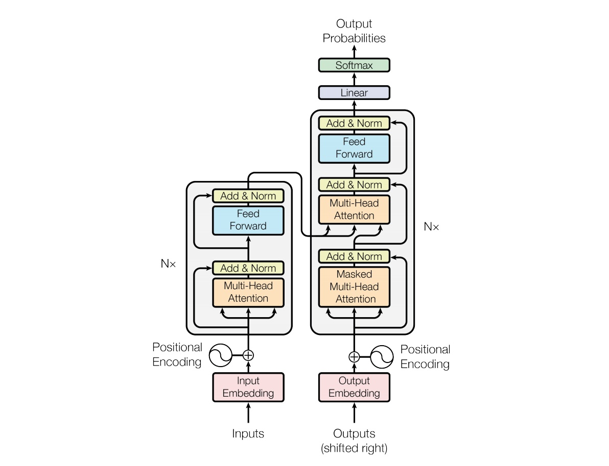

本文主要介绍 seq2seq learning 中的 Transformer 模型，由谷歌提出。

<!--more-->

---
- [1. 简介](#1-简介)
- [2. 总体结构](#2-总体结构)
- [3. Encoder](#3-encoder)
  - [3.1. input](#31-input)
  - [3.2. positional encoding](#32-positional-encoding)
  - [3.3. multi-head attention](#33-multi-head-attention)
    - [3.3.1. self-attention](#331-self-attention)
    - [3.3.2. scaled dot-product attention](#332-scaled-dot-product-attention)
    - [3.3.3. multi-head attention](#333-multi-head-attention)
- [4. 参考文献](#4-参考文献)

# 1. 简介

Transformer 来自 Google 团队 2017 年的文章 **《Attenion Is All You Need》**（https://arxiv.org/abs/1706.03762 ），该文章的目的：减少计算量并且提高并行效率，同时不减弱最终的实验效果。Transformer 在机器翻译任务上的表现超过了 RNN、CNN，只用 encoder-decoder 和 attention 机制就能达到很好的效果，最大的优点是可以高效地并行化。

自 attention 机制提出后，加入 attention 的 seq2seq 模型在各个任务上都有了提升，所以现在的 seq2seq 模型指的都是结合 RNN 和 attention 的模型。之后 google 又提出了解决 seq2seq 问题的 Transformer 模型，用全 attention 的结构代替了 lstm，在翻译任务上取得了更好的成绩。

# 2. 总体结构

模型结构如下图所示

和大多数 seq2seq 模型一样，transformer 的结构也是由 encoder 和 decoder 组成。Transformer 的 encoder 由 6 个编码器叠加组成，decoder 也由 6 个解码器组成，在结构上都是相同的，但它们不共享权重。图中左边的部分就是 Encoder，由 6 个相同的 layer 组成，layer 指的就是上图左侧的单元，最左边有个 “Nx”，这里是 $x=6$ 个。类似的，途中右边的部分就是 Decoder，同样由 6 个相同的 layer 组成。

从**顶层**看，Transformer 就是一个 Encoder-Decoder 框架的一种实现。

在编码端和解码端，分别堆叠了 6 个编码器 / 解码器。6 这个数字并没由什么特别理由，也可以换成其它数字。编码器和解码器的内部结构大同小异，都包含一个 Self-Attention 模块和一个 Feed Forward 模块，不同的是解码器部分中间还增加了一个 Encoder-Decoder Attention 模块。

# 3. Encoder

下面将目光聚焦到 Encoder，它由两个 sub-layer 组成，分别是

- multi-head **self-attention** mechanism
- fully connected **feed-forward** network

Encoder 的数据流通过程如下

- Input 经过 embedding 后，要做 positional encoding
- 然后是 Multi-head attention
- 再经过 position-wise Feed Forward
- 每个子层之间有残差连接

## 3.1. input

首先使用嵌入算法将输入的 word（$x$） 转换为 vector（$z$），这个转换仅在最下方第一个 Encoder 之前发生。在 NLP 任务中，假设每个单词都转化为 $d_{model}=512$ 维的向量，用下图中的 4 个框并排在一起表示。

对于其它 Encoder 而言，同样是输入 512 维的向量，只不过第一个 Encoder 输入的是词嵌入向量，而其它 Encoder 输入其下方 Encoder 的输出向量。包含各个词向量的**列表长度**是一个超参数，一般设为训练数据集中最长句子的长度。

## 3.2. positional encoding

在数据预处理的部分，由于 Transformer 抛弃了卷积（convolution）和循环（recurrence），为了使得模型具备利用句子序列顺序的能力，必须要在词向量中插入一些相对或绝对位置信息。

Positional Encoding 是一种考虑输入序列中单词顺序的方法。Encoder 为每个输入词向量添加了一个维度（$d_{model}=512$）与词向量一致的位置向量 $PE$，取值范围介于 -1 和 1 之间。这些位置向量符合一种特定模式，可以用来确定每个单词的位置，或者用来提供信息以衡量序列中不同单词之间的距离。

作者提出两种 Positional Encoding 的方法，将 encoding 后的数据与 embedding 数据求和，加入了相对位置信息。

- 固定方法：用不同频率的 $sine$ 和 $cosine$ 函数直接计算
- 学习方法：学习出一份 positional embedding

经过实验（[Convolutional Sequence to Sequence Learning](https://arxiv.org/abs/1705.03122)）发现两者的结果一样，所以最后选择了第一种方法。

$$
\begin{aligned}
PE_{(pos,2i)} &= sin(pos / 10000^{2i/d_{model}})\\
PE_{(pos,2i+1)} &= cos(pos / 10000^{2i/d_{model}})
\end{aligned}
$$

其中， $pos$ 是词在句子中的位置；$i$ 是位置向量的维度。每个位置向量的分量对应一个正弦或余弦函数。

下面详细分析一下这个位置向量的形式。从维度的角度来看，$i=0$ 时第一个维度由波长为 $2\pi$ 的正余弦函数构成。依次往后，第 $i$ 个维度对应的正余弦函数的波长逐渐变长（$10000^{2i/d_{model}}$）。最终波长从 $2\pi$ 到 $10000\cdot 2\pi$。作者选择正余弦函数的原因，是因为作者认为正余弦函数能够让模型轻松学习相对位置的参与，因为对于任何固定的偏移量 $k$，位置向量 $PE_{pos+k}$ 可以表示为 $PE_{pos}$ 的线性函数

$$
\begin{aligned}
sin(PE_{pos+k}) &= sin(PE_{pos})cos(PE_k)+cos(PE_{pos})sin(PE_k)\\
cos(PE_{pos+k}) &= cos(PE_{pos})cos(PE_k)-sin(PE_{pos})sin(PE_k)\\
\end{aligned}
$$

这种方法相比学习而言还有一个好处，如果是学习到的 positional embedding，（个人认为，没看论文）会像词向量一样受限于词典大小。也就是只能学习到 “位置2对应的向量是 (1,1,1,2) ” 这样的表示。而用三角公式明显不受序列长度的限制，也就是可以应对比训练时所用到序列的更长的序列。当然这并不是位置编码的唯一方法，只是这个方法能够扩展到看不见的序列长度处，例如当我们要翻译一个句子，这个句子的长度比我们训练集中的任何一个句子都长时。

将上述 positional embedding 可视化后的图如下所示（图中假设 $d_{model}=64$，$l_{sequence}=10$）

最后，将 $PE+wordvec$ 作为输入。如下图所示，假设 $wordvec$ 的维度为四个格子，那么实际的 positional encoding 过程如下所示

## 3.3. multi-head attention

### 3.3.1. self-attention

例如我们要翻译：”The animal didn't cross the street because **it** was too tired” 这句话。这句话中的 “it” 是指什么？它指的是 street 还是 animal？这对人类来说是一个简单的问题，但对算法来说并不简单。而 self-attention 让算法知道这里的 it 指的是 animal 。

当模型在处理每个单词时，self-attention 可以帮助模型查看 input 序列中的其他位置，寻找相关的线索，来达到更好的编码效果。它的作用就是将对其他相关单词的“understanding”融入我们当前正在处理的单词中。

RNN 可以通过隐层状态将其已处理的先前单词/向量的表示与正在处理的当前单词/向量相结合，而 self-attention 是 Transformer 将其他相关单词的 “理解” 融入我们当前正在处理的单词所使用的方法。下图展示了在第五个 Encoder 中（最顶层的 Encoder） 将大部分注意力放在了 “animal” 且将其表达融入了对 "it" 的编码。

### 3.3.2. scaled dot-product attention

首先用向量来描述如何实现 self-attention。这里采用 scaled dot-product attention 来计算 self-attention。

- **第一步**，根据每一个输入的 word embedding 生成三个向量：Query vector（$Q$）, Key vector（$K$）, Value vector（$V$）。这三个向量是由 word embedding 分别乘以三个矩阵得到的。这三个矩阵是需要在训练过程中进行训练的。注意新生成的三个向量的维度（64）小于 word embedding 的维度（512）。然而，它们的维度**不必**一定要更小，在这里是作者做出的一种架构选择，使得 multi-head attention 在绝大多数情况下的计算更稳定。

 

为什么要产生这三个向量呢？因为它们是计算和考虑注意力的一种有用的抽象。继续往下阅读，看到注意力如何计算时，就会发现这些向量的作用。

- **第二步**，计算一个得分。如果要计算第一个词的 “Thinking” 的 self-attention，我们需要在输入句子的每个单词上对这个单词打分。这个分数决定了当我们在某个位置编码一个单词时，对输入句子其他部分的关注程度（也即句子其它部分对该词的影响）。采用**点乘 $Q$ 和 $K$** 的方式产生对应单词的分数，因此分数是个标量。比如如果我们考虑 “Thinking” 对第一个位置（自身）的 self-attention，那么就计算 $q_1\cdot k_1$，考虑第二个词对 “Thinking” 的 self-attention 则计算 $q_1\cdot k_2$。

 

- **第三步**，将分数除以 8 （Key vector 长度 64 的平方根，可以使得梯度计算更稳定，当然也可以用其它数字，但是默认用平方根）。注意，标准的 dot-product attention 没有这一步，作者加了这一步后因此称为 **scaled** dot-product attention 。

- **第四步**，将算得的分数传入 softmax，将其归一化为和为 1 的正数。归一化后的分数代表句子中的每一个词对当前某个位置的表达量。很明显，当前位置所在的词的归一化分数肯定最高，但有时候注意与当前词相关的另一个词是有用的。

  

- **第五步**，将 value vector （$V$）与前面计算得到的归一化分数相乘（为求和做准备）。这里的直觉是，保持我们想要关注的单词的值不变，同时淹没不相关的单词（例如，通过将它们乘以像 0.001 这样的小数字）。

- **第六步**，对所有加权后的 value vectors （$V$）求和，得到当前位置（图例对第一个词）的 self-attention 输出。

  

从**数学公式**的角度来看，对于某个具体位置的词，首先比较其 $Q$ 和每个位置 $i$ 的词的 $K$ 的相似度，相似度函数设为 $f$ 那么有

$$
f(Q,K_i),\ i=1,2,...
$$

具体的相似度函数包括以下四种

- 点乘：$f(Q,K_i) = QK_i^T / \sqrt{d_k}$
- 权重：$f(Q,K_i) = QWK_i^T / \sqrt{d_k}$

然后通过 $softmax$ 来计算权重

$$
\omega_i = \frac{e^{f(Q,K_i)}}{\sum_{i=1}^m e^{f(Q,K_i)}},\ i=1,2,...
$$

最终生成的向量就是发送到前馈神经网络的向量。在实际的实现中，此计算以**矩阵**形式进行，以加快处理速度。作者将整个句子的所有词序列打包成一个矩阵 $Q$，keys 和 values 类似打包成矩阵 $K, V$。与上面的向量形式类似，矩阵形式的 attention 计算结果输出为
 
$$
Attention(Q,K,V) = softmax(\frac{QK^T}{\sqrt{d_k}})V
$$

 

除了 scaled dot-product attention 外，作者还提到一种计算 self-attention 的方式，即 additive attention。该方式用一个单隐层的前馈神经网络来计算适应度函数，与 scaled dot-product attention 相比具有相近的计算复杂度，但更慢且稳定性更差（因为 dot-product 可以部署为高度优化的矩阵乘法代码）。

### 3.3.3. multi-head attention

# 4. 参考文献

[1] Jay Alammar. [The Illustrated Transformer](http://jalammar.github.io/illustrated-transformer/)

[1] 不会停的蜗牛. [图解什么是 Transformer](https://www.jianshu.com/p/e7d8caa13b21)

[2] rumor. [【NLP】Transformer模型原理详解](https://zhuanlan.zhihu.com/p/44121378)

[3] \_zhang_bei\_. [自然语言处理中的Transformer和BERT](https://blog.csdn.net/Zhangbei_/article/details/85036948)
