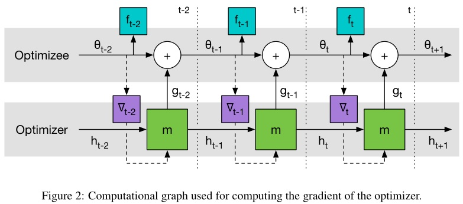

本文介绍了用梯度下降的方法学会了梯度下降的学习方法，用 LSTM 代替传统人设计的诸如RMSprop、ADAM 等优化方法去学习出一个针对特定任务的优化器。

<!--more-->

---
- [1. 简介](#1-简介)
  - [1.1. 迁移学习和泛化](#11-迁移学习和泛化)
  - [1.2. 相关工作](#12-相关工作)
- [2. 采用 RNN 实现学会学习](#2-采用-rnn-实现学会学习)
  - [2.1. 问题框架](#21-问题框架)
  - [2.2. coordinatewise LSTM 优化器](#22-coordinatewise-lstm-优化器)
- [3. 参考文献](#3-参考文献)

# 1. 简介

> Marcin Andrychowicz1, Misha Denil1, Sergio Gómez Colmenarejo, Nando de Freitas, et al. **Learning to learn by gradient descent by gradient descent**[J]. NIPS 2016.

目前深度学习的情况只是输入输出过程是神经网络，但调控神经网络的是人工设计！或者说这个学习机制是人工给定的。

本文解决的是优化算法的学习问题。具体来说，假设目标函数为 $f(\theta)$，机器学习中我们经常可以把优化目标表示成

$$
\theta^*=argmin_{\theta\in \Theta}f(\theta)
$$

对于连续的目标函数，标准的梯度下降序列式如下

$$
\theta_{t+1} - \theta_t - \alpha \nabla f(\theta_t)
$$

优化方面的许多现代工作都基于设计针对特定问题类别的更新规则，不同研究社区之间关注的问题类型不同。比如在深度学习领域，大量研究专门针对高维，非凸优化问题的优化方法，这些促使了**momentum** [Nesterov, 1983, Tseng, 1998], **Rprop** [Riedmiller and Braun, 1993], **Adagrad** [Duchi et al., 2011], **RMSprop** [Tieleman and Hinton, 2012], 和 **ADAM** [Kingma and Ba, 2015] 等优化方法的研究。

上述研究更多的关注各自问题结构本身，但往往存在潜在的较差泛化性能为代价。根据 *No Free Lunch Theorems for Optimization* [Wolpert and Macready, 1997] （天下没有免费的午餐）理论，组合优化设置下，没有一个算法可以绝对好过一个随机策略。因此，将研究局限于特定子问题的方式是 **唯一** 能提高性能的研究手段。

本文另辟蹊径，提出了一种【**基于学习的更新策略**】代替【**人工设计的更新策略**】（用一个可学习的梯度更新规则，替代手工设计的梯度更新规则），称之为（优化）优化器（optimizer） $g$，由其参数 $\phi$ 定义。

- （优化）优化器 optimizer：$g$，参数为 $\phi$
- （原始）优化器 optimizee：参数为 $\theta$

因此原始优化器（optimizee）的参数优化序列式形式为

$$
\theta_{t+1} - \theta_t + g_t ( \nabla f(\theta_t),\phi)
$$

也即用一个 optimizer 来直接给出 optimizee 的参数更新方式（大小和方向）。$g$ 的取值与目标函数 $f$ 的梯度 $\nabla f$ 以及自身参数 $\phi$。文中的 optimizer 采用 RNN 实现，具体而言采用 LSTM 实现。

>  RNN 存在一个可以保存历史信息的隐状态，LSTM 可以从一个历史的全局去适应这个特定的优化过程，LSTM 的参数对每个时刻节点都保持 “聪明”，是一种 “全局性的聪明”，适应每分每秒。

## 1.1. 迁移学习和泛化

【强烈怀疑本节是审稿人要求加的】

这项工作的目的是开发一种构建学习算法的程序，该算法在特定类别的优化问题上表现良好。通过将算法设计演化为学习问题，我们可以通过示例问题实例来指定我们感兴趣的问题类别。这与通常的方法不同，后者通常通过分析来表征有趣问题的特性，并利用这些分析见解来手动设计学习算法。【**个人理解，通过数据驱动来学习设计优化算法，而不是通过人工分析问题来设计优化算法**】

在普通的统计学习中，**泛化** 反映了目标函数在未知点处的行为进行预测的能力。 而在本文中，任务本身就是问题实例，这意味着泛化衡量了在不同问题之间传递知识的能力。问题结构的这种重用通常被称为**迁移学习**，并且通常被视为独立的主题。但是从元学习的观点出发，**我们可以认为迁移学习是一种泛化**，后者在机器学习领域中已有广泛的研究。

深度学习的成功之处就在于，我们可以依赖深度网络的泛化能力，通过学习感兴趣的子结构去适应新样本。本文旨在利用这种泛化能力，还将其从简单的监督学习提升到更广泛的优化设置。

## 1.2. 相关工作

略。

# 2. 采用 RNN 实现学会学习

## 2.1. 问题框架

假设最终的 optimizee 的参数为 $\theta^*(f,\phi)$，即其与 optimizer 参数 $\phi$ 和位置的目标函数 $f$ 有关。

提出以下问题：什么是最好的 optimizer？再次回顾我们最终的目标

$$
\theta^*=argmin_{\theta\in \Theta}f(\theta)
$$

给定一个目标函数 $f$ 的分布，那么 optimizer 的损失定义为

$$
\mathcal L(\phi) = \mathbb E_f[f(\theta^*)]
$$

这里详细解读一下，对于某个具体的任务

- 目标函数 $f$ 可以定义为比如 $f(\theta)=\vert\vert W\theta-y \vert\vert_2^2$，其中 $W,y\in \mathbb R^{10} \sim i.i.d\ Gaussian\ distribution$，训练时从该分布中采样 $f$，测试时也从该分布采样新的 $f$
- 最终优化后的 optimizee 的参数为 $\theta^*(f,\phi)$
- 那么对应的最终的损失为 $f(\theta^*(f,\phi))$
- 因此 optimizer 的损失就是上述最终损失的期望 $\mathbb E_f[f(\theta^*(f,\phi))]$

注意，最终最优的参数 $\theta^*$ 我们还并不知道，它是通过一个优化过程得到的。

假设经过 $T$ 次优化步骤，那么更加方便的做法是将 optimizer 的损失定义为整个优化过程的损失的加权和

$$
\mathcal L(\phi) = \mathbb E_f\left[ \sum_{t=1}^T\omega_tf(\theta_t) \right]
$$

其中

$$
\theta_{t+1} = \theta_t+g_t
$$

$$
[ g_t,h_{t+1} ] = {\rm lstm}(\nabla_t,h_t,\phi)
$$

$\omega \in \mathbb R_{\geq0}$ 是各个优化时刻的任意权重，$\nabla_t = \nabla_\theta f(\theta_t)$。

当 $t=T$ 且 $\omega_t = 1$ 时

$$
\mathcal L(\phi) = \mathbb E_f[f(\theta^*(f,\phi))] = \mathbb E_f\left[ \sum_{t=1}^T\omega_tf(\theta_t) \right]
$$

对上面的过程进行详细解读：

- **Meta-optimizer 优化器**：目标函数整个优化周期的 loss 都要很小（加权和），而且这个目标函数是独立同分布采样的（这里意味着任意初始化一个优化问题模型的参数，我们都希望这个优化器能够找到一个优化问题的稳定的解）
- **传统优化器**：对于当前的目标函数，只要这一步的 loss 比上一步的 loss 值要小就行

可以用 GD 来最小化 $\mathcal L(\phi)$，梯度估计 $\partial \mathcal L(\phi)/\partial\phi$ 可以通过采样随机的 $f$ 然后对计算图进行反向传播来求解。我们允许梯度沿着实线反传，但是丢弃了沿着虚线的路径。这种考虑相当于假设 $\partial \nabla_t/\partial \phi = 0$，这样可以避免计算 $f$ 的二阶导。

从上面 LSTM 优化器的设计来看，我们几乎没有加入任何先验的人为经验在里面，只是用了长短期记忆神经网络的架构，优化器本身的参数 $\phi$ 即 LSTM 的参数，这个优化器的参数代表了我们的更新策略，后面我们会学习这个参数，即学习用什么样的更新策略。

## 2.2. coordinatewise LSTM 优化器

> One challenge in applying RNNs in our setting is that we want to be able to optimize at least tens of thousands of parameters. Optimizing at this scale with a fully connected RNN is not feasible as it would require a huge hidden state and an enormous number of parameters. To avoid this difficulty we will use an optimizer m which operates coordinatewise on the parameters of the objective function, similar to other common update rules like RMSprop and ADAM. **This coordinatewise network architecture allows us to use a very small network that only looks at a single coordinate to define the optimizer and share optimizer parameters across different parameters of the optimizee**.

采用 RNN（LSTM） 的一大挑战就是，我们想要优化成千上万的参数。采用全连接 RNN 需要巨大的隐层（与输入向量 $\theta$ 同维度，假设为 $n$）和巨量的参数（$W_f, W_i, W_o\in \mathbb R^{n\times n}$），这是不现实的。为了克服这一点，我们采用了类似 RMSprop 和 ADAM 的方式，设计一个优化器 $m$，对目标函数的参数进行按维度操作。具体而言，每次只对 optimizee 的**一个参数** $\theta_i$ 进行优化，这样只需要维持一个很小的 lstm 就可以完成工作了。

# 3. 参考文献

[1] 大师兄. [BERT详解](https://zhuanlan.zhihu.com/p/48612853)

[1] 不会停的蜗牛. [图解什么是 Transformer](https://www.jianshu.com/p/e7d8caa13b21)

[2] rumor. [【NLP】Transformer模型原理详解](https://zhuanlan.zhihu.com/p/44121378)

[3] \_zhang_bei\_. [自然语言处理中的Transformer和BERT](https://blog.csdn.net/Zhangbei_/article/details/85036948)

[4] Amirhossein Kazemnejad. [Transformer Architecture: The Positional Encoding](https://kazemnejad.com/blog/transformer_architecture_positional_encoding/)
