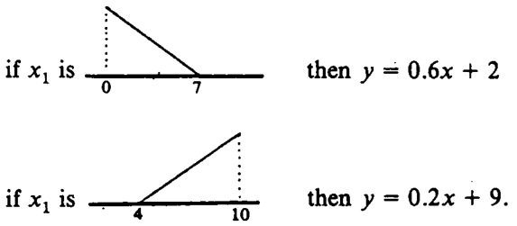
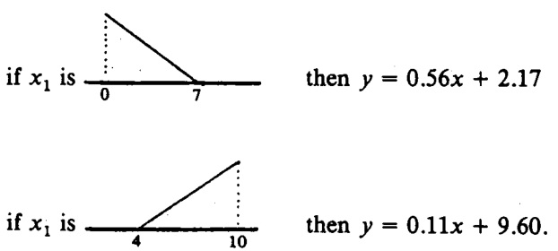
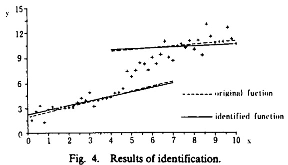
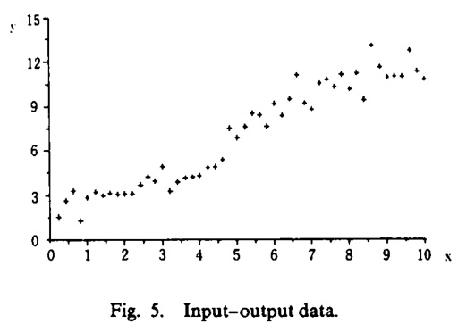
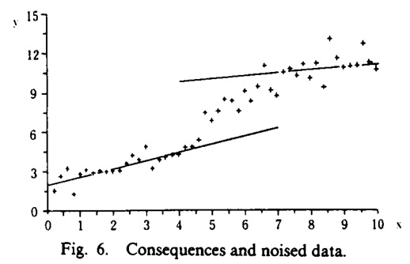
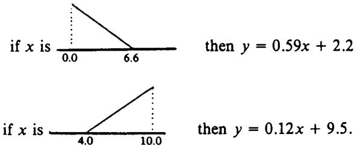
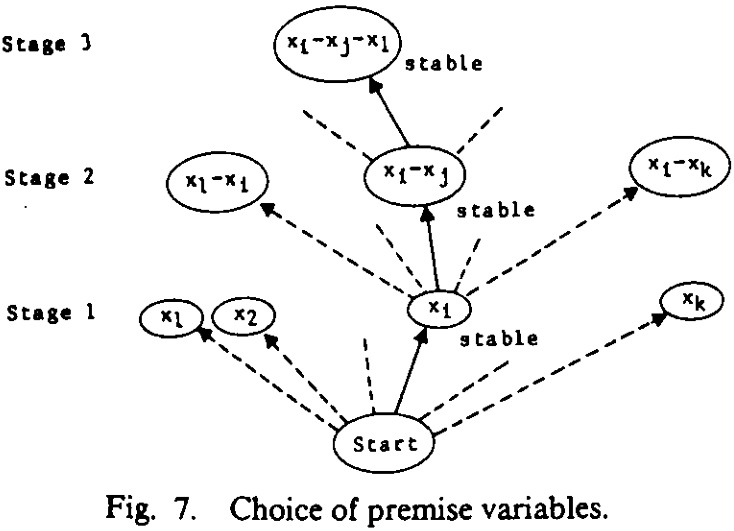

本文介绍了 TS 型模糊系统，由 Takagi 和 Sugeno 两位学者在 1985 年提出，主要思想是将非线性系统用许多线段相近的表示出来，即将复杂的非线性问题转化为在不同小线段上的问题。

<!--more-->

---
- [1. TS 模糊系统](#1-ts-模糊系统)
  - [1.1. 推理过程](#11-推理过程)
  - [1.2. 特性](#12-特性)
  - [1.3. 辨识算法](#13-辨识算法)
    - [1.3.1. 结论参数辨识](#131-结论参数辨识)
    - [1.3.2. 前提参数辨识](#132-前提参数辨识)
    - [1.3.3. 前提变量的选择](#133-前提变量的选择)
  - [1.4. 广义 TS 模糊系统](#14-广义-ts-模糊系统)
- [2. 参考文献](#2-参考文献)

# 1. TS 模糊系统

> Tomohiro Takagi and Michio Sugeno. **Fuzzy Identification of Systems and Its Applications to Modeling and Control**[J]. Fuzzy Identification of Systems, 1993.

> A mathematical tool to build a fuzzy model of a system where fuzzy implications and reasoning are used is presented in this paper. The premise of an implication is the description of fuzzy subspace of inputs and its consequence is a linear input-output relation. The method of identification of a system using its input-output data is then shown. Two applications of the method to industrial processes are also discussed: a water cleaning process and a converter in a steel-making process.

TS 模糊模型是由多个线性系统对同一个非线性系统进行拟合，利用模糊算法进行输入变量的解构，通过模糊演算推理再去模糊化，生成数条代表每组输入与输出关系的方程。

假设模糊集为 $A$，隶属度函数为 $A(x)$，$x$ 属于某论域 $X$。“$x$ 属于 $A$ 且 $y$ 属于 $B$” 表达为

$$
\vert x\ is\ A\ and\ y\ is\ B \vert = A(x) \land B(y)
$$

对于离散系统模型，令 $R_i$ 表示模糊系统的第 $i$ 条规则，其一阶 TS 模糊系统典型的模糊蕴含条件（Implication）句为

$$
R_i:\quad IF\quad f(x_1\ is\ A_1,\ \cdots,\ x_k\ is\ A_k)\quad THEN\quad y = g(x_1, \cdots, x_k)
$$

在实际应用中，$f$ 为 $and$ 连接符，$g$ 为线性函数，即

$$
R:\quad IF\quad x_1\ is\ A_1\ and\ \cdots\ and\ x_k\ is\ A_k\quad THEN\quad y = p_0+p_1x_1+\cdots+p_kx_k)
$$

## 1.1. 推理过程

假设有 3 个上述格式的蕴含条件 $R_i,\ i=1,\cdots,3$，分别为

$$
\begin{aligned}
R_1:&\quad IF\quad x_1\ is\ small_1\ and\ x_2\ is\ small_2 & \quad THEN \quad y=x_1+x_2\\
R_2:&\quad IF\quad x_1\ is\ big_1\ & \quad THEN \quad y=2x_1\\
R_2:&\quad IF\quad x_2\ is\ big_2\ & \quad THEN \quad y=3x_2
\end{aligned}
$$

前提（Premise）中涉及到的隶属度函数定义为

假设输入 $x_1=12, x_2=5$，那么三个前提下的结论（Consequence）为

$$
\begin{aligned}
y_1 &= x_1+x_2 = 17\\
y_2 &= 2x_1 = 24\\
y_3 &= 3x_2 = 15
\end{aligned}
$$

相应的三个真值（True Value）为

$$
\begin{aligned}
t_1 &= small_1(x_1)\land small_2(x_2) = 0.25\land 0.375 = 0.25\\
t_2 &= big_1(x_1) = 0.2\\
t_3 &= big_2(x_2) = 0.375
\end{aligned}
$$

那么最终 $y$ 的取值为（此处采用加权平均法）

$$
y = \frac{t_1y_1+t_2y_2+t_3y_3}{t_1+t_2+t_3} \approx 17.8
$$

用一张表格可以列写如下

## 1.2. 特性

优点：

- 相比分段线性逼近，数学形式更紧凑，连接处比较平滑；
- 相比原始的非线性函数，更加简明，方便进一步处理；
- 模糊划分可以包含有意义的语义条件，方便的讲人类语言规则形式表达的先验知识融入到模型建立过程中（模糊逻辑的功效）；
- 万能逼近定律表明 TS 模糊系统能以任意精度逼近非线性模型，适用于广泛类型的非线性系统。

另一方面，TS 模糊系统存在以下问题

- 隶属度函数全部由直线组成，不具备自适应性
- 不能保证参数的最优性
- 模糊规则数目无法最佳确定，即无法预知模型的复杂程度

## 1.3. 辨识算法

需要确定以下三个部分

- $x_i, \cdots, x_k$，前提变量；
- $A_1,\cdots,A_k$，隶属度函数的参数，简记为隶属度参数；
- $p_0, p_1,\cdots,p_k$，结论中的参数。

注意，前提中的变量不需要全部出现。前两个部分的确定和变量如何划分到模糊子空间有关，最后一个部分与模糊子空间中如何描述输入输出关系有关。论文作者提出依次逐层考虑如何确定。

### 1.3.1. 结论参数辨识

假设一个一般的系统（$n$ 条规则）表示如下

$$
\begin{aligned}
R_1:&\quad IF\quad x_1\ is\ A_1^1,\ \cdots,\ x_k\ is\ A_k^1\\
&\quad THEN\quad y=p_0^1 + p_1^1\cdot x_1+\cdots+p^1_k\cdot x_k\\
&\quad \vdots\\
R_n:&\quad IF\quad x_1\ is\ A_1^n,\ \cdots,\ x_k\ is\ A_k^n\\
&\quad THEN\quad y=p_0^n + p_1^n\cdot x_1+\cdots+p^n_k\cdot x_k\\
\end{aligned}
$$

那么输出为

$$
y = \frac{\sum_{i=1}^n (A_1^i(x_1)\land\cdots\land A_k^i(x_k))\cdot(p_0^i+p_1^ix_1+\cdots+p_k^ix_k)}{\sum_{i=1}^n (A_1^i(x_1)\land\cdots\land A_k^i(x_k))}
$$

假设

$$
\beta_i = \frac{A_1^i(x_1)\land\cdots\land A_k^i(x_k)}{\sum_{i=1}^n (A_1^i(x_1)\land\cdots\land A_k^i(x_k))}
$$

那么

$$
y = \sum_{i=1}^n\beta_i(p_0^i+p_1^ix_1+\cdots+p_k^ix_k)
$$

当给定一组输入输出数据 $x_{1j},\cdots,x_{kj}\rightarrow y_j\ (j=1,\cdots,m)$ 时，可以通过最小二乘法来确定参数 $p_0^i, p_1^i,\cdots,p_k^i$。

> 最小二乘法：在实验中获得了自变量与因变量的若干组对应数据，在使偏差平方和取最小值时，找出一个已知类型的函数（即确定关系式中的参数）的方法。

经过 TS 模糊系统的推理后得到输出的估计为

$$
\begin{aligned}
\hat y_1 &= \sum_{i=1}^n\beta_{i1}(p_0^i+p_1^ix_{11}+\cdots+p_k^ix_{k1})\\
\hat y_2 &= \sum_{i=1}^n\beta_{i2}(p_0^i+p_1^ix_{12}+\cdots+p_k^ix_{k2})\\
&\cdots\\
\hat y_m &= \sum_{i=1}^n\beta_{im}(p_0^i+p_1^ix_{1m}+\cdots+p_k^ix_{km})\\
\end{aligned}
$$

对于其中第 $j$ 个式子，展开如下

$$
\begin{aligned}
\hat y_j &= \sum_{i=1}^n\beta_{ij}(p_0^i+p_1^ix_{1j}+\cdots+p_k^ix_{kj})\\
&= (\beta_{1j}p_0^1+\cdots+\beta_{nj}p_0^n)+(\beta_{1j}p_1^1+\cdots+\beta_{nj}p_1^n)x_{11}+\cdots\\
&= [\beta_{1j},\cdots,\beta_{nj}][p_0^1,\cdots,p_0^n]^T+[\beta_{1j}x_{11},\cdots,\beta_{nj}x_{11}][p_1^1,\cdots,p_1^n]^T+\cdots\\
&=\begin{bmatrix}
  \beta_{1j}\cdots\beta_{nj},\quad \beta_{1j}x_{11}\cdots\beta_{nj}x_{11},\quad \cdots
\end{bmatrix}
\begin{bmatrix}
  p_0^1\\
  \vdots\\
  p_0^n\\
  \\
  p_1^1\\
  \vdots\\
  p_1^n\\
  \\
  \vdots
\end{bmatrix}
\end{aligned}
$$

其中

$$
\beta_{ij} = \frac{A_{i1}(x_{1j})\land\cdots\land  A_{ik}(x_{kj})}{\sum_j A_{i1}(x_{1j})\land\cdots\land A_{ik}(x_{kj})}
$$

将上式的 $j$ 在 $[1,m]$ 上展开，可写成矩阵形式。假设 $X\in \mathbb R^{m\times n(k+1)}$，$Y,\hat Y\in \mathbb R^{m}$，$P\in \mathbb R^{n(k+1)}$，则

$$
\begin{aligned}
X &= \begin{bmatrix}
\beta_{11}\cdots\beta_{n1},\ \beta_{11}x_{11}\cdots\beta_{n1}x_{11},\ \cdots,\ beta_{11}x_{k1}\cdots\beta_{n1}x_{k1}\\
\cdots\\
\beta_{1m}\cdots\beta_{nm},\ \beta_{11}x_{1m}\cdots\beta_{nm}x_{1m},\ \cdots,\ \beta_{1m}x_{km}\cdots\beta_{nm}x_{km}
\end{bmatrix}\\
Y &= [y_1,\cdots,y_m]^T\\
\hat Y &= [\hat y_1,\cdots,\hat y_m]^T\\
P&=[p_0^1\cdots p_0^n,\cdots p_1^1\cdots p_1^n,\cdots,p_k^1\cdots p_k^n]^T
\end{aligned}
$$

$m$ 表示样本个数（$X,Y$ 的行数），$n$ 表示规则个数，$n(k+1)$ 表示待估计的特征参数 $P$ 的个数。

用矩阵形式表达的推理过程变为

$$
\hat Y = XP
$$

损失函数定义为

$$
J(P) = \frac{1}{2}(\hat Y-Y)^T(\hat Y-Y)= \frac{1}{2}(XP-Y)^T(XP-Y)
$$

根据最小二乘法原理，将损失函数对待估计参数求导取 0，结果为（组内大神推导表示无误）

> Eureka机器学习读书笔记. [最小二乘法（least sqaure method）](https://zhuanlan.zhihu.com/p/38128785/)

$$
\begin{aligned}
&\frac{\partial}{\partial P}J(P)= X^T(XP-Y)=0\\
&\Rightarrow X^TXP=X^TY\Rightarrow P=(X^TX)^{-1}X^TY
\end{aligned}
$$

即得到最小二乘法的标准解析解

$$
P=(X^TX)^{-1}X^TY
$$

如果能够提供足够数量的无噪声样本数据，最小二乘法可以精确估计出原始问题的真实参数。

**如果数据有噪声**，则采用稳态卡尔曼滤波（原文 stable-state，现在一般用 steady-state）来估计 $P$。稳态卡尔曼滤波可以计算出线性代数方程中的参数，使得均方差最小。

假设 $X$ 矩阵的第 $i$ 行为 $x_i$，$Y$ 的第 $i$ 个元素为 $y_i$，那么 $P$ 可以通过下面的式子递归估计（**涉及卡尔曼滤波的知识，还没看，假设就能估计出来了**）

$$
\begin{aligned}
P_{i+1} &= P_i + S_{i+1}\cdot x_{i+1}\cdot(y_{i+1}-x_{i+1}\cdot P_i)\\
S_{i+1} &= S_i-\frac{S_i\cdot x_i+x_{i+1}\cdot P_i}{1+x_{i+1}\cdot S\cdot x_{i+1}^T},\quad i=0,1,\cdots,m-1\\
P &= P_m
\end{aligned}
$$

初值为

$$
\begin{aligned}
P_0 &= 0\\
S_0 &= \alpha\cdot I\quad(\alpha=big\ number)
\end{aligned}
$$

最后给出一个例子。假设系统为

在将模型的前提固定为原始系统的前提的情况下，将噪声添加到数据中，可以从输入输出数据中识别出后果，如下所示。

下图展示了包含噪声的输入输出数据，原始结论和辨识出的结论。

### 1.3.2. 前提参数辨识

在本节中，我们说明如何确定前提中的模糊集，即在**前提变量已经选定**的情况下，如何将前提变量的空间划分为模糊子空间（包括确定规则个数和确定每个规则中的模糊集/隶属度函数参数），但是规则个数作者只是一笔带过。

如上图所示，根据图中的输入输出数据来划分 $x$ 的模糊子空间，比如 `x is small` 或者 `x is big`。即可设计如下两个规则

$$
\begin{aligned}
IF\ x\ is\ small\ THEN\ y=a_1x+b_1\\
IF\ x\ is\ big\ THEN\ y=a_2x+b_2\\
\end{aligned}
$$

然后需要确定 `small` 和 `big` 的隶属度函数，以及结论中的 $a_1,a_2,b_1,b_2$。

问题转变为，找寻隶属度函数的最优参数，使得性能指标最优。步骤如下

- 固定模糊集参数，通过上一节的方法得到最优的结论参数估计；
- 找寻隶属度函数的最优参数使得性能指标最优的问题可简化为一个非线性规划问题。作者采用著名的  **complex method for the minimization**（著名到我居然不认识）求解。由于传统的 TS 模糊系统的隶属度函数是线性的，因此用两个参数（分别对应取值为 0 和 1 的隶属度值）就能确定。

例子：使用从假定系统中收集的带有噪声的输入输出数据进行的识别，噪声的标准差是输出值的 5% 。

注意，如果不存在噪音，我们可以识别与原始系统相同的所有前提参数。指出这个事实非常重要。如果不是这种情况，我们就不能与模糊系统描述语言一起主张识别算法的有效性。

假设原始系统描述如下

结论和带噪音的输入输出数据如下图所示。

所识别的前提参数如下。我们可以看到已经推导出几乎相同的参数。

### 1.3.3. 前提变量的选择

上一节假设前提变量已经给定。但是如何确定前提中用到哪些变量？因为给定的输入量 $x$ 可以不全用在前提中。

本质上包括两个问题：

- 选择哪些变量：选择一个变量意味着它的空间要被划分；
- 划分出多少子空间；

两个问题是有组合关系的，所以一般而言没有理论方法解决（The whole problem is a combinatorial one. So in general there seems no theoretical approach available）。作者提出一种启发式搜索方法，包含以下步骤：

假设一个包含 $k$ 个输入和 1 个输出的模糊系统。

- **步骤 1**：只划分 $x_1$ 为 `big` 和 `small`，其它分量不划分，意味着只有 $x_1$ 出现在前提中，其它分量不出现。那么模型规则如下
  
  $$
  \begin{aligned}
    IF\ x_1\ is\ big_1\ THEN\ \cdots\\
    IF\ x_1\ is\ small_1\ THEN\ \cdots\\
  \end{aligned}
  $$

  称上述模型为 模型 1-1，类似的，只划分第 $i$ 个分量的情况称为 模型 1-$i$。这样可以得到 $k$ 个模型，每个模型包含两个模糊蕴含条件（规则）。

- **步骤 2**：对上述每一个模型，用前面所述的方法确定最优的前提参数和结论参数。挑出其中性能指标最低的模型，作为稳定状态（stable state）。
- **步骤 3**：从前面的稳定状态出发，比如 模型 1-$i$，对所有分量 $x_i - x_j$ 进行排列组合，每个分量划分为 2 个模糊子空间。特别地，$x_i - x_i$ 组合将 $x_i$ 划分为 4 个模糊子空间，比如 `small, medium small, medium big, big`。这样又得到 $k$ 个模型，称为 模型 2-j。再次挑出其中性能指标最小的一个模型。
- **步骤 4**：重复**步骤 3**，往里再次添加一个其它分量。当满足下列任一条件时搜索停止：
  - 性能指标小于预设值；
  - 模糊蕴含条件的个数大于预设值；

整个过程如图所示

## 1.4. 广义 TS 模糊系统

将 TS 模糊系统进行规范化描述如下。

给定 $m$ 个输入向量 $x_1,\cdots,x_m$，$n$ 条模糊规则为 $R_1,\cdots,R_n$，第 $i$ 条模糊规则的模糊子集分别为 $A^i_1,\cdots,A^i_m$（相应的隶属度函数为 $A^i_j(x_j)$），各个模糊规则的真值为 $G_1, \cdots, G_n$，各个模糊规则对应的结论为 $y_1,\cdots,y_n$，最终输出为 $y$，那么采用加权平均法的 TS 模糊系统为

$$
\begin{aligned}
y &= \frac{\sum_{i=1}^n G_iy_i}{\sum_{i=1}^n G_i}\\
G_i &= \prod_{j=1}^m A^i_j(x_j)
\end{aligned}
$$

其中 $\prod$ 为模糊化算子，通常采取**取小** "$\land$" 或者 **代数积** "$\cdot$" 计算。

若隶属度函数采用高斯隶属度函数形式，则可得到具有 $m$ 输入单输出、模糊规则数为 $n$ 的广义 TS 模糊系统（未能找到出处）

$$
\begin{aligned}
y &= \frac{\sum_{i=1}^n G_iy_i}{\sum_{i=1}^n G_i}\\
G_i &= \prod_{j=1}^m A^i_j(x_j) = \prod_{j=1}^m exp{(-\left\vert\frac{x_j - b_j^i}{a_j^i}\right\vert)}
\end{aligned}
$$

广义 TS 模糊系统可以以任意精度逼近被控对象，而模型的参数可以通过参数辨识方法获得。

# 2. 参考文献

无。