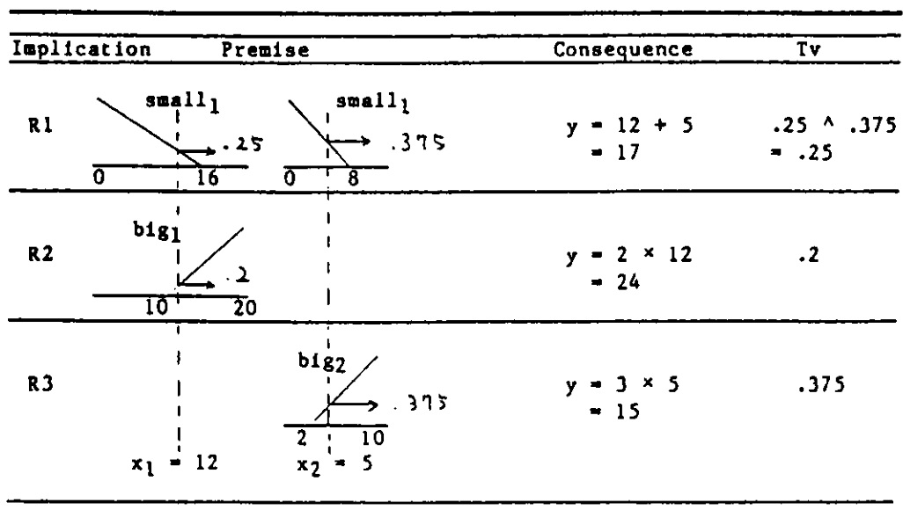
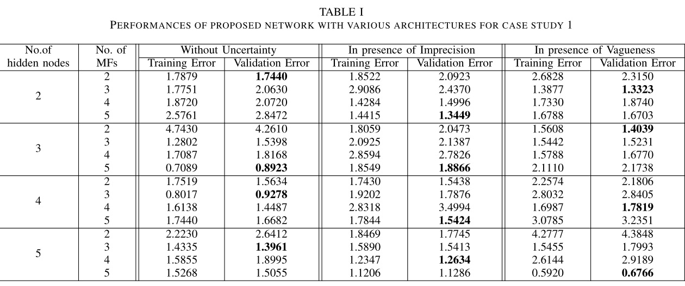
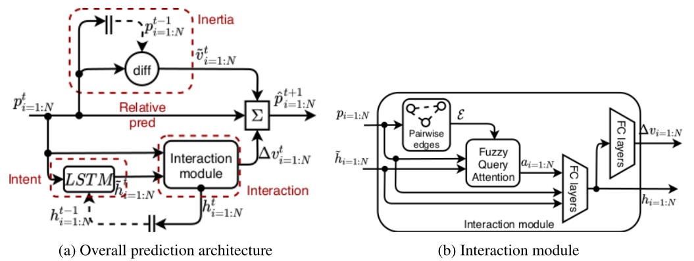

本文介绍了 TS 型模糊系统，由 Takagi 和 Sugeno 两位学者在 1985 年提出，主要思想是将非线性系统用许多线段相近的表示出来，即将复杂的非线性问题转化为在不同小线段上的问题。

<!--more-->

---
- [1. TS 模糊系统](#1-ts-模糊系统)
  - [1.1. 推理过程](#11-推理过程)
  - [1.2. 特性](#12-特性)
  - [1.3. 辨识算法](#13-辨识算法)
- [2. 广义 TS 模糊系统](#2-广义-ts-模糊系统)
- [3. TS 深度模糊网络](#3-ts-深度模糊网络)
  - [3.1. 网络结构](#31-网络结构)
  - [3.2. 网络参数辨识](#32-网络参数辨识)
    - [3.2.1. 前向传播](#321-前向传播)
    - [3.2.2. 反向传播](#322-反向传播)
  - [3.3. 实验](#33-实验)
    - [3.3.1. 准备工作](#331-准备工作)
    - [3.3.2. 算例 1](#332-算例-1)
    - [3.3.3. 算例 2](#333-算例-2)
    - [3.3.4. 分析](#334-分析)
- [4. Trajectory Prediction](#4-trajectory-prediction)
  - [4.1. 归纳偏置](#41-归纳偏置)
  - [4.2. 预测架构](#42-预测架构)
  - [4.3. 交互模块](#43-交互模块)
  - [4.4. 模糊查询注意力模块](#44-模糊查询注意力模块)
  - [分析](#分析)
  - [训练](#训练)
  - [实验](#实验)
- [5. TS 模糊控制](#5-ts-模糊控制)
- [6. 参考文献](#6-参考文献)

# 1. TS 模糊系统

> Tomohiro Takagi and Michio Sugeno. **Fuzzy Identification of Systems and Its Applications to Modeling and Control**[J]. Fuzzy Identification of Systems, 1993.

> A mathematical tool to build a fuzzy model of a system where fuzzy implications and reasoning are used is presented in this paper. The premise of an implication is the description of fuzzy subspace of inputs and its consequence is a linear input-output relation. The method of identification of a system using its input-output data is then shown. Two applications of the method to industrial processes are also discussed: a water cleaning process and a converter in a steel-making process.

TS 模糊模型是由多个线性系统对同一个非线性系统进行拟合，利用模糊算法进行输入变量的解构，通过模糊演算推理再去模糊化，生成数条代表每组输入与输出关系的方程。

假设模糊集为 $A$，隶属度函数为 $A(x)$，$x$ 属于某论域 $X$。“$x$ 属于 $A$ 且 $y$ 属于 $B$” 表达为

$$
\vert x\ is\ A\ and\ y\ is\ B \vert = A(x) \land B(y)
$$

对于离散系统模型，令 $R_i$ 表示模糊系统的第 $i$ 条规则，其一阶 TS 模糊系统典型的模糊蕴含条件（Implication）句为

$$
R_i:\quad if\quad f(x_1\ is\ A_1,\ \cdots,\ x_k\ is\ A_k)\quad then\quad y = g(x_1, \cdots, x_k)
$$

在实际应用中，$f$ 为 $and$ 连接符，$g$ 为线性函数，即

$$
R:\quad if\quad x_1\ is\ A_1\ and\ \cdots\ and\ x_k\ is\ A_k\quad then\quad y = p_0+p_1x_1+\cdots+p_kx_k)
$$

## 1.1. 推理过程

假设有 3 个上述格式的蕴含条件 $R_i,\ i=1,\cdots,3$，分别为

$$
\begin{aligned}
R_1:&\quad if\quad x_1\ is\ small_1\ and\ x_2\ is\ small_2 & \quad then \quad y=x_1+x_2\\
R_2:&\quad if\quad x_1\ is\ big_1\ & \quad then \quad y=2x_1\\
R_2:&\quad if\quad x_2\ is\ big_2\ & \quad then \quad y=3x_2
\end{aligned}
$$

前提（Premise）中涉及到的隶属度函数定义为

假设输入 $x_1=12, x_2=5$，那么三个前提下的结论（Consequence）为

$$
\begin{aligned}
y_1 &= x_1+x_2 = 17\\
y_2 &= 2x_1 = 24\\
y_3 &= 3x_2 = 15
\end{aligned}
$$

相应的三个真值（True Value）为

$$
\begin{aligned}
t_1 &= small_1(x_1)\land small_2(x_2) = 0.25\land 0.375 = 0.25\\
t_2 &= big_1(x_1) = 0.2\\
t_3 &= big_2(x_2) = 0.375
\end{aligned}
$$

那么最终 $y$ 的取值为（此处采用加权平均法）

$$
y = \frac{t_1y_1+t_2y_2+t_3y_3}{t_1+t_2+t_3} \approx 17.8
$$

用一张表格可以列写如下

## 1.2. 特性

优点：

- 相比分段线性逼近，数学形式更紧凑，连接处比较平滑；
- 相比原始的非线性函数，更加简明，方便进一步处理；
- 模糊划分可以包含有意义的语义条件，方便的讲人类语言规则形式表达的先验知识融入到模型建立过程中（模糊逻辑的功效）；
- 万能逼近定律表明 TS 模糊系统能以任意精度逼近非线性模型，适用于广泛类型的非线性系统。

另一方面，TS 模糊系统存在以下问题

- 隶属度函数全部由直线组成，不具备自适应性
- 不能保证参数的最优性
- 模糊规则数目无法最佳确定，即无法预知模型的复杂程度

## 1.3. 辨识算法

需要确定以下三个部分

- $x_i, \cdots, x_k$，前提变量；
- $A_1,\cdots,A_k$，隶属度函数的参数，简记为隶属度参数；
- $p_0, p_1,\cdots,p_k$，结论中的参数。

注意，前提中的变量不需要全部出现。前两个部分的确定和变量如何划分到模糊子空间有关，最后一个部分与模糊子空间中如何描述输入输出关系有关。论文作者提出依次逐层考虑如何确定。

假设一个一般的系统表示如下

$$
\begin{aligned}
R_1:&\quad if\quad x_1\ is\ A_1^1,\ \cdots,\ x_k\ is\ A_k^1\\
&\quad then\quad y=p_0^1 + p_1^1\cdot x_1+\cdots+p^1_k\cdot x_k\\
&\quad \vdots\\
R_n:&\quad if\quad x_1\ is\ A_1^n,\ \cdots,\ x_k\ is\ A_k^n\\
&\quad then\quad y=p_0^n + p_1^n\cdot x_1+\cdots+p^n_k\cdot x_k\\
\end{aligned}
$$

那么输出为

$$
y = \frac{\sum_{i=1}^n (A_1^i(x_1)\land\cdots\land A_k^i(x_k))\cdot(p_0^i+p_1^ix_1+\cdots+p_k^ix_k)}{\sum_{i=1}^n (A_1^i(x_1)\land\cdots\land A_k^i(x_k))}
$$

假设

$$
\beta_i = \frac{A_1^i(x_1)\land\cdots\land A_k^i(x_k)}{\sum_{i=1}^n (A_1^i(x_1)\land\cdots\land A_k^i(x_k))}
$$

那么

$$
y = \sum_{i=1}^n\beta_i(p_0^i+p_1^ix_1+\cdots+p_k^ix_k)
$$

当给定一组输入输出数据 $x_{1j},\cdots,x_{kj}\rightarrow y_j\ (j=1,\cdots,m)$ 时，可以通过 least squares method 来确定参数 $p_0^i, p_1^i,\cdots,p_k^i$。

# 2. 广义 TS 模糊系统

将 TS 模糊系统进行规范化描述如下。

给定 $m$ 个输入向量 $x_1,\cdots,x_m$，$n$ 条模糊规则为 $R_1,\cdots,R_n$，第 $i$ 条模糊规则的模糊子集分别为 $A^i_1,\cdots,A^i_m$（相应的隶属度函数为 $A^i_j(x_j)$），各个模糊规则的真值为 $G_1, \cdots, G_n$，各个模糊规则对应的结论为 $y_1,\cdots,y_n$，最终输出为 $y$，那么采用加权平均法的 TS 模糊系统为

$$
\begin{aligned}
y &= \frac{\sum_{i=1}^n G_iy_i}{\sum_{i=1}^n G_i}\\
G_i &= \prod_{j=1}^m A^i_j(x_j)
\end{aligned}
$$

其中 $\prod$ 为模糊化算子，通常采取**取小** "$\land$" 或者 **代数积** "$\cdot$" 计算。

若隶属度函数采用高斯隶属度函数形式，则可得到具有 $m$ 输入单输出、模糊规则数为 $n$ 的广义 TS 模糊系统

$$
\begin{aligned}
y &= \frac{\sum_{i=1}^n G_iy_i}{\sum_{i=1}^n G_i}\\
G_i &= \prod_{j=1}^m A^i_j(x_j) = \prod_{j=1}^m exp{(-\left\vert\frac{x_j - b_j^i}{a_j^i}\right\vert)}
\end{aligned}
$$

广义 TS 模糊系统可以以任意精度逼近被控对象，而模型的参数可以通过参数辨识方法获得。

# 3. TS 深度模糊网络

> 2017 . Developing deep fuzzy network with Takagi Sugeno fuzzy inference system. IEEE Transactions on Fuzzy System

## 3.1. 网络结构

提出了一种新型的三层 **TS Deep Fuzzy Network (TSDFN)** 网络架构。

TSDFN 的网络架构如下图所示

图中，隐层（hidden layer）中的每一个神经元都是一个 TSFIS ，输出层只有一个神经元，也是一个 TSFIS 。当然也可以扩展为多输出，不同的输出间相互独立。

> FIS：fuzzy inference system，模糊推理系统，是一个完整的输入-输出模糊系统，比如上面介绍的 TS 模糊系统，就被称为 TSFIS

一个 TSFIS 神经元的模糊规则基（Fuzzy Rul Base，FRB）包含多条模糊规则，每条规则都包括前提部分和结论部分。一阶 TSFIS 的结论是输入的线形方程。FRB 的规则形式如下

$$
\begin{aligned}
R_i^h:&\quad {\rm IF}\quad x_1\ is\ G_{1,i}\ {\rm AND}\ \cdots\ {\rm AND}\ x_D\ is\ G_{D,i}\quad\\
&\quad {\rm THEN}\quad y\ is\ y_i=p_{i,0}+p_{i,1}x_1+\cdots+p_{i,D}x_D
\end{aligned}
$$

$D$ 是输入个数，$x_d$ 是第 $d$ 个输入分量（$d=1,\cdots,D$）。$R$ 是规则总个数$G_{d,i}$ 是前提中相应的输入模糊隶属度函数（$i=1,\cdots,R$）。前提中采用 "AND" 作为模糊连接符。

一个 TSFIS 的参数即为输入前提模糊隶属度函数的参数和结论系数，二者的组合可表示特定输入的模糊结构。可采用多种模糊隶属度函数。采用不同的模糊连接符可以定义不同的模糊规则基。

整个网络包括如下参数：

- 模糊规则的前提（premise）中的输入隶属度的参数；
- 每一层的每一个 TS 模糊神经元的结论部分的输入系数；

一个 TS 模糊神经元（TSFN）建模出了一种输入的复杂函数，输入的隶属度函数代表了模糊区域，建模出了输入数据的不确定性。模糊区域可以表示语义标签。TSDFN 中的 TSFN 提取输入数据中的复杂模式，相应的FRB参数以模糊规则的形式表示模式的内部结构。

> a TSFN in TSDFN extracts a complex pattern in input data and corresponding FRB parameters represent the nternal structure of the pattern in the form of fuzzy rules.

## 3.2. 网络参数辨识

采用标准的误差反向传播来针对特定数据进行网络参数辨识。

### 3.2.1. 前向传播

下面考虑 **一个一般的隐层 TSFN**（$S_h$），假设输入向量为 $\boldsymbol x=[x_1,x_2,\cdots,x_d,\cdots,x_D]$。

> $θ^h_{d,f}$ denotes parameter of $f^th$ input MF of input $d$ in premise part of **a rule** in FRB of $S_h$

$\boldsymbol \theta^h$ 表示**某个**规则中的输入隶属度函数的参数矩阵，那么

$$
\begin{aligned}
\boldsymbol \theta^h = \begin{bmatrix}
\theta^h_{1,1} & \cdots & \theta^h_{1,f} & \cdots & \theta^h_{1,F}\\
\vdots & \ddots & \vdots & \ddots & \vdots\\ 
\theta^h_{d,1} & \cdots & \theta^h_{d,f} & \cdots & \theta^h_{d,F}\\
\vdots & \ddots & \vdots & \ddots & \vdots\\ 
\theta^h_{D,1} & \cdots & \theta^h_{D,f} & \cdots & \theta^h_{D,F}
\end{bmatrix}
\end{aligned}
$$

其中 $F$ 是隶属度函数的参数个数（**个人理解**）。如果隶属度函数采用 **高斯** 函数，那么参数为均值和方差（参数的个数为 2 ）。为了进行反向传播，必须要计算梯度，因此隶属度函数必须是连续的。（类似关于激活函数是否要求处处可导的问题，涉及次梯度，不做展开）

$\boldsymbol p^h$ 表示结论部分的系数矩阵，那么

$$
\begin{aligned}
\boldsymbol p^h = \begin{bmatrix}
p^h_{1,0} & \cdots & p^h_{1,f} & \cdots & p^h_{1,D}\\
\vdots & \ddots & \vdots & \ddots & \vdots\\ 
p^h_{r,0} & \cdots & p^h_{r,f} & \cdots & p^h_{r,D}\\
\vdots & \ddots & \vdots & \ddots & \vdots\\ 
p^h_{R,0} & \cdots & p^h_{R,f} & \cdots & p^h_{R,D}
\end{bmatrix}
\end{aligned}
$$

其中 $R$ 为规则个数。

对于输出层的 TSFN，其参数与隐层的 TSFN 类似，只不过将上标换为 $O$，即 $\boldsymbol \theta^o, \boldsymbol p^o$。

给定输入，隶属度函数的输出表示为

$$
\begin{aligned}
\boldsymbol \mu^h = \begin{bmatrix}
\mu^h_{1,1} & \cdots & \mu^h_{1,f} & \cdots & \mu^h_{1,D}\\
\vdots & \ddots & \vdots & \ddots & \vdots\\ 
\mu^h_{r,1} & \cdots & \mu^h_{r,d} & \cdots & \mu^h_{r,D}\\
\vdots & \ddots & \vdots & \ddots & \vdots\\ 
\mu^h_{R,1} & \cdots & \mu^h_{R,d} & \cdots & \mu^h_{R,D}
\end{bmatrix}
\end{aligned}
$$

其中 $\mu^h_{r,d}=\mu_{G^h_{r,d}(x_d)}$ 是第 $h$ 个TS模糊神经元中第 $r$ 个规则下第 $d$ 个输入的隶属度。

第 $r$ 个规则的权重计算如下（原文 t-norm ？）

<!-- $$
\begin{aligned}
\omega_r^h &= \land_{d=1}^D\mu_{r,d}^h\\
\boldsymbol \omega^h &= [\omega_1^h \cdots\omega_r^h \cdots\omega_R^h]^T
\end{aligned}
$$ -->

$$
\omega_r^h = \land_{d=1}^D\mu_{r,d}^h
$$

第 $r$ 个规则的输出（原文用 $v^h_r$）

<!-- $$
\begin{aligned}
y_r^h &= p^h_{r,0}+p^h_{r,1}x_1 + \cdots + p^h_{r,d}x_d+\cdots+p^h_{r,D}x_D\\
\boldsymbol y^h &= \boldsymbol p^h\times
\begin{bmatrix}
1\\
\boldsymbol x
\end{bmatrix}
\end{aligned}
$$ -->

$$
y_r^h = p^h_{r,0}+p^h_{r,1}x_1 + \cdots + p^h_{r,d}x_d+\cdots+p^h_{r,D}x_D
$$

最终 $S_h$ 的输出为

$$
a^h = \frac{\sum_{r=1}^R\omega^h_ry_r^h}{\sum_{r=1}^R\omega^h_r}
$$

$a^h$ 作为输出层的 STFN 的（$H$ 维）输入。

在输出层，经过上述类似的步骤，可以得到一个输出 $y^o$（原文用 $y^O$），作为整个 TSDFN 的输出，如下

$$
\begin{aligned}
\mu^o_{r,h} &=\mu_{G^o_{r,h}(a^h)}\\
\omega_r^o &= \land_{h=1}^H\mu_{r,h}^o\\
y_r^o &= p^o_{r,0}+p^o_{r,1}a^1 + \cdots + p^o_{r,h}a^h+\cdots+p^o_{r,H}a^H\\
y^o &= \frac{\sum_{r=1}^R\omega^o_ry_r^o}{\sum_{r=1}^R\omega^o_r}
\end{aligned}
$$

误差 $e = y^o-y_d$ 可用于 MSE 损失函数（原文 $\frac{1}{2n}$ 可能 **有误**）

$$
J = \frac{1}{2}\sum_{n=1}^N(e^{(n)})^2
$$

其中 $N$ 是数据样本（输入输出对）总个数，$e^n$ 是第 $n$ 个样本对应的误差。

### 3.2.2. 反向传播

首先求 loss 对**输出层参数**的梯度。

loss 对输出的梯度

$$
\frac{\partial J}{\partial y^o} = \sum_{n=1}^Ne^{(n)}
$$

loss 对输出系数 $p^o_{r,h}$ 的梯度

$$
\begin{aligned}
\frac{\partial J}{\partial p_{r,h}^o} &=\frac{\partial J}{\partial y^o}\frac{\partial y^o}{\partial y^o_r}\frac{\partial y^o_r}{\partial p^o_{r,h}} \\
&=\sum_{n=1}^Ne^{(n)}\cdot \frac{\omega^o_r}{\sum_{r=1}^R\omega^o_r}\cdot a^h
\end{aligned}
$$

其中 $a^0=1$ 。

loss 对输出层隶属度函数参数 $\theta^o_{h,f}$ 的梯度

$$
\frac{\partial J}{\partial \theta^o_{h,f}} =
\frac{\partial J}{\partial y^o}
\sum_{r=1}^R
\frac{\partial y^o}{\partial \omega^o_r}
\frac{\partial \omega^o_r}{\partial \mu^o_r}
\frac{\partial \mu^o_r}{\partial \theta^o_f}
$$

但是需要注意一点，不是每个隶属度函数都参与每条规则的计算（也即不是每个输入都参与规则计算）。假设有 $Q\leq R$ 个规则中包含待求解的隶属度函数的参数，则上式变为

> $Q$ denotes the total number of rules in which the corresponding MF appears in premise part.

$$
\frac{\partial J}{\partial \theta^o_{h,f}} =
\frac{\partial J}{\partial y^o}
\sum_{q=1}^Q(
\frac{\partial y^o}{\partial \omega^o_q}
\frac{\partial \omega^o_q}{\partial \mu^o_{q,h}}
\frac{\partial \mu^o_{q,h}}{\partial \theta^o_{h,f}}
)
$$

---

下面求 loss 对**隐层参数**的梯度。

首先求 loss 对隐层输出的梯度。注意到从 $y^o$ 到 $a^h$ 实际上是有两个部分的，因此下式包含两项

$$
\frac{\partial J}{\partial a^h} = 
\frac{\partial J}{\partial y^o}
\sum_{r=1}^R(
\frac{\partial y^o}{\partial y^o_h}
\frac{\partial y^o_h}{\partial a^h}+
\frac{\partial y^o}{\partial \omega^o_r}
\frac{\partial \omega^o_r}{\partial a^h}
)
$$

然后求 loss 对隐层系数 $p^h_{r,d}$ 和隐层隶属度函数参数 $\theta^h_{r,f}$ 的梯度

$$
\frac{\partial J}{\partial p_{r,d}^h} =
\frac{\partial J}{\partial a^h} \cdot
\frac{\partial a^h}{\partial y^h_r}
\frac{\partial y^h_r}{\partial p^h_{r,d}}
$$

$$
\frac{\partial J}{\partial \theta^h_{d,f}} =
\frac{\partial J}{\partial a^h}
\sum_{q=1}^Q(
\frac{\partial a^h}{\partial \omega^h_q}
\frac{\partial \omega^h_q}{\partial \mu^h_{q,d}}
\frac{\partial \mu^h_{q,d}}{\partial \theta^h_{d,f}}
)
$$

实际上，隐层和输出层的 $Q$ 应该用不同的符号表示，为了简略此处不加区分（**个人理解**）。

原文到此处就不再推导，这里也不进行展开了。

计算出全部梯度后，采用梯度下降更新参数。

## 3.3. 实验

### 3.3.1. 准备工作

采用高斯隶属度函数，简便起见，隐层的每个模糊神经元的每条规则中，均采用相同个数的隶属度函数。

为了从前提参数值评估规则权重，采用 **代数乘积**（而不是取小） 作为 t-norm 运算符，因为它易于求微分。

设计三种工况：

- 不加任何处理的原始训练数据集；
- 增加小幅度的不精确的训练数据集。实际上，在进行测量时，总是存在测量值正确性的公差。实际值在测量值的指定公差范围内。为了在数据集中添加不精确度，数据集值的某一随机部分在某些带前缀（prefixed？）的公差带之间变化；
- 更进一步，添加模糊性使得数据集含糊不清。通常而言，模糊性是指对值的不清楚的理解或不正确和错误的度量。在模糊情况下，多个观测者（或传感器）对某个单个值没有达成共识。如果认为某数值属于模糊集，则更改其参数会导致模糊性（vagueness）增加到数据集中，因为更改模糊集的参数会由于模糊性而引入不确定性（uncertainty），并且模糊集的性质也会变得模糊（vague）。本文考虑使用高斯模糊集将模糊性添加到数据中。
  > If data values are considered to belong to fuzzy set then varying its parameters leads to add vagueness into dataset since varying the parameter of fuzzy set introduces uncertainty due to vagueness and the nature of fuzzy set becomes vague.

后续每个实验中，针对上述每个情况，将数据集划分为 70% 的训练集，15% 的验证集和 15% 的测试集。

TSDFN 网络架构的确定包含下面几步：

- TSDFN 的网络架构：不同的隐层模糊神经元个数；
- TSDFN 的网络结构：不同的隶属度函数个数；
- 对每个网络结构在训练集上训练，在验证集上测试；
- 根据最好的测试性能确定隶属度函数个数（即确定网络结构）；
- 将已经确定隶属度函数个数的不同架构的网络在测试集上测试。（然后就能最终确定采用啥架构的 TSDFN 了？）

在上述每个工况下，设计一个 3 层普通神经网络与 TSDFN 进行对比。神经网络激活函数采用 sigmoid 函数，隐层个数与 TSDFN 一致，训练方式采用现有的复杂方式（啥？）。

> This ANN is trained with existing sophisticated approaches.

采用 MSE 衡量性能。最终如图所示（图中 impression 可能写错了，应该是 imprecision）

### 3.3.2. 算例 1

辨识一个非线性系统

$$
f=x^2+y^2+xy+2y+x
$$

文中没说数据集咋来的，个人理解就是对上述系统进行离散赋值求解，然后得到一堆输入输出样本集（$f_i\leftarrow (x_i,y_i),i=1,2,\cdots,M$）

下表列举了 TSDFN 在验证集上的测试结果，加粗的数字表示不同网络架构下的最小 MSE，对应最佳的网络结构（对应最佳的隶属度函数个数）。

确定不同工况下的最佳网络结构（隶属度函数个数）后，分别在三个工况下与 ANN 进行比较，结果如下。

可以看出 TSDFN 均全面超越 ANN。

### 3.3.3. 算例 2

小车倒车问题（Truck Backer Upper problem），是一个将卡车以合适的方向后退到对接位置的问题。来自以下参考文献，总共包含 14 个表（总共 239 个读数），每个表均包含位置 $x$ 和方向 $\phi$ 的值以及相应的输出 —— 转向角 $\theta$。用于生成数据集的模型（待识别的非线性复杂系统）在文献中也有说明。

> Wang, Li-Xin, and Jerry M. Mendel, **Generating fuzzy rules from numerical data, with applications**, Signal and Image Processing Institute, University of Southern California, Department of Electrical EngineeringSystems, 1991.

TSDFN 在验证集上的测试结果如下表所示。

 

同样分别在三个工况下与 ANN 进行比较，结果如下。

可以看出 TSDFN 均全面超越 ANN。

### 3.3.4. 分析

两个算例的结果表明，对于相同数量的隐层神经元个数，在隶属函数数量方面，性能存在一些不规律。对实验的分析表明，误差在这些算例中不下降了，因为梯度在到达最小前卡住了。适当的调整学习率和增加迭代次数可以解决这个问题。但是总的来说 TSDFN 牛逼！

> In both case studies, the results show that there is a slight irregularity in the performance with respect to the number of membership functions for the same number of hidden nodes. The analysis of experiments have shown that this happens because the training error doesn’t decrease in such cases and the gradient gets stuck before reaching minimum. Proper tunning of learning rate and increased number of iterations solve this problem

# 4. Trajectory Prediction

> NIPS 2020. **Multi-agent Trajectory Prediction with Fuzzy Query Attention**.

做多目标轨迹预测。

## 4.1. 归纳偏置

inductive biases，归纳偏置。

> LinT. [如何理解Inductive bias？](https://www.zhihu.com/question/264264203/answer/830077823)
> 归纳偏置在机器学习中是一种很微妙的概念：在机器学习中，很多学习算法经常会对学习的问题做一些假设，这些假设就称为归纳偏置(Inductive Bias)。归纳偏置这个译名可能不能很好地帮助理解，不妨拆解开来看：归纳(Induction)是自然科学中常用的两大方法之一(归纳与演绎, induction and deduction)，指的是从一些例子中寻找共性、泛化，形成一个比较通用的规则的过程；偏置(Bias)是指我们对模型的偏好。因此，归纳偏置可以理解为，从现实生活中观察到的现象中归纳出一定的规则(heuristics)，然后对模型做一定的约束，从而可以起到“模型选择”的作用，即从假设空间中选择出更符合现实规则的模型。其实，贝叶斯学习中的“先验(Prior)”这个叫法，可能比“归纳偏置”更直观一些。
> 以神经网络为例，各式各样的网络结构/组件/机制往往就来源于归纳偏置。在卷积神经网络中，我们假设特征具有局部性(Locality)的特性，即当我们把相邻的一些特征放在一起，会更容易得到“解”；在循环神经网络中，我们假设每一时刻的计算依赖于历史计算结果；还有注意力机制，也是基于从人的直觉、生活经验归纳得到的规则。

- **惯性**（Inertia）：几乎所有无生命实体都按照匀速前进，除非收到外力作用。这个规则在作为一阶近似估计时，在段时间内同样适用于有生命实体（如行人），因为行人几乎也以匀速行走，除非需要转弯或减速以避免碰撞；
- **运动的相对性**（Motion is relative）：两个目标之间的运动是相对的，在预测未来轨迹时应该使用他们之间的相对位置和速度（相对观测，relative observations），对未来的预测也需要是相对于当前位置的偏差（相对预测，relative predictions）；
- **意图**（Intent）：有生命对象有自己的意图，运动会偏离惯性，需要在预测模型中进行考虑；
- **交互**（Interactions）：有生命对象和无生命对象可能偏离它们预期的运动，比如受到其它附近对象的影响。这种影响需要清晰的建模。

## 4.2. 预测架构

下图 (a) 为预测架构，输入 $t$ 时刻的所有对象的位置 $p^t_{i=1:N}$。使用 $t\leq T_{obs}$ 时刻的位置作为观测，对 $t\geq T_{obs}$ 时刻的位置进行预测。我们对每个对象的下一时刻位置 $\hat p^{t+1}_i$ 进行预测，预测量是相对于当前时刻 $p_i^t$ 的位置偏差（relative prediction）。

 

- **公式 1**：将位置偏差拆分为一阶常速度估计 $\tilde v_i^t$ （惯性）和速度修正项 $\Delta v_i^t$ （意图和对象间的交互）。
- **公式 2**：一阶常速度估计由当前时刻位置和前一时刻位置直接差分得到。
- **公式 3**：采用 LSTM 来捕捉每个对象的意图，其隐藏状态 $h_i^t$ 能够保存之前的轨迹信息。LSTM 的权重参数所有对象均共享。为了计算速度修正项 $\Delta v_i^t$，首先用 LSTM 根据每个对象的当前位置初步更新一个临时隐藏状态 $\tilde h_i^t$。
- **公式 4**：然后将对象当前位置和临时隐层状态 $h_i^t,$ 同时送入一个 「交互模块（Interaction module）」 来推理对象间的交互、合计他们的效果，然后更新每个对象的隐藏状态，同时计算对象的速度修正项。和所有对象的当前位置向量进一步被用于将来的对象间的交互，汇总其效果并更新每个对象的隐藏状态，

$$
\begin{aligned}
\hat p^{t+1}_i &= p_i^t + \tilde v_i^t + \Delta v_i^t,&\quad \forall i\in 1:N\\
(Inertia): \tilde v_i^t &= p_i^t - p_i^{t-1},&\quad \forall i\in 1:N\\
(Intents): \tilde h_i^t &= LSTM(p_i^t, h_i^{t-1}),&\quad \forall i\in 1:N\\
(Interactions): h_i^t,\Delta v_i^t&= InteractionModule(p_i^t, \tilde h_i^t)&
\end{aligned}
$$

由于所有的计算都在当前时刻 $t$ 下，因此后文可以略去该上标。

## 4.3. 交互模块

下图 (b) 作为交互模块。

 

- **公式 1**：在每两个对象间**产生一条有向边来建立一张图（creates a graph by generating directed edges between all pairs of agents）**（忽略自身与自身的边连接），得到边集合 $\varepsilon$。将边集合、所有对象的位置和临时隐藏状态（意图）估计送入 模糊查询注意力模块（Fuzzy Query Attention, FQA）得到每一个对象的注意力向量 $a_i$，该向量汇聚了其与其它所有对象的交互信息。
  有向边的方向如何确定的不明确。

- **公式 2，3**：将注意力向量、位置向量、临时隐藏状态（意图）送入随后的 2 层全连接层（ReLU），得到更新后的隐藏状态 $h_i$（且之后返传给 LSTM 作为上一时刻的隐藏状态），再次经过 2 层全连接层（ReLU）得到每个对象的速度修正项 $\Delta v_i$。

$$
\begin{aligned}
a&=FQA(p,\hat h, \varepsilon)&\\
h_i&= FC_2(ReLU(FC_1(p_i, h_i, a_i))),&\quad \forall i\in 1:N\\
\Delta v_i&= FC_4(ReLU(FC_3(p_i))),&\quad \forall i\in 1:N
\end{aligned}
$$

## 4.4. 模糊查询注意力模块

 

FQA 模块将有向边图看作 发送-接收 对象对（sender-receiver pairs of agents）。从高层来看，该模块建模了所有发送对象对一个特定接收对象的汇聚影响。基本想法是建立 key-query-value self attention 网络（Vaswani et al）。

> Ashish Vaswani, Noam Shazeer, Niki Parmar, Jakob Uszkoreit, Llion Jones, Aidan N. Gomez, Lukasz Kaiser, Illia Polosukhin. **Attention Is All You Need**[J]. arXiv preprint arXiv:1706.03762v5 [cs.CL], 2017. [Google Transformer]
> 
> **Self attention**: 输入一系列向量，输出所有向量对每个特定向量的 value 的加权和（注意力 / 重要性）。value 是每个向量乘以一个权重矩阵得到的，矩阵需要被训练。

- **产生独立特征**：复制 $p,\hat h$ 到每一条边，一条边两个对象，一个 sender 一个 receiver，那么就复制出 $p_s, p_r, h_s, h_r$。
- **产生相对特征**：$p_{sr} = p_s-p_r$ （相对位移），$h_{sr} = h_s-h_r$ （相对状态），$\hat p_{sr} = p_{sr}/\vert\vert p_{sr} \vert\vert$（单位化）,$\hat h_{sr} = h_{sr}/\vert\vert h_{sr} \vert\vert$（单位化）。这些特征用来捕捉相对观测归纳偏差。
- 对于每一条边，将上述所有**特征拼接** $f_{sr} = \{ p_s, p_r, p_sr, \hat p_{sr}, h_s, h_r, h_sr, \hat h_{sr} \}$，然后分别经过一个 **单层全连接层**，产生 $n$ 个 keys $K_{sr}\in \mathbb R^{n\times d}$ 和  $n$ 个 queries $Q_{sr}\in \mathbb R^{n\times d}$。$n$ 代表 $s-r$ 对的个数（个人理解也就是边的个数，也就是 $f_{sr} 的个数$），$d$ 应该是用户定义的维度。
- 将 $K_{sr}\in \mathbb R^{n\times d}$ 和 $Q_{sr}\in \mathbb R^{n\times d}$ 通过一个**点乘的变体**（元素积然后按行求和，row-wise dot-product），产生模糊决策 $D_{sr}\in \mathbb R^n$。
- 
$$
\begin{aligned}
K_{sr}&=FC_5(f_{sr}^\perp)&\ \forall (s,r)\in 1:N,s\neq r\\
Q_{sr}&=FC_6(f_{sr}^\perp)&\ \forall (s,r)\in 1:N,s\neq r\\
D_{sr}&= \sigma(K_{sr}\star Q_{sr}+B)=\left( \sum_{dim=1} K_{sr}\odot Q_{sr}+B\right),&\ \forall (s,r)\in 1:N,s\neq r
\end{aligned}
$$

注：作者说的模糊决策不是模糊逻辑，而是浮点数取值的决策，相对于离散取值的布尔决策。「大意了！」

其中 $B$ 是一个待优化的偏差参数矩阵，$\sigma$ 是 sigmoid 激活函数，$\perp$ 是分离运算符（detach operator）。[不允许梯度从 $Q,K$ 回传，只能从 $V$ 回传]

> The detach operator acts as identity for the forward-pass but prevents any gradients from propagating back through its operand. This allows us to learn feature representations only using responses while the keys and queries make useful decisions from the learnt features.
> we learn the sender-receiver features by backpropagating only through the responses ($V_sr$) while features are detached to generate the keys and queries. This additionally allows us to inject human knowledge into the model via handcrafted non-learnable decisions, if such decisions are available 

最终得到的模糊决策 $D_{sr} \in [0,1]^n$ 可以解释为一组 $n$个 连续取值的决策，反应了 sender 对象和 receiver 对象之间的交互。这个决策可以用来影响（select）receiver 对象对 sender 对象当前状态的应答。

- **确定性应答（公式 1，2）**：相对特征并行的通过两个 2 层全连接层（第一层包含 ReLU 激活函数）产生 yes-no 应答 $V_{y,sr},V_{n,sr}\in \mathbb R^{n\times d_v}$，与 $D_{sr}=1\ or\ D_{sr}=0$ 对应。虽然可以使用全部特征 $f_{sr}$，但实验表明只用一部分特征（$p_{sr},h_s$）的表现就很好了，还能节约参数。
- **模糊应答（公式 3）**：将上述确定性应答模糊化，根据模糊决策 $D_{sr}$ 和其补集 $\overline D_{sr}= 1 - D_{sr}$ 通过 fuzzy if-else 产生最终的模糊应答。

$$
\begin{aligned}
V_{y,sr}&=FC_8(ReLU(FC_7(p_{sr},h_s))),&\quad \forall (s,r)\in 1:N,s\neq r\\
V_{n,sr}&=FC_{10}(ReLU(FC_9(p_{sr},h_s))),&\quad \forall (s,r)\in 1:N,s\neq r\\
V_{sr}&=D_{sr}V_{y,sr}+\overline D_{sr}V_{n,sr}&\quad \forall (s,r)\in 1:N,s\neq r\\
\end{aligned}
$$

最后得到 $n$ 个对象对的应答 $V_{sr}\in \mathbb R^{n\times d_v}$。

- **公式 1**：将应答拼接 $\in \mathbb R^{nd_v}$，然后过一个全连接层，提高向量维度增加信息量，以弥补后续最大池化带来的信息丢失。
- **公式 2**：对上述步骤的输出进行最大池化，将所有对 receiver 对象的交互的影响累积。
- **公式 3**：最后再通过一个全连接层降维（与之前升维对应）。

$$
\begin{aligned}
V_{proc,sr} &= FC_{11}(concat(V_{sr}))\\
V_{proc,r} &= maxpool_{s:(s-r)\in\varepsilon}V_{proc,sr}\\
a_r&=FC_{12}(V_{proc,r}),\quad \forall r\in 1:N
\end{aligned}
$$

## 分析

上述架构受到 multi-head self-attention 的启发，但是经过了大量改造。

- 从 self-attention 改成 pairwise-attention；
- 包括一个可学习的 $B$ 使得模型能力更高；
- 从矩阵元素积变为元素积然后按行求和，降低计算量和硬件性能要求，同时保证了性能；
- 只允许梯度从 $V_{sr}$ 回传。这使得额外增加不可学习的人类知识成为可能（section 4.3）？

FQA 能学到：

- 靠近（Proximity）：假设 $K,Q$ 是 $p_{sr}$ 且对应的 $B$ 是 $-d_{th}^2$ 那么决策 $D = \sigma(p_{sr}^Tp_{sr}-d_{th}^2)$ 逼近 0 表示两个对象 $s$ 和 $r$ 间的距离小于 $d_{th}$。注意到上述决策依赖 $B$ 的存在，即 $B$ 赋予模型更灵活的能力；
- 接近（Approach）：由于部分隐藏状态内部能够学习如何对对象的速度进行建模，FQA 可能可以学习到一种 $K_{sr} = v_{sr},Q_{sr} = \hat p_{sr},B=0$ 形式，这种形式逼近 0 表示两个对象相互直接接近对方。虽然我们并没有直接要求 FQA 学习这些可解释的决策，但是实验表明 FQA 学习到的模糊决策能够高度预测对象间的交互（section 4.3）。

## 训练

用 MSE，评估下一时刻所有对象的预测位置与真实位置的偏差，用 Adam，batch size = 32， 初始学习率 0.001，每 5 epoch 乘以 0.8 下降。所有待比较的模型都训练至少 50 epoch，然后当连续 10 epoch 的验证 MSE 不下降时激活 early stopping，最多进行 100 epochs 训练。

所有样本的 $T_{obs} = \frac{2T}{5}$，我们遵循动态时间表，允许所有模型查看 $T_{temp}$ 时间步长的真实观测值，然后预测 $T-Ttemp$ 时间步长。在起始阶段，$T_{temp} = T$，然后每次减 1 直到 $T_{temp} = T_{obs}$。发现这样操作可以提高所有模型的预测性能：

- 观察 $T$ 个步长，预测 $T-T=0$ 个步长；
- 观察 $T-1$ 个步长，预测 $T-(T-1)=1$ 个步长；
- 观察 $T-2$ 个步长，预测 $T-(T-2)=2$ 个步长；
- ......； 
- 观察 $T_{obs}$ 个步长，预测 $T-(T-T_{obs})=T_{obs}$ 个步长； 

## 实验

采用以下几个前人研究的数据集（包含不同种类的交互特征）。如果数据集没有划分，那么我们按照 $70:15:15$ 来划分训练集、验证集和测试集。

- ETH-UCY：3400 场景，T = 20；
- Collisions：9500 场景，T = 25；
- NGsim：3500 场景，T = 20；
- Charges：3600 场景，T = 25；
- NBA：7500 场景，T = 30。

baselines：

- Vanilla LSTM：
- Social LSTM：
- GraphSAGE：
- Graph Networks：
- Neural Relational Inference：
- Graph Attention Networks：

# 5. TS 模糊控制

> T. Taniguchi; K. Tanaka; H. Ohtake; H.O. Wang. **Model construction, rule reduction, and robust compensation for generalized form of Takagi-Sugeno fuzzy systems**. IEEE Transactions on Fuzzy Systems ( Volume: 9, Issue: 4, Aug 2001).

在线性矩阵不等式（linear matrix inequality, LMI）设计框架下，基于 TS 模糊模型的非线性控制得以广泛应用。一般分为三个阶段：

- 第一阶段：对非线性被控对象的模糊建模
  - 利用输入输出数据进行模糊模型辨识
  - 或 基于分区非线性思想的模糊系统构建（模糊 IF-THEN 规则）
- 第二阶段：模糊控制规则推导，它反映了模糊模型的规则结构，它通过所谓的并行分布式补偿（PDC）实现
- 第三阶段：模糊控制器设计，即确定反馈增益。

> This paper presents a systematic procedure of fuzzy control system design that consists of fuzzy model construction, rule reduction, and robust compensation for nonlinear systems. 
 
本文提出了一种模糊控制系统设计的系统程序，该程序由模糊模型构建，规则约简和非线性系统的鲁棒补偿组成。

---

> Robust ${L_1}$ Observer-Based Non-PDC Controller Design for Persistent Bounded Disturbed TS Fuzzy Systems

# 6. 参考文献

无。