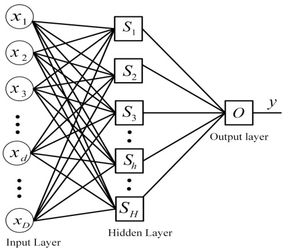
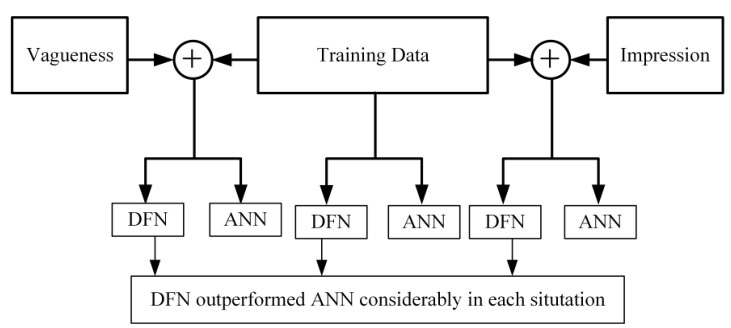
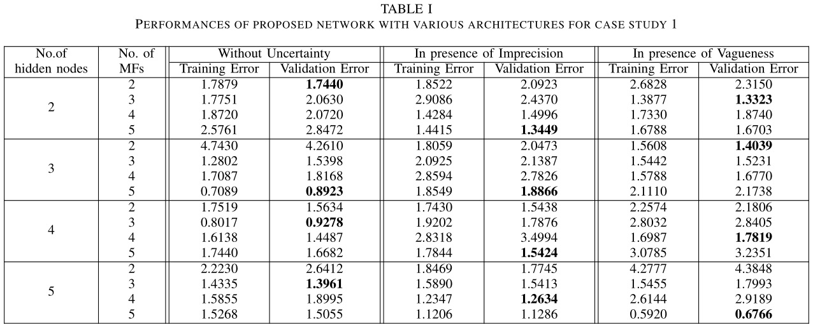
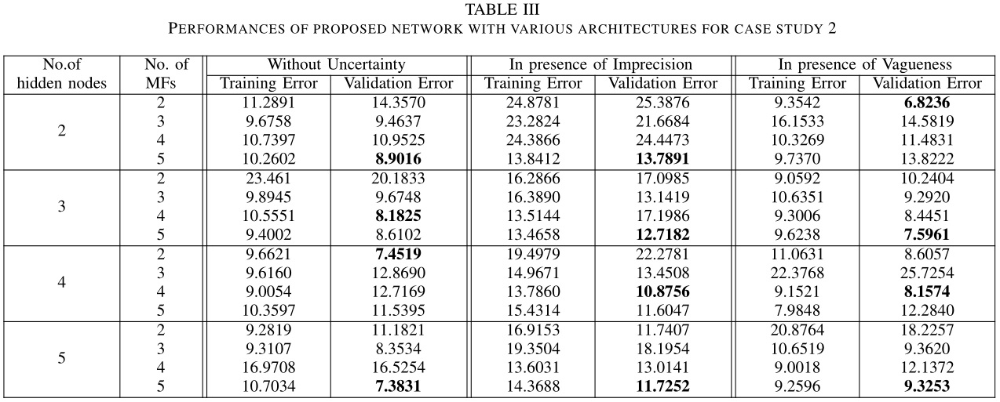
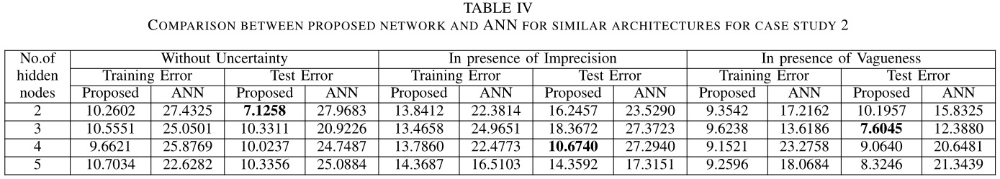

本文介绍了 TS 深度模糊网络（TS Deep Fuzzy Network, TSDFN），于 2017 年提出，基于 TS 模糊系统组成三层网络，并推导了反向传播的梯度。

<!--more-->

---
- [1. 网络结构](#1-网络结构)
- [2. 网络参数辨识](#2-网络参数辨识)
  - [2.1. 前向传播](#21-前向传播)
  - [2.2. 反向传播](#22-反向传播)
- [3. 实验](#3-实验)
  - [3.1. 准备工作](#31-准备工作)
  - [3.2. 算例 1](#32-算例-1)
  - [3.3. 算例 2](#33-算例-2)
  - [3.4. 分析](#34-分析)
- [4. 参考文献](#4-参考文献)

> Shreedharkumar Rajurkar, Nishchal Kumar Verma. **Developing deep fuzzy network with Takagi Sugeno fuzzy inference system**[J]. IEEE Transactions on Fuzzy System. 2017.

# 1. 网络结构

提出了一种新型的三层 **TS Deep Fuzzy Network (TSDFN)** 网络架构。

TSDFN 的网络架构如下图所示

图中，隐层（hidden layer）中的每一个神经元都是一个 TSFIS ，输出层只有一个神经元，也是一个 TSFIS 。当然也可以扩展为多输出，不同的输出间相互独立。

> FIS：fuzzy inference system，模糊推理系统，是一个完整的输入-输出模糊系统，比如上面介绍的 TS 模糊系统，就被称为 TSFIS

一个 TSFIS 神经元的模糊规则基（Fuzzy Rul Base，FRB）包含多条模糊规则，每条规则都包括前提部分和结论部分。一阶 TSFIS 的结论是输入的线形方程。FRB 的规则形式如下

$$
\begin{aligned}
R_i^h:&\quad {\rm IF}\quad x_1\ is\ G_{1,i}\ {\rm AND}\ \cdots\ {\rm AND}\ x_D\ is\ G_{D,i}\quad\\
&\quad {\rm THEN}\quad y\ is\ y_i=p_{i,0}+p_{i,1}x_1+\cdots+p_{i,D}x_D
\end{aligned}
$$

$D$ 是输入个数，$x_d$ 是第 $d$ 个输入分量（$d=1,\cdots,D$）。$R$ 是规则总个数$G_{d,i}$ 是前提中相应的输入模糊隶属度函数（$i=1,\cdots,R$）。前提中采用 "AND" 作为模糊连接符。

一个 TSFIS 的参数即为输入前提模糊隶属度函数的参数和结论系数，二者的组合可表示特定输入的模糊结构。可采用多种模糊隶属度函数。采用不同的模糊连接符可以定义不同的模糊规则基。

整个网络包括如下参数：

- 模糊规则的前提（premise）中的输入隶属度的参数；
- 每一层的每一个 TS 模糊神经元的结论部分的输入系数；

一个 TS 模糊神经元（TSFN）建模出了一种输入的复杂函数，输入的隶属度函数代表了模糊区域，建模出了输入数据的不确定性。模糊区域可以表示语义标签。TSDFN 中的 TSFN 提取输入数据中的复杂模式，相应的FRB参数以模糊规则的形式表示模式的内部结构。

> a TSFN in TSDFN extracts a complex pattern in input data and corresponding FRB parameters represent the nternal structure of the pattern in the form of fuzzy rules.

# 2. 网络参数辨识

采用标准的误差反向传播来针对特定数据进行网络参数辨识。

## 2.1. 前向传播

下面考虑 **一个一般的隐层 TSFN**（$S_h$），假设输入向量为 $\boldsymbol x=[x_1,x_2,\cdots,x_d,\cdots,x_D]$。

> $θ^h_{d,f}$ denotes parameter of $f^th$ input MF of input $d$ in premise part of **a rule** in FRB of $S_h$

$\boldsymbol \theta^h$ 表示**某个**规则中的输入隶属度函数的参数矩阵，那么

$$
\begin{aligned}
\boldsymbol \theta^h = \begin{bmatrix}
\theta^h_{1,1} & \cdots & \theta^h_{1,f} & \cdots & \theta^h_{1,F}\\
\vdots & \ddots & \vdots & \ddots & \vdots\\ 
\theta^h_{d,1} & \cdots & \theta^h_{d,f} & \cdots & \theta^h_{d,F}\\
\vdots & \ddots & \vdots & \ddots & \vdots\\ 
\theta^h_{D,1} & \cdots & \theta^h_{D,f} & \cdots & \theta^h_{D,F}
\end{bmatrix}
\end{aligned}
$$

其中 $F$ 是隶属度函数的参数个数（**个人理解**）。如果隶属度函数采用 **高斯** 函数，那么参数为均值和方差（参数的个数为 2 ）。为了进行反向传播，必须要计算梯度，因此隶属度函数必须是连续的。（类似关于激活函数是否要求处处可导的问题，涉及次梯度，不做展开）

$\boldsymbol p^h$ 表示结论部分的系数矩阵，那么

$$
\begin{aligned}
\boldsymbol p^h = \begin{bmatrix}
p^h_{1,0} & \cdots & p^h_{1,f} & \cdots & p^h_{1,D}\\
\vdots & \ddots & \vdots & \ddots & \vdots\\ 
p^h_{r,0} & \cdots & p^h_{r,f} & \cdots & p^h_{r,D}\\
\vdots & \ddots & \vdots & \ddots & \vdots\\ 
p^h_{R,0} & \cdots & p^h_{R,f} & \cdots & p^h_{R,D}
\end{bmatrix}
\end{aligned}
$$

其中 $R$ 为规则个数。

对于输出层的 TSFN，其参数与隐层的 TSFN 类似，只不过将上标换为 $O$，即 $\boldsymbol \theta^o, \boldsymbol p^o$。

给定输入，隶属度函数的输出表示为

$$
\begin{aligned}
\boldsymbol \mu^h = \begin{bmatrix}
\mu^h_{1,1} & \cdots & \mu^h_{1,f} & \cdots & \mu^h_{1,D}\\
\vdots & \ddots & \vdots & \ddots & \vdots\\ 
\mu^h_{r,1} & \cdots & \mu^h_{r,d} & \cdots & \mu^h_{r,D}\\
\vdots & \ddots & \vdots & \ddots & \vdots\\ 
\mu^h_{R,1} & \cdots & \mu^h_{R,d} & \cdots & \mu^h_{R,D}
\end{bmatrix}
\end{aligned}
$$

其中 $\mu^h_{r,d}=\mu_{G^h_{r,d}(x_d)}$ 是第 $h$ 个TS模糊神经元中第 $r$ 个规则下第 $d$ 个输入的隶属度。

第 $r$ 个规则的权重计算如下（原文 t-norm ？）

<!-- $$
\begin{aligned}
\omega_r^h &= \land_{d=1}^D\mu_{r,d}^h\\
\boldsymbol \omega^h &= [\omega_1^h \cdots\omega_r^h \cdots\omega_R^h]^T
\end{aligned}
$$ -->

$$
\omega_r^h = \land_{d=1}^D\mu_{r,d}^h
$$

第 $r$ 个规则的输出（原文用 $v^h_r$）

<!-- $$
\begin{aligned}
y_r^h &= p^h_{r,0}+p^h_{r,1}x_1 + \cdots + p^h_{r,d}x_d+\cdots+p^h_{r,D}x_D\\
\boldsymbol y^h &= \boldsymbol p^h\times
\begin{bmatrix}
1\\
\boldsymbol x
\end{bmatrix}
\end{aligned}
$$ -->

$$
y_r^h = p^h_{r,0}+p^h_{r,1}x_1 + \cdots + p^h_{r,d}x_d+\cdots+p^h_{r,D}x_D
$$

最终 $S_h$ 的输出为

$$
a^h = \frac{\sum_{r=1}^R\omega^h_ry_r^h}{\sum_{r=1}^R\omega^h_r}
$$

$a^h$ 作为输出层的 STFN 的（$H$ 维）输入。

在输出层，经过上述类似的步骤，可以得到一个输出 $y^o$（原文用 $y^O$），作为整个 TSDFN 的输出，如下

$$
\begin{aligned}
\mu^o_{r,h} &=\mu_{G^o_{r,h}(a^h)}\\
\omega_r^o &= \land_{h=1}^H\mu_{r,h}^o\\
y_r^o &= p^o_{r,0}+p^o_{r,1}a^1 + \cdots + p^o_{r,h}a^h+\cdots+p^o_{r,H}a^H\\
y^o &= \frac{\sum_{r=1}^R\omega^o_ry_r^o}{\sum_{r=1}^R\omega^o_r}
\end{aligned}
$$

误差 $e = y^o-y_d$ 可用于 MSE 损失函数（原文 $\frac{1}{2n}$ 可能 **有误**）

$$
J = \frac{1}{2}\sum_{n=1}^N(e^{(n)})^2
$$

其中 $N$ 是数据样本（输入输出对）总个数，$e^n$ 是第 $n$ 个样本对应的误差。

## 2.2. 反向传播

首先求 loss 对**输出层参数**的梯度。

loss 对输出的梯度

$$
\frac{\partial J}{\partial y^o} = \sum_{n=1}^Ne^{(n)}
$$

loss 对输出系数 $p^o_{r,h}$ 的梯度

$$
\begin{aligned}
\frac{\partial J}{\partial p_{r,h}^o} &=\frac{\partial J}{\partial y^o}\frac{\partial y^o}{\partial y^o_r}\frac{\partial y^o_r}{\partial p^o_{r,h}} \\
&=\sum_{n=1}^Ne^{(n)}\cdot \frac{\omega^o_r}{\sum_{r=1}^R\omega^o_r}\cdot a^h
\end{aligned}
$$

其中 $a^0=1$ 。

loss 对输出层隶属度函数参数 $\theta^o_{h,f}$ 的梯度

$$
\frac{\partial J}{\partial \theta^o_{h,f}} =
\frac{\partial J}{\partial y^o}
\sum_{r=1}^R
\frac{\partial y^o}{\partial \omega^o_r}
\frac{\partial \omega^o_r}{\partial \mu^o_r}
\frac{\partial \mu^o_r}{\partial \theta^o_f}
$$

但是需要注意一点，不是每个隶属度函数都参与每条规则的计算（也即不是每个输入都参与规则计算）。假设有 $Q\leq R$ 个规则中包含待求解的隶属度函数的参数，则上式变为

> $Q$ denotes the total number of rules in which the corresponding MF appears in premise part.

$$
\frac{\partial J}{\partial \theta^o_{h,f}} =
\frac{\partial J}{\partial y^o}
\sum_{q=1}^Q(
\frac{\partial y^o}{\partial \omega^o_q}
\frac{\partial \omega^o_q}{\partial \mu^o_{q,h}}
\frac{\partial \mu^o_{q,h}}{\partial \theta^o_{h,f}}
)
$$

---

下面求 loss 对**隐层参数**的梯度。

首先求 loss 对隐层输出的梯度。注意到从 $y^o$ 到 $a^h$ 实际上是有两个部分的，因此下式包含两项

$$
\frac{\partial J}{\partial a^h} = 
\frac{\partial J}{\partial y^o}
\sum_{r=1}^R(
\frac{\partial y^o}{\partial y^o_h}
\frac{\partial y^o_h}{\partial a^h}+
\frac{\partial y^o}{\partial \omega^o_r}
\frac{\partial \omega^o_r}{\partial a^h}
)
$$

然后求 loss 对隐层系数 $p^h_{r,d}$ 和隐层隶属度函数参数 $\theta^h_{r,f}$ 的梯度

$$
\frac{\partial J}{\partial p_{r,d}^h} =
\frac{\partial J}{\partial a^h} \cdot
\frac{\partial a^h}{\partial y^h_r}
\frac{\partial y^h_r}{\partial p^h_{r,d}}
$$

$$
\frac{\partial J}{\partial \theta^h_{d,f}} =
\frac{\partial J}{\partial a^h}
\sum_{q=1}^Q(
\frac{\partial a^h}{\partial \omega^h_q}
\frac{\partial \omega^h_q}{\partial \mu^h_{q,d}}
\frac{\partial \mu^h_{q,d}}{\partial \theta^h_{d,f}}
)
$$

实际上，隐层和输出层的 $Q$ 应该用不同的符号表示，为了简略此处不加区分（**个人理解**）。

原文到此处就不再推导，这里也不进行展开了。

计算出全部梯度后，采用梯度下降更新参数。

# 3. 实验

## 3.1. 准备工作

采用高斯隶属度函数，简便起见，隐层的每个模糊神经元的每条规则中，均采用相同个数的隶属度函数。

为了从前提参数值评估规则权重，采用 **代数乘积**（而不是取小） 作为 t-norm 运算符，因为它易于求微分。

设计三种工况：

- 不加任何处理的原始训练数据集；
- 增加小幅度的不精确的训练数据集。实际上，在进行测量时，总是存在测量值正确性的公差。实际值在测量值的指定公差范围内。为了在数据集中添加不精确度，数据集值的某一随机部分在某些带前缀（prefixed？）的公差带之间变化；
- 更进一步，添加模糊性使得数据集含糊不清。通常而言，模糊性是指对值的不清楚的理解或不正确和错误的度量。在模糊情况下，多个观测者（或传感器）对某个单个值没有达成共识。如果认为某数值属于模糊集，则更改其参数会导致模糊性（vagueness）增加到数据集中，因为更改模糊集的参数会由于模糊性而引入不确定性（uncertainty），并且模糊集的性质也会变得模糊（vague）。本文考虑使用高斯模糊集将模糊性添加到数据中。
  > If data values are considered to belong to fuzzy set THEN varying its parameters leads to add vagueness into dataset since varying the parameter of fuzzy set introduces uncertainty due to vagueness and the nature of fuzzy set becomes vague.

后续每个实验中，针对上述每个情况，将数据集划分为 70% 的训练集，15% 的验证集和 15% 的测试集。

TSDFN 网络架构的确定包含下面几步：

- TSDFN 的网络架构：不同的隐层模糊神经元个数；
- TSDFN 的网络结构：不同的隶属度函数个数；
- 对每个网络结构在训练集上训练，在验证集上测试；
- 根据最好的测试性能确定隶属度函数个数（即确定网络结构）；
- 将已经确定隶属度函数个数的不同架构的网络在测试集上测试。（然后就能最终确定采用啥架构的 TSDFN 了？）

在上述每个工况下，设计一个 3 层普通神经网络与 TSDFN 进行对比。神经网络激活函数采用 sigmoid 函数，隐层个数与 TSDFN 一致，训练方式采用现有的复杂方式（啥？）。

> This ANN is trained with existing sophisticated approaches.

采用 MSE 衡量性能。最终如图所示（图中 impression 可能写错了，应该是 imprecision）

## 3.2. 算例 1

辨识一个非线性系统

$$
f=x^2+y^2+xy+2y+x
$$

文中没说数据集咋来的，个人理解就是对上述系统进行离散赋值求解，然后得到一堆输入输出样本集（$f_i\leftarrow (x_i,y_i),i=1,2,\cdots,M$）

下表列举了 TSDFN 在验证集上的测试结果，加粗的数字表示不同网络架构下的最小 MSE，对应最佳的网络结构（对应最佳的隶属度函数个数）。

确定不同工况下的最佳网络结构（隶属度函数个数）后，分别在三个工况下与 ANN 进行比较，结果如下。

可以看出 TSDFN 均全面超越 ANN。

## 3.3. 算例 2

小车倒车问题（Truck Backer Upper problem），是一个将卡车以合适的方向后退到对接位置的问题。来自以下参考文献，总共包含 14 个表（总共 239 个读数），每个表均包含位置 $x$ 和方向 $\phi$ 的值以及相应的输出 —— 转向角 $\theta$。用于生成数据集的模型（待识别的非线性复杂系统）在文献中也有说明。

> Wang, Li-Xin, and Jerry M. Mendel, **Generating fuzzy rules from numerical data, with applications**, Signal and Image Processing Institute, University of Southern California, Department of Electrical EngineeringSystems, 1991.

TSDFN 在验证集上的测试结果如下表所示。

 

同样分别在三个工况下与 ANN 进行比较，结果如下。

可以看出 TSDFN 均全面超越 ANN。

## 3.4. 分析

两个算例的结果表明，对于相同数量的隐层神经元个数，在隶属函数数量方面，性能存在一些不规律。对实验的分析表明，误差在这些算例中不下降了，因为梯度在到达最小前卡住了。适当的调整学习率和增加迭代次数可以解决这个问题。但是总的来说 TSDFN 牛逼！

> In both case studies, the results show that there is a slight irregularity in the performance with respect to the number of membership functions for the same number of hidden nodes. The analysis of experiments have shown that this happens because the training error doesn’t decrease in such cases and the gradient gets stuck before reaching minimum. Proper tunning of learning rate and increased number of iterations solve this problem

# 4. 参考文献

无。