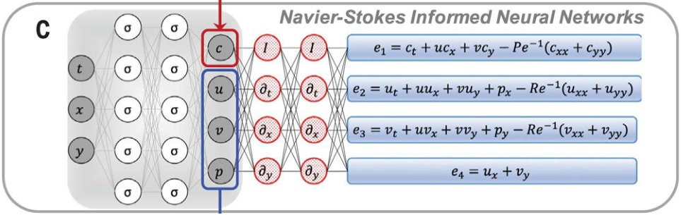
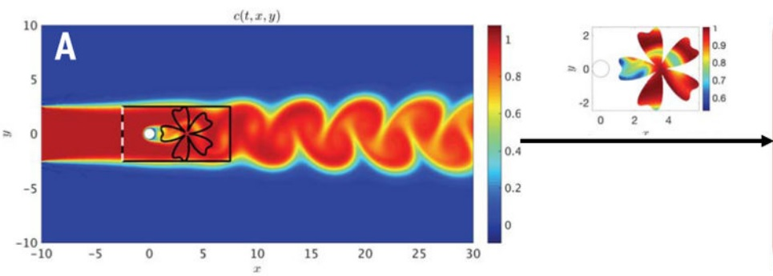
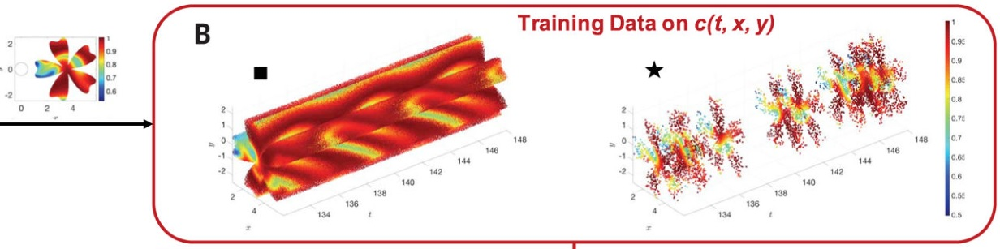
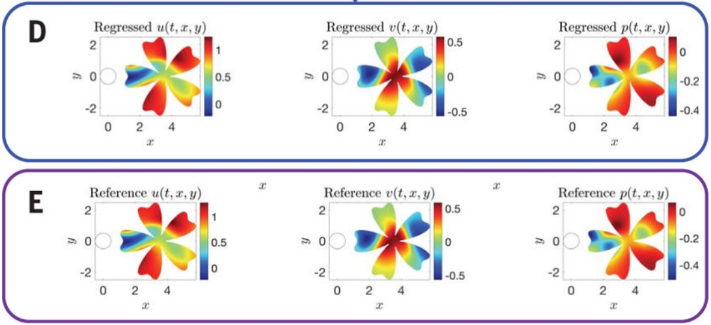

本文介绍了 2020 年 Raissi 等发表在 Science 上的一种根据流体可视化结果来学习速度和压力场的方法，称为隐流体力学（hidden fluid mechanics）。

<!--more-->

---
- [1. 引言](#1-引言)
  - [1.1. 网络框架](#11-网络框架)
  - [1.2. 损失函数](#12-损失函数)
  - [仿真](#仿真)
- [2. 参考文献](#2-参考文献)

> M. Raissi, A. Yazdani和G. E. Karniadakis, **Hidden fluid mechanics: Learning velocity and pressure fields from flow visualizations**, Science, 卷 367, 期 6481, 页 1026–1030, 2月 2020, doi: 10.1126/science.aaw4741.

# 1. 引言

本文针对物理和生物系统中的流体运动可视化。理论上，Navier-Stokes 方程（NS 方程）可以描述流动模式，直接使用图像来提取速度和压力场很难。

> Navier Stokes（纳维叶－斯托克斯）方程是流体力学中描述粘性牛顿流体的方程，是尚未被完全解决的方程，只有大约一百多个特解被解出来，是最复杂的方程之一。
> NS 方程由一个连续方程和一个动量方程组成（变成标量就是三个）。
> - 连续方程：单位时间内，流入质量-流出质量等于质量增量（质量守恒方程的流体表达）
> - 动量方程：某一时刻，控制体中所有流体微团的总动量随时间变化率=控制体中所有流体微团受到的合力（牛顿第二定律的流体表达）
> - 传输方程：分子扩散+随流传输，浓度与速度的关系？
> - 状态方程：表征流体压强、 流体密度、 温度等三个热力学参量的函数关系式，$p=p(\rho T)$ 或 $U=U(\rho T)$ 来表示，式中 $p$ 为压强；$\rho$ 为流体密度；$T$ 为热力学温度；$U$ 为单位质量流体的内能。
> 
> **注意，方程通过网格划分，能解除特定坐标点的浓度，速度，压力信息。**

作者开发了一种**物理先验的深度学习框架**（a physics-informed deep-learning framework），能够将 NS 方程编码到神经网络中，而与几何或初始/边界条件无关。在一些物理和生物医学问题中，**hidden fluid mechanics（HFM）** 可以提取可能无法直接测量的定量信息。 HFM 对于低分辨率和观测数据中的大量噪声具有鲁棒性。

作者考虑一个在速度场 $\boldsymbol u(t,x,y,z)=[u(t,x,y,z),v(t,x,y,z),w(t,x,y,z)]$ 中的某种被动标量 $c(t,x,y,z)$ 的传输过程，该过程满足不可压缩的 NS 方程。被动标量受流动平流并扩散，但对流体运动本身没有动力学影响。

> passive scalar，**烟雾**和**染料**是被动标量的两个典型示例。

唯一的观测量是一组单点云的离散数据组成的且包含噪声的时空坐标 $\{t^n,x^n,y^n,z^n,c^n\}_{n=1}^N$，他是被动标量的**浓度信息**（Fig. 2B）。这组时空坐标一共包含 $N$ 个数据点 $(t^n,x^n,y^n,z^n,c^n)$ 以及其对应的标签 $c^n$，即反映了在时空坐标 $(t^n,x^n,y^n,z^n,c^n)$ 处的浓度信息 $c^n$。N 一般为网格节点或者网格中心点。

有了这组观测量后，我们关注于推理出感兴趣的隐状态量，即速度量 $u(t,x,y,z),v(t,x,y,z),w(t,x,y,z)$ 和压力量 $p(t,x,y,z)$。

## 1.1. 网络框架

作者致力于开发出一个灵活的框架，可以处理各类流动场，比如运载器附近的流动场，或者大脑或主动脉瘤中的血管流动场。网络框架，包含两个部分，共享参数（其实只有第一部分网络有参数）。

- **网络1**：无物理先验的深度神经网络（a physics-**un**informed deep neural network），用来近似下述方程

$$
(t,x,y,z)\mapsto (c,u,v,w,p)
$$

根据数学方程求解的结果，输入时空坐标，输出对应的浓度，速度，压力。用来学习方程本身的规律。

- **网络2**：物理先验的深度神经网络

$$
(t,x,y,z)\mapsto (e_1,e_2,e_3,e_4,e_5)
$$

其中，输出 $e_1,e_2,e_3,e_4,e_5$ 为采用**自动微分**（automatic differentiation）编码的被动标量和 NS 方程的耦合动力学信息（Fig. 3C and fig. S1），也就是说这部分本质上不是一个神经网络，而是直接写出偏微分方程。通过最小化这五个残差的范数来保证相应方程的满足性。

- $e_1$ 是传递方程的残差，用于建模被动标量的动力学特性（对应浓度 $c$？）；
- $e_2,e_3,e_4$ 代表 $x,y,z$ 方向的动量方程（对应速度 $u,v,w$？）；
- $e_5$ 是连续方程的残差（对应密度，然后通过状态方程得到压力 $p$？）；

## 1.2. 损失函数

上述两个深度神经网络共享参数，通过下面的均方差损失函数来训练

$$
MSE = \frac{1}{N}\sum_{n=1}^N\vert c(t^n,x^n,y^n,z^n)-c^n \vert^2 + \sum_{i=1}^5\frac{1}{M}\sum_{m=1}^M\vert e_i(t^m,x^m,y^m,z^m) \vert^2
$$

- 第一项对应训练数据中各个坐标点的浓度。浓度是对方程的数值解算得到的，只在网格中心点或节点有值。
- 第二项强制执行了 NS 方程和传输方程强加在各个坐标的结构。

由于流体方程在任意点均满足，因此给定任意时空坐标点位置，均可以根据方程计算残差。因此第二项中的坐标与训练数据的个数和位置可以不同，即用来惩罚方程的坐标的个数和位置是由人们完全掌控的（M），但是浓度只在测量点（网格中心或者节点）有数据（N）。

> the first term corresponds to the training data $\{t^n,x^n,y^n,z^n\}_{n=1}^N$ on the concentration of the passive scalar, the last term enforces the structure imposed by the NS and transport equations at a finite set of residual points $\{t^m,x^m,y^m,z^m\}_{m=1}^M$. The number and locations of these points at which we penalize the equations are in our full control, whereas the data on the concentration of the passive scalar are available at the measurement points.

小批量梯度下降算法及其现代变体（例如Adam优化器）使我们能够在几乎 “无限” 多个点处对方程进行惩罚。更进一步，如表 S2 和 S3 所示，除了速度和压力场，其它未知流体参数也能从被动标量的密度数据中直接发掘，如雷诺数（Re）、佩克莱数（Pe）。

## 仿真

首先考察外部流动，以一个典型的在圆桶中的 2D 流动问题为起点，$Re=100, Pe=100$（图 2）。在圆筒中放一个圆柱体，考察被圆柱障碍挡住的液体的流动。用**谱元法**（spectral element method）做一个直接数值仿真，得到训练数据（浓度散点），同时提供参考速度和压力场用以分析 HFM 的准确性。被动标量在左侧边界入口被注入（图 2），**训练域的边界的形状和范围任意**（如下图中的花瓣形状）。但训练域的选择需要注意以下两点：

- **第一**，被动标量的浓度场必须存在于训练域内，以便其信息可用于推断其他流量变量；
- **第二**，为了避免需要给速度指定适当的边界条件，必须有足够的垂直于边界的浓度梯度 （$\partial c/\partial n\neq 0$），为了使该方法能够推断出速度场的单个解。

在训练域的区域中，浓度分布本身不能携带足够的信息来保证获得单个速度场或压力场，可以为算法提供额外信息，如额外的速度或压力数据（比如，针对壁边界上的速度的无滑移边界条件）。但是在本文中，除了一个实验（图 S8 和 S9）外，其它实验中我们只基于封装在浓度数据内的信息。该算法的输入本质上是散布在空间和时间上的被动标量数据点云（图2B）。

如 图2 所示，**在圆柱体下游任意的训练域内，算法的预测与参考数据之间的定量一致性很好**。

我们针对被动标量浓度分布的训练数据的时空分辨率进行了系统研究（图 2F 和图 S5），结果表明算法对于点云数据的时空分辨率非常鲁棒。具体而言，如果用于训练的算法每个涡街脱落周期的时间快照少于五个，或者在空间域中少于250个点，算法才会崩溃。

# 2. 参考文献

无。