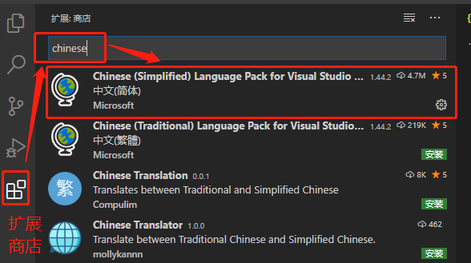
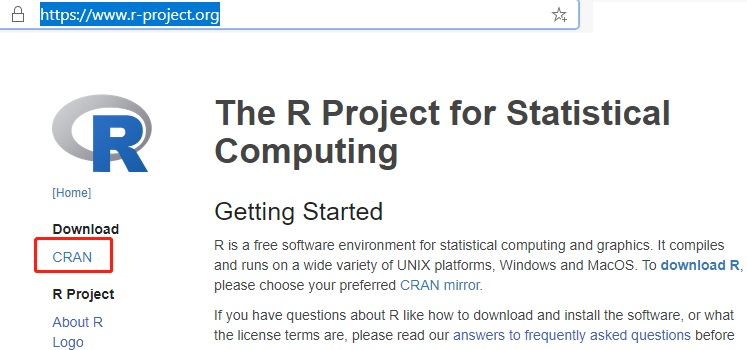
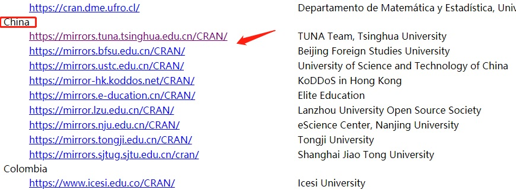
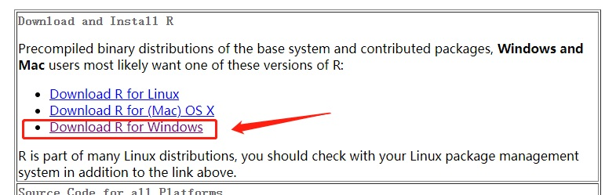
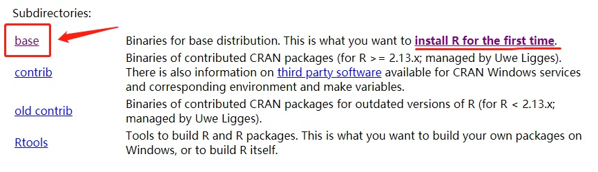
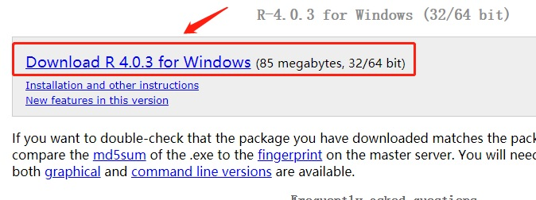

本文介绍了基于 VSCode 的 R 开发环境的搭建方法。

<!--more-->

 ---
 
- [1. 简介](#1-简介)
- [2. 下载与安装](#2-下载与安装)
- [3. 配置R开发环境](#3-配置r开发环境)
  - [3.1. 部署R语言](#31-部署r语言)
- [4. 参考文献](#4-参考文献)

# 1. 简介

[VSCode](https://code.visualstudio.com/)是微软推出的一款跨平台开源编辑器，凭借强大的第三方插件支持C/C++、Python、Java等众多语言，体积小巧功能丰富，适合小型工程项目的开发调试。下面简单介绍VSCode开发环境的部署。

注意，VSCode仅仅是一个前端文本**编辑器**，本质上与记事本并无不同，在没有插件和编译器的情况下只能进行文件的读写，并不能进行源程序编译调试。与之相对，微软自家的Visual Studio是一个**集成开发环境（IDE）**，下载安装后可以直接进行源程序的编译调试。

一个现代编译器的主要工作流程如下： [源代码](http://zh.wikipedia.org/wiki/源代码) (source code) => [预处理器](http://zh.wikipedia.org/wiki/预处理器) (preprocessor) => [编译器](http://zh.wikipedia.org/wiki/编译器) (compiler) => [汇编程序](http://zh.wikipedia.org/wiki/汇编程序) (assembler) => [目标代码](http://zh.wikipedia.org/wiki/目标代码) (object code) => [链接器](http://zh.wikipedia.org/wiki/链接器) (Linker) => [可执行文件](http://zh.wikipedia.org/wiki/執行檔) (executables)。VSCode 本身仅仅是一个源代码编辑器。不过，当配合插件和编译器后，VSCode也能够完成绝大部分的源代码编译调试工作。

# 2. 下载与安装

前往官网（https://code.visualstudio.com/）下载安装，支持Windows、Linux和Mac系统。可以下载安装版，也可以选择解压即用的绿色版。区别在于安装板会向系统路径写入配置信息，绿色版所有的依赖信息和配置信息均存放于一个目录中。安装版可以在线下载更新和安装更新，绿色版只能下载新版本的绿色安装包解压后覆盖来更新。

安装完成后，点击左侧的扩展商店，搜索chinese，下载中文简体汉化包（可能需要翻墙）。

安装完成后重启VSCode，即可发现所有界面均已汉化。

注意：

- VSCode基于文件夹进行编译和调试，每个项目必须对应一个文件夹作为工作路径（根目录），根目录内包含一个.vscode文件夹存放配置文件（json格式）；

- VSCode默认编码为UTF8，对中文支持并不完美，特别是打开已有的包含中文注释的源代码文件时要特别注意，可能导致中文乱码，且在保存文件时弹出警告。因此，对于包含中文注释的已有文件，一般需要新建一个空白文件，保存为UTF8编码格式，然后重新输入中文注释部分再进行保存。

# 3. 配置R开发环境

## 3.1. 部署R语言

前往[官网](https://www.r-project.org/)（https://www.r-project.org/） 下载R语言的安装包。

然后选择任意一个中国镜像（比如第一个清华镜像）

然后根据自己的平台选择安装包（比如 Windows）

首次安装，请选择 **base**

最后点击下载安装包，下载完毕后安装即可。

# 4. 参考文献

[1] Micsosoft. [Configure VS Code for Microsoft C++](https://code.visualstudio.com/docs/cpp/config-msvc).