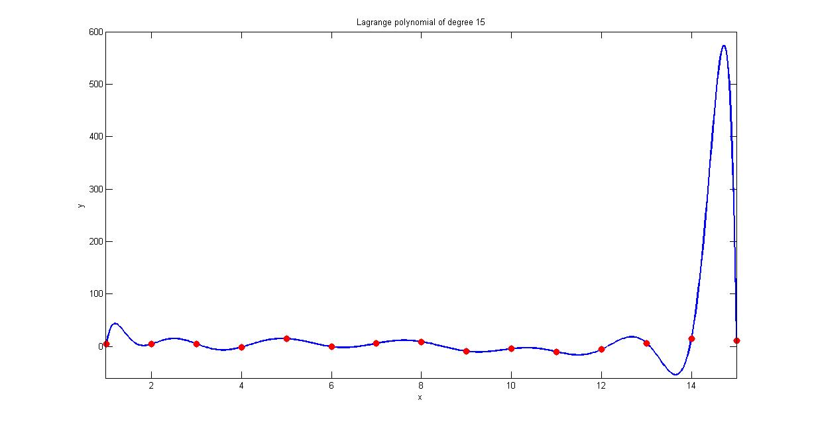
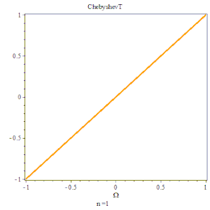
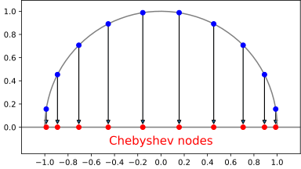
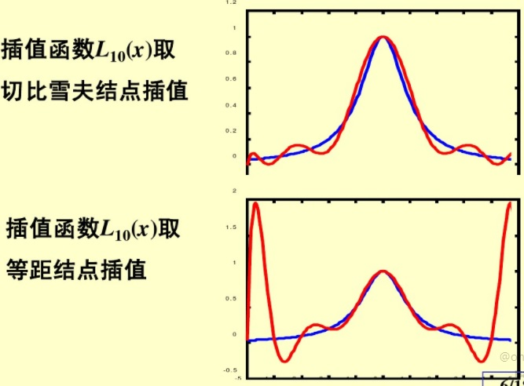
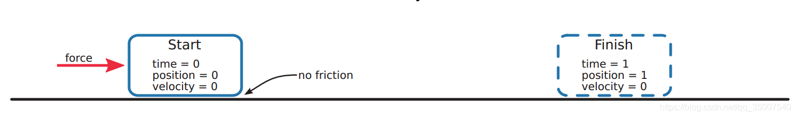
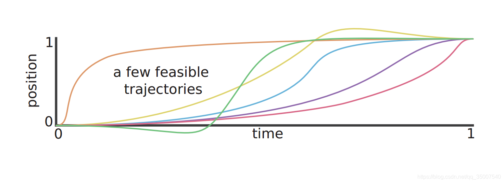
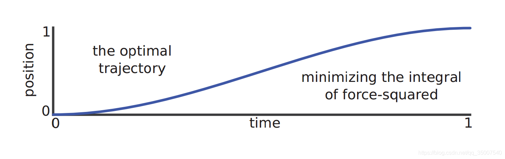

本文介绍了最优控制的数值解法的基础知识，包括微分方程的数值解法。

<!--more-->

 ---
 
- [1. 多项式局部近似](#1-多项式局部近似)
- [2. 多项式插值](#2-多项式插值)
  - [2.1. 拉格朗日插值](#21-拉格朗日插值)
  - [2.2. 重心拉格朗日插值](#22-重心拉格朗日插值)
  - [2.3. 切比雪夫节点](#23-切比雪夫节点)
- [3. ODE-IPV的数值解法](#3-ode-ipv的数值解法)
  - [3.1. 时间推进法](#31-时间推进法)
    - [3.1.1. 多步法](#311-多步法)
    - [3.1.2. 多段法](#312-多段法)
  - [3.2. 配点法](#32-配点法)
    - [3.2.1. 正交配点法](#321-正交配点法)
- [4. ODE-BPV的数值解法](#4-ode-bpv的数值解法)
- [5. 轨迹规划与最优控制](#5-轨迹规划与最优控制)
  - [5.1. 形式化描述](#51-形式化描述)
  - [5.2. 间接法](#52-间接法)
  - [5.3. 直接法](#53-直接法)
    - [5.3.1. 直接打靶法](#531-直接打靶法)
    - [5.3.2. 直接配点法](#532-直接配点法)
  - [5.4. 高斯伪谱法](#54-高斯伪谱法)
- [6. 参考文献](#6-参考文献)

# 1. 多项式局部近似

人们希望通过简单的函数来近似表示复杂的函数。多项式就是一类简单函数，只包含加法和乘法两种基本运算。

给定函数 $f(x)$ ，要在**指定点** $x$ 附近找一个与 $f(x)$ **近似的多项式**

$$
P(x) = a_0 + a_1x + a_2x^2 + \cdots + a_nx^n
$$

假设指定点为 $x_0$，$f(x)$ 在 $x_0$ 处可导，于是按照定义有

$$
f(x) = f(x_0) + f^\prime(x_0)(x-x_0) + O(x-x_0)
$$

这表明在 $x_0$ 附近可以用一次多项式来近似表达 $f(x)$ ，而误差是高于一阶的无穷小量。从几何角度看，这就是用曲线过点 $x_0$ 的切线来近似曲线。

从微分学的角度看，这种近似的特点是在点 $x_0$ 处多项式的函数值和一阶导数值与原始函数 $f(x)$ 相等。但是，许多情况下这个逼近程度不够，需要提高多项式的近似精度。

为了进一步提高逼近精度，需要在该点附近构造更高阶次的多项式，即构造一个 $(x-x_0)$ 的 $n$ 次多项式

$$
P_n(x) = a_0 + a_1(x-x_0) + a_2(x-x_0)^2 + \cdots + a_n(x-x_0)^n
$$

我们希望该多项式在 $x_0$ 处的函数值及其直到 $n$ 阶导数值都与 $f(x)$ 的相应值分别相等，即

$$
\begin{aligned}
P_n(x_0) &= a_1 = f(x_0)\\
P^\prime_n(x_0) &= a_1 = f^\prime(x_0)\\
P^{\prime\prime}_n(x_0) &= 2a_2 = f^{\prime\prime}(x_0)\\
\cdots\\
P^{(n)}_n(x_0) &= n!a_n = f^{(n)}(x_0)\\
\end{aligned}
$$

于是有

$$
\begin{aligned}
P_n(x) = &f(x_0) \\
& + f^\prime(x_0)(x-x_0)\\
& + \frac{1}{2}f^{\prime\prime}(x_0)(x-x_0)^2\\
& + \cdots\\
& + \frac{1}{n!}f^{(n)}(x_0)(x-x_0)^n
\end{aligned}
$$

称 $P_n(x)$ 为 $f(x)$ 在点 $x_0$ 处的 $n$ 阶**泰勒多项式**。

> 匿名用户. [如何通俗地解释泰勒公式？](https://www.zhihu.com/question/21149770/answer/464443944)

总结
- 泰勒公式的作用是描述如何在 $x_0$ 点附近, 用一个多项式函数 $P_n(x)$ 去近似一个复杂函数 $f(x)$；
- 之所以能实现这种近似, 背后的逻辑是：
  - 多项式函数在 $x=x_0$ 处的值, 一阶导, 二阶导 ...$n$ 阶导的值 = 原始函数在 $x=x_0$ 处的值, 一阶导, 二阶导 ...$n$ 阶导；
  - 多项式和函数在某一点的值一样, 变化率一样, 变化率的变化率一样, 变化率的变化率的变化率也一样...
  - 就这样层层深入, 无论深入到哪一个维度, 关于这一点的变化率, 二者都相等, 那就可以推断：
    - 在这一点上, 函数和多项式应该是一样的；
    - 在这一点附近, 函数和多项式应该很相似；
    - 离这一点越远, 函数和多项式的相似程度就越难以保证。

# 2. 多项式插值

在实际问题中，往往通过实验或观测得出表示某种规律的数量关系 $y=F(x)$，通常只给出了 $F(x)$ 在某些点 $x_i$ 上的函数值 $y_i=F(x_i), i=1,2,\cdots,n+1$。即使有时给出了函数 $F(x)$ 的解析表达式，倘若较为复杂，也不便于计算。因此，需要根据给定点 $x_i$ 上的函数值 $F(x_i)$,求出一个既能反映 $F(x)$ 的特性，又便于计算的简单函数 $ƒ(x)$ 来近似地代替 $F(x)$,此时 $ƒ(x)$ 称为 $F(x)$ 的插值函数；$x_1,x_2,\cdots,x_{n+1}$ 称为插值节点。求插值函数的方法，称为插值法。

多项式是一类简单的初等函数，而且任给两组数：$b_1,b_2,\cdots,b_{n+1}$ 和各不相同的 $с_1,с_2,\cdots,с_{n+1}$，总有唯一的次数不超过 $n$ 的多项式 $ƒ(x)$ 满足 $ƒ(с_i)=b_i, i=1,2,\cdots,n+1$。因此在实际应用中常常取多项式作为插值函数。作为插值函数的多项式，称为插值多项式。

## 2.1. 拉格朗日插值

[拉格朗日插值法](https://zh.wikipedia.org/wiki/%E6%8B%89%E6%A0%BC%E6%9C%97%E6%97%A5%E6%8F%92%E5%80%BC%E6%B3%95)，给定某个函数 $y(x)$，选择 $k+1$ 个插值点 $(x_0,y_0),\cdots,(x_k,y_k)$，其中 $x_j$ 对应坐标点，$y_j$ 为对应这个坐标点的值，那么拉格朗日插值多项式为：

$$
L(x) := \sum_{j=0}^k y_jl_j(x)
$$

其中，每个 $l_j(x)$ 为拉格朗日基本多项式（或称插值基函数），其表达式为：

$$
l_j(x) := \prod_{i=0,i\neq j}^k \frac{x-x_i}{x_j-x_i}
= \frac{x-x_0}{x_j-x_0}\cdots\frac{x-x_{j-1}}{x_j-x_{j-1}}\frac{x-x_{j+1}}{x_j-x_{j+1}}\cdots\frac{x-x_k}{x_j-x_k}
$$

拉格朗日基本多项式 $l_j(x)$ 的性质：

- 在 $x_{j}$ 上取值为 $1$；
- 在其它的点 $x_{i},\,i\neq j$ 上取值为 $0$。

这个性质保证了，在给定的所有离散点 $(x_j,y_j)$ 上：

- $y_jl_j(x)$ 在 $x_j$ 处取值为 $y_j$；
- $y_jl_j(x)$ 在其余点处取值为 0。

对于给定的若 $n+1$ 个点，对应于它们的次数不超过 $n$ 的拉格朗日多项式只有**一个**。证明略。

以三个点的拉格朗日插值为例 [2]，如图所示，我们想找一根穿过它的曲线，我们可以合理的假设，这根曲线是一个二次多项式

$$
y=a_0+a_1x + a_2x^2
$$

牛逼的拉格朗日认为，需要找到三个二次曲线作为基，就可以达到目标。

拉格朗日插值法的公式结构整齐紧凑，在理论分析中十分方便，然而在计算中，当插值点增加或减少一个时，所对应的基本多项式就需要全部重新计算，于是整个公式都会变化，非常繁琐。这时可以用重心拉格朗日插值法或牛顿插值法来代替。

此外，当**插值点比较多**的时候，拉格朗日插值多项式的次数可能会很高，因此具有数值不稳定的特点，也就是说尽管在已知的几个点取到给定的数值，但在附近却会和 “实际上” 的值之间有很大的偏差（如下图）。这类现象也被称为**龙格现象**，解决的办法是分段用较低次数的插值多项式。

上图展示了拉格朗日插值法的数值稳定性：如图，用于模拟一个十分平稳的函数时，插值多项式的取值可能会突然出现一个大的偏差（图中的14至15中间）

## 2.2. 重心拉格朗日插值

重心拉格朗日插值（第一型）是拉格朗日插值法的一种改进。在拉格朗日插值法中，运用多项式

$$
l(x) = (x-x_0)(x-x_1)\cdots(x-x_k)
$$

可以将拉格朗日基本多项式重新写为：

$$
l_j(x) = \frac{l(x)}{x-x_j}\frac{1}{\prod_{i=0,i\neq j}^k(x_j-x_i)}
$$

定义重心权

$$
\omega_j = \frac{1}{\prod_{i=0,i\neq j}^k(x_j-x_i)}
$$

上面的表达式可简化为

$$
l_j(x) = l(x)\frac{\omega_j}{x-x_j}
$$

于是拉格朗日插值多项式变为：

$$
L(x) = l(x)\sum_{j=0}^k \frac{\omega_j}{x-x_j}y_j
$$

它的优点是当插值点的个数增加一个时，将每个 $\omega_{j}$ 都除以 $(x_{j}-x_{k+1})$，就可以得到新的重心权 $\omega_{k+1}$，计算复杂度为 ${\mathcal  O}(n)$，比重新计算每个基本多项式所需要的复杂度 ${\mathcal  O}(n^{2})$ 降了一个量级。

将以上的拉格朗日插值多项式用来对函数 $g(x)\equiv 1$ 插值，可以得到：

$$
\forall x, g(x) = l(x) \sum_{j=0}^k \frac{\omega_j}{x-x_j}
$$

因为 $g(x) \equiv 1$ 是一个多项式，因此将 $L(x)$ 除以 $g(x)$ 得到

$$
L(x) = \frac{\sum_{j=0}^k\frac{\omega_j}{x-x_j}y_j}{\sum_{j=0}^k\frac{\omega_j}{x-x_j}}
$$

上述公式被称为重心拉格朗日插值公式（第二型）。

它继承了第一型式容易计算的特点，并且在代入 $x$ 值计算 $L(x)$ 的时候不必计算多项式 $l(x)$。它的另一个优点是，结合切比雪夫节点进行插值的话，可以很好地模拟给定的函数，使得插值点个数趋于无穷时，最大偏差趋于零。同时，**重心拉格朗日插值结合切比雪夫节点进行插值可以达到极佳的数值稳定性**。

第一型拉格朗日插值是向后稳定的，而第二型拉格朗日插值是向前稳定的，并且勒贝格常数很小。

## 2.3. 切比雪夫节点

**第一类切比雪夫多项式** $T_n$ 由以下递推关系确定：

$$
\begin{aligned}
  T_0(x) &= 1\\
  T_1(x) &= x\\
  T_{n+1}(x) &= 2xT_n(x) - T_{n-1}(x),\ n=1,2,\cdots\\
\end{aligned}
$$

前 4 阶第一类切比雪夫多项式为

$$
\begin{aligned}
  T_0(x) &= 1\\
  T_1(x) &= x\\
  T_2(x) &= 2x^2 - 1\\
  T_3(x) &= 4x^3 - 3x\\
  T_4(x) &= 8x^4 - 8x^2+1\\
\end{aligned}
$$

**第一类切比雪夫多项式的根**又被称为[切比雪夫节点](https://en.wikipedia.org/wiki/Chebyshev_nodes)，在 $[0,1]$ 区间内为

$$
x_k=cos(\frac{2k-1}{2n}\pi),\ k=1,\cdots,n
$$

> 多项式的根为使得多项式取值为 0 的值，即多项式曲线与横坐标轴的交点。

形象的看，切比雪夫节点等价于 $n$ 等分单位半球的点的 $x$ 坐标（下图中 $n=10$）。

对于任意区间 $[a,b]$，切比雪夫节点为

$$
x_k=\frac{1}{2}(a+b) + \frac{1}{2}(b-a)cos(\frac{2k-1}{2n}\pi),\ k=1,\cdots,n
$$

切比雪夫节点广泛用于多项式插值，因为他们具备一个很好的性质，即具有最小的龙格现象。

# 3. ODE-IPV的数值解法

[微分方程的初值问题（ODE-IVP）](https://en.wikipedia.org/wiki/Initial_value_problem)如下

$$
\left\{
\begin{array}{l}
  \dot{x}=f(x(t),t),\quad t\in[t_n,t_{n+1}]\\
  x(t_0)=x_0
\end{array}
\right.
$$

其中，$f$ 为 $x,t$ 的已知函数，$x_0$ 为给定的初值。在以下讨论中，假设函数 $f(x,t)$ 在区域 $t_0\leq t\leq T, \vert x\vert<\infty$ 内连续，并且关于 $x$ 满足 Lipschitz 条件，使得

$$
\vert f(x, t) - f(\overline x, t) \vert \leq L\vert x - \overline x \vert
$$

由常微分方程理论，在以上假设下，初值问题必定且唯一存在数值解 $x(t)$。

由于常微分方程的解析解求解困难，到目前为止我们只能对少数几个特殊类型的方程求得解析解，很多实际问题中常常得不到初等函数表示的解，需要求数值解。

假设 $t_n$ 时刻的状态量取值为 $x(t_n) = x_n$，则下一时刻 $t_{n+1}$ 的状态量取值 $x(t_{n+1}) = x_{n+1}$ 可以通过对原始微分式进行积分求得

$$
x_{n+1} = x_n + \int_{t_n}^{t_{n+1}}f(x(s),s)ds
$$

常微分方程初值问题的数值解法，就是给定初值 $x(t_0)=x_0$ 的基础上，寻求微分方程在一系列离散节点 $t_1,t_2,\cdots,t_n$ 上的近似值 $x_1,x_2,\cdots,x_n$。由于微分方程的解的图形时一条曲线，叫做微分方程的积分曲线，初值问题的几何意义，就是求微分方程通过初值点 $(t_0,x_0)$ 的那条积分曲线。

解决上述问题有两种方法：时间推进法和配点法。

## 3.1. 时间推进法

Time-Marching，时间推进法，微分方程在每个时刻的解根据前面**一个**或**多个**时刻的解求得。时间步进法再次被分为两类：多步法（multiple-step）和多阶段法（multiple-stage）。

### 3.1.1. 多步法

又称为 [linear multiple-step method](https://en.wikipedia.org/wiki/Linear_multistep_method)，即 $t_{n+1}$ 时刻微分方程的解由 $t_{n-j},\cdots,t_n$ 时刻的解求得，$j$ 为步长。

- **单步法（欧拉法）**

最简单的多步法就是单步法，即 $j=1$，最常用的单步法为**欧拉法**（Euler Method），具备如下的形式。

$$
x_{n+1} = x_n + h_n[b f_n + (1-b)f_{n+1}]
$$

其中 $f_n=f[x(t_n),t_n]$，$b\in[0,1]$，$h_n$ 是步长。

当 $b=1$ 时，为对应**前向欧拉法**；$b=0$ 时，为对应**后向欧拉法**。

以后向欧拉法为例

$$
x_{t+1} = x_t + h\cdot f(x_t,t)
$$

当 $b=1/2$ 时，为对应**改进的欧拉法**。欧拉法也可以从一阶泰勒多项式变化得到。改进的欧拉法可以采用 预测-校正 模型来实施。

$$
\begin{aligned}
\overline x_{t+1} &= x_t + h\cdot f(x_t,t)\\
x_{t+1} &= x_t + \frac{1}{2}h\cdot [f(x_t,t)+f(\overline x_{t+1},t+1)]\\
\end{aligned}
$$

- **多步法**

当 $j>1$ 时，就是更加复杂的线性多步法。形如

$$
\begin{aligned}
&a_0x_n + \cdots + a_{j-1}x_{n+j-1} + a_jx_{n+j} =\\
&h(b_0f(x_n,t_n) + \cdots + b_{j-1}f(x_{n+j-1},t_{n+j-1})+b_jf(x_{n+j},t_{n+j}))
\end{aligned}
$$

其中 $a_j=1$。系数 $a_0,\cdots,a_{j-1}$ 和 $b_0,\cdots,b_j$ 的选取决定了多步法的具体形式，一般在逼近程度和计算简便性上进行权衡。更加普遍的情况下，其中绝大部分的系数都置为0。

如果 $b_j=0$ 则称为显式法，因为可以直接根据等式计算 $x_{n+j}$。如果$b_j\neq 0$ 则称为隐式法，因为 $x_{n+j}$ 依赖于 $f(x_{n+j},t_{n+j})$，需要通过迭代的方法来求解，比如采用牛顿迭代法。

有时候，采用显式多步法来 『预测』 $x_{n+j}$，然后用隐式来 『校正』它，这种方式称为 预测-校正法（predictor–corrector method）。

下面列举两种常用的线性多步法家族。

**Adams-Bashforth methods**，一种显式法，其中 $a_{j-1}=-1$ 而 $a_{j-2}=\cdots=a_0=0$，然后设计 $b_j$ 来使得方法具备 $j$ 阶精度（同时也使得算法具备唯一性）。

$j=1,2,3$ 步 Adams-Bashforth 方法如下：

$$
\begin{aligned}
  x_{n+1} &= x_n + hf(x_n, t_n)\quad (前向欧拉法)\\
  x_{n+2} &= x_{n+1} + h[\frac{3}{2}f(x_{n+1}, t_{n+1})-\frac{1}{2}f(x_{n}, t_{n})]\\
  x_{n+3} &= x_{n+2} + h[\frac{23}{12}f(x_{n+2}, t_{n+2})-\frac{16}{12}f(x_{n+1}, t_{n+1})+\frac{5}{12}f(x_{n}, t_{n})]\\
\end{aligned}
$$

$j=2$ 质为泰勒展开保留至二阶，并用差分代替二阶微分项。

$$
\begin{aligned}
x_{n+1} &= x_n + hf(x_n,t_n) + \frac{h^2}{2}\dot f(x_n,t_n)+\cdots\\
x_{n+2} &= x_{n+1} + hf(x_{n+1},t_{n+1}) + \frac{h^2}{2}\dot f(x_{n+1},t_{n+1})\\
&= x_{n+1} + hf(x_{n+1},t_{n+1}) + \frac{h^2}{2}[\frac{f(x_{n+1},t_{n+1})-f(x_{n},t_{n})}{h}]\\
&= x_{n+1} + h[\frac{3}{2}f(x_{n+1}, t_{n+1})-\frac{1}{2}f(x_{n}, t_{n})]
\end{aligned}
$$

另一种如何确定参数 $b_j$ 的方法略，可参考[维基百科](https://en.wikipedia.org/wiki/Linear_multistep_method)。

注意到，多步法需要多个历史数据 $x_n,x_{n+1}$ 来计算下一步 $x_{n+2}$，而常微分方程的初值问题一般只给出初始时刻的初值，因此不能直接从该值启动。常用方法是用 Euler 法或者 Runge-Kutta 法来启动，计算出前几个值。

**Adams-Moulton methods**，一种隐式法，与 Adams-Bashforth 方法很类似，只是设计 $b_j$ 使得精度阶数尽可能高（$j$ 阶 Adams-Moulton 法具备 $j+1$ 阶精度，而$j$ 阶 Adams-Bashforth 法只具备 $j$ 阶精度）。

$j=1,2$ 步 Adams-Moulton 方法如下：

$$
\begin{aligned}
  x_{n+1} &= x_n + hf(x_{n+1}, t_{n+1})\quad (后向欧拉法)\\
  x_{n+1} &= x_n + \frac{1}{2}h[f(x_{n+1}, t_{n+1})+f(x_n, t_n)]\quad (梯形法则)\\
  x_{n+2} &= x_{n+1} + h[\frac{5}{12}f(x_{n+2}, t_{n+2})+\frac{3}{2}f(x_{n+1}, t_{n+1})-\frac{1}{12}f(x_{n}, t_{n})]\\
\end{aligned}
$$

### 3.1.2. 多段法

又称为 multiple-stage method，是在 $[t_n,t_{n+1}]$ 区间内划分若干临时段，然后进行迭代求解的一种常微分方程数值解法。多段法只需要用到一步的历史信息，但是将这一步区间划分为许多段。

多段法其中最常用的是 **龙格-库塔**（**Runge-Kutta**） 法。定义步长为 $h$，将区间划分为 $s$ 个子区间，则 $s$ 阶显式 Runge-Kutta 公式为

$$
\begin{aligned}
x_{n+1} &= x_n + h\sum_{i=1}^sb_ik_i\\
k_1&= f(x_n,t_n)\\
k_2&= f(x_n+h(a_{21}k_1),t_n+c_2h)\\
k_3&= f(x_n+h(a_{31}k_1+a_{32}k_2),t_n+c_3h)\\
\vdots\\
k_s&= f(x_n+h(a_{s1}k_1+a_{s2}k_2+\cdots+a_{s,s-1}k_{s-1}),t_n+c_sh)\\
\end{aligned}
$$

龙格库塔法的基本思路是，用 $f(x,t)$ 在几个不同点的数值加权平均代替 $f(x_{n+1},t_{n+1})$ 的值，而使截断误差的阶数尽可能高。也就是说，取不同点的斜率加权平均作为平均斜率，从而提高方法的阶数。这样可以保留泰勒展开法所具有的高阶局部截断误差，同时避免了计算函数 $f(x,t)$ 的高阶导数。

龙格库塔法包含的系数为 $b_i, a_{ij},c_i$，需要与泰勒展开公式各项系数做对比来确定这些系数。

- **一阶龙格库塔法**

泰勒展开到一阶导为

$$
x_{n+1} = x_n + hf(x_n,t_n)+\cdots
$$

一阶龙格库塔公式：$s=1$ 时为

$$
\begin{aligned}
x_{n+1} &= x_n + hb_1k_1\\
k_1 &= f(x_n,t_n)\\
\Rightarrow x_{n+1} &= x_n + hb_1f(x_n,t_n)
\end{aligned}
$$

下面确定系数 $b_1$。与泰勒展开对比，相应项系数保持一致，有

$$
b_1=1
$$

可以看出，1 阶龙格库塔法就是显式欧拉法。

- **二阶龙格库塔法**

泰勒展开到二阶导为

$$
\begin{aligned}
x_{n+1} &= x_n + hf(x_n,t_n) + \frac{h^2}{2}\dot f(x_n,t_n)+\cdots\\
&=x_n + hf(x_n,t_n) + \frac{h^2}{2}\left[\frac{\partial f(x_n,t_n)}{\partial x}f(x_n,t_n)+\frac{\partial f(x_n,t_n)}{\partial t}\right] + \cdots
\end{aligned}
$$

注意，上式隐含了条件 $\frac{\partial x}{\partial t}=\dot x = f(x_n,t_n)$

二阶龙格库塔法：$s=2$ 时为

$$
\begin{aligned}
x_{n+1} &= x_n + h(b_1k_1+b_2k_2)\\
k_1&= f(x_n,t_n)\\
k_2&= f(x_n+h(a_{21}k_1),t_n+c_2h)\\
\Rightarrow x_{n+1} &= x_n + hb_1f(x_n,t_n)+hb_2f(x_n+h(a_{21}k_1),t_n+c_2h)
\end{aligned}
$$

相当于在区间 $[t_n,t_n+1]$ 取两个点 $t_n,t_{n}+c_2h$，计算该两个点的斜率值 $k_1,k_2$，然后做加权平均。

为了与上述泰勒展开式进行系数对比，需要对斜率 $k_2$ 在 $(x_n,t_n)$ 处做泰勒展开，遵循二元函数的泰勒展开公式，形式如下

$$
\begin{aligned}
  f(x_0+h,y_0+k) = f(x_0,t_0) + (h\frac{\partial}{\partial x}+k\frac{\partial}{\partial y})f(x_0,y_0)+\cdots
\end{aligned}
$$

展开后有

$$
\begin{aligned}
  k_2 &= f(x_n+h(a_{21}k_1),t_n+c_2h)\\
  &=f(x_n,t_n) + ha_{21}k_1\frac{\partial f(x_n,t_n)}{\partial x} + c_2h\frac{\partial f(x_n,t_n)}{\partial t}\\
  &=f(x_n,t_n) + ha_{21}\frac{\partial f(x_n,t_n)}{\partial x}f(x_n,t_n) + c_2h\frac{\partial f(x_n,t_n)}{\partial t}\\
\end{aligned}
$$

带回到二阶龙格库塔的展开式中，有

$$
\begin{aligned}
  x_{n+1} &= x_n + hb_1f(x_n,t_n)+hb_2f(x_n+h(a_{21}k_1),t_n+c_2h)\\
  &= x_n + hb_1f(x_n,t_n)+hb_2 \left[ f(x_n,t_n) + ha_{21}\frac{\partial f(x_n,t_n)}{\partial x}f(x_n,t_n) + c_2h\frac{\partial f(x_n,t_n)}{\partial t} [\right]\\
  &=x_n + h(b_1+b_2)f(x_n,t_n) + \frac{h^2}{2}\left[ 2b_2a_{21}\frac{\partial f(x_n,t_n)}{\partial x}f(x_n,t_n) + 2b_2c_2\frac{\partial f(x_n,t_n)}{\partial t} \right]
\end{aligned}
$$

与泰勒展开式进行系数对比，有

$$
b_1+b_2=1,\quad 2b_2a_{21}=1,\quad 2b_2c_2 = 1
$$

四个未知数，三个方程，因此存在无穷多个系数组合。所有满足的系数统称为二阶龙格库塔格式。

注意到， $b_1=b_2=0.5,\;a_{21}=c_2=1$，对应的二阶龙格库塔公式为

$$
\begin{aligned}
x_{n+1} &= x_n + \frac{h}{2}(k_1+k_2)\\
k_1&= f(x_n,t_n)\\
k_2&= f(x_n+hk_1,t_n+h)\\
\end{aligned}
$$

这就是改进的 Euler 法。

- **三阶龙格库塔法**：略。

可参考百度文库. [龙格库塔法推导](https://wenku.baidu.com/view/98d914413868011ca300a6c30c2259010302f30a.html)

- **四阶龙格库塔法**：

$s=4$ 时，四阶龙格库塔法如下

$$
\begin{aligned}
x_{n+1} &=x_n + \frac{1}{6}h(k_1+2k_2+2k_3+k_4)\\
k_1 &= f(x_n,t_n)\\
k_2 &= f(x_n+h\frac{k_1}{2},t_n + \frac{h}{2})\\
k_3 &= f(x_n+h\frac{k_2}{2},t_n + \frac{h}{2})\\
k_4 &= f(x_n+hk_3,t_n + h)\\
\end{aligned}
$$

证明过程略。可参考百度文库. [龙格库塔法推导](https://wenku.baidu.com/view/98d914413868011ca300a6c30c2259010302f30a.html)

最常用四阶龙格库塔法，因为龙格库塔公式的截断精度并不是随着阶数的增高而提高的，当 $s=5,6$ 时的龙格库塔公式仍然只有四阶精度，只有到 $s=7$ 才具备五阶精度。

总结：Runge-Kutta 公式的思路，就是利用区间内一些特殊点的一阶导数值的线性组合来替代某点处的 $n$ 阶导数值，这样就可以仅通过一系列一阶导数值来得到某点幂级数展开的预测效果。这和泰勒公式正好是反过来的，泰勒公式是用某点的 $n$ 阶幂级数展开来近似得到小邻域内的函数值。

## 3.2. 配点法

配点法选择的有限维候选解空间（通常是展开到一定阶数的多项式）和域中的多个点（称为配点），并选择在配点处满足给定方程的解 。

一种简单的方式是采用如下形式的 $n$ 阶分段多项式来近似状态量取值

$$
p(t) = \sum_{i=0}^n a_i(t-t_0)^i,\ t\in[t_0,t_1]
$$

假设希望求微分方程初值问题

$$
\left\{
\begin{array}{l}
  \dot{x}=f(x(t),t)\\
  x(t_0)=x_0
\end{array}
\right.
$$

在区间 $[t_0,t_0+c_kh]$ 的解，其中 $0<c_1<\cdots<c_n\leq1$。

配点法设计一个 $n$ 阶多项式 $p$，使多项式满足以下两个约束

- 初始条件 $p(t_{0})=x_{0}$ 
- 微分方程 $\dot p(t_{k})=f(p(t_{k}),t_{k}),\ k=1,\cdots,n$

后者被称为配点条件，使得多项式在区间的每个配点 $t_1,\cdots,t_n$ 上的微分均等于微分方程的等式右边。

上面两个约束提供了 $n+1$ 个条件，正好对应 $n$ 阶多项式中的 $n+1$ 个待定参数。

**举例**：梯形法/改进的欧拉法（两个配点 $c_1=0, c_2 = 1$，那么 $n=2$）

配点条件为

$$
\begin{aligned}
  p(t_0) &= x_0\\
  \dot p(t_0) &= f(p(t_0),t_0)\\
  \dot p(t_0+h) &= f(p(t_0+h),t_0+h)
\end{aligned}
$$

因为有三个配点条件，因此多项式的阶数为 2。假设多项式为如下形式

$$
p(t) = a_2(t-t_0)^2 + a_1(t-t_0) + a_0
$$

将多项式及其导数带入上面的配点条件，可以解出三个系数

$$
\begin{aligned}
a_0 &= x_0\\
a_1 &= f(p(t_0),t_0)\\
a_2 &= \frac{1}{2h}[f(p(t_0+h),t_0+h)-f(p(t_0),t_0)]\\
\end{aligned}
$$

则 $t_0+h$ 位置的微分方程的近似解为

$$
x_1 = p(t_0+h) = x_0 + \frac{1}{2}h[f(x_1,t_0+h)+f(x_0,t_0)]
$$

配点法包括三个种类：

- Gauss 配点法（始末端点 $t_k,t_{k+1}$ 均不是配点）
- Radau 配点法（始末端点 $t_k,t_{k+1}$ 任意一个是配点）
- Lobatto 配点法（始末端点 $t_k,t_{k+1}$ 均是配点）

所有这些配点法本质上都是隐式龙格库塔法，但不是所有龙格库塔法都是配点法。

从另外一个角度，龙格库塔法（包括一阶欧拉法）既可以看作是分段法，又可以看作是配点法。其中的区别在于，从配点法的形式来看，所有微分方程是同时被解出的（多项式的所有参数同时确定），而分段法中所有参数是迭代解出的。

类似地，配点法被认为是一种隐式解法，因为所有时刻的状态均同时被解出（所有多项式参数同时确定后，将所有时刻带入多项式得到所有时刻的状态量），有别于时间推进方法中状态量序列的一步步显式解出。

最后，配点法也不需要采用「预测」-「校正」策略。

总结：

- 坐标点选择随意，比如**等距取点**；
- 状态量取值点选择**分段多项式**近似；

### 3.2.1. 正交配点法

[orthogonal collocation methods](https://en.wikipedia.org/wiki/Orthogonal_collocation)，配点法中的一个非常常用的具体方法族。与一般配点法的不同在于其采用**正交多项式**。

具体而言，在正交配点方法中，配点是某个正交多项式的根，一般为 [切比雪夫（Chebyshev）多项式](https://en.wikipedia.org/wiki/Chebyshev_polynomials) 或者 Legendre 多项式。

正交配点法一般配合拉格朗日多项式进行来近似解。即

- 坐标点选择正交多项式的根，比如**切比雪夫节点**；
- 状态量取值点选择**拉格朗日多项式**近似；

使用正交配点法的好处在于，可以**获得明显高于所使用的配点数的精度**。

# 4. ODE-BPV的数值解法

[微分方程的边值问题（ODE-BPV）](https://en.wikipedia.org/wiki/Boundary_value_problem) 类似初值问题。边值问题的条件是在区域的边界上，而初值问题的条件都是在独立变量及其导数在某一特定值时的数值（一般是定义域的下限，所以称为初值问题）。

例如独立变量是时间，定义域为 $[0,1]$，边值问题的条件会是 $x(t)$ 在 $t=0$ 及 $t=1$ 时的数值，而初值问题的条件会是 $t=0$ 时的 $x(t)$ 及 $x^\prime(t)$ 之值。

解决边值问题一般采用：

- [打靶法](https://en.wikipedia.org/wiki/Shooting_method)
- [差分](https://en.wikipedia.org/wiki/Finite_difference)
- [伽辽金法](https://en.wikipedia.org/wiki/Galerkin_method)
- [配点法](https://en.wikipedia.org/wiki/Collocation_method)

# 5. 轨迹规划与最优控制

轨迹用来描述一个物体的运动过程，通常是关于时间的变量。轨迹优化一种用于寻找最佳轨迹选择的方法，通常是通过选择合适的系统输入或控制量，是系统完成期望的运动过程。在控制领域，轨迹优化近似于最优控制，但从更广的概念上来讲，轨迹优化更具一般性。

数值解法将最优控制问题转化成一个等效问题，然后用数值优化的方法来求解该等效问题。因此，数值解法主要包括了最优控制问题的**转化**和**解等效问题**两部分。其中，最优控制问题的转化方法主要有**直接法**和**间接法**两类。

## 5.1. 形式化描述

- 目标函数

$$
\mathop{\rm min}\limits_{t_0,t_f,\bm x(t),\bm u(t)} \underbrace{J(t_0,t_f,\bm x(t_0),\bm x(t_f))}_{\rm Mayer\; Term} + \underbrace{\int_{t_0}^{t_f} H(\tau,\bm x(\tau),\bm u(\tau))d\tau}_{\rm Lagrange\; Term}
$$

约束包括：

- 动力学约束

$$
\dot \bm x(t)=f(\bm x(t),\bm u(t),t)
$$

- 路径约束

$$
\bm h(\bm x(t),\bm u(t),t)\leq \bm 0
$$

- 边界约束

$$
\bm g(\bm x(t_0),\bm x(t_f),t_0,t_f)\leq \bm 0
$$

- 状态量与控制量边界

$$
\begin{aligned}
\bm x_{lb}\leq\bm x(t)\leq \bm x_{ub}\\
\bm u_{lb}\leq\bm u(t)\leq \bm u_{ub}
\end{aligned}
$$

由于最终我们想要求得的是控制量关于时间的具体函数形式，而非一个值或一个参数，因此轨迹优化问题也可以理解为在一定约束或大量约束下的泛函求极值问题。

## 5.2. 间接法

变分法

## 5.3. 直接法

直接法是通过把原原始优控制问题的控制变量或状态变量离散和参数化，从而实现现将连续系统统合为最优控题题转化为一个非线性规划问题（NLP），之后再采用某种优 法求解使 NLP 问题性能指标最优的参数，并最终获得得原最优控制问题的最优解。

该方法最大的优点是不需要推导原始问题的一阶最优性必要条件，同时收敛域相对于间接法更加宽广，对初值估计精度要求不高，不需要猜猜测协态变量量初值，也不需切切换结构先验验知识。

### 5.3.1. 直接打靶法

### 5.3.2. 直接配点法

直接配点法（direct collocation methods）的算法核心是：先将整个时间过程划分为 $N$ 段，毎一段的两个端点称为节点。之后将节点上的控制变董作为一部分设计优化变量，并采用分段线性插值或拉格朗日插值多项式来近似节点之间的控制变量值。

与直接打靶法不同的是，配点法不是通过积分状态方程来获得状态变量，而是采用 Gmiss-Lobatto 多项式族来表示节点间状态变量隨时间的变化关系，并根据特定的雅可比多项式选择配点。

雅可比多项式是 $[-1，1]$ 区间上的正交多项式族。在选择的配点处应使多项式求导得到的状态变量导数与动态系统运动方程右函数求得的状态变量导数在一定精度条件下相匹配，即将动力学微分方程约束转化为一组代数约束。再以节点处的状态变景和控制变量以及配点处的控制变量作为设计优化变量，并采用某神非线性规划算法，搜索满足约束且使目标函数最小的最优解。

下面我们用一个例子来进一步说明配点法如何应用于轨迹优化最优控制问题[1]。如图所示，一个滑块放置在光滑地面上，并受到一个水平方向的作用力。我们想要滑块在里的作用下，在 1s 的时间内从开始位置运动到指定位置，并刚好停在该处。

这个问题存在着无数种可能的运动轨迹，进一步，我们希望从中确定一条最优的轨迹，如图所示。

系统状态方程为

$$
\dot x = v,\quad \dot v = u
$$

边界约束为

$$
\begin{aligned}
x(0) = 0,\quad x(1) = 1\\
v(0) = 0,\quad v(1) = 0
\end{aligned}
$$

轨迹优化关心在一定指标下的最优轨迹，假设需要能量最优，则目标函数为

$$
\mathop{\rm min}\limits_{u(t)}\int_0^1 u^2(\tau)d\tau
$$

直接配点法的核心思想是将连续时间曲线离散为有限时间序列，从而把轨迹规划问题转化大规模非线性规划问题。

**首先**，我们对轨迹进行离散化，将状态变量 $x(t)$ 和 $v(t)$ 表示为一系列离散时刻上的值，也称为配置点：

$$
\begin{aligned}
t\rightarrow t_0,\cdots,t_N\\
x\rightarrow x_0,\cdots,x_N\\
v\rightarrow v_0,\cdots,v_N\\
u\rightarrow u_0,\cdots,u_N\\
\end{aligned}
$$

这些配置点实际上就是最终转化的 NLP 问题**优化变量**，$N$ 表示离散的细化程度，N越大则离散化误差越小，但优化单独越大。

**其次**，要把原始问题在这些配置点处进行近似表示，其核心思想是两个配置点之间的状态变化等于系统动力学的积分：

$$
\begin{aligned}
\dot x &= v\\
\int_{t_k}^{t_{k+1}}\dot xdt &= \int_{t_k}^{t_{k+1}}vdt\\
x_{x+1}-x_k&\approx \frac{1}{2}(t_{k+1}-t_k)(v_{k+1}+v_k)
\end{aligned}
$$

由于位置的微分等于速度，对等式两侧进行积分，从时刻 $t_k$ 积分到时刻 $t_{k+1}$ 。等式左侧自然等于两个状态之间的差值，而对于等式右侧我们用梯形积分公式进行近似。

把速度与作用力的动力学关系同样转化成上面的形式，忽略由梯形积分近似的误差，得到以下由配置点表示的约束方程，其中 $h_k = t_{k+1}-t_k$

$$
\begin{aligned}
x_{k+1}-x_{k}=\frac{1}{2}\left(h_{k}\right)\left(\nu_{k+1}+\nu_{k}\right)\\
u_{k+1}-\nu_{k}=\frac{1}{2}\left(h_{k}\right)\left(u_{k+1}+u_{k}\right)
\end{aligned}
$$

这样，通过离散化，我们把原来连续的动力学方程中的每个变量均转化为 $N$ 个等式约束。当然为了满足问题要求，配置点还要满足以下的约束

$$
\begin{aligned}
x_0 = 0,\quad x_N = 1\\
v_0 = 0,\quad v_N = 0
\end{aligned}
$$

最后，通过采用梯形积分近似的方法，将目标函数也用配置点进行表示

$$
\mathop{\rm min}\limits_{u(t)}\int_0^1 u^2(\tau)d\tau = \mathop{\rm min}\limits_{u_0,\cdots,u_N}\sum_{k=0}^{N-1}\frac{1}{2}h_k(u_k^2 + u_{k+1}^2)
$$
至此，滑块移动问题被完全转化为一个 $3N$ 个优化变量（配置点），$2N+4$ 个约束的**非线性规划问题**，采用类似内点法的非线性规划求解器（IPOPT）进行求解，就可以得到问题数值结果。

在上面的例子中，我们采用梯形公式来近似积分，将问题中的所用连续问题转化为离散问题，这种方法称为**梯形配点法**。梯形法是一种低阶多项式，还可以采用更加高阶的多项式，如 三阶 Simpson 法等。这些多项式都属于 Gauss-Lobatto 多项式族。

## 5.4. 高斯伪谱法

- **谱方法**

- **伪谱法**

# 6. 参考文献

[1] 马同学. [如何直观地理解拉格朗日插值法？](https://www.zhihu.com/question/58333118)

[2] 素_履. [轨迹优化与直接配点法](https://blog.csdn.net/qq_35007540/article/details/105672547)

[3] 百度文库. [龙格库塔法推导](https://wenku.baidu.com/view/98d914413868011ca300a6c30c2259010302f30a.html)