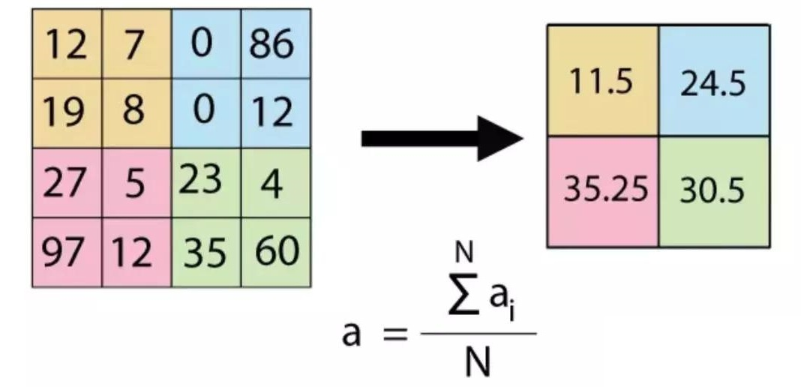

本文介绍了计算机视觉中目标检测问题的基础研究和历史。

<!--more-->

 ---
 - [1. 基础知识](#1-基础知识)
  - [1.1. 卷积核（kernel）](#11-卷积核kernel)
  - [1.2. 滤波器（filter）](#12-滤波器filter)
  - [1.3. 池化](#13-池化)
- [2. 参考文献](#2-参考文献)

# 1. 基础知识

## 1.1. 卷积核（kernel）

狭义的卷积核（kernel）是一个矩阵，可在图像上滑动并与输入相乘，从而以某种我们期望的方式增强输出。

上面的kernel可用于**锐化**图像。比如，考虑下图所示的两个输入图像。第一个图像，中心值为3 * 5 + 2 * -1 + 2 * -1 + 2 * -1 + 2 * -1 =7，值3增加到7。第二个图像，输出是1 * 5 + 2 * -1 + 2 * -1 + 2 * -1 + 2 * -1 = -3，值1减少到-3。显然，3和1之间的对比度增加到了7和-3，图像将更清晰锐利。

通过深层 CNN，我们无需再用手工设计的 kernel 来提取特征，而是可以直接学习这些可提取潜在特征的 kernel 值。

卷积核里面数就是所谓的权重，网络训练时输出的结果会和数据集标签做损失计算，然后把计算得到的损失反向梯度下降去更新卷积核里的每一个参数。所以卷积核里面的参数最终是训练得到的。但最开始时是需要给这些参数提供初始值才能使网络运行，可以简略分三种：

- 取偏差很小的高斯分布随机取值
- Xavier 初始化方法
- He kai ming 初始化方法

广义的卷积核与滤波器概念已经发生交融。

卷积后尺寸计算公式：

$$
输出图像尺寸 = (输出图像尺寸-卷积核尺寸 + 2*填充值)/步长+1
$$

## 1.2. 滤波器（filter）

滤波器是卷积核的串联，对应输入图像的每个通道。即比如卷积核是2D的 conv 3×3s1（表示是 $3\times 3$ 卷积核，stride = 1），输入图像 3 通道，那么一个 filter 就是 $3\times 3 \times 3$ 维的。

filter 还包括偏置 bias。

一个卷积层一般包含 $N$ 个 filter，对应输出的 $N$ 张特征图。

## 1.3. 池化

最大池化

平均池化

> 言有三. [池化是什么意思？](https://www.zhihu.com/question/303215483/answer/615115629)

池化的好处：

- **增大感受野**。所谓感受野，即一个像素对应回原图的区域大小，假如没有pooling，一个3*3，步长为1的卷积，那么输出的一个像素的感受野就是3*3的区域，再加一个stride=1的3*3卷积，则感受野为5*5。假如我们在每一个卷积中间加上3*3的pooling呢？很明显感受野迅速增大，这就是pooling的一大用处。感受野的增加对于模型的能力的提升是必要的，正所谓“一叶障目则不见泰山也”。
- **平移不变性**。我们希望目标的些许位置的移动，能得到相同的结果。因为pooling不断地抽象了区域的特征而不关心位置，所以pooling一定程度上增加了平移不变性。
- **降低优化难度和参数**。我们可以用步长大于1的卷积来替代池化，但是池化每个特征通道单独做降采样，与基于卷积的降采样相比，不需要参数，更容易优化。全局池化更是可以大大降低模型的参数量和优化工作量。

# 2. 参考文献

[1] 维基百科. [Kernel regression](https://en.wikipedia.org/wiki/Kernel_regression)
