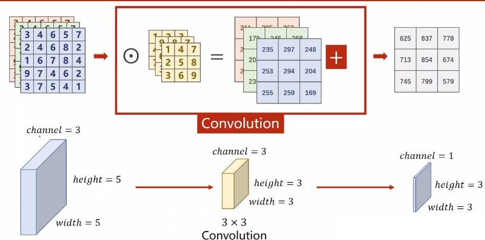
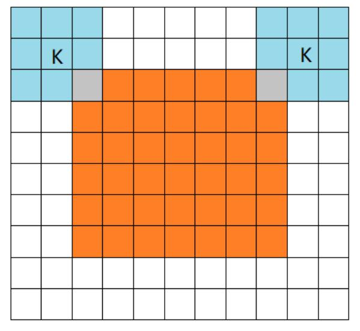
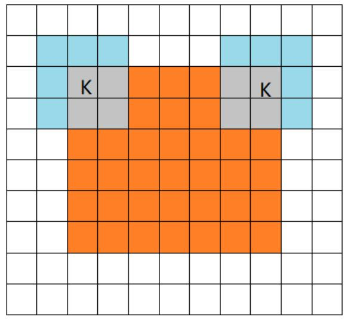
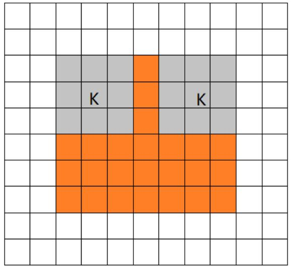

本文介绍了深度学习中卷积神经网络的（CNN）的基础知识。

<!--more-->

 ---
- [1. 基础知识](#1-基础知识)
  - [1.1. 图像](#11-图像)
  - [1.2. 卷积](#12-卷积)
    - [1.2.1. 单通道卷积](#121-单通道卷积)
    - [1.2.2. 多通道卷积](#122-多通道卷积)
    - [1.2.3. 权重](#123-权重)
    - [1.2.4. 偏置](#124-偏置)
    - [1.2.5. 激活](#125-激活)
    - [1.2.6. 共享权值](#126-共享权值)
    - [1.2.7. 初始化](#127-初始化)
    - [三种卷积模式](#三种卷积模式)
  - [1.3. 池化](#13-池化)
    - [1.3.1. 最大池化](#131-最大池化)
    - [1.3.2. 平均池化](#132-平均池化)
    - [1.3.3. 池化的好处](#133-池化的好处)
- [2. 参考文献](#2-参考文献)

# 1. 基础知识

## 1.1. 图像

图像在计算机中表示为一个 $height\times width$ 的 2 维的矩阵，矩阵的各个元素取值为颜色的值，可以表示为 $[0,1]$ 区间或 $[0,255]$ 区间的一个数。灰度图像是单通道的，彩色图像是三通道的（R，G，B）。

## 1.2. 卷积

卷积是原始图像与卷积核之间的滑动局部加乘计算过程。

狭义的卷积核（kernel）是一个矩阵，可在图像上滑动并与输入相乘，从而以某种我们期望的方式增强输出。

### 1.2.1. 单通道卷积

假设输入图片为 $6\times 6 \times 1\ channel$，卷积核为 $3\times 3$，stride=1（表示 kernel 的滑动步长为1），padding=1（表示对原始输入图像周围额外增加一层，配合stride=1，可以保证卷积后图片大小不变），则卷积过程如下图所示：

上面的kernel可用于**锐化**图像。比如，考虑下图所示的两个输入图像。

- 第一个图像，中心值为3 * 5 + 2 * -1 + 2 * -1 + 2 * -1 + 2 * -1 =7，值3增加到7。
- 第二个图像，输出是1 * 5 + 2 * -1 + 2 * -1 + 2 * -1 + 2 * -1 = -3，值1减少到-3。

显然，3和1之间的对比度增加到了7和-3，图像将更清晰锐利。

卷积后尺寸计算公式：

$$
输出图像尺寸 = (输出图像尺寸-卷积核尺寸 + 2*填充值)/步长+1
$$

### 1.2.2. 多通道卷积

假设一个图像为 $5\times 5 \times 3\ channel$，此时，对于每一个通道均可以用一个卷积核进行卷积。此时，三个通道的卷积核串联起来，形成一个**滤波器（filter）**。在前面的单通道卷积中，卷积核就是一个单通道的 filter。

举例，采用 1 个 $3\ channel$ 的滤波器，每个通道的卷积核大小仍为 3x3，padding=0，stride=1。卷积过程如下，每一个通道的像素值与对应通道的卷积核的数值进行卷积，因此每一个通道会对应一个输出卷积结果，三个卷积结果对应位置累加 **求和**，得到最终的卷积结果。

上述过程中，每一个 滤波器 的通道数必须与输入图片的通道数 **一致**。

可以看出，一个 滤波器 最终到一个通道的特征图，则采用多个 滤波器 就可得到多个特征图，也即最终输出的特征图的通道数等于 滤波器 的个数。为什么要采用多个 滤波器 呢？因为一个 滤波器 提取特征是不充分的，需要添加多个 滤波器 去学习多种特征。

另外，滤波器 中不同通道上的卷积核的参数并不相同。

### 1.2.3. 权重

卷积核的值就是待学习的权重参数。网络训练时，输出的结果会和数据集标签做损失计算，然后把计算得到的损失反向梯度下降去更新卷积核里的每一个参数。所以卷积核里面的参数最终是训练得到的。

通过深层 CNN，我们无需再用手工设计的 kernel 来提取特征，而是可以直接学习这些可提取潜在特征的 kernel 值。

### 1.2.4. 偏置

每一个 滤波器 都包括一个偏置参数（bias）。这个偏置参数是该 滤波器 中所有 卷积核 共享的。最终的卷积结果需要在加上该偏置值。

### 1.2.5. 激活

卷积与偏置加和后的值，还需要再经过激活函数（比如 ReLU）才得到最终特征图上的值。

### 1.2.6. 共享权值

共享权值包括 共享权重 和 共享偏置。简而言之，卷积核的权重与偏置在卷积过程中保持不变。

### 1.2.7. 初始化

卷积核的权值是通过学习更新的，但是最开始是需要给这些参数提供初始值才能使网络运行。初始化方法可以简略分三种：

- 取偏差很小的高斯分布随机取值
- Xavier 初始化方法
- He kai ming 初始化方法

### 三种卷积模式

橙色部分为 image, 蓝色部分为 filter。

- **full mode**

full 模式的意思是，从 filter 和 image 刚相交开始做卷积，白色部分为填 0。filter 的运动范围如图所示。

- **same mode**

当filter的中心 K 与 image 的边角重合时，开始做卷积运算。当卷积补偿 stride = 1 时，卷积之后输出的 feature map 尺寸相对于输入图片保持不变（same）。

- **valid mode**

当filter全部在image里面的时候，进行卷积运算。

## 1.3. 池化

池化层也称下采样层，会压缩输入的特征图，一方面减少了特征，导致了参数减少，进而简化了卷积网络计算时的复杂度；另一方面保持了特征的某种不变性（旋转、平移、伸缩等）。池化的思想来自于视觉机制，是对信息进行抽象的过程。

池化操作主要有两种，一种是平均池化(Average Pooling)，即对邻域内的特征点求平均；另一种是最大池化(Max Pooling)，即对邻域内的特征点取最大。

### 1.3.1. 最大池化

采用 $2\times 2$ 卷积核对 $4\times 4$ 图像的最大池化过程：

通常认为如果选取区域均值(mean pooling)，往往能保留整体数据的特征，较好的突出背景信息。

### 1.3.2. 平均池化

采用 $2\times 2$ 卷积核对 $4\times 4$ 图像的平均池化过程：

如果选取区域最大值(max pooling)，则能更好保留纹理特征。

### 1.3.3. 池化的好处
> 言有三. [池化是什么意思？](https://www.zhihu.com/question/303215483/answer/615115629)

池化的好处：

- **增大感受野**。所谓感受野，即一个像素对应回原图的区域大小，假如没有pooling，一个3*3，步长为1的卷积，那么输出的一个像素的感受野就是3*3的区域，再加一个stride=1的3*3卷积，则感受野为5*5。假如我们在每一个卷积中间加上3*3的pooling呢？很明显感受野迅速增大，这就是pooling的一大用处。感受野的增加对于模型的能力的提升是必要的，正所谓“一叶障目则不见泰山也”。
- **平移不变性**。我们希望目标的些许位置的移动，能得到相同的结果。因为pooling不断地抽象了区域的特征而不关心位置，所以pooling一定程度上增加了平移不变性。
- **降低优化难度和参数**。我们可以用步长大于1的卷积来替代池化，但是池化每个特征通道单独做降采样，与基于卷积的降采样相比，不需要参数，更容易优化。全局池化更是可以大大降低模型的参数量和优化工作量。

# 2. 参考文献

[1] 木盏. [卷积的三种模式](https://blog.csdn.net/leviopku/article/details/80327478). CSDN.
