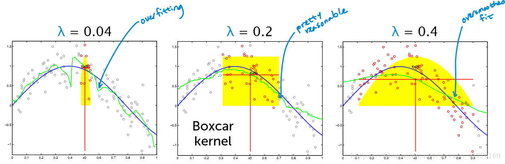

本文介绍了计算机视觉中目标检测问题的基础研究和历史。

<!--more-->

 ---
 
- [1. 前沿](#1-前沿)
  - [1.1. R-CNN](#11-r-cnn)
  - [1.2. 近邻回归](#12-近邻回归)
  - [1.3. 核回归](#13-核回归)
- [2. 参考文献](#2-参考文献)

# 1. 前沿

图片分类任务我们已经熟悉了，就是算法对其中的对象进行分类。而今天我们要了解构建神经网络的另一个问题，即目标检测问题。这意味着，我们不仅要用算法判断图片中是不是一辆汽车， 还要在图片中标记出它的位置， 用边框或红色方框把汽车圈起来， 这就是目标检测问题。 其中“定位”的意思是判断汽车在图片中的具体位置。

近几年来，目标检测算法取得了很大的突破。比较流行的算法可以分为两类，一类是基于 Region Proposal 的 R-CNN 系算法（R-CNN，Fast R-CNN, Faster R-CNN等），它们是two-stage的，需要先算法产生目标候选框，也就是目标位置，然后再对候选框做分类与回归。而另一类是 Yolo，SSD 这类 one-stage 算法，其仅仅使用一个卷积神经网络 CNN 直接预测不同目标的类别与位置。第一类方法是准确度高一些，但是速度慢，但是第二类算法是速度快，但是准确性要低一些。

## 1.1. R-CNN

> 2014. Ross Girshick，JeffDonahue,TrevorDarrell,Jitendra Malik. 
> **Rich feature hierarchies for accurate oject detection and semantic segmentation**

目标检测有两个主要任务：物体分类和定位，为了完成这两个任务，R-CNN借鉴了滑动窗口思想， 采用对区域进行识别的方案，具体是：

- **提取候选区域**。输入一张图片，通过指定算法从图片中提取 2000 个类别独立的候选区域（可能目标区域）。R-CNN 目标检测首先需要获取2000个目标候选区域，能够生成候选区域的方法很多，比如：

  - objectness
  - selective search
  - category-independen object proposals
  - constrained parametric min-cuts (CPMC)
  - multi-scale combinatorial grouping
  - Ciresan
  
  R-CNN 采用的是 Selective Search 算法。简单来说就是通过一些传统图像处理方法将图像分成很多小尺寸区域，然后根据小尺寸区域的特征合并小尺寸得到大尺寸区域，以实现候选区域的选取。

- **提取特征向量**。对于上述获取的候选区域，需进一步使用 CNN 提取对应的特征向量，作者使用模型 AlexNet (2012)。（需要注意的是 Alexnet 的输入图像大小是 227x227，而通过 Selective Search 产生的候选区域大小不一，为了与 Alexnet 兼容，R-CNN 采用了非常暴力的手段，那就是无视候选区域的大小和形状，统一变换到 227x227 的尺寸）。
  网络训练过程如下：
  - 首先进行有监督预训练：使用 ImageNet 训练网络参数，这里只训练和分类有关的参数，因为 ImageNet 数据只有分类，没有位置标注。输入图片尺寸调整为 227x227，最后一层输出：4097 维向量 -> 1000 维向量的映射（因为 ImageNet 挑战使用了一个“修剪”的1000 个非重叠类的列表）。
  - 然后在特定样本下的微调 ：采用训练好的 AlexNet 模型进行 PASCAL VOC 2007 样本集下的微调，学习率=0.001（PASCAL VOC 2007样本集上既有图像中物体类别标签，也有图像中物体位置标签）。mini-batc h为 32 个正样本和 96 个负样本（由于正样本太少）

- 对于每个区域相应的特征向量，利用支持向量机SVM 进行分类，并通过一个bounding box regression调整目标包围框的大小

- **非参数回归**

  非参数回归是指并不需要知道总的分布的情况下进行的一种非参数统计方法。

  > [非参数统计](https://zh.wikipedia.org/wiki/%E7%84%A1%E6%AF%8D%E6%95%B8%E7%B5%B1%E8%A8%88)（nonparametric statistics），或称非参数统计学，统计学的分支，适用于母群体分布情况未明、小样本、母群体分布不为正态也不易变换为正态。特点在于尽量减少或不修改其建立之模型，较具稳健特性；在样本数不大时，计算过程较简单。
  > 
  > 非参数统计推断时所使用的统计量的抽样分配通常与总体分配无关，不必推论其中位数、拟合优度、独立性、随机性，更广义的说，非参数统计又称为“不受分布限制统计法”（distribution free）。

  优点：

  - 回归函数形式自由、受约束少，对数据分布一般不做任何要求
  - 适应能力强，稳健性高，回归模型完全由数据驱动
  - 对于非线性、非齐次问题效果很好

  缺点

  - 不能进行外推运算
  - 估计的收敛速度慢
  - 一般只有在大样本下才能取得很好的效果，小样本效果较差
  - 高维诅咒？

## 1.2. 近邻回归

1NN（1-Nearest Neighbor）回归：找寻与输入 $x_q$ 最接近的 $x_i$ 对应的 $y_i$ 作为预测输出。缺点时对大块区域没有数据或数据不足时敏感，拟合的不好。

KNN（K-Nearest Neighbor）回归：找寻 $k$ 个最近邻的点 $x_1,x_2,\cdots,x_k$，然后对他们对应的 $y_1,y_2,\cdots,y_k$ 求**平均**。

加权 kNN （Weighted K-Nearest Neighbor）回归：找寻 $k$ 个最近邻的点 $X_1,X_2,\cdots,X_k$，然后对他们对应的 $y_1,y_2,\cdots,y_k$ 求**加权平均**。权重取法为，离得更近的点具备更大的权重，反之更小。简单的算法为计算距离的倒数，即

$$
\begin{aligned}
y_{q} &= \frac{c_{1}y_{1}+\cdots+c_{k}y_{k}}{\sum_{j=1}^k c_{qj}}\\
c_{qj} &= \frac{1}{dis(x_j,x_q)}
\end{aligned}
$$

影响近邻回归性能的因素：

- **k**
  如果 K 值选择的比较小，这时候我们就相当于使用较小的领域中的训练样本对实例进行预测。这时候，算法的**近似误差会减小**，因为只有与输入实例相近的训练样本才能才会对预测结果起作用。但是它也会有明显的缺点：算法的估计误差会偏大，预测的结果会对近邻点十分敏感，也就是说如果近邻点是噪声点的话，那么预测就会出错。也就是说，k 值太小会使得 KNN 算法容易**过拟合**。

  同理，如果 K 值选的比较大的话，这时候距离较远的训练样本都能够对实例的预测结果产生影响。这时候，而模型相对**比较鲁棒**，不会因个别噪声点对最终的预测产生影响。但是缺点也是十分明显的：算法的近似误差会偏大，距离较远的点（与预测实例不相似）也会同样对预测结果产生作用，使得预测产生较大偏差。此时相当于模型发生**欠拟合**。

  因此，在实际的工程实践过程中，我们一般采用交叉验证的方式选取 K 值。从上面的分析也可以知道，一般 k 值取得比较小。我们会选取 k 值在较小的范围，同时在测试集上准确率最高的那一个确定为最终的算法超参数 k。

- **距离度量方法**
  
  距离计算一般采用:

  - 闵可夫斯基距离（欧氏距离、曼哈顿距离、切比雪夫距离）
  - 余弦距离（余弦相似度）

  闵可夫斯基距离不是一种距离，而是一类距离的定义。对于两个具有 $n$ 维特征的样本点 $\boldsymbol x_i,\boldsymbol x_q$，二者间的**闵可夫斯基距离**为

  $$
  dis(\boldsymbol x_i,\boldsymbol x_q)=\left( \sum_{k=1}^n \vert x_i^k - x_q^k \vert^n \right)^{\frac{1}{n}}
  $$

  $p=1$ 时被称为曼哈顿距离；
  $p=2$ 时被称为欧氏距离（L2范数）；
  $p\rightarrow \infty$ 时被称为切比雪夫距离。

  对于两个具有 $n$ 维特征的样本点 $\boldsymbol x_i,\boldsymbol x_q$，二者间的**余弦相似度**为

  $$
  sim_c(\boldsymbol x_i,\boldsymbol x_q) = cos(\boldsymbol x_i,\boldsymbol x_q)=\frac{\boldsymbol x_i\cdot \boldsymbol x_q}{\vert\vert\boldsymbol x_i\vert\vert\cdot\vert\vert\boldsymbol x_q\vert\vert} = \frac{\sum_{k=1}^n x_{ik}x_{qk}}{\sqrt{\sum_{k=1}^n x_{ik}^2} \sqrt{\sum_{k=1}^n x_{qk}^2}}
  $$

  则余弦距离为

  $$
  dis_c(\boldsymbol x_i,\boldsymbol x_q) = 1 - sim_c(\boldsymbol x_i,\boldsymbol x_q)
  $$

  注意，余弦距离不是一个严格意义上的距离度量公式，但在形容两个特征向量之间的关系上用处很大。

  当向量的模长经过归一化时，欧氏距离与余弦距离有着单调的关系

  $$
  dis_2 = \sqrt{2\cdot dis_c}
  $$

  此时如果选择距离最小（相似度最大）的近邻，那么使用余弦相似度和欧氏距离的结果是相同的。

  二者之间的使用差异如下：欧氏距离体现**数值上的绝对差异**，而余弦距离体现**方向上的相对差异**。

  1) 例如，统计两部剧的用户观看行为，用户A的观看向量为(0,1)，用户B为(1,0)；此时二者的余弦距很大，而欧氏距离很小；我们分析两个用户对于不同视频的偏好，更关注相对差异，显然应当使用余弦距离。

  2) 而当我们分析用户活跃度，以登陆次数(单位：次)和平均观看时长(单：分钟)作为特征时，余弦距离会认为(1,10)、(10,100)两个用户距离很近；但显然这两个用户活跃度是有着极大差异的，此时我们更关注数值绝对差异，应当使用欧氏距离。

## 1.3. 核回归

继续细化权重，提出**核权重**的概念。

$$
c_{qj} = k(\boldsymbol x_i,\boldsymbol x_q)
$$

$k$ 是一个函数，一个二元函数，一个 $R^n\times R^n \rightarrow R^+$ 的二元函数，用来描述点与点之间的关系或者说距离的一种东西。

范数就是我们之前强调的距离，或者说广义的距离。向量空间中两向量的内积可度量其距离，即内积就是这个距离的定义的方式，也即由内积可以诱导出范数。可以用内积来刻画 kernel

$$
k(\boldsymbol x_i,\boldsymbol x_q)=<\boldsymbol x_i,\boldsymbol x_q>
$$

根据不同的内积定义，可以构造出不同的核函数。

k 可以用原特征空间上点内积的方式经过运算转化成高维空间点内积的函数，可以用来避免在高维空间里进行繁琐的内积计算。

常用的**高斯核**如下

$$
k_\lambda(x_i,x_q)=exp(-\frac{\vert\vert \boldsymbol x_i-\boldsymbol x_q\vert\vert^2}{\lambda})
$$

其它常用的核函数包括均匀分布核、三角核等等，如下图所示。

**核回归就是升级版的加权 KNN，区别在于不是加权 k 个最近的邻居，而是加权所有样本点**。然后权重是由特定的核函数来确定的。

$$
y_q = \frac{\sum_{i=1}^N c_{qi}y_i}{\sum_{i=1}^Nc_{qi}} = \frac{\sum_{i=1}^N k_{\lambda}(\boldsymbol x_i,\boldsymbol x_q)y_i}{\sum_{i=1}^N k_{\lambda}(\boldsymbol x_i,\boldsymbol x_q)}
$$

要确定两个东西：

- 核
- $\lambda$

$\lambda$ 的选择根据验证集验证时的验证损失来确定。较小的 $\lambda$ 即使得预测量近受到附近距离很近的点的影响，过小的 $\lambda$ 会导致过拟合；过大的 $\lambda$ 则会导致过平滑，即欠拟合。

核的选择比 $\lambda$ 的选择更重要。很多时候我们根本不知道核函数将数据映射成了什么样子，映射后的可分离性可能更好，也可能更差。这个时候我们会尝试不同的核函数和参数。

对于非参数回归问题，点 $x_q$ 对应的预测值 $y_q$ 的条件期望可以写成某个未知函数 $m(\cdot)$ 与噪声 $\sigma$ 之和

$$
y_q = \mathbb E(y\vert x=x_q)=m(x)+\sigma
$$

1964年，Nadaraya 和 Watson 提出了一种局部加权平均估计 $m(\cdot)$ 方法，称为 Nadaraya-Watson 核估计（或 Nadaraya-Watson 回归）。

$$
y_q = \frac{\sum_{i=1}^N k_{\lambda}(\boldsymbol x_q-\boldsymbol x_i)y_i}{\sum_{i=1}^N k_{\lambda}(\boldsymbol x_q-\boldsymbol x_i)}
$$

另外两个核估计方法为 Priestley-Chao 核估计和 Gasser——Müller 核估计。

# 2. 参考文献

[1] 维基百科. [Kernel regression](https://en.wikipedia.org/wiki/Kernel_regression)
