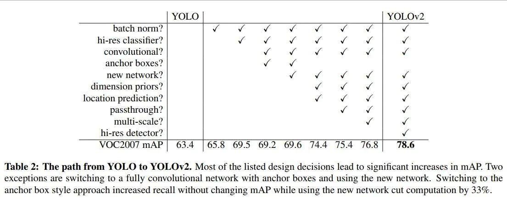
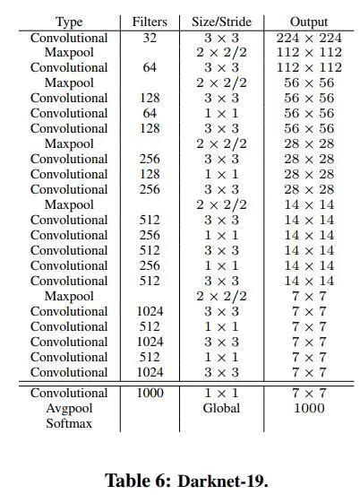
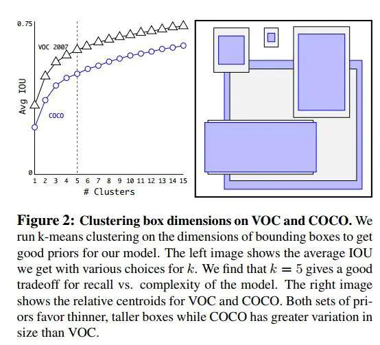

本文介绍了计算机视觉中单阶段目标检测问题的解决方法，即 Yolo 系列。

<!--more-->

 ---
 
- [1. 前言](#1-前言)
- [2. YOLO V1](#2-yolo-v1)
  - [2.1. 输入](#21-输入)
  - [2.2. 输出](#22-输出)
  - [2.3. 构造训练样本](#23-构造训练样本)
  - [2.4. 损失函数](#24-损失函数)
  - [2.5. 训练](#25-训练)
  - [2.6. 测试预测](#26-测试预测)
  - [2.7. 结论](#27-结论)
- [3. YOLO V2](#3-yolo-v2)
  - [3.1. 网络结构](#31-网络结构)
  - [3.2. 批归一化](#32-批归一化)
  - [3.3. 高分辨率分类器](#33-高分辨率分类器)
  - [先验框（anchor）](#先验框anchor)
  - [约束预测框位置](#约束预测框位置)
- [4. 参考文献](#4-参考文献)

# 1. 前言

Yolo，SSD 这类 one-stage 算法，仅仅使用一个卷积神经网络 CNN 直接预测不同目标的类别与位置。一阶段方法的速度快，但是准确性要低一些。

# 2. YOLO V1

YOLO意思是You Only Look Once，创造性的将候选区和对象识别这两个阶段合二为一，看一眼图片（不用看两眼哦）就能知道有哪些对象以及它们的位置。

实际上，YOLO并没有真正去掉候选区，而是采用了预定义的候选区（准确点说应该是预测区，因为并不是Faster RCNN所采用的Anchor）。也就是将图片划分为 $7\times 7=49$ 个网格（grid），每个网格允许预测出 2 个边框（bounding box，包含某个对象的矩形框），总共 $49\times 2=98$ 个 bounding box。可以理解为 98 个候选区，它们很粗略的覆盖了图片的整个区域。

## 2.1. 输入

输入就是原始图像，唯一的要求是缩放到 $448\times 448$ 的大小。主要是因为YOLO的网络中，卷积层最后接了两个全连接层，全连接层是要求固定大小的向量作为输入，所以倒推回去也就要求原始图像有固定的尺寸。

## 2.2. 输出

输出是一个 $7\times 7\times 30$ 的张量。$7\times 7$ 对应原始图像的网格，30维向量 = 20个对象的概率 + 2个bounding box * 4个坐标 + 2个bounding box的置信度。

**前 20 维**，one hot 编码。因为YOLO支持识别20种不同的对象（人、鸟、猫、汽车、椅子等），所以这里有20个值表示该网格位置存在任一种对象的概率。

**中 2 维**，2 个 bounding box 的置信度。 = 该 bounding box 内有对象的概率 * 该 bounding box 与该对象实际 bounding box 的 IOU。

**后 8 维**，2 个 bounding box 的位置。每个 bounding box 需要 4 个数值来表示其位置，**(Center_x, Center_y, width, height)**，2 个 bounding box 共需要 8 个数值来表示其位置。

$7\times 7$ 网格，每个网格 2 个 bounding box，对 $448\times 448$ 输入图像来说覆盖粒度有点粗。我们也可以设置更多的网格以及更多的bounding box。设网格数量为 $S\times S$，每个网格产生 B 个边框（4 位置 + 1 置信度），网络支持识别 C 个不同的对象。这时，输出的向量长度为： $C + B\times (4+1)$ 整个输出的tensor就是： $S\times S\times (C + B\times (4+1))$。

## 2.3. 构造训练样本

- **20 个对象分类的概率**

对于输入图像中的每个对象，先找到其中心点。中心点落在某个网格内，该网格对应 30 维向量中的 1 维置 1，其它维度置 0（也即一个网格只能预测 1 个对象，网络一共能从一张图片中检测49个对象）。这就是所谓的"中心点所在的网格对预测该对象负责"。

- **2 个 bounding box 的位置**

训练样本的 bounding box 位置应该填写对象实际的 bounding box，但一个对象对应了 2 个 bounding box，该填哪一个呢？上面讨论过，需要根据网络输出的 bounding box 与对象实际 bounding box 的 IOU 来选择，所以要在训练过程中动态决定到底填哪一个 bounding box。参考下面第 3 点。

- **2 个 bounding box 的置信度**

上面讨论过置信度公式

$$
Confidence = Pr(Object) * IOU^{truth}_{pre}
$$

2 个 bounding box 的 $IOU$，哪个比较大就由哪个 bounding box 负责预测该对象是否存在，相应的 $P(Object)=1$，$Confidence = IOU$，该网格其它 bounding box 的 $Confidence = 0$。

注意，在训练过程中等网络输出以后，比较两个 bounding box 与自行车实际位置的 IOU，自行车的位置（实际 bounding box）放置在 IOU 比较大的那个 bounding box（图中假设是 bounding box1），且该 bounding box 的置信度设为 1。

## 2.4. 损失函数

损失函数就是网络实际输出与标签之间的误差，YOLO V1 简单粗暴采用 sum-squared error loss。

$$
\begin{aligned}
loss =&\lambda_{coord}\sum_{i=0}^{S^2}\sum_{j=0}^{B}[(x_i-\hat{x}_i)^2+(y_i-\hat{y}_i)^2]\\
&+\lambda_{coord}\sum_{i=0}^{S^2}\sum_{j=0}^{B}\mathbb{I}_{ij}^{obj}[(\sqrt w_i-\sqrt{\hat{w}_i})^2+(\sqrt h_i-\sqrt{\hat{h}_i})^2]\\
&+\sum_{i=0}^{S^2}\sum_{j=0}^{B}\mathbb{I}_{ij}^{obj}(C_i-\hat C_i)^2\\
&+\lambda_{noobj}\sum_{i=0}^{S^2}\sum_{j=0}^{B}\mathbb{I}_{ij}^{noobj}(C_i-\hat C_i)^2\\
&+\sum_{i=0}^{S^2}\mathbb{I}_{i}^{obj}\sum_{c\in classes}(p_i(c) - \hat p_i(c))^2
\end{aligned}
$$

其中，三个布尔系数：

- $\mathbb{I}_{ij}^{obj}=1$ 表示第 $i$ 个网格的第 $j$ 个 bounding box 中存在对象；
- $\mathbb{I}_{ij}^{noobj}=1$ 表示第 $i$ 个网格的第 $j$ 个 bounding box 中不存在对象；
- $\mathbb{I}_{i}^{obj}=1$ 表示第 $i$ 个网格中存在对象。

加入这些项的意义在于，只对符合布尔条件的 网格 / bounding box 才参与误差计算。

**第一行**，中心点的误差。

**第二行**，边框宽度高度的误差。注意取了平方根，这是为了平衡小框和大框的不同权重，因为绝对偏差在小框上更加敏感。取平方根可以降低这种敏感度的差异，使得较大的对象和较小的对象在尺寸误差上有相似的权重

系数 $\lambda_{coord}=5$ 用来调高位置误差（相对于分类误差和置信度误差）的权重。

**第三行**，存在对象的 bounding box 的置信度误差。

**第四行**，不存在对象的 bounding box 的置信度误差。因为不存在对象的 bounding box 应该老老实实的说 "我这里没有对象"，也就是输出尽量低的置信度。如果它不恰当的输出较高的置信度，会与真正有对象预测的那个 bounding box 产生混淆。即正确的对象概率最好是 1，所有其它对象的概率最好是 0。

系数 $\lambda_{noobj}=0.5$ 用来调低位置误差（相对于分类误差和置信度误差）的权重。

**第五行**，对于有对象的网格（$\mathbb{I}_{i}^{obj}=1$），分类的误差。这里将分类的向量与标签的 one-hot 向量进行作差然后求平方，即**把分类问题当作回归问题**。

## 2.5. 训练

最后一层采用线性激活函数，其它层都是 Leaky ReLU。训练过程采用了 drop out 和数据增强来防止过拟合。

## 2.6. 测试预测

测试时，每个网格预测的 class 的概率（比如前 20 维向量中最大的那个值），和 bounding box 预测的 confidence 值相乘，就得到每个 bounding box 的 class-specific confidence score：

$$
Pr(C_i) = Pr(C_i\vert Object) *Pr(Object) * IOU_{pred}^{truth}
$$

然后设置阈值，滤掉得分低的 boxes，对保留的 boxes 进行 NMS 处理，就得到最终的检测结果。

具体而言：每个网格有 20 个对象的概率 * 2个 bounding box 的置信度，共40个得分（候选对象）。49个网格共1960个得分。Andrew Ng建议每种对象分别进行NMS，那么每种对象有 1960/20=98 个得分。

NMS步骤如下：
1）设置一个Score的阈值，低于该阈值的候选对象排除掉（将该Score设为0）
2）遍历每一个对象类别
 2.1）遍历该对象的98个得分
  2.1.1）找到Score最大的那个对象及其bounding box，添加到输出列表
  2.1.2）对每个Score不为0的候选对象，计算其与上面2.1.1输出对象的bounding box的IOU
  2.1.3）根据预先设置的IOU阈值，所有高于该阈值（重叠度较高）的候选对象排除掉（将Score设为0）
  2.1.4）如果所有bounding box要么在输出列表中，要么Score=0，则该对象类别的NMS完成，返回步骤2处理下一种对象
3）输出列表即为预测的对象

## 2.7. 结论

YOLO以速度见长，处理速度可以达到45fps，其快速版本（网络较小）甚至可以达到155fps。这得益于其识别和定位合二为一的网络设计，而且这种统一的设计也使得训练和预测可以端到端的进行，非常简便。

不足之处是小对象检测效果不太好（尤其是一些聚集在一起的小对象），对边框的预测准确度不是很高，总体预测精度略低于Fast RCNN。主要是因为网格设置比较稀疏，而且每个网格只预测两个边框，另外Pooling层会丢失一些细节信息，对定位存在影响。

# 3. YOLO V2

相比 YOLO V1，改进如下表所示。

## 3.1. 网络结构

主干网络换成 **Darknet-19**，19 个卷积层和 5 个最大池化层，比 VGG-16 小一些，精度不弱于它，但浮点运算减少到约 1/5，运算速度更快。

- **移除全连接层**

很长一段时间以来，全连接网络一直是 CNN 分类网络的标配结构。一般在全连接后会有激活函数来做分类，假设这个激活函数是一个多分类 softmax，那么全连接网络的作用就是将最后一层卷积得到的 feature map stretch 成向量，对这个向量做乘法，最终降低其维度，然后输入到 softmax 层中得到对应的每个类别的得分。

全连接层如此的重要，以至于全连接层过多的参数重要到会造成过拟合，所以也会有一些方法专门用来解决过拟合，比如dropout。

YOLO V2 移除了全连接层，而是采用 全局平均池化层来进行分类。global average pooling 与 average pooling 的差别就在 "global" 这一个字眼上。global 与 local 在字面上都是用来形容 pooling 窗口区域的。 local 是取 feature map 的一个子区域求平均值，然后滑动这个子区域； global 显然就是对整个 feature map 求平均值了。

- 摆脱了固定尺寸的 FC 对输入图像尺寸的约束，可以适应各种尺寸的输入图像。
- 剔除了 FC 的黑箱特性，直接赋予每个 channel 实际意义。

> PLoB. [关于global average pooling理解和介绍](https://www.plob.org/article/22160.html)

- **移除一个池化层**

去掉了一个池化层，使网络卷积层输出具有更高的分辨率。

## 3.2. 批归一化

该主干网络中的每个卷积层中还引入了 **Batch Normalization** 稳定训练，加快收敛，防止过拟合。同时放弃了 dropout。批归一化有助于解决反向传播过程中的梯度消失和梯度爆炸问题，降低对一些超参数（比如学习率、网络参数的大小范围、激活函数的选择）的敏感性，并且每个 batch 分别进行归一化的时候，起到了一定的正则化效果（YOLO V2 不再使用 dropout），从而能够获得更好的收敛速度和收敛效果。

通常，一次训练会输入一批样本（batch）进入神经网络。批规一化在神经网络的每一层，**在网络（线性变换）输出后和激活函数（非线性变换）之前增加一个批归一化层（BN）**，BN层进行如下变换：
- 对该批样本的**各特征量**（对于中间层来说，就是每一个神经元）分别进行归一化处理，分别使每个特征的数据分布变换为均值 0，方差 1。从而使得每一批训练样本在每一层都有类似的分布。这一变换不需要引入额外的参数。
- 对上一步的输出再做一次**线性变换**，假设上一步的输出为Z，则 $Z_1=\gamma Z + \beta$。这里γ、β是可以训练的参数。增加这一变换是因为上一步骤中强制改变了特征数据的分布，可能影响了原有数据的信息表达能力。增加的线性变换使其有机会恢复其原本的信息。

批归一化使 mAP 有 2.4% 的提升。

> 天雨粟. [Batch Normalization原理与实战](https://zhuanlan.zhihu.com/p/34879333). 知乎

## 3.3. 高分辨率分类器

图像分类的训练样本很多，而标注了边框的用于训练对象检测的样本相比而言就比较少了，因为标注边框的人工成本比较高。所以对象检测模型通常都先用图像分类样本训练卷积层，提取图像特征。但这引出的另一个问题是，图像分类样本的分辨率不是很高。所以YOLO v1使用ImageNet的图像分类样本采用 `224 x 224` 作为输入，来训练CNN卷积层。然后在训练对象检测时，检测用的图像样本采用更高分辨率的 `448 x 448` 的图像作为输入。但这样切换对模型性能有一定影响。

所以YOLO2在采用 `224 x 224` 图像进行分类模型预训练后，再采用 `448 x 448` 的高分辨率样本对分类模型进行微调（10个epoch），使网络特征逐渐适应 `448 x 448` 的分辨率。然后再使用 `448 x 448` 的检测样本进行训练，缓解了分辨率突然切换造成的影响。

mAP 提升了 3.7%。

## 先验框（anchor）

借鉴 Faster R-CNN 的做法，YOLO V2 也尝试采用先验框（anchor）。在每个网格预先设定一组不同大小和宽高比的边框，来覆盖整个图像的不同位置和多种尺度，这些先验框作为预定义的候选区在神经网络中将检测其中是否存在对象，以及微调边框的位置。

之前 YOLO V1 并没有采用先验框，并且每个网格只预测两个 bounding box，整个图像 98 个。YOLO V2 如果每个网格采用 9 个先验框，总共有 $13\times 13\times 9=1521$ 个先验框。

召回率大幅提升到88%，同时mAP轻微下降了0.2%。不过 YOLO V2 接着进一步对先验框进行了改良。之前先验框都是手工设定的，YOLO2尝试统计出更符合样本中对象尺寸的先验框，这样就可以减少网络微调先验框到实际位置的难度。YOLO V2 对训练集中标注的边框进行聚类分析，以寻找尽可能匹配样本的边框尺寸。

聚类算法最重要的是选择如何计算两个边框之间的“距离”，对于常用的欧式距离，大边框会产生更大的误差，但我们关心的是边框的IOU。所以，YOLO V2 在聚类时采用以下公式来计算两个边框之间的 “距离”。 

$$
d(box,centroid) = 1- IOU(box, centroid)
$$

$centroid$ 是聚类时被选作中心的边框，$box$ 就是其它边框，$d$ 就是两者间的 “距离”。IOU 越大，“距离” 越近。聚类分析结果如下图所示：

上图左边是选择不同的聚类 k 值情况下，得到的 k 个 centroid 边框，计算样本中标注的边框与各 centroid 的 Avg IOU。显然，边框数 k 越多，Avg IOU 越大。YOLO V2 选择 k=5 作为边框数量与 IOU 的折中。对比手工选择的先验框，使用 **5** 个聚类框即可达到 61 Avg IOU，相当于 **9** 个手工设置的先验框 60.9 Avg IOU。

上图右边显示了 5 种聚类得到的先验框，VOC 和 COCO 数据集略有差异，不过都有较多的瘦高形边框。

## 约束预测框位置

借鉴于 Faster RCNN 的先验框方法，其位置预测公式为：

$$
x = (t_x \cdot w_a) + x_a\\
y = (t_y \cdot h_a) + y_a
$$

其中，$x_a, y_a$ 时先验框中心，$w_a, h_a$ 是先验框宽高，$x,y$ 是预测框中心，$t_x, t_y$ 是待学习参数。

由于 $t_x, t_y$ 没有任何约束，因此预测框的中心可能出现在任何位置。训练早期阶段不容易稳定。因此 YOLO V2 调整了预测公式，将预测框中心约束在特定的网格内。

$$
x = \sigma (t_x) + c_x\\
y = \sigma (t_y) + c_y\\
w = w_a e^{t_w}\\
h = h_a e^{t_h}\\
$$

式中，$t_x, t_y, t_w, t_h, t_o$ 是待学习参数。

$c_x, x_y$ 是当前网格左上角到图像左上角的距离，要先将网格大小归一化，即令一个网格的宽=1，高=1。$\sigma$ 即 sigmoid 函数，可以将 $[-\infty,+\infty]$ 的 $t_x, t_y$ 映射到 $[0,1]$，从而约束在了当前网格内。

对于预测框的宽高，采用指数函数，将 $[-\infty,+\infty]$ 的 $t_w, t_h$ 映射到 $[0,+\infty]$，此时 $t=0$ 对应宽高就等于原始宽高，相当于让参数围绕 0 附近波动，更好学习。

# 4. 参考文献

[1] X猪. [YOLO v1深入理解](https://www.jianshu.com/p/cad68ca85e27). 简书
