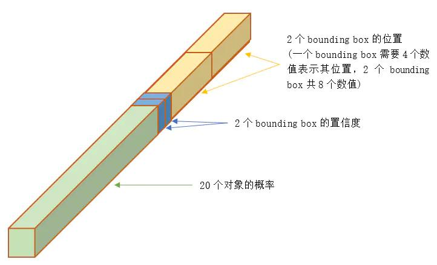
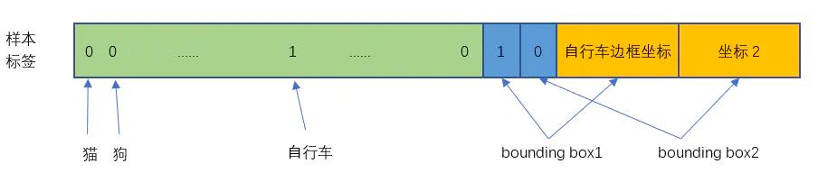
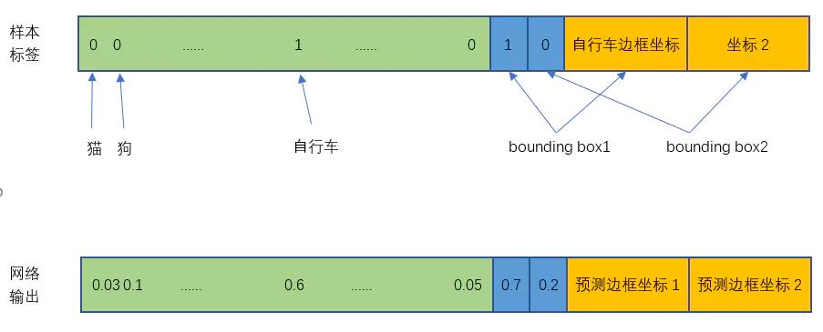

本文介绍了计算机视觉中单阶段目标检测问题的解决方法，即 Yolo 系列。

<!--more-->

 ---
 
- [1. 前言](#1-前言)
- [2. YOLO V1](#2-yolo-v1)
  - [2.1. 输入](#21-输入)
  - [2.2. 输出](#22-输出)
  - [2.3. 构造训练样本](#23-构造训练样本)
  - [2.4. 损失函数](#24-损失函数)
  - [2.5. 训练](#25-训练)
  - [2.6. 测试预测](#26-测试预测)
  - [2.7. 结论](#27-结论)
- [3. 参考文献](#3-参考文献)

# 1. 前言

Yolo，SSD 这类 one-stage 算法，仅仅使用一个卷积神经网络 CNN 直接预测不同目标的类别与位置。一阶段方法的速度快，但是准确性要低一些。

# 2. YOLO V1

YOLO意思是You Only Look Once，创造性的将候选区和对象识别这两个阶段合二为一，看一眼图片（不用看两眼哦）就能知道有哪些对象以及它们的位置。

实际上，YOLO并没有真正去掉候选区，而是采用了预定义的候选区（准确点说应该是预测区，因为并不是Faster RCNN所采用的Anchor）。也就是将图片划分为 $7\times 7=49$ 个网格（grid），每个网格允许预测出 2 个边框（bounding box，包含某个对象的矩形框），总共 $49\times 2=98$ 个 bounding box。可以理解为 98 个候选区，它们很粗略的覆盖了图片的整个区域。

## 2.1. 输入

输入就是原始图像，唯一的要求是缩放到 $448\times 448$ 的大小。主要是因为YOLO的网络中，卷积层最后接了两个全连接层，全连接层是要求固定大小的向量作为输入，所以倒推回去也就要求原始图像有固定的尺寸。

## 2.2. 输出

输出是一个 $7\times 7\times 30$ 的张量。$7\times 7$ 对应原始图像的网格，30维向量 = 20个对象的概率 + 2个bounding box * 4个坐标 + 2个bounding box的置信度。

**前 20 维**，one hot 编码。因为YOLO支持识别20种不同的对象（人、鸟、猫、汽车、椅子等），所以这里有20个值表示该网格位置存在任一种对象的概率。

**中 2 维**，2 个 bounding box 的置信度。 = 该 bounding box 内有对象的概率 * 该 bounding box 与该对象实际 bounding box 的 IOU。

**后 8 维**，2 个 bounding box 的位置。每个 bounding box 需要 4 个数值来表示其位置，(Center_x, Center_y, width, height)，2 个 bounding box 共需要 8 个数值来表示其位置。

$7\times 7$网格，每个网格2个bounding box，对 $448\times 448$ 输入图像来说覆盖粒度有点粗。我们也可以设置更多的网格以及更多的bounding box。设网格数量为 $S\times S$，每个网格产生 B 个边框（4 位置 + 1 置信度），网络支持识别 C 个不同的对象。这时，输出的向量长度为： $C + B\times (4+1)$ 整个输出的tensor就是： $S\times S\times (C + B\times (4+1))$。

## 2.3. 构造训练样本

- **20 个对象分类的概率**

对于输入图像中的每个对象，先找到其中心点。中心点落在某个网格内，该网格对应 30 维向量中的 1 维置 1，其它维度置 0（也即一个网格只能预测 1 个对象，网络一共能从一张图片中检测49个对象）。这就是所谓的"中心点所在的网格对预测该对象负责"。

- **2 个 bounding box 的位置**

训练样本的 bounding box 位置应该填写对象实际的bounding box，但一个对象对应了 2 个 bounding box，该填哪一个呢？上面讨论过，需要根据网络输出的bounding box 与对象实际 bounding box 的 IOU 来选择，所以要在训练过程中动态决定到底填哪一个 bounding box。参考下面第 3 点。

- **2 个 bounding box 的置信度**

上面讨论过置信度公式

$$
Confidence = Pr(Object) * IOU^{truth}_{pre}
$$

2 个 bounding box 的 $IOU$，哪个比较大就由哪个 bounding box 负责预测该对象是否存在，相应的 $P(Object)=1$，$Confidence = IOU$，该网格其它 bounding box 的 $Confidence = 0$。

注意，在训练过程中等网络输出以后，比较两个 bounding box 与自行车实际位置的 IOU，自行车的位置（实际 bounding box）放置在 IOU 比较大的那个 bounding box（图中假设是 bounding box1），且该 bounding box 的置信度设为 1。

## 2.4. 损失函数

损失函数就是网络实际输出与标签之间的误差，YOLO V1 简单粗暴采用 sum-squared error loss。

$$
\begin{aligned}
loss =&\lambda_{coord}\sum_{i=0}^{S^2}\sum_{j=0}^{B}[(x_i-\hat{x}_i)^2+(y_i-\hat{y}_i)^2]\\
&+\lambda_{coord}\sum_{i=0}^{S^2}\sum_{j=0}^{B}\mathbb{I}_{ij}^{obj}[(\sqrt w_i-\sqrt{\hat{w}_i})^2+(\sqrt h_i-\sqrt{\hat{h}_i})^2]\\
&+\sum_{i=0}^{S^2}\sum_{j=0}^{B}\mathbb{I}_{ij}^{obj}(C_i-\hat C_i)^2\\
&+\lambda_{noobj}\sum_{i=0}^{S^2}\sum_{j=0}^{B}\mathbb{I}_{ij}^{noobj}(C_i-\hat C_i)^2\\
&+\sum_{i=0}^{S^2}\mathbb{I}_{i}^{obj}\sum_{c\in classes}(p_i(c) - \hat p_i(c))^2
\end{aligned}
$$

其中，三个布尔系数：

- $\mathbb{I}_{ij}^{obj}=1$ 表示第 $i$ 个网格的第 $j$ 个 bounding box 中存在对象；
- $\mathbb{I}_{ij}^{noobj}=1$ 表示第 $i$ 个网格的第 $j$ 个 bounding box 中不存在对象；
- $\mathbb{I}_{i}^{obj}=1$ 表示第 $i$ 个网格中存在对象。

加入这些项的意义在于，只对符合布尔条件的 网格 / bounding box 才参与误差计算。

**第一行**，中心点的误差。

**第二行**，边框宽度高度的误差。注意取了平方根，这是为了平衡小框和大框的不同权重，因为绝对偏差在小框上更加敏感。取平方根可以降低这种敏感度的差异，使得较大的对象和较小的对象在尺寸误差上有相似的权重

系数 $\lambda_{coord}=5$ 用来调高位置误差（相对于分类误差和置信度误差）的权重。

**第三行**，存在对象的 bounding box 的置信度误差。

**第四行**，不存在对象的 bounding box 的置信度误差。因为不存在对象的 bounding box 应该老老实实的说 "我这里没有对象"，也就是输出尽量低的置信度。如果它不恰当的输出较高的置信度，会与真正有对象预测的那个 bounding box 产生混淆。即正确的对象概率最好是 1，所有其它对象的概率最好是 0。

系数 $\lambda_{noobj}=0.5$ 用来调低位置误差（相对于分类误差和置信度误差）的权重。

**第五行**，对于有对象的网格（$\mathbb{I}_{i}^{obj}=1$），分类的误差。这里将分类的向量与标签的 one-hot 向量进行作差然后求平方，即**把分类问题当作回归问题**。

## 2.5. 训练

最后一层采用线性激活函数，其它层都是 Leaky ReLU。训练过程采用了 drop out 和数据增强来防止过拟合。

## 2.6. 测试预测

测试时，每个网格预测的 class 的概率（比如前 20 维向量中最大的那个值），和 bounding box 预测的 confidence 值相乘，就得到每个 bounding box 的 class-specific confidence score：

$$
Pr(C_i) = Pr(C_i\vert Object) *Pr(Object) * IOU_{pred}^{truth}
$$

然后设置阈值，滤掉得分低的 boxes，对保留的 boxes 进行 NMS 处理，就得到最终的检测结果。

具体而言：每个网格有 20 个对象的概率 * 2个 bounding box 的置信度，共40个得分（候选对象）。49个网格共1960个得分。Andrew Ng建议每种对象分别进行NMS，那么每种对象有 1960/20=98 个得分。

NMS步骤如下：
1）设置一个Score的阈值，低于该阈值的候选对象排除掉（将该Score设为0）
2）遍历每一个对象类别
 2.1）遍历该对象的98个得分
  2.1.1）找到Score最大的那个对象及其bounding box，添加到输出列表
  2.1.2）对每个Score不为0的候选对象，计算其与上面2.1.1输出对象的bounding box的IOU
  2.1.3）根据预先设置的IOU阈值，所有高于该阈值（重叠度较高）的候选对象排除掉（将Score设为0）
  2.1.4）如果所有bounding box要么在输出列表中，要么Score=0，则该对象类别的NMS完成，返回步骤2处理下一种对象
3）输出列表即为预测的对象

## 2.7. 结论

YOLO以速度见长，处理速度可以达到45fps，其快速版本（网络较小）甚至可以达到155fps。这得益于其识别和定位合二为一的网络设计，而且这种统一的设计也使得训练和预测可以端到端的进行，非常简便。

不足之处是小对象检测效果不太好（尤其是一些聚集在一起的小对象），对边框的预测准确度不是很高，总体预测精度略低于Fast RCNN。主要是因为网格设置比较稀疏，而且每个网格只预测两个边框，另外Pooling层会丢失一些细节信息，对定位存在影响。

# 3. 参考文献

[1] X猪. [YOLO v1深入理解](https://www.jianshu.com/p/cad68ca85e27). 简书
