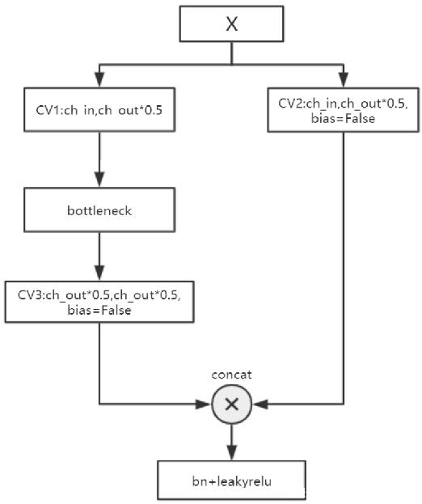

本文介绍了计算机视觉中单阶段目标检测问题的一个最新实现，即 YOLO V5。

<!--more-->

 ---
 
- [1. 网络结构](#1-网络结构)
  - [1.1. parameters](#11-parameters)
  - [1.2. backnone](#12-backnone)
    - [1.2.1. Focus](#121-focus)
    - [1.2.2. Conv](#122-conv)
    - [1.2.3. BottleneckCSP](#123-bottleneckcsp)
  - [1.3. head](#13-head)
- [2. 训练](#2-训练)
  - [2.1. 准备标签](#21-准备标签)
  - [2.2. 数据存放位置](#22-数据存放位置)
  - [2.3. 准备模型](#23-准备模型)
  - [2.4. 进行训练](#24-进行训练)
- [3. 测试](#3-测试)
  - [3.1. 自定义检测](#31-自定义检测)
  - [3.2. 检测参数](#32-检测参数)
- [4. 其它](#4-其它)
  - [4.1. Citation](#41-citation)

# 1. 网络结构

> https://www.cnblogs.com/xiaoheizi-12345/p/14287592.html


其中橙色的数字表示层号，0-9层构成backbone，10-23层构成head，17、20、23 层的输出是Detect()函数的输入。

- `C3`后的参数表示`(c_in, c_out)*该模块堆叠的次数`
- `Conv`和Focus参数`(c_in, c_out, kernel_size, stride)`
- `SPP`后的参数`(c_in, c_out, [kernel_size1,kernel_size2,kernel_size3])`
- `Concat`是`axes=1`时的合并（增加通道）
- `upsample`的`scale_factor`为`2`，输出图像为输入的`2`倍。

> https://www.bilibili.com/video/BV18K411n7rc

yolov5 是使用 `xxxx.yaml` 配置文件，通过`./models/yolo.py`解析文件加了一个输入构成的网络模块。以 `yolov5s.yaml` 为例：

```yaml
# parameters
nc: 80  # number of classes
depth_multiple: 0.33  # model depth multiple
width_multiple: 0.50  # layer channel multiple

# anchors
anchors:
  - [10,13, 16,30, 33,23]  # P3/8
  - [30,61, 62,45, 59,119]  # P4/16
  - [116,90, 156,198, 373,326]  # P5/32

# YOLOv5 backbone
backbone:
  # [from, number, module, args]
  [[-1, 1, Focus, [64, 3]],  # 0-P1/2
   [-1, 1, Conv, [128, 3, 2]],  # 1-P2/4
   [-1, 3, C3, [128]],
   [-1, 1, Conv, [256, 3, 2]],  # 3-P3/8
   [-1, 9, C3, [256]],
   [-1, 1, Conv, [512, 3, 2]],  # 5-P4/16
   [-1, 9, C3, [512]],
   [-1, 1, Conv, [1024, 3, 2]],  # 7-P5/32
   [-1, 1, SPP, [1024, [5, 9, 13]]],
   [-1, 3, C3, [1024, False]],  # 9
  ]

# YOLOv5 head
head:
  [[-1, 1, Conv, [512, 1, 1]],
   [-1, 1, nn.Upsample, [None, 2, 'nearest']],
   [[-1, 6], 1, Concat, [1]],  # cat backbone P4
   [-1, 3, C3, [512, False]],  # 13

   [-1, 1, Conv, [256, 1, 1]],
   [-1, 1, nn.Upsample, [None, 2, 'nearest']],
   [[-1, 4], 1, Concat, [1]],  # cat backbone P3
   [-1, 3, C3, [256, False]],  # 17 (P3/8-small)

   [-1, 1, Conv, [256, 3, 2]],
   [[-1, 14], 1, Concat, [1]],  # cat head P4
   [-1, 3, C3, [512, False]],  # 20 (P4/16-medium)

   [-1, 1, Conv, [512, 3, 2]],
   [[-1, 10], 1, Concat, [1]],  # cat head P5
   [-1, 3, C3, [1024, False]],  # 23 (P5/32-large)

   [[17, 20, 23], 1, Detect, [nc, anchors]],  # Detect(P3, P4, P5)
  ]
```
- `from` 列参数：`-1` 代表是从上一层获得的输入，`-2` 表示从上两层获得的输入。
- `number` 列参数：1 表示只有一个，3 表示有三个相同的模块。
- `module` 表示模块：包括 SPP、Conv、Bottleneck、BottleneckCSP，代码可以在`./models/common.py`中获取到。
- `Focus` 的 `[64, 3]` 表示输入图片通道数为`3`（RGB），卷积核个数为 `64`即输出通道数为`64`；
- `[128, 3, 2]` 解析得到 `[64, 128, 3, 2]` ，`64` 是输入，`128` 表示输出 128 个卷积核个数，也是是输出通道数，`3` 表示 `3×3` 的卷积核，`2` 表示步长为 2。

yaml 中输入都省去了，因为输入都是上层的输出。为了修改过于麻烦，这里输入的获取是从`./models/yolo.py`的`def parse_model(md, ch)`函数中解析得到的。

## 1.1. parameters

> https://www.cnblogs.com/E-Dreamer-Blogs/p/13297580.html

- **`nc`**：类别数。

- **`depth_multiple`**：控制**模型的深度**。

  在 backbone 中的 `number ≠ 1` 的情况下生效，也即对数量大于 1 的层生效。
  - yolov5s中：`depth_multiple = 0.33`，即3个模块缩减为1个，9个模块缩减为3个；
  - yolov5m中: `depth_multiple = 0.66`，即3个模块缩减为2个，9个模块缩减为6个；
  - yolov5l中: `depth_multiple = 1`
  - yolov5x中: `depth_multiple = 1.33`，即3个模块扩充为4个，9个模块缩扩充12个；
  
  假设 yolov5l 中有三个 BottleneckCSP，那 yolov5s 中就只有一个 BottleneckCSP，那
  

- **`width_multiple`**：控制**卷积核的个数**。

  用于设置 arguments，例如 yolov5s 设置为 0.5，则 Focus 就变成 `[32, 3]`，Conv 就变成 `[64, 3, 2]`。以此类推，卷积核的个数都变成了设置的一半。

yolov5提供了 s、m、l、x 四种尺寸的网络，所有的`.yaml`文件都一样，只需要修改这两个参数就可以调整模型的网络结构。

## 1.2. backnone

https://blog.csdn.net/jiafeier_555/article/details/109052569

骨干网络特征图从大到小，深度加深。

### 1.2.1. Focus

一种下采样方法，从高分辨率图像中，周期性的抽出像素点重构到低分辨率图像中，即将图像相邻的四个位置进行堆叠，聚焦 wh 维度信息到 c 通道空间，提高每个点感受野，并**减少原始信息的丢失**。一种 space to depth 方法。

```python
class Focus(nn.Module):
    # Focus wh information into c-space
    def __init__(self, c1, c2, k=1, s=1, p=None, g=1, act=True):  # ch_in, ch_out, kernel, stride, padding, groups
        super(Focus, self).__init__()
        self.conv = Conv(c1 * 4, c2, k, s, p, g, act)

    def forward(self, x):  # x(b,c,w,h) -> y(b,4c,w/2,h/2)
        return self.conv(torch.cat([x[..., ::2, ::2], x[..., 1::2, ::2], x[..., ::2, 1::2], x[..., 1::2, 1::2]], 1))
```
具体操作是在一张图片中每隔一个像素拿到一个值，类似于邻近下采样，这样就拿到了四张图片，四张图片互补，长的差不多，**但是没有信息丢失**，这样一来，将 W、H 信息就集中到了 C 维度，输入通道扩充了4倍，即拼接起来的图片相对于原先的RGB三通道模式变成了12个通道，最后将得到的新图片再经过卷积操作，最终得到了没有信息丢失情况下的二倍下采样特征图。

以yolov5s为例，原始的 `640 × 640 × 3` 的图像输入Focus结构，采用切片操作，先变成 `320 × 320 × 12` 的特征图，再经过一次卷积操作，最终变成 `320 × 320 × 32` 的特征图。切片操作如下：


该模块的设计主要是减少计算量加快速度。作者原话：Focus() module is designed for FLOPS reduction and speed increase, not mAP increase.

**【然而】**......

**计算量（FLOPs）**：即浮点运算数，可以用来衡量算法/模型的复杂度，这关系到算法速度，大模型的单位通常为G，小模型单位通常为M；通常只考虑**乘加**操作的数量，而且只考虑Conv和FC等参数层的计算量，忽略BN和PReLU等，一般情况下，Conv和FC层也会忽略仅纯加操作的计算量，如bias偏置加和shoutcut残差加等，目前技术有BN和CNN可以不加bias。计算公式（卷积层）：

```
FLOPs =（Cin x Kh x Kw - 1）× H × W × Cout
```

不考虑bias时有-1，有bias时没有-1。

输入 `640 × 640 × 3` 的图片，

普通下采样：`3 × 3 x 32s2p1` 卷积，得到 `320 × 320 × 32` 的特征图，计算量为：

```
FLOPs（conv） = 3 × 3 × 3 × 320 × 320 × 32 = 88473600
```

Focus：切片操作，先变成 `320 × 320 × 12` 的特征图，再经过 `3 × 3 x 32s1p1` 卷积操作，得到 `320 × 320 × 32` 的特征图，计算量为：

```
FLOPs（Focus） = 3 × 3 × 12 × 32 × 320 × 320 = 353894400
```

可以看出，Focus的计算量是普通卷积的4倍，但是下采样时没有信息的丢失。

### 1.2.2. Conv

```python
class Conv(nn.Module):
    # Standard convolution
    def __init__(self, c1, c2, k=1, s=1, p=None, g=1, act=True):  # ch_in, ch_out, kernel, stride, padding, groups
        super(Conv, self).__init__()
        self.conv = nn.Conv2d(c1, c2, k, s, autopad(k, p), groups=g, bias=False)
        self.bn = nn.BatchNorm2d(c2)
        self.act = nn.Hardswish() if act else nn.Identity()

    def forward(self, x):
        return self.act(self.bn(self.conv(x)))

    def fuseforward(self, x):
        return self.act(self.conv(x))
    
def autopad(k, p=None):  # kernel, padding
    # Pad to 'same'
    if p is None:
        p = k // 2 if isinstance(k, int) else [x // 2 for x in k]  # auto-pad
    return p

```
CONV层使用的激活函数是 `Hardswish`;

atuopad 是自动填 padding 的值，在`k=1`的时候，`padding=0`，在`k=3`的时候`padding=1`，保证了卷积模式为 same。

### 1.2.3. BottleneckCSP

首先介绍 **bottleneck**。

bottleneck 主要目的是为了减少参数的数量，从而减少计算量，且在降维之后可以更加有效、直观地进行数据的训练和特征提取。

```python
class Bottleneck(nn.Module):
    # Standard bottleneck
    def __init__(self, c1, c2, shortcut=True, g=1, e=0.5):  # ch_in, ch_out, shortcut, groups, expansion
        super(Bottleneck, self).__init__()
        c_ = int(c2 * e)  # hidden channels
        self.cv1 = Conv(c1, c_, 1, 1)
        self.cv2 = Conv(c_, c2, 3, 1, g=g)
        self.add = shortcut and c1 == c2

    def forward(self, x):
        return x + self.cv2(self.cv1(x)) if self.add else self.cv2(self.cv1(x))
```
参数说明：

- `c1`：bottleneck 结构的输入通道维度；
- `c2`：bottleneck 结构的输出通道维度；
- `shortcut`：是否给bottleneck 结构添加shortcut连接，添加后即为ResNet模块；
- `g`：groups，通道分组的参数，输入通道数、输出通道数必须同时满足被groups整除；
- `e`：expansion: bottleneck 结构中的瓶颈部分的通道膨胀率，使用0.5即为变为输入的1/2；


瓶颈层的瓶颈主要体现在通道数上面。一般 `1 x 1` 卷积具有很强的灵活性，这里用于降低通道数，如膨胀率为  `0.5`，若输入通道为 `640`，那么经过`1 x 1` 的卷积层之后变为 `320`；经过 `3x3` 之后变为输出的通道数，这样参数量会大量减少。

然后介绍 **CSP Bottleneck**。

> CSP Bottleneck: https://github.com/WongKinYiu/CrossStagePartialNetworks

```python
class BottleneckCSP(nn.Module):
    # CSP Bottleneck https://github.com/WongKinYiu/CrossStagePartialNetworks
    def __init__(self, c1, c2, n=1, shortcut=True, g=1, e=0.5):  # ch_in, ch_out, number, shortcut, groups, expansion
        super(BottleneckCSP, self).__init__()
        c_ = int(c2 * e)  # hidden channels
        self.cv1 = Conv(c1, c_, 1, 1)
        self.cv2 = nn.Conv2d(c1, c_, 1, 1, bias=False)
        self.cv3 = nn.Conv2d(c_, c_, 1, 1, bias=False)
        self.cv4 = Conv(2 * c_, c2, 1, 1)
        self.bn = nn.BatchNorm2d(2 * c_)  # applied to cat(cv2, cv3)
        self.act = nn.LeakyReLU(0.1, inplace=True)
        self.m = nn.Sequential(*[Bottleneck(c_, c_, shortcut, g, e=1.0) for _ in range(n)])

    def forward(self, x):
        y1 = self.cv3(self.m(self.cv1(x)))
        y2 = self.cv2(x)
        return self.cv4(self.act(self.bn(torch.cat((y1, y2), dim=1))))
```
参数说明：

- `c1`：BottleneckCSP 结构的输入通道维度；
- `c2`：BottleneckCSP 结构的输出通道维度；
- `n`：bottleneck 结构 结构的个数；
- `shortcut`：是否给bottleneck 结构添加shortcut连接，添加后即为ResNet模块；
- `g`：groups，通道分组的参数，输入通道数、输出通道数必须同时满足被groups整除；
- `e`：expansion: bottleneck 结构中的瓶颈部分的通道膨胀率，使用0.5即为变为输入的12；
- `torch.cat((y1, y2), dim=1)`：这里是指定在第1个维度上进行合并，即在channel维度上合并;
- `c_`：BottleneckCSP 结构的中间层的通道数，由膨胀率`e`决定。

Cross Stage Partial Network (CSPNet) 就是从网络结构设计的角度来解决以往工作在推理过程中需要很大计算量的问题。



CSP bottleneck 结构在 Bottleneck 部分存在一个可修改的参数 `n`，标识使用的Bottleneck结构个数。这一条也是我们的主分支，是对残差进行学习的主要结构，右侧分支`nn.Conv2d`是shortcut分支。

倘若该层后面有BN层的话，一般选择`bias=False`（因为BN包含偏置），而后面没有的时候`bias=True`。上面的 Conv 层和 CSPNet 也是这个规律

## 1.3. head

YOLO V5 使用的 head 是 PANet。

> PANet: https://arxiv.org/pdf/1803.01534.pdf

# 2. 训练

## 2.1. 准备标签

yolo格式的标签为txt格式的文件，文件名跟对应的图片名一样，除了后缀改为了.txt。 具体格式如下：

- 每个目标一行，整个图片没有目标的话不需要有txt文件
- 每行的格式为`class_num x_center y_center width height`
- 其中`class_num`取值为`0`至`total_class - 1`，框的四个值`x_center y_center width height`是相对于图片分辨率大小正则化的`0-1`之间的数，左上角为`(0,0)`，右下角为`(1,1)`
- 
  

## 2.2. 数据存放位置

yolov5的代码会根据图片找标签，具体形式的把图片路径`/images/*.jpg`替换为`/labels/*.txt`，所以要新建两个文件夹，一个名为`images`存放图片，一个名为`labels`存放标签txt文件，如分训练集、验证集和测试集的话，还要再新建各自的文件夹，如：

```
coco
|--images
   |--train2017
   |--val2017
|--labels
   |--train2017
   |--val2017
```

## 2.3. 准备模型

自定义训练需要修改.yaml文件，一个是模型文件(可选)，一个是数据文件。

- 模型文件(可选):可以根据你选择训练的模型，直接修改`./models`里的`yolov5s.yaml / yolov5m.yaml / yolov5l.yaml / yolov5x.yaml`文件，只需要将nc: 80中的80修改为你数据集的类别数。其他为模型结构不需要改。 注意 :当需要随机初始化时才会使用本文件，官方推荐使用预训练权重初始化。
- 数据文件:根据`./data`文件夹里的coco数据文件，制作自己的数据文件，在数据文件中定义训练集、验证集、测试集路径；定义总类别数；定义类别名称

``` python
# train and val data as 1) directory: path/images/, 2) file: path/images.txt, or 3) list: [path1/images/, path2/images/]
train: ../coco128/images/train2017/
val: ../coco128/images/val2017/
test:../coco128/images/test2017/

# number of classes
nc: 80

# class names
names: ['person', 'bicycle', 'car', 'motorcycle', 'airplane', 'bus', 'train', 'truck', 'boat', 'traffic light',
        'fire hydrant', 'stop sign', 'parking meter', 'bench', 'bird', 'cat', 'dog', 'horse', 'sheep', 'cow',
        'elephant', 'bear', 'zebra', 'giraffe', 'backpack', 'umbrella', 'handbag', 'tie', 'suitcase', 'frisbee',
        'skis', 'snowboard', 'sports ball', 'kite', 'baseball bat', 'baseball glove', 'skateboard', 'surfboard',
        'tennis racket', 'bottle', 'wine glass', 'cup', 'fork', 'knife', 'spoon', 'bowl', 'banana', 'apple',
        'sandwich', 'orange', 'broccoli', 'carrot', 'hot dog', 'pizza', 'donut', 'cake', 'chair', 'couch',
        'potted plant', 'bed', 'dining table', 'toilet', 'tv', 'laptop', 'mouse', 'remote', 'keyboard', 
        'cell phone', 'microwave', 'oven', 'toaster', 'sink', 'refrigerator', 'book', 'clock', 'vase', 'scissors', 
        'teddy bear', 'hair drier', 'toothbrush']
```

## 2.4. 进行训练

训练直接运行train.py即可，后面根据需要加上指令参数，--weights指定权重，--data指定数据文件，--batch-size指定batch大小，--epochs指定epoch。一个简单的训练语句：

```python
# 使用yolov5s模型训练coco128数据集5个epochs，batch size设为16
python train.py --batch 16 --epochs 5 --data ./data/coco128.yaml --weights ./weights/yolov5s.pt
```
训练指令说明:

有参：

- `--weights` (⭐)指定权重，如果不加此参数会默认使用COCO预训的`yolov5s.pt`，`--weights ''`则会随机初始化权重
- `--cfg` 指定模型文件
- `--data` (⭐)指定数据文件
- `--hyp`指定超参数文件
- `--epochs` (⭐)指定epoch数，默认300
- `--batch-size` (⭐)指定batch大小，默认16，官方推荐越大越好，用你GPU能承受最大的batch size，可简写为--batch
- `--img-size` 指定训练图片大小，默认640，可简写为--img
- `--name` 指定结果文件名，默认result.txt
- `--device` 指定训练设备，如--device 0,1,2,3
- `--local_rank` 分布式训练参数，不要自己修改！
- `--log-imgs` W&B的图片数量，默认16，最大100
- `--workers` 指定dataloader的workers数量，默认8
- `--project` 训练结果存放目录，默认./runs/train/
- `--name` 训练结果存放名，默认exp
无参：

- `--rect`矩形训练
- `--resume` 继续训练，默认从最后一次训练继续
- `--nosave` 训练中途不存储模型，只存最后一个checkpoint
- `--notest` 训练中途不在验证集上测试，训练完毕再测试
- `--noautoanchor` 关闭自动锚点检测
- `--evolve`超参数演变
- `--bucket`使用gsutil bucket
- `--cache-images` 使用缓存图片训练
- `--image-weights` 训练中对图片加权重
- `--multi-scale` 训练图片大小+/-50%变换
- `--single-cls` 单类训练
- `--adam` 使用torch.optim.Adam()优化器
- `--sync-bn` 使用SyncBatchNorm，只在分布式训练可用
- `--log-artifacts` 输出artifacts,即模型效果
- `--exist-ok` 如训练结果存放路径重名，不覆盖已存在的文件夹
- `--quad` 使用四分dataloader

# 3. 测试

首先明确，推理是直接检测图片，而测试是需要图片有相应的真实标签的，相当于检测图片后再把推理标签和真实标签做mAP计算。

使用`./weights/yolov5x.pt`权重检测`./data/coco.yaml`里定义的测试集，图片分辨率设为672。

```python
python test.py --weights ./weights/yolov5x.pt --data ./data/coco.yaml --img 672
```

有参：

- `--weights`(⭐) 测试所用权重，默认yolov5sCOCO预训练权重模型
- `--data`(⭐) 测试所用的.yaml文件，默认使用./data/coco128.yaml
- `--batch-size` 测试用的batch大小，默认32，这个大小对结果无影响
- `--img-size` 测试集分辨率大小，默认640，测试建议使用更高分辨率
- `--conf-thres`目标置信度阈值，默认0.001
- `--iou-thres`NMS的IOU阈值，默认0.65
- `--task` 指定任务模式，train, val, 或者test,测试的话用--task test
- `--device` 指定设备，如--device 0 --device 0,1,2,3 --device cpu
- `--project` 指定结果存放路径，默认./runs/test/
- `--name` 指定结果存放名,默认`exp`

无参：

- `--single-cls` 视为只有一类
- `--augment` 增强识别
- `--verbose` 输出各个类别的mAP
- `--save-txt` 输出标签结果(yolo格式)
- `--save-hybrid` 输出标签+预测混合结果到txt
- `--save-conf` 保存置信度至输出文件中
- `--save-json` 保存结果为json
- `--exist-ok` 若重名不覆盖
```

# 检测

## 快速检测

直接执行`detect.py`，指定一下要推理的目录即可，如果没有指定权重，会自动下载默认COCO预训练权重模型。推理结果默认会保存到`./runs/detect`中。
注意：每次推理会清空output文件夹，注意留存推理结果。

​```python
# 快速推理，--source 指定检测源，以下任意一种类型都支持：
python detect.py --source 0  # 本机默认摄像头
                          file.jpg  # 图片 
                          file.mp4  # 视频
                          path/  # 文件夹下所有媒体
                          path/*.jpg  # 文件夹下某类型媒体
```

## 3.1. 自定义检测

使用权重`./weights/yolov5s.pt`去推理`./data/images`文件夹下的所有媒体，并且推理置信度阈值设为0.5:

```python
python detect.py --source ./data/images/ --weights ./weights/yolov5s.pt --conf 0.5
```

## 3.2. 检测参数

自己根据需要加各种指令。

有参：

- `--source`(⭐) 指定检测来源
- `--weights` 指定权重，不指定的话会使用yolov5s.pt预训练权重
- `--img-size` 指定推理图片分辨率，默认640，也可使用--img
- `--conf-thres` 指定置信度阈值，默认0.4，也可使用--conf
- `--iou-thres` 指定NMS(非极大值抑制)的IOU阈值，默认0.5
- `--device` 指定设备，如`--device 0` `--device 0,1,2,3` `--device cpu`
- `--classes` 只检测特定的类，如`--classes 0 2 4 6 8`
- `--project` 指定结果存放路径，默认`./runs/detect/`
- `--name` 指定结果存放名,默认`exp`

无参：

- `--view-img` 图片形式显示结果
- `--save-txt` 输出标签结果(yolo格式)
- `--save-conf` 在输出标签结果txt中同样写入每个目标的置信度
- `--agnostic-nms` 使用agnostic NMS(前背景)
- `--augment` 增强识别，速度会慢不少。详情
- `--update` 更新所有模型
- `--exist-ok` 若重名不覆盖

# 4. 其它

BFLOPS 的概念：https://blog.csdn.net/weixin_38145317/article/details/106281462

## 4.1. Citation

[](https://zenodo.org/badge/latestdoi/264818686)

