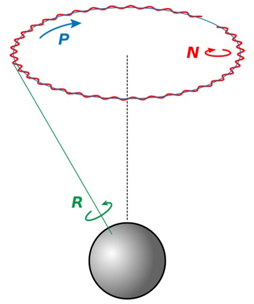
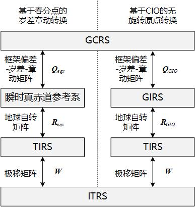

本文介绍了天文学中基本的座标系统。

<!--more-->

---

- [1. 背景](#1-背景)
  - [1.1. 国际地球自转和参考框架服务](#11-国际地球自转和参考框架服务)
  - [1.2. 国际天文学联合会](#12-国际天文学联合会)
- [2. 坐标系](#2-坐标系)
  - [2.1. 参考系统与参考框架](#21-参考系统与参考框架)
  - [2.2. 坐标系的分类](#22-坐标系的分类)
  - [2.3. 国际天球参考系统和参考框架（ICRS/ICRF）](#23-国际天球参考系统和参考框架icrsicrf)
    - [2.3.1. 太阳系质心天球参考系统和参考框架](#231-太阳系质心天球参考系统和参考框架)
    - [2.3.2. 地心天球参考系统和参考框架](#232-地心天球参考系统和参考框架)
  - [2.4. J2000.0平赤道平春分点坐标系](#24-j20000平赤道平春分点坐标系)
  - [2.5. 国际地球参考系统和参考框架（GCRS/GCRF）](#25-国际地球参考系统和参考框架gcrsgcrf)
  - [2.6. 地理坐标系](#26-地理坐标系)
  - [2.7. 当地水平坐标系](#27-当地水平坐标系)
  - [2.8. 飞行坐标系](#28-飞行坐标系)
  - [2.9. 本体坐标系](#29-本体坐标系)
- [3. 坐标变换](#3-坐标变换)
  - [3.1. 岁差、章动和极移](#31-岁差章动和极移)
  - [3.2. 地心天球参考系统与国际地球参考系统的变换](#32-地心天球参考系统与国际地球参考系统的变换)
  - [3.3. 地心天球参考系到地球固连坐标系的变换](#33-地心天球参考系到地球固连坐标系的变换)
- [4. 参考文献](#4-参考文献)

# 1. 背景

## 1.1. 国际地球自转和参考框架服务

[国际地球自转和参考框架服务](https://www.iers.org/IERS/EN/Home/home_node.html)（International Earth Rotation and Reference System, IERS）（官网：https://www.iers.org/IERS/EN/Home/home_node.html ）的主要目标是通过提供国际陆空参考系统的入口来为天文学、测地学和地球物理学的研究团体服务。该网站提供了有关国际地球自转服务中心的任务、机构设置、成员以及相关产品的详细信息，同时还提供了通向其数据库和公告中的观测数据与研究结果的入口。

国际地球自转服务(International Earth Rotation Service-简称IERS)由国际大地测量学和地球物理学联合会及与国际天文学联合会联合创办，用以取代国际时间局(BIH)的地球自转部分和原有的国际极移服务(IPMS)。

## 1.2. 国际天文学联合会

[国际天文学联合会](https://www.iau.org/)（International Astronomical Union, IAU）（官网：https://www.iau.org/ ）是世界各国天文学术团体联合组成的非政府性学术组织，其宗旨是组织国际学术交流，推动国际协作，促进天文学的发展。国际天文学联合会于1919年7月在布鲁塞尔成立。

天文学联盟有73个成员国，其中包括专业天文学研究达到较高程度的大多数国家。天文学联盟的一个主要从事地面和空间天文学各学科的 10528 多名成员的直接参与。

# 2. 坐标系

## 2.1. 参考系统与参考框架

**参考系统**（reference system）是关于坐标系的“理论定义”，包括原点、坐标轴、坐标平面，以及基本的数学或物理模型。其包含自身部署应用所需的模型和标准，用以规定坐标系三个轴向和坐标原点的建模方法，可以理解为一组处方（prescriptions）和公约（conventions）。参考系统也有被翻译为参考框架或参考架。

**参考框架**（reference frame）是对参考系统的“具体实现”，一般是通过对一组参考坐标（天体参考框架是一组基本恒星，地球参考框架是一组基准站）进行观测来具体实现某一参考系统。建立参考框架必须遵循一定的原则，这些原则包括：如何通过观测建立某些事件的时空坐标，如何实现相应系统（框架）。例如，通过观测以一些天体相对于某参考框架的位置的历书或星表的形式来实现。建立天文参考框架可依据三种原理：星历罗盘、恒星罗盘、惯性罗盘。

1. 星历罗盘是以相互作用的天体平动动力学为基础的。在基本的参考框架中，可给出相应的运动动力学方程，并将这些天体位置的观测结果作为事件的函数来实现相应的框架构建。基于星历罗经建立的参考框架称为动力学参考框架（DRS）。国际地球坐标系（ITRS）的建立主要是基于星历罗经，即人造卫星的观测结果；太阳质心动力学参考框架（BDRS）是通过描述太阳系天体运动的历表来实现的。历表（ephemeris）这个词来源于希腊语（ephemeros表示一天），意思为用于确定太阳系大型天体位置和速度的列表、表格或计算机程序。历表可分为数值历表（DE、EPM）和半解析历表（VSOP2010A和VSOP2010B）。

2. 恒星星表是利用遥远的天体，如类星体的光信息构建的准惯性参考框架，如依巴谷参考框架（HCRS）。

3. 不同于天体的平移运动，如激光陀螺等的惯性系统可定义一个参考框架，它直接构建一个动力学非旋转参考框架。

## 2.2. 坐标系的分类

- **i 系**：地心惯性坐标系（**inertial**）是在惯性空间中静止或作匀速运动的参考系，是一个理想坐标系。实践中将该坐标系的原点固定在地球质心， z 轴平行于地球平均自转轴且指向北极点（协议北极）， x 轴指向平春分点， z 轴在赤道面内且与 x 轴和 z 轴垂直构成右手坐标系，三个轴在惯性空间中固定不动。
- **e 系**：地心地固坐标系(Earth Center Earth Fixed Frame, **ECEF**)是指原点在地心，与地球固连，并随着地球一起转动的坐标系。x 轴指向赤道与本初子午线的交点，z 轴指向地球平均自转轴方向，y 轴与 x、z 轴垂直并满足右手定则，常用符号 e 来表示。
- **n 系**：导航坐标系（Navigation） 一般选当地地理水平坐标系（ Local-Level-Frame, LLF），该坐标系可以提供直观的导航参数。该坐标系的原点为载体中心， x 轴沿参考椭球子午线的切线方向指北， y 轴沿参考椭球法线垂直向下， z 轴在当地水平面内与 x 轴和 y 轴构成右手坐标系，又称为北-东-地（ North-East-Down, **NED**）坐标系。
- **b 系**：同载体固连的一种正交坐标系，x 轴与载体角运动的横滚轴方向相同且指向载体前方， y 轴与载体角运动的俯仰轴方向相同且指向载体右侧， z 轴与载体角运动的航向轴方向相同且与 x 轴和 y 轴构成右手坐标系，称为前-右-下（ Forward-RightDown， **FRD**）坐标系。
- **c 系**：相机坐标系，原点为光学透镜中心， ܺx 轴沿相机镜头方向且向右为正，z 轴沿相机镜头方向且向前为正，y 轴与ܺx 轴和ܼ z 轴构成右手坐标系。

## 2.3. 国际天球参考系统和参考框架（ICRS/ICRF）

**国际天球参考系统**（Celestial Reference System，**ICRS**）是一个准惯性无旋转参考系统，其原点是广义相对论框架下的VLBI测定的太阳系质心，基本平面尽可能接近J2000.0平赤道面，X轴指向J2000.0历元的平春分点方向（被隐含定义在一组星表的23个射电源的平赤经中），Z轴垂直于J2000.0平赤道面，Y轴通过右手定则确定。ICRS是直接由遥远、静止的射电源表来定义的。射电源可被分为三类：定义源、候选源、其它源。定义源应有大量的观测和足够长的数据可以评定位置的稳定性，它们维持着ICRS的轴方向；候选源没有足够的观测数据或观测时间太短，不能用来作为定义源，但它们可能是未来潜在的定义源；其它源包括位置确定较差的源，但在导出各种框架时会用到。

**国际天球参考框架**（Celestial Reference Frame, **ICRF**）是ICRS的一个具体实现，它是通过超长基线干涉测量（Very Long Baseline Interferometry, VLBI）估计一组银河系外射电源的精确坐标确定的（即它相对于遥远的宇宙物体是固定的）。其采用的J2000.0平赤道和平春分点由IAU在1976年发布的协议定义。目前用来实现ICRS的射电源表包含ICRF1和ICRF2两个版本，ICRF1射电源表包含了608个射电源的位置，其中定义源212个，候选源294个，其他源102个；ICRF2射电源表包含了3414个致密天文射电源的精确坐标，有292个定义源。由于ICRF（包括ICRF1和ICRF2）是在射电波段建立的，而基准射电源在光学波段非常暗，对光学观测很不方便，所以IAU12000决议B1.2推荐使用依巴谷星表（Hipparcos Catalogue）作为ICRS在光学波段的主要实现，并命名为依巴谷参考系统（HCRF），其平均观测历元为J1991.25。依巴谷星表比之前的任何光学天体测量星表都精确，而且没有明显的星等差和区域差。与河外射电源相比，最大区别在于有很明显的自行，因此依巴谷星表的位置精度依赖时间，随着时间偏离其平均观测历元而逐渐降低。

### 2.3.1. 太阳系质心天球参考系统和参考框架

**太阳系质心天球参考系统**（Barycentric Celestial Reference System，**BCRS**）是ICRS下属的一种参考系统。BCRS和ICRS的区别体现在不同的抽象层次上。原则上，BCRS轴可以通过不同的技术来固定。但目前它们是由ICRS确定的。严格而言，BCRS的定义应该不参考ICRS。**太阳系质心天球参考框架**（Barycentric Celestial Reference Frame，**BCRF**）是BCRS的一个实现。目前ICRS和BCRS，ICRF和BCRF之间存在混用的情况。

### 2.3.2. 地心天球参考系统和参考框架

**地心天球参考系统**（Geocentric Celestial Reference System，**GCRS**）也是ICRS下属的一种参考系统，其原点在地球质心，是一个局部参考系统。GCRS与BCRS之间的空间坐标转换没有旋转，只有平移。**地心天球参考框架**（Geocentric Celestial Reference Frame，**GCRF**）是GCRS的一个实现。

## 2.4. J2000.0平赤道平春分点坐标系

**J2000.0平赤道平春分点坐标系**（The mean equator and equinox J2000.0），常被称为J2000平赤道地心坐标系，原点在地球质心，xy平面为J2000.0时刻的地球平赤道面，x轴指向J2000.0时刻的平春分点（J2000.0时刻平赤道面与平黄道面的一个交点）。此坐标系常被作为地球卫星的惯性坐标系，卫星运动积分等都在此坐标系计算。J2000平赤道地心坐标系与GCRS之间仅有一个常值偏差矩阵B。**目前IAU推荐用GCRS坐标系逐渐取代J2000平赤道地心坐标系。**

## 2.5. 国际地球参考系统和参考框架（GCRS/GCRF）

在研究与地球有关的科技问题时，都需要以地球为参考的坐标系，称为地球坐标系，它是大地测量学和地球动力学研究的一种基本坐标系。如果把地球潮汐和地壳运动忽略不计，地球重力场和地面点的位置在这个坐标系中是固定不变的。也就是说这个坐标系仅随地球自转而转动，固定在地球上不变，因而也被称为地固坐标系（ECEF）。地球坐标系的建立已有一百多年的历史，1980年以前主要采用的是光学观测。随着空间大地测量的开展，观测人造的或自然的天体打破了集团或国家独有的观测传统，迫切要求确立与使用公用的地球坐标系。但宇宙间不可能存在绝对固定不动的东西，所以建立这种坐标系只能通过一种协议结果来体现，因而这种坐标系也被称协议地球参考系统（CTRS）。

国际上约定统一采用的协议地球参考系统为**国际地球参考系统**（International Terrestrial Reference System，**ITRS**）。IERS主要任务是准确及时提供自转参数，同时建立与保持这个地球参考系统。ITRS是一种地心参考系统，由空间大地测量观测站的坐标和运动速度来定义，是国际地球自转服务的地面参考系统。该系统是国际大地测量学和地球物理学联合会（IUGG）、国际大地测量学协会（IAG）、国际天文学会（IAU）专门决定建立的，有关工作由IERS下属地球参考系统部门负责执行。ITRS的原点在地球质心（包含大气海洋等质量），长度为广义相对论框架下定义的米（SI），坐标轴方向与国际时间局1984.0历元的定义一致，时间演变基准是使用满足无整体旋转NNR（No-Net Rotation）条件的板块运动模型描述地球各块体随时间的变化。

**国际地球参考框架**（International Terrestrial Reference Frame，**ITRF**）是ITRS的一个实现，也就是人们常说的地球固连坐标系（ECEF）。ITRF由IERS每年将全球各地测量站的观测数据进行综合处理分析，就原点差、尺度差和定向差进行平差而确定，并以IERS年报和IERS技术备忘录的形式发布。ITRF是国际上目前公认的精度最高、稳定性最好的地球参考架。ITRF 从 1988 建立起已有13个版本，它们是 ITRF88, ITRF89, ITRF90, ITRF91, ITRF92, ITRF93, ITRF94, ITRF96, ITRF97, ITRF2000, ITRF2005, ITRF2008，ITRF2014。

- **WGS84参考系**：20世纪30年代以来，美国和前苏联等国家利用卫星观测等资料，开展了建立地心坐标系的工作。美国国防部曾先后建立过世界大地坐标系（World Geodetic System，WGS）WGS 30、WGS 33和WGS72，并于1984年开始，经过多年修正和完善，建立起更为精确的地心坐标系统，称为WGS84。<u>WGS84坐标系是目前GPS测量所采用的坐标系统。</u>
- **CGCS2000参考系**：我国当前最新的国家大地坐标系（China Geodetic Coordinate System 2000），原点为包括海洋和大气的整个地球的质量中心，Z轴由原点指向J2000.0历元时刻的地球参考极的方向，X轴由原点指向格林尼治参考子午线与地球赤道面（J2000.0历元时刻）的交点，Y轴与Z轴、X轴构成右手正交坐标系。采用广义相对论意义下的尺度。GCGS 2000 是定义在 ITRF97 底薪坐标系统中的区域性地心坐标框架。<u>CGCS2000为我国北斗导航系统所采用的坐标系统。</u>

## 2.6. 地理坐标系

地理坐标系（Length-Breadth-Height, **LBH** 或 Latitude-Longitude-Height, **LLA**）和地球固连坐标系在理论上是等价的，只不过地球固连坐标系使用直角坐标描述方位，而地理坐标系使用经线和纬线的球面测量值来描述方位。在球面系统中，水平线（或东西线）是等纬度线或纬线。垂直线（或南北线）是等经度线或经线。这些线包络着地球，构成了一个称为经纬网的格网化网络。当地球作为球体建模时，它们是从地心到地球表面上的点的角度测量值（以度为单位）。当使用旋转椭球体（椭球体）时，可通过将与地球表面垂直的线延伸到赤道平面来测量纬度。

地理坐标系的使用需要基于地固坐标系的选取（大概？）。

## 2.7. 当地水平坐标系
当地水平坐标系（Local Level System/Frame，LLS或LLF）的Z轴沿着当地垂线竖直向上，X轴指向当地东方，Y轴指向当地北方，X轴与Y轴、Z轴构成右手正交坐标系。

## 2.8. 飞行坐标系

飞行坐标系是一种固连在飞行器本体的坐标系统，坐标系原点定义在飞行器质心，X轴指向飞行方向，Z轴指向地球质心，Y轴与X轴、Z轴构成右手正交坐标系，垂直于飞行轨道平面。对于航天器，飞行坐标系又可称为轨道坐标系。

## 2.9. 本体坐标系

本体坐标系是一种固连在飞行器本体的坐标系统，坐标系原点定义在飞行器质心，X轴指向飞行器前向中心线方向，Y轴指向垂直于X轴指向载体右侧，Z轴与X轴、Y轴构成右手正交坐标系。

# 3. 坐标变换

## 3.1. 岁差、章动和极移

地球的自转轴在惯性空间中并不固定，而是不断摆动的。此摆动造成地轴绕北黄级顺时针运动，夹角约为23.5度，该运动（进动）在天文学上被称为**岁差**（Precession）。在岁差运动的同时，地轴还在做微小的抖动，称为**章动**（Nutation）。岁差章动的原因主要有两个方面。其一是太阳系行星对地球绕日轨道所产生的摄动影响；其二是太阳和月球对地球赤道隆起部分的摄动影响。早期岁差章动计算依据IAU 1976岁差模型和IAU 1980章动模型。随着时间的推移，上述模型的精度逐渐无法满足需要。因此，IAU规定从2003年1月1日起，采用新的岁差章动模型，即IAU 2000A模型（精度达到0.2mas）或IAU 2000B模型（精度达到1mas）。

地球自转轴相对于地球北极而言也不是固定不动的，地表海洋、大气运动以及地核内部液体运动会造成地球自转轴相对于地球北极CIO点存在小范围运动，被称为**极移**。

## 3.2. 地心天球参考系统与国际地球参考系统的变换

GCRS与ITRS之间有两种坐标变换模型：基于春分点的岁差章动转换和基于CIO的无旋转原点转换。IERS 2003 和 2010 规范针对这两种转换模型分别推荐了相应的转换参数。两种转换模型相应的转换过程如下图所示。

## 3.3. 地心天球参考系到地球固连坐标系的变换

# 4. 参考文献

无。